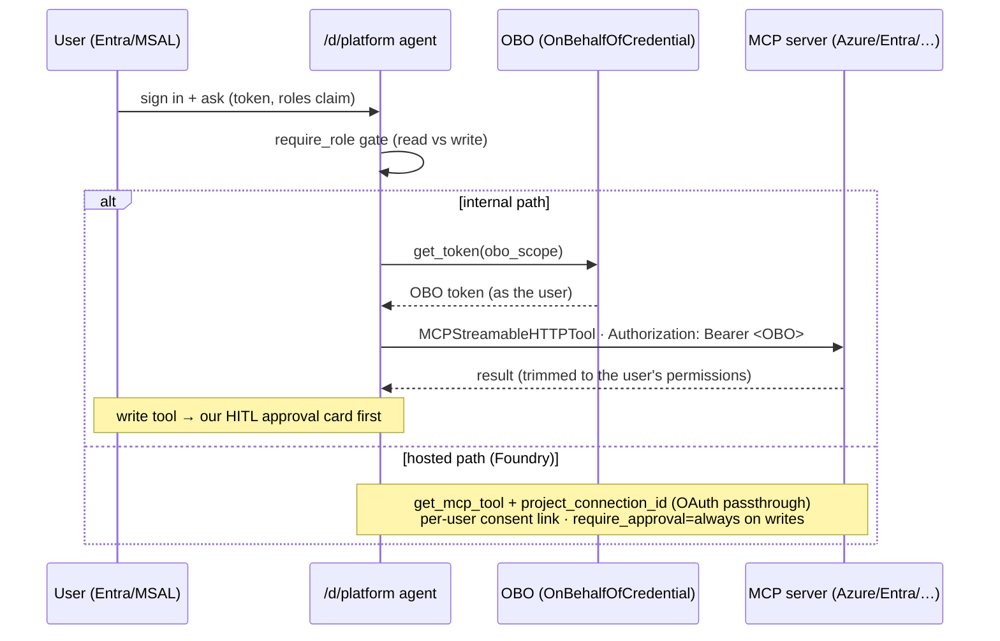

# Plan: Microsoft first-party MCP servers on the stack

## Goal

Add the Microsoft first-party **MCP servers** as agent tools — **Azure MCP, Microsoft Learn
MCP, Microsoft Entra MCP, Azure DevOps MCP, GitHub MCP, and Microsoft 365 MCP** — wired with
**per-user identity** (OBO / OAuth passthrough) where applicable, on **both** surfaces we
have: the internal agent-framework agents *and* the Foundry hosted agents. They live in a new
**`platform` (ops) domain** — a tool-driven engineering-platform concierge — governed by our
RBAC + native approval. It extends the project's "access follows the source" thesis to **live
Microsoft services**, scoped to the signed-in user.

## Microsoft-native first (don't reinvent)

Researched against Microsoft Learn — the framework already provides the layer, so the design
is **thin config feeding native APIs**, not a custom MCP/approval/codegen layer:

| Need | Microsoft-native (use) |
|------|------------------------|
| Client MCP tool (our backend executes it) | **`MCPStreamableHTTPTool`** (`agent_framework`) |
| Hosted MCP tool (Foundry executes it) | **`FoundryChatClient.get_mcp_tool(name, url, approval_mode, headers, allowed_tools)`** / **`HostedMCPTool`** — registers on the Foundry agent itself (no hand-written agent.yaml) |
| Reuse a tool config across agents | **Foundry toolboxes** (named, versioned server-side tool collections) |
| Approval / governance | native **`approval_mode`**: `"never_require"` · `"always_require"` · `{"always_require":[…], "never_require":[…]}` (per tool); hosted uses `require_approval` (`always`/`never`/per-tool) |
| Filter tools | native **`allowed_tools`** |
| Per-user identity (hosted) | Foundry **OAuth identity passthrough** (managed or custom OAuth) |

So our footprint is: a **thin registry (data)** + the **`platform` agent** that builds tools
from it + the **auth wiring** + a small **RBAC layer**. No custom builder, approval wrapper,
or agent.yaml generator.

## The registry (MCP servers as data) — `app/agents/mcp/registry.py`

```python
@dataclass(frozen=True)
class McpServer:
    id: str                 # azure · learn · entra · azdo · github · m365
    label: str
    url: str                # remote MCP endpoint
    auth: str               # "public" | "obo" | "github_pat" | "oauth_passthrough"
    obo_scope: str | None   # downstream scope for OBO (local path)
    read_tools: list[str]   # → approval_mode never_require
    write_tools: list[str]  # → approval_mode always_require (+ our HITL on AG-UI)
    min_role: str = "Reader"        # who may use the read tools
    min_role_write: str = "Author"  # who may use the write/action tools
    enabled: bool = True
```

The registry is the single source that feeds **both** the internal `MCPStreamableHTTPTool`
calls and the hosted `get_mcp_tool` / toolbox config — same data, two surfaces.

### The six servers

| id | auth | OBO scope (local) | read / write | tenant status |
|----|------|-------------------|--------------|---------------|
| **learn** | public | — | docs search (read-only) | ✅ now |
| **azure** | obo / oauth-pt | `https://management.azure.com/.default` | diagnostics, cost, list / **deploy** | ✅ (azd up) |
| **entra** | obo / oauth-pt | `https://graph.microsoft.com/.default` | directory queries / **changes** | ✅ (admin consent) |
| **azdo** | obo / oauth-pt | Azure DevOps resource | work items, pipelines / **create** | ✅ |
| **github** | github_pat / oauth | (the user's GitHub token) | repos, issues / **create issue** | ✅ |
| **m365** | oauth-pt | Graph (Agent 365 servers) | mail/files/etc. | ⚠️ needs M365 → `enabled=False` |

## The `platform` (ops) domain

A new domain entry in `apps/frontend/lib/domains.ts` + `app/agents/platform.py` — a
**tool-driven** agent (not KB-grounded): an engineering-platform concierge that uses the MCP
tools. Registered at `/d/platform`. Builds its tool list from the registry (filtered to the
caller's role; see Governance).

## Authentication (local vs hosted differ — per Microsoft)

- **Internal (our backend, `MCPStreamableHTTPTool`):** OBO — `OnBehalfOfCredential.get_token(obo_scope)` → `headers={"Authorization": f"Bearer {obo}"}`. Reuses the OBO machinery we already have (`app/core/auth.py`). The MCP server sees the **user's identity**, trimmed to their permissions.
- **Hosted (Foundry):** **OAuth identity passthrough** (not raw OBO header), the Microsoft-recommended per-user mechanism — Agent Service issues a per-user **consent link** (`oauth_consent_request`) and stores the user's credentials. Configured via a **`project_connection_id`** (the connection holds the OAuth app/credentials), **not** a header.

### Hard constraints found in research (must respect)

- **Secrets can't go in hosted-MCP headers** on Agent Service → use `project_connection_id`.
- **"Cannot pass a Microsoft-audience token to an untrusted MCP endpoint"** → for Microsoft MCP servers use **custom OAuth with our own Entra app registration** (audience we control), per the docs; `offline_access` in scopes for refresh.
- **GitHub MCP is GitHub OAuth/PAT**, not Entra OBO — a separate credential path (`github_pat` / its own OAuth), per the framework's GitHub MCP sample.

## Governance: native approval + our RBAC (complementary)

- **Native `approval_mode`** drives per-tool approval from the registry: `read_tools` →
  `never_require`; `write_tools` → `always_require` (so deploy / create-issue / Entra-change
  pause for approval).
- **Our `require_role`** (the RBAC we shipped) gates **who** reaches the platform agent + the
  write tools: read tools need `Reader`+, write tools need `Author`/`Admin`. Server-side,
  fail-closed — complements the framework's approval (which is about *this call*, not *who*).

> ⚠️ **Known bug (agent-framework #3199):** MCP tools with `always_require` approval **don't
> execute over AG-UI** — and our frontend is AG-UI. **Mitigation:** on the internal path,
> route write-tool approval through **our existing HITL approval card** (the escalation/
> `request_info` mechanism) instead of the framework's approval, until #3199 is fixed. Hosted
> path uses Foundry's native `require_approval` (unaffected).
> ⚠️ **Known bug (azure-sdk #46696):** raw OBO token exchange fails for MCP tools on a
> *deployed* Foundry agent — another reason the hosted path uses **OAuth passthrough**, not
> OBO-in-header.

## Data flow



## Reused vs new

| Piece | Reused | New |
|------|:----:|:---:|
| Entra + MSAL + **OBO** (`OnBehalfOfCredential`) | ✅ | |
| **RBAC** (`require_role`/`has_role`) | ✅ | gate MCP tools |
| **HITL approval** (escalation/request_info) | ✅ | reuse for write-tool approval (AG-UI bug workaround) |
| `MCPStreamableHTTPTool` / `get_mcp_tool` / toolboxes / `approval_mode` | ✅ (framework) | |
| MCP **registry** (data) | | ✅ (thin) |
| `platform` agent + domain entry | | ✅ |
| Hosted: Foundry connection (`project_connection_id`) + OAuth app for passthrough | | ✅ (config) |

## Error handling

- MCP unreachable / tool error → graceful tool error to the model ("couldn't reach <label>"),
  never a crash.
- OBO/consent failure → fail-closed (tool unavailable + a clear message; OAuth decline handled
  per the docs).
- `enabled=False` servers (m365) are skipped entirely.

## Testing

- **Unit (infra-free):** the registry; the role gate (mock roles); the read/write→approval_mode mapping.
- **End-to-end, infra-free proof:** wire **Learn MCP** (public, no OBO/azd) through the
  `platform` agent and exercise it for real — the same "run it, don't claim it" discipline we
  used with the Copilot CLI. (One source-cited answer grounded in MS Learn.)
- **OBO servers (azure/entra/azdo):** need `azd up` + admin consent → tested when infra is up.
- **Hosted:** validate `get_mcp_tool` + the OAuth-passthrough connection (consent link) on a
  deployed agent.

## Rollout order (phased)

1. Registry + the `platform` agent + the role gate *(infra-free)*.
2. **Learn MCP** (public) → exercise end-to-end (the infra-free proof). ✅
3. The frontend `/d/platform` entry + the EvidencePanel reuse.
4. **OBO** servers (azure/entra/azdo) — needs `azd up` + admin consent + the OAuth app reg.
5. **GitHub MCP** (GitHub PAT/OAuth path).
6. **Hosted mirror** — `get_mcp_tool`/toolbox + `project_connection_id` OAuth passthrough,
   when hosted agents are deployed.
7. **M365 MCP** — deferred until M365 is enabled in the tenant (the one external dependency).

## Open questions / constraints

1. **M365 needs M365** — this tenant has none (no SPO/Graph M365). `m365` stays `enabled=False`
   until M365 is enabled (e.g. M365 Developer Program). The Agent 365 MCP servers are also
   Frontier-tenant-gated.
2. **GitHub auth** — PAT (simple, shared) vs GitHub OAuth (per-user). MVP: PAT via a connection;
   per-user OAuth later.
3. **AG-UI approval bug (#3199)** — gate write tools through our HITL on the internal path; revisit
   when the upstream fix lands.
4. **Custom OAuth app reg** for hosted passthrough — a new Entra app (audience we control) to
   avoid the "Microsoft token to untrusted MCP" restriction.
