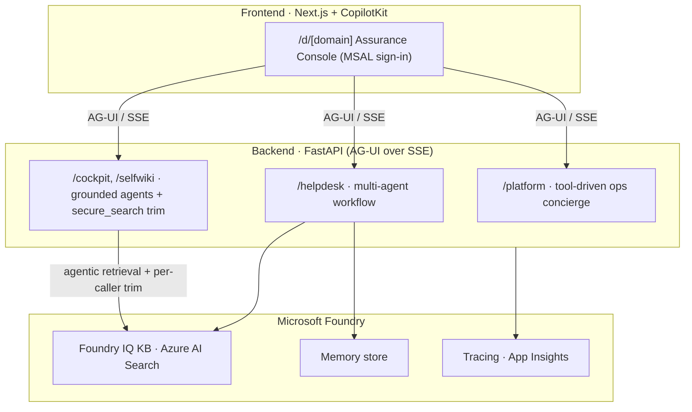
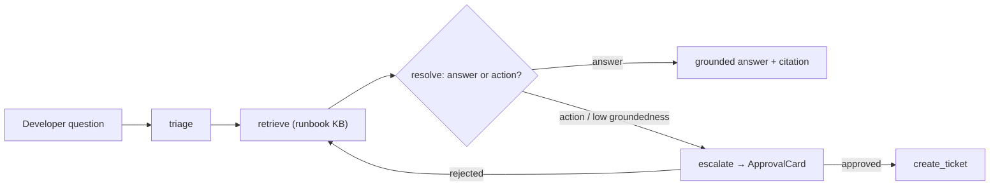

# Architecture

Three layers. The Next.js frontend talks to the Python backend over **AG-UI (SSE)**; the backend
runs a **multi-agent workflow** against Microsoft Foundry in the cloud. Phase 6 adds a second,
parallel delivery model: the same workflow packaged as a **managed hosted agent** on Foundry
Agent Service.

The diagram shows the **self_hosted** (single-tenant) topology. In **shared** mode the same
backend resolves the tenant per-request from the Entra `tid` and calls *that tenant's*
Foundry/KB/memory — see [the SaaS model](../explanation/index.md#the-multi-tenant-saas-model).

## The layers

- **Frontend — the Assurance Console.** The generic route `/d/[domain]` is driven by a single
  registry, `apps/frontend/lib/domains.ts`, which defines the agent map, the nav, the route, and
  the suggested prompts. `app/api/copilotkit/route.ts` registers a `CopilotRuntime` with an
  `HttpAgent` per domain. The page uses `useCoAgentStateRender` for the intermediate steps,
  `useCopilotAction` (`renderAndWaitForResponse`) for the approval card, and an `EvidencePanel`
  for cited sources + assurance badges.
- **Backend — `app/main.py`** creates the FastAPI app and exposes the AG-UI endpoints. Layers:
  `app/api` (thin routers) → `app/services` → `app/workflow` / `app/agents` / `app/core`. Tenant
  resolution (shared mode) + credential brokering live in `app/core` behind the
  `TenantConfigProvider` seam.
- **Foundry** — the retriever queries the Foundry IQ KB and trims by entitlement
  (`app/agents/secure_search.py`, `app/knowledge/acl_setup.py`); triage/resolver read+write
  memory; eval and traces go to the Foundry Control Plane.

## The helpdesk workflow

The workflow is exposed to the frontend as a **workflow-as-agent** over AG-UI so the intermediate
steps (triage, retrieval, draft) stream to the UI — not just the final answer.

## Four config-driven domains

Adding a domain = **one entry in `apps/frontend/lib/domains.ts` + a backend agent**. Deploy any
subset.

| Domain | Kind | What it does |
|---|---|---|
| **helpdesk** | workflow | triage → retrieve → resolve → escalate, with HITL |
| **cockpit** | grounded | cited Q&A over the `cockpit-kb` corpus |
| **selfwiki** | grounded | cited Q&A over a deep-wiki generated from *this repo's own source* |
| **platform** | tool | ops concierge over Microsoft first-party MCP servers, HITL on writes |

In **shared** mode domains mount globally but are gated per-tenant by a license entitlement
(`DomainAssignment`, [ADR-010](../adr/ADR-010-per-tenant-domain-entitlement.md)).

## Two ways to consume the same agent

- **Live workflow (AG-UI)** — the rich experience: intermediate steps stream into the chat, the
  approval card gates ticket creation, and Foundry is called **on-behalf-of** the signed-in
  developer (OBO) with per-user memory.
- **Hosted agent (Foundry)** — the same `triage → retrieve → resolve` workflow deployed as a
  managed, autoscaling agent invoked by name over the Responses API. Request→response (no live
  steps/HITL — those are inherent to AG-UI), runs under its own platform identity, and costs
  nothing while idle.

## Declarative prompts

Agent instructions are **data**, composed at boot from the runtime `.dna` scope
([ADR-013](../adr/ADR-013-declarative-agent-prompts-dna.md)) — changing a prompt is a restart, not
a rebuild ([ADR-014](../adr/ADR-014-runtime-prompt-scope-no-rebuild.md)). See
[The `.dna` scopes](dna-scopes.md) and
[Update prompts without a redeploy](../how-to/update-prompts.md).
