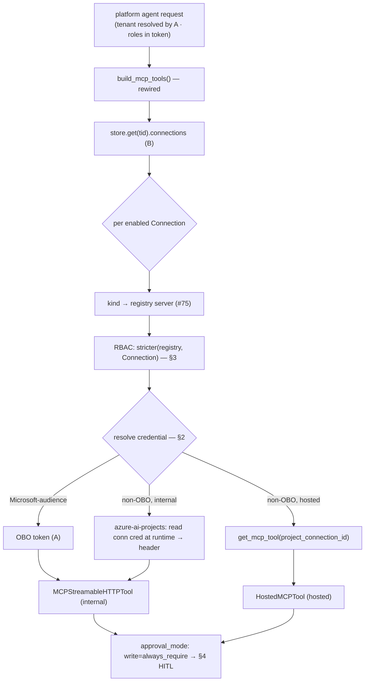

# Sub-project C — credential brokering + write governance

> Third sub-project of the [SaaS target architecture](./2026-06-29-saas-target-architecture-design.md).
> Builds on **A** (multi-tenant OBO, `resolve_tenant`, `has_role`) and **B** (the `TenantStore` +
> `Connection`), both merged to `develop`, and the MCP integration (#75). Decisions:
> [ADR-003](../../adr/ADR-003-multitenant-identity-obo.md), [ADR-005](../../adr/ADR-005-never-store-secrets.md),
> [ADR-008](../../adr/ADR-008-foundry-connections-app-configuration.md), and the new
> **[ADR-009](../../adr/ADR-009-native-tool-approval-foundry-connection-resolution.md)**.

## Goal

Make the platform agent's MCP tools **driven by the tenant's `Connection` records** (managed in B),
with credentials resolved the **Microsoft-native** way — **OBO** for Microsoft-audience servers and
**Foundry connections** for everything else (**we never read a customer secret**) — **per-tool
RBAC** (the registry floor tightened per-tenant by the Connection), and **write tools gated by the
framework's native tool-approval** (Approver/Admin). Covers both the **internal** (over AG-UI today)
and **hosted** (Foundry) credential paths.

## Scope boundary

- **C owns:** rewiring `app/agents/mcp/tools.py` to read Connections; the three credential
  mechanisms; the per-tool RBAC; the `approval_mode` wiring + the frontend approval-card extension.
- **B owned** (done): the `Connection` data model + management UI/API.
- **D owns** (not C): deploying hosted Foundry agents (the hosted path's runtime), the shared-mode
  domain-mounting gap, and stamp packaging.

## Non-goals

- Reading/storing any customer secret (ADR-005/008/009 — Foundry connections do it).
- A hand-rolled HITL workflow (ADR-009 — native tool-approval).
- The Connections management UI/API (B). Deploying hosted agents (D).

## 1. The tool-builder, driven by `Connection`

`build_mcp_tools()` is rewired: the source is `store.get(current_tenant_id()).connections` (B), not
the deprecated flat `mcp_*` fields. Per enabled connection: map `kind` → the registry server
(governance: read/write tools + min-roles), apply per-tool RBAC (§3), resolve the credential (§2),
and build the tool with the right `approval_mode` (§4).



**The flat fields are deprecated:** C stops reading `tenant_config().mcp_ado_organization /
mcp_github_pat / mcp_azure_url`; they stay on `TenantConfig` for back-compat with a deprecation note.
Per-connection target config (e.g. the Azure DevOps org that fills the registry URL `{org}`) moves
to a new **`Connection.endpoint: str = ""`** field (C extends B's entity, backward-compatible).

## 2. Credential resolution (never read a secret)

Per [ADR-009](../../adr/ADR-009-native-tool-approval-foundry-connection-resolution.md), three
mechanisms, chosen by the server's `auth` + the Connection's reference:

| Mechanism | When | How (no stored secret) |
|---|---|---|
| **OBO** | server `auth=obo` (Microsoft-audience: azure/azdo/entra) | `_obo_header_provider(server.obo_scope)` mints the user's token (reuses A). No reference. Works internal + hosted. |
| **Foundry connection — hosted** | non-OBO, or any server in hosted mode | `get_mcp_tool(..., project_connection_id=conn.foundry_connection_id)` → Foundry resolves the credential. |
| **Foundry connection — internal** | non-OBO in internal mode (e.g. GitHub over AG-UI today) | retrieve the connection credential via `azure-ai-projects` **at runtime** (Foundry is the store; broker in memory, never persist) → `header_provider`. **TODO: verify the `azure-ai-projects` get-connection-with-credentials signature — don't invent it; if unavailable, non-OBO is hosted-only.** |

**Path selection** = the existing live-vs-hosted toggle. Internal mode: OBO → internal tool; non-OBO
→ the internal SDK-broker line (or skip with a "needs hosted" signal if unresolved). Hosted mode:
all via `get_mcp_tool(project_connection_id)`. **`keyvault_ref` is deprecated** — the build no longer
reads it; the field stays on `Connection` for back-compat with existing Table records (removing it
would break their round-trip). `foundry_connection_id` is the single non-OBO reference; no
`azure-keyvault-secrets` dependency.

> **Note for the plan:** the **hosted builder is greenfield** — there is no existing `get_mcp_tool`/
> `HostedMCPTool` code in `tools.py` today (only the internal `MCPStreamableHTTPTool` path). The
> registry's data model is the only thing to consume; the hosted builder is new code (infra-gated).

## 3. Per-tool RBAC (stricter-of-both)

Two role layers combined by intersection — the tenant can only **tighten**, never loosen below the
product floor:

```python
# reuses the registry's _granted / READ_ROLES / WRITE_ROLES + A's has_role/current_roles
def visible_tools_for(server, conn, roles) -> tuple[list[str], list[str]]:
    reads  = server.read_tools  if _granted(roles, server.min_role)       and _granted(roles, conn.min_role_read)  else ()
    writes = server.write_tools if _granted(roles, server.min_role_write) and _granted(roles, conn.min_role_write) else ()
    return list(reads), list(writes)
```

- **Layer 1 — registry (#75):** the product floor (which tools are read vs write + the baseline min-role).
- **Layer 2 — Connection (B):** the tenant's per-connection tightening (`min_role_read/write`).
- `allowed_tools` (internal `MCPStreamableHTTPTool` / hosted `get_mcp_tool`) = the visible `reads + writes`,
  so the model never sees a tool above the caller's role. Fail-closed: no role / disabled connection
  / unknown kind → no tools. This RBAC is legitimately ours (governance), not reinvented.

## 4. Write governance — native tool-approval

Per [ADR-009](../../adr/ADR-009-native-tool-approval-foundry-connection-resolution.md):

- **Per-tool `approval_mode`** (replaces today's blanket `never_require`): a dict
  `{"always_require": [<visible write tools>], "never_require": [<read tools>]}` on the
  `MCPStreamableHTTPTool` / `get_mcp_tool`. Reads flow; a write **pauses** and the framework emits a
  `RequestInfoEvent` carrying `ToolApprovalRequestContent`.
- **Frontend extends the existing approval card** — the as-built card is
  `apps/frontend/components/chat/TicketApproval.tsx`, which (because CopilotKit's native interrupt
  detection does NOT match the agent-framework interrupt) **taps the raw stream** (`agent.subscribe`,
  catching the `request_info` **CUSTOM** event) and resumes via
  `agent.runAgent({ resume: [{ interruptId, status, payload }] })`. C extends *that* tap to also
  carry `ToolApprovalRequestContent` (tool name + args). **Scoping caveat (tie to #3199):** confirm
  the native `always_require` approval surfaces as the **same `request_info`-style CUSTOM event** the
  existing tap consumes. If it surfaces differently (likely if #3199 is unfixed), the "little new UI"
  assumption is wrong — the resume-bridge handling must be scoped as real work (a new event shape +
  a new card path), not a one-line extension. The `tool`-domain resume bridge from the MCP wiring is
  reused either way.
- **Two barriers (defense in depth):** a write tool is **visible** only to Author/Admin (§3) **and**
  the **approval requires Approver/Admin** (project rule #5 — reuses A's HITL role gate). A
  single-Admin tenant: the Admin triggers and approves (Admin satisfies both).
- **Bug #3199 (verify, don't guess):** Plan **step 0** inspects whether `approval_mode=always_require`
  executes over AG-UI in the installed `agent-framework`. If fixed → native. If not → a framework
  `RequestInfoEvent`-emitting **middleware** (not a hand-rolled workflow).

## 5. Error handling, testing, infra-gating

**Error handling (fail-closed):** disabled connection / unknown `kind` / caller lacks role → no
tool. OBO-mint or Foundry-connection resolution failure → that connection's tools unavailable + a
clear error, never a crash. Write rejected → not executed. Never persist a secret (even the
internal SDK-broker holds it only in memory for the call). Internal mode + an unresolvable non-OBO
connection → skip with a "needs hosted" signal.

**Testing (repo convention: runnable `def main()->int` modules in `apps/backend/eval/`, NO pytest):**
- **Unit, infra-free:** `visible_tools_for` (stricter-of-both RBAC: registry × Connection); the
  `kind → server` mapping; the `approval_mode` dict construction (write→always_require,
  read→never_require); `build_mcp_tools` against a **fake store** seeded with connections (no network).
- **Plan step 0:** the #3199 verification (inspect the installed framework's approval behavior).
- **Infra-gated (E2E, skips clean offline):** the hosted path (`get_mcp_tool` + a real
  `foundry_connection_id` + deployed agents), the internal SDK-broker (a live Foundry project +
  connection), and the native write-approval over AG-UI (running stack + #3199).

**Infra-gated parts** (code written now, validated when infra lands): the hosted passthrough (needs
deployed Foundry agents — D-adjacent), the internal SDK credential read (live Foundry project), the
write-approval over AG-UI (#3199). The infra-free deliverable is the rewired build logic + RBAC +
approval_mode construction, fully unit-tested.

## Units (for the writing-plans handoff)

- `app/agents/mcp/tools.py` — rewire `build_mcp_tools` to read `store.get(tid).connections`;
  `visible_tools_for`; the `approval_mode` dict; the three credential mechanisms (OBO header_provider,
  hosted `get_mcp_tool`, internal `azure-ai-projects` SDK-broker header_provider).
- `app/core/tenant_store.py` — add `Connection.endpoint: str = ""`; deprecate `keyvault_ref`.
- `app/core/tenant.py` — deprecate the flat `mcp_ado_organization/mcp_github_pat/mcp_azure_url`
  (build no longer reads them; kept for back-compat with a note).
- `apps/frontend/...` — extend the approval card to handle `ToolApprovalRequestContent`.
- `apps/backend/eval/` — `rbac_per_tool_test`, `connection_tools_build_test` (+ the infra-gated
  `mcp_brokering_e2e_test`).

## Open questions (for the plan)

1. **`azure-ai-projects` get-connection-with-credentials** — verify the exact call (and whether it
   returns the secret for an ApiKey connection) before relying on the internal SDK-broker line. If
   unavailable, non-OBO is hosted-only (document it).
2. **#3199 status** — resolved upstream or not, in the installed version → native vs middleware.
3. **`Connection.endpoint` semantics** — for ADO it's the org (fills `{org}`); standardize whether
   it's the org string or a full URL, and which servers use it.
