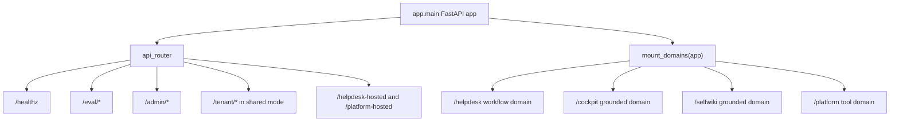

# Backend overview

The backend is a FastAPI application that stays intentionally thin at the composition root: `app/main.py` builds the app, applies CORS, preloads Entra OpenID metadata during lifespan startup, includes the HTTP router aggregate, mounts every live domain endpoint through `mount_domains(app)`, and closes hosted-agent clients on shutdown. The file’s module docstring explicitly says business logic belongs in `services/`, `agents/`, and `workflow/`, while `main.py` remains wiring-only ([`apps/backend/app/main.py`](https://github.com/ruinosus/foundry-assured/blob/7e41ad6f80befa024fae867b3fcdf763f8331a10/apps/backend/app/main.py#L1-L10), [`apps/backend/app/main.py`](https://github.com/ruinosus/foundry-assured/blob/7e41ad6f80befa024fae867b3fcdf763f8331a10/apps/backend/app/main.py#L26-L49)).

The package manifest shows what this process is built around: FastAPI and `uvicorn` expose HTTP, `agent-framework` plus `agent-framework-ag-ui` serve live agents over AG-UI, `azure-ai-projects` and `azure-search-documents` back Foundry and retrieval integration, `fastapi-azure-auth` handles Entra validation, `azure-data-tables` persists shared-mode tenants, and `agent-framework-declarative` plus `pyyaml` load declarative agent definitions. The exact pin on `agent-framework-declarative==1.0.0rc2` is deliberate because newer framework-core combinations broke a required eval path, so prompt loading is treated as a compatibility-sensitive subsystem rather than a casual dependency ([`apps/backend/pyproject.toml`](https://github.com/ruinosus/foundry-assured/blob/7e41ad6f80befa024fae867b3fcdf763f8331a10/apps/backend/pyproject.toml#L1-L43)).

## Composition root and mount model

`app/api/__init__.py` aggregates ordinary HTTP routers: health, tickets, evals, hosted chat bridges, admin, and `me`; the shared-mode tenant router is included only when `settings.deployment_mode == "shared"`. Live domain endpoints are not defined there. Instead, `app/domains.py` owns a backend domain registry and a single `mount_domains(app)` loop that dispatches each registered domain by `kind` (`workflow`, `grounded`, or `tool`) and mounts the appropriate runtime surface. That keeps route ownership centralized instead of splitting domain wiring across multiple modules ([`apps/backend/app/api/__init__.py`](https://github.com/ruinosus/foundry-assured/blob/7e41ad6f80befa024fae867b3fcdf763f8331a10/apps/backend/app/api/__init__.py#L1-L19), [`apps/backend/app/domains.py`](https://github.com/ruinosus/foundry-assured/blob/7e41ad6f80befa024fae867b3fcdf763f8331a10/apps/backend/app/domains.py#L1-L18), [`apps/backend/app/domains.py`](https://github.com/ruinosus/foundry-assured/blob/7e41ad6f80befa024fae867b3fcdf763f8331a10/apps/backend/app/domains.py#L167-L176)).

The registry itself is `DomainSpec`. It encodes the backend’s four domains as data: `helpdesk` is a workflow domain, `cockpit` and `selfwiki` are grounded domains, and `platform` is a tool domain. A grounded spec must declare either a knowledge base or a search index, enforced in `__post_init__`, because otherwise retrieval would fall through to an invalid `.../indexes/None/docs/search` call. `_domains()` also resolves per-tenant values lazily through `tenant_config()` so import-time side effects stay out of the composition path ([`apps/backend/app/domains.py`](https://github.com/ruinosus/foundry-assured/blob/7e41ad6f80befa024fae867b3fcdf763f8331a10/apps/backend/app/domains.py#L34-L60), [`apps/backend/app/domains.py`](https://github.com/ruinosus/foundry-assured/blob/7e41ad6f80befa024fae867b3fcdf763f8331a10/apps/backend/app/domains.py#L63-L99)).

Caption: The composition root separates ordinary HTTP routers from domain-mounted live agent endpoints.

## Deployment-mode seam

The backend’s main architectural seam is deployment mode. `PlatformSettings` keeps only platform-global settings such as auth, CORS, and tenant-store wiring, while per-tenant data-plane pointers live in `app.core.tenant`. `deployment_mode` defaults to `self_hosted`, but shared mode switches the runtime into multi-tenant resolution with a tenant store and entitlement gates. The code comments make the design goal explicit: the core runtime should call `tenant_config()` and not care which mode is active ([`apps/backend/app/core/settings.py`](https://github.com/ruinosus/foundry-assured/blob/7e41ad6f80befa024fae867b3fcdf763f8331a10/apps/backend/app/core/settings.py#L1-L22), [`apps/backend/app/core/tenant.py`](https://github.com/ruinosus/foundry-assured/blob/7e41ad6f80befa024fae867b3fcdf763f8331a10/apps/backend/app/core/tenant.py#L1-L6), [`apps/backend/app/core/tenant.py`](https://github.com/ruinosus/foundry-assured/blob/7e41ad6f80befa024fae867b3fcdf763f8331a10/apps/backend/app/core/tenant.py#L171-L266)).

`_domain_deps(domain_id)` is the routing consequence of that seam. In self-hosted or dedicated mode it returns exactly `auth_dependencies()`. In shared mode it appends `require_domain(domain_id)`, so every mounted domain route adds per-tenant entitlement checks without changing the domain implementation. That is why the registry can mount all domains globally in shared mode while still failing requests closed for tenants that have not enabled a domain ([`apps/backend/app/domains.py`](https://github.com/ruinosus/foundry-assured/blob/7e41ad6f80befa024fae867b3fcdf763f8331a10/apps/backend/app/domains.py#L102-L108), [`apps/backend/app/core/tenant.py`](https://github.com/ruinosus/foundry-assured/blob/7e41ad6f80befa024fae867b3fcdf763f8331a10/apps/backend/app/core/tenant.py#L216-L252)).

## Major runtime subsystems

### Helpdesk workflow

The `helpdesk` mount uses AG-UI’s workflow adapter when knowledge is configured, wrapping `build_helpdesk_workflow` in `OrderedAgentFrameworkWorkflow`; otherwise it falls back to a single concierge agent. The workflow factory is per-request because identity and memory scope come from the current caller, not from process-global startup state ([`apps/backend/app/domains.py`](https://github.com/ruinosus/foundry-assured/blob/7e41ad6f80befa024fae867b3fcdf763f8331a10/apps/backend/app/domains.py#L132-L149), [`apps/backend/app/workflow/graph.py`](https://github.com/ruinosus/foundry-assured/blob/7e41ad6f80befa024fae867b3fcdf763f8331a10/apps/backend/app/workflow/graph.py#L1-L54)). The detailed workflow lifecycle is documented in helpdesk-workflow.

### Grounded domains

`cockpit` and `selfwiki` both mount simple `POST /{id}` handlers that capture `current_user()` outside the `StreamingResponse` generator and pass it into `stream_grounded`. That capture is necessary because the code comments state that the auth contextvar is lost inside the async generator otherwise, which would silently fall back to the wrong identity during synthesis ([`apps/backend/app/domains.py`](https://github.com/ruinosus/foundry-assured/blob/7e41ad6f80befa024fae867b3fcdf763f8331a10/apps/backend/app/domains.py#L111-L129), [`apps/backend/app/services/grounded.py`](https://github.com/ruinosus/foundry-assured/blob/7e41ad6f80befa024fae867b3fcdf763f8331a10/apps/backend/app/services/grounded.py#L1-L18), [`apps/backend/app/services/grounded.py`](https://github.com/ruinosus/foundry-assured/blob/7e41ad6f80befa024fae867b3fcdf763f8331a10/apps/backend/app/services/grounded.py#L76-L125)). Their retrieval and citation pipeline is covered in grounded-domains.

### Platform tool domain

`platform` mounts only when MCP is configured. It serves a `PerRequestAgent` proxy whose builder recreates the real agent for each request so tools can be filtered under the current caller’s roles and credential. That differs materially from grounded domains, which can often reuse stable configuration and a shared archetype ([`apps/backend/app/domains.py`](https://github.com/ruinosus/foundry-assured/blob/7e41ad6f80befa024fae867b3fcdf763f8331a10/apps/backend/app/domains.py#L152-L164), [`apps/backend/app/agents/platform.py`](https://github.com/ruinosus/foundry-assured/blob/7e41ad6f80befa024fae867b3fcdf763f8331a10/apps/backend/app/agents/platform.py#L1-L56), [`apps/backend/app/agents/per_request.py`](https://github.com/ruinosus/foundry-assured/blob/7e41ad6f80befa024fae867b3fcdf763f8331a10/apps/backend/app/agents/per_request.py#L1-L48)). See platform-domain.

### Hosted bridges

Hosted-agent twins are intentionally separate from the live mounts. `app/api/chat.py` exposes `/helpdesk-hosted` and `/platform-hosted`, both streaming SSE responses from `app.services.hosted`. This split lets the same frontend consume either the live AG-UI workflow or a hosted agent surface without overloading the live domain registry with hosted implementation details ([`apps/backend/app/api/chat.py`](https://github.com/ruinosus/foundry-assured/blob/7e41ad6f80befa024fae867b3fcdf763f8331a10/apps/backend/app/api/chat.py#L1-L34), [`apps/backend/app/services/hosted.py`](https://github.com/ruinosus/foundry-assured/blob/7e41ad6f80befa024fae867b3fcdf763f8331a10/apps/backend/app/services/hosted.py#L1-L20)). See hosted-bridges.

### Knowledge and assurance subsystems

The backend also owns the source-grounded knowledge toolchain that builds and ingests wiki/docbundle content. `wiki_builder.py` generates bundles, `adapt_openwiki.py` adapts OpenWiki output into the ingest contract, and `ingest_docbundles.py` uploads, provisions, and refreshes searchable corpora. The repository then measures those bundles with fidelity and freshness gates under `apps/backend/eval/` so generated knowledge cannot be treated as trusted unless it resolves back to real source ([`apps/backend/app/knowledge/wiki_builder.py`](https://github.com/ruinosus/foundry-assured/blob/7e41ad6f80befa024fae867b3fcdf763f8331a10/apps/backend/app/knowledge/wiki_builder.py#L1-L27), [`apps/backend/app/knowledge/adapt_openwiki.py`](https://github.com/ruinosus/foundry-assured/blob/7e41ad6f80befa024fae867b3fcdf763f8331a10/apps/backend/app/knowledge/adapt_openwiki.py#L1-L27), [`apps/backend/app/knowledge/ingest_docbundles.py`](https://github.com/ruinosus/foundry-assured/blob/7e41ad6f80befa024fae867b3fcdf763f8331a10/apps/backend/app/knowledge/ingest_docbundles.py#L1-L19), [`apps/backend/eval/wiki_fidelity_test.py`](https://github.com/ruinosus/foundry-assured/blob/7e41ad6f80befa024fae867b3fcdf763f8331a10/apps/backend/eval/wiki_fidelity_test.py#L1-L20)). See knowledge-pipeline and evaluation-and-assurance.

## Invariants that shape safe changes

- Keep `app/main.py` wiring-only. The file’s docstring is explicit that business logic belongs elsewhere, so adding domain logic there increases coupling and bypasses the backend’s established composition seams ([`apps/backend/app/main.py`](https://github.com/ruinosus/foundry-assured/blob/7e41ad6f80befa024fae867b3fcdf763f8331a10/apps/backend/app/main.py#L1-L10)).
- Add domains through the registry, not by ad hoc routes. The registry is the canonical place that pairs domain ids, kinds, config, and dependency gates ([`apps/backend/app/domains.py`](https://github.com/ruinosus/foundry-assured/blob/7e41ad6f80befa024fae867b3fcdf763f8331a10/apps/backend/app/domains.py#L1-L18), [`apps/backend/app/domains.py`](https://github.com/ruinosus/foundry-assured/blob/7e41ad6f80befa024fae867b3fcdf763f8331a10/apps/backend/app/domains.py#L167-L176)).
- Keep ACL and tenancy as data, not classification code. `DomainSpec.acl_group_map` and `TenantConfig.acl_group_map` carry group ids, while comments in both domains and ACL code warn against embedding classification logic in code paths ([`apps/backend/app/domains.py`](https://github.com/ruinosus/foundry-assured/blob/7e41ad6f80befa024fae867b3fcdf763f8331a10/apps/backend/app/domains.py#L12-L18), [`apps/backend/app/core/tenant.py`](https://github.com/ruinosus/foundry-assured/blob/7e41ad6f80befa024fae867b3fcdf763f8331a10/apps/backend/app/core/tenant.py#L107-L122), [`apps/backend/app/knowledge/acl_setup.py`](https://github.com/ruinosus/foundry-assured/blob/7e41ad6f80befa024fae867b3fcdf763f8331a10/apps/backend/app/knowledge/acl_setup.py#L1-L18)).
- Treat hosted cleanup as part of app lifecycle. `main.py` calls `hosted_aclose()` from lifespan shutdown, so any change to hosted client caching must preserve explicit teardown ([`apps/backend/app/main.py`](https://github.com/ruinosus/foundry-assured/blob/7e41ad6f80befa024fae867b3fcdf763f8331a10/apps/backend/app/main.py#L26-L33), [`apps/backend/app/services/hosted.py`](https://github.com/ruinosus/foundry-assured/blob/7e41ad6f80befa024fae867b3fcdf763f8331a10/apps/backend/app/services/hosted.py#L47-L56)).

## Focused validation

For composition changes, the narrowest checks are:

- `uv run python -m eval.domain_registry_test` to prove the four-domain registry, dispatch, and grounded guards still hold ([`apps/backend/eval/domain_registry_test.py`](https://github.com/ruinosus/foundry-assured/blob/7e41ad6f80befa024fae867b3fcdf763f8331a10/apps/backend/eval/domain_registry_test.py#L1-L8), [`apps/backend/eval/domain_registry_test.py`](https://github.com/ruinosus/foundry-assured/blob/7e41ad6f80befa024fae867b3fcdf763f8331a10/apps/backend/eval/domain_registry_test.py#L38-L71), [`apps/backend/eval/domain_registry_test.py`](https://github.com/ruinosus/foundry-assured/blob/7e41ad6f80befa024fae867b3fcdf763f8331a10/apps/backend/eval/domain_registry_test.py#L87-L140)).
- `uv run python -m eval.shared_boot_smoke_test` when touching shared-mode boot assumptions, because shared mode changes provider and tenant-store wiring at startup ([`apps/backend/eval/shared_boot_smoke_test.py`](https://github.com/ruinosus/foundry-assured/blob/7e41ad6f80befa024fae867b3fcdf763f8331a10/apps/backend/eval/shared_boot_smoke_test.py#L1-L38)).
- Run the specific subsystem checks linked from the corresponding pages before broader end-to-end validation.
