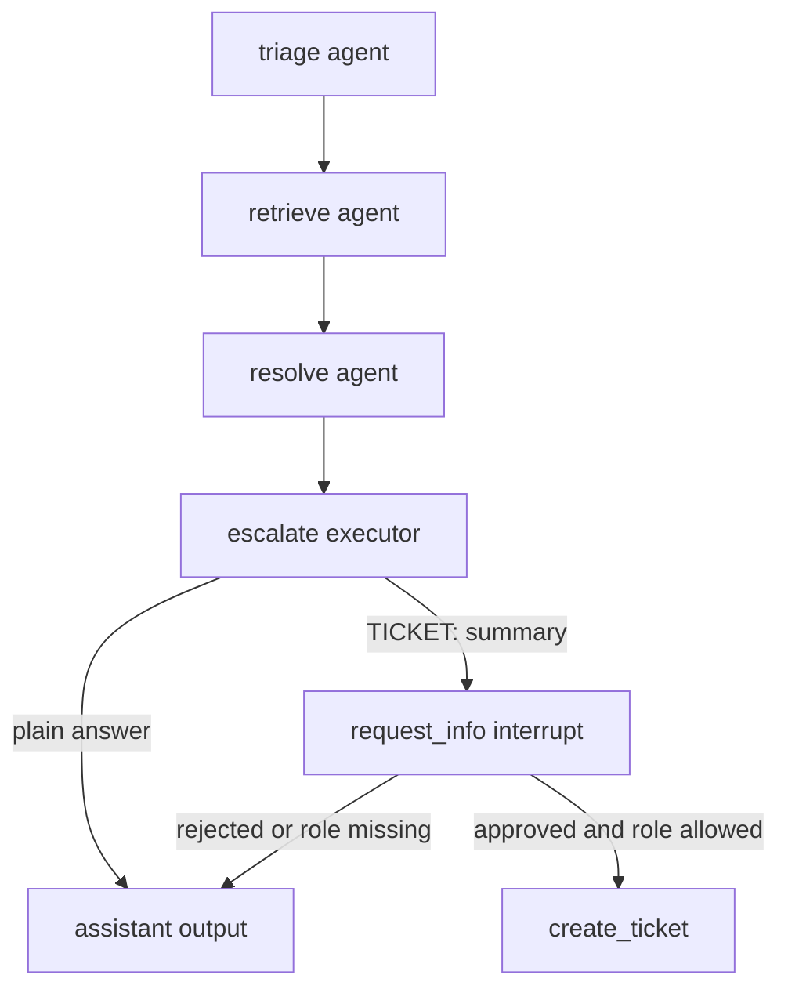

The `helpdesk` domain is the backend’s richest live runtime: a per-request workflow that uses the signed-in user’s identity, can consult memory, streams intermediate steps over AG-UI, and can pause for approval before creating a ticket. The backend mounts it as a `workflow` domain when knowledge is configured; otherwise it falls back to a single concierge agent so the route still exists in lower-fidelity setups.[`apps/backend/app/domains.py`](https://github.com/ruinosus/foundry-assured/blob/4b749e7bac56789f0b1097cd4a8212b5c5c65d05/apps/backend/app/domains.py#L70-L75) [`apps/backend/app/domains.py`](https://github.com/ruinosus/foundry-assured/blob/4b749e7bac56789f0b1097cd4a8212b5c5c65d05/apps/backend/app/domains.py#L132-L149)

## Workflow shape

`build_helpdesk_workflow()` constructs the workflow fresh for each run. That is not incidental: the workflow needs the request’s current credential and memory scope, both derived from auth context stored earlier in the request lifecycle.[`apps/backend/app/workflow/graph.py`](https://github.com/ruinosus/foundry-assured/blob/4b749e7bac56789f0b1097cd4a8212b5c5c65d05/apps/backend/app/workflow/graph.py#L1-L13) [`apps/backend/app/workflow/graph.py`](https://github.com/ruinosus/foundry-assured/blob/4b749e7bac56789f0b1097cd4a8212b5c5c65d05/apps/backend/app/workflow/graph.py#L28-L40)

The chain is fixed and linear:

1. `triage`
2. `retrieve`
3. `resolve`
4. `escalate`

The builder expresses that by creating the executors and adding one chain in order.[`apps/backend/app/workflow/graph.py`](https://github.com/ruinosus/foundry-assured/blob/4b749e7bac56789f0b1097cd4a8212b5c5c65d05/apps/backend/app/workflow/graph.py#L42-L54)

This diagram shows the live helpdesk workflow and its approval branch.

## Agent responsibilities

The three chat agents are deliberately narrow and UI-facing. Their names become the workflow executor ids that the AG-UI adapter renders as step names, so their naming is part of the user-facing contract, not just developer readability.[`apps/backend/app/workflow/agents.py`](https://github.com/ruinosus/foundry-assured/blob/4b749e7bac56789f0b1097cd4a8212b5c5c65d05/apps/backend/app/workflow/agents.py#L1-L10) [`apps/backend/app/workflow/agents.py`](https://github.com/ruinosus/foundry-assured/blob/4b749e7bac56789f0b1097cd4a8212b5c5c65d05/apps/backend/app/workflow/agents.py#L34-L40)

- `triage` classifies intent and urgency.[`apps/backend/app/workflow/agents.py`](https://github.com/ruinosus/foundry-assured/blob/4b749e7bac56789f0b1097cd4a8212b5c5c65d05/apps/backend/app/workflow/agents.py#L34-L39)
- `retrieve` attaches an `AzureAISearchContextProvider` in agentic mode over the tenant-configured knowledge base.[`apps/backend/app/workflow/agents.py`](https://github.com/ruinosus/foundry-assured/blob/4b749e7bac56789f0b1097cd4a8212b5c5c65d05/apps/backend/app/workflow/agents.py#L42-L55)
- `resolve` writes the final grounded answer, can consult memory when configured, and emits the `TICKET:` signal consumed by escalation logic.[`apps/backend/app/workflow/agents.py`](https://github.com/ruinosus/foundry-assured/blob/4b749e7bac56789f0b1097cd4a8212b5c5c65d05/apps/backend/app/workflow/agents.py#L58-L70)

## Memory and identity

The workflow runs under `credential_for_request()` and `memory_scope()`. In authenticated mode, that means OBO for the current user and a user-scoped memory namespace; in local or auth-off mode, it degrades to `DefaultAzureCredential` and a dev scope.[`apps/backend/app/workflow/graph.py`](https://github.com/ruinosus/foundry-assured/blob/4b749e7bac56789f0b1097cd4a8212b5c5c65d05/apps/backend/app/workflow/graph.py#L28-L38) [`apps/backend/app/core/auth.py`](https://github.com/ruinosus/foundry-assured/blob/4b749e7bac56789f0b1097cd4a8212b5c5c65d05/apps/backend/app/core/auth.py#L186-L196) [`apps/backend/app/core/auth.py`](https://github.com/ruinosus/foundry-assured/blob/4b749e7bac56789f0b1097cd4a8212b5c5c65d05/apps/backend/app/core/auth.py#L199-L209)

Memory is optional. `build_memory_provider()` returns `None` if the tenant config does not supply a project endpoint and memory store name; otherwise it constructs a `FoundryMemoryProvider` with `update_delay=0` so the system writes new memory immediately rather than waiting for a later flush window.[`apps/backend/app/workflow/memory.py`](https://github.com/ruinosus/foundry-assured/blob/4b749e7bac56789f0b1097cd4a8212b5c5c65d05/apps/backend/app/workflow/memory.py#L22-L40)

The key invariant is that memory isolation is structural: only the current user’s scope is passed into the provider, and in multi-tenant mode that scope is prefixed by tenant id to avoid cross-tenant collisions.[`apps/backend/app/core/auth.py`](https://github.com/ruinosus/foundry-assured/blob/4b749e7bac56789f0b1097cd4a8212b5c5c65d05/apps/backend/app/core/auth.py#L199-L209)

## Escalation and ticket creation invariant

`EscalationExecutor` is the final workflow node. It parses the resolve output and only enters approval flow if the text begins with `TICKET:`. If not, it simply yields the resolve answer as final output.[`apps/backend/app/workflow/escalation.py`](https://github.com/ruinosus/foundry-assured/blob/4b749e7bac56789f0b1097cd4a8212b5c5c65d05/apps/backend/app/workflow/escalation.py#L44-L65)

If the prefix is present, the executor calls `ctx.request_info()` with a `TicketApprovalRequest`. The actual side effect happens later in the response handler, after approval, and even then a second RBAC gate requires `Approver` or `Admin`. That means the invariant “no ticket without approval” is structural rather than prompt-based.[`apps/backend/app/workflow/escalation.py`](https://github.com/ruinosus/foundry-assured/blob/4b749e7bac56789f0b1097cd4a8212b5c5c65d05/apps/backend/app/workflow/escalation.py#L55-L61) [`apps/backend/app/workflow/escalation.py`](https://github.com/ruinosus/foundry-assured/blob/4b749e7bac56789f0b1097cd4a8212b5c5c65d05/apps/backend/app/workflow/escalation.py#L66-L93)

## AG-UI stream ordering fix

The workflow is wrapped in `OrderedAgentFrameworkWorkflow`, a local subclass added specifically because the upstream AG-UI adapter emitted `RUN_FINISHED` before closing an open text message when terminal output came from `yield_output(text)`. CopilotKit rejected that event order. The wrapper fixes terminal ordering and suppresses `request_info` tool-call noise that would otherwise create a stuck spinner in the UI.[`apps/backend/app/workflow/stream_fix.py`](https://github.com/ruinosus/foundry-assured/blob/4b749e7bac56789f0b1097cd4a8212b5c5c65d05/apps/backend/app/workflow/stream_fix.py#L1-L15) [`apps/backend/app/workflow/stream_fix.py`](https://github.com/ruinosus/foundry-assured/blob/4b749e7bac56789f0b1097cd4a8212b5c5c65d05/apps/backend/app/workflow/stream_fix.py#L15-L31) [`apps/backend/app/workflow/stream_fix.py`](https://github.com/ruinosus/foundry-assured/blob/4b749e7bac56789f0b1097cd4a8212b5c5c65d05/apps/backend/app/workflow/stream_fix.py#L51-L87)

This is a crucial safe-change constraint: if you remove or bypass the wrapper, frontend behavior can regress even though the workflow logic itself still works.

## Persistence and downstream side effects

The only durable side effect in the live workflow is ticket creation. The executor calls `create_ticket()`, and those tickets become visible to `/tickets` and the frontend tickets workspace.[`apps/backend/app/workflow/escalation.py`](https://github.com/ruinosus/foundry-assured/blob/4b749e7bac56789f0b1097cd4a8212b5c5c65d05/apps/backend/app/workflow/escalation.py#L82-L89) [`apps/backend/app/api/tickets.py`](https://github.com/ruinosus/foundry-assured/blob/4b749e7bac56789f0b1097cd4a8212b5c5c65d05/apps/backend/app/api/tickets.py#L1-L12)

## Focused tests and evals

The best backend proof surfaces for this domain are:

- `eval/approval_mode_test.py` for approval-gated behavior.[`apps/backend/eval/approval_mode_test.py`](https://github.com/ruinosus/foundry-assured/blob/4b749e7bac56789f0b1097cd4a8212b5c5c65d05/apps/backend/eval/approval_mode_test.py#L1-L56)
- `eval/memory_scope_test.py` for memory isolation semantics.[`apps/backend/eval/memory_scope_test.py`](https://github.com/ruinosus/foundry-assured/blob/4b749e7bac56789f0b1097cd4a8212b5c5c65d05/apps/backend/eval/memory_scope_test.py#L1-L52)
- `eval/credential_wiring_test.py` for OBO credential selection.[`apps/backend/eval/credential_wiring_test.py`](https://github.com/ruinosus/foundry-assured/blob/4b749e7bac56789f0b1097cd4a8212b5c5c65d05/apps/backend/eval/credential_wiring_test.py#L1-L58)
- `eval/grounded_archetype_roundtrip_test.py` and `eval/archetype_emit_test.py` for streamed message/event behavior around the AG-UI path.[`apps/backend/eval/grounded_archetype_roundtrip_test.py`](https://github.com/ruinosus/foundry-assured/blob/4b749e7bac56789f0b1097cd4a8212b5c5c65d05/apps/backend/eval/grounded_archetype_roundtrip_test.py#L1-L64) [`apps/backend/eval/archetype_emit_test.py`](https://github.com/ruinosus/foundry-assured/blob/4b749e7bac56789f0b1097cd4a8212b5c5c65d05/apps/backend/eval/archetype_emit_test.py#L1-L66)

## Minimal validation

- `cd apps/backend && uv run python -m eval.approval_mode_test`
- `cd apps/backend && uv run python -m eval.memory_scope_test`
- `cd apps/backend && uv run python -m eval.credential_wiring_test`

Those checks cover the workflow’s most fragile invariants: approval gating, identity wiring, and memory scoping.