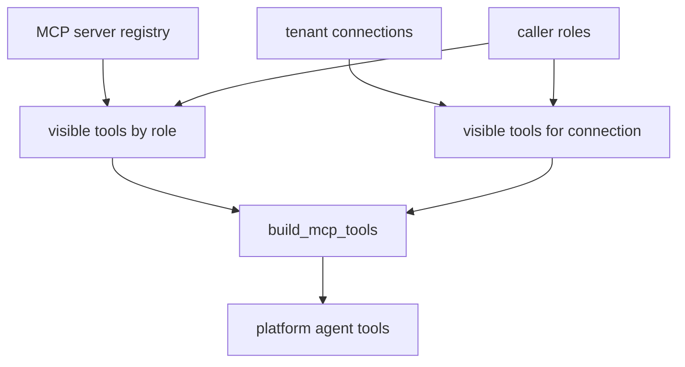

# Platform domain

The `platform` domain is the backend’s tool-driven concierge. Unlike `helpdesk`, `cockpit`, or `selfwiki`, it does not retrieve from a knowledge base as its primary capability. Instead it builds a Foundry chat agent whose capabilities come from Microsoft-first-party MCP tools filtered per request under the caller’s roles and credential ([`apps/backend/app/agents/platform.py`](https://github.com/ruinosus/foundry-assured/blob/7e41ad6f80befa024fae867b3fcdf763f8331a10/apps/backend/app/agents/platform.py#L1-L10), [`apps/backend/app/agents/platform.py`](https://github.com/ruinosus/foundry-assured/blob/7e41ad6f80befa024fae867b3fcdf763f8331a10/apps/backend/app/agents/platform.py#L31-L44)).

## Mount behavior and why it is per request

In the domain registry, `platform` is `kind="tool"`. `_mount_platform` only mounts it when `platform_configured()` succeeds, then serves `platform_agent_proxy` through the AG-UI FastAPI adapter. As with every mounted domain, it uses `_domain_deps("platform")`, so auth applies when enabled and shared mode adds tenant entitlement gating ([`apps/backend/app/domains.py`](https://github.com/ruinosus/foundry-assured/blob/7e41ad6f80befa024fae867b3fcdf763f8331a10/apps/backend/app/domains.py#L152-L164)).

`platform_agent_proxy` is a `PerRequestAgent`, not a prebuilt singleton agent. That proxy exists because `add_agent_framework_fastapi_endpoint(agent=...)` expects an instance implementing `SupportsAgentRun`, but platform tools depend on the current caller’s roles and OBO credential. `PerRequestAgent.run()` rebuilds the inner agent for every call so request-scoped state can influence tool availability safely ([`apps/backend/app/agents/platform.py`](https://github.com/ruinosus/foundry-assured/blob/7e41ad6f80befa024fae867b3fcdf763f8331a10/apps/backend/app/agents/platform.py#L47-L56), [`apps/backend/app/agents/per_request.py`](https://github.com/ruinosus/foundry-assured/blob/7e41ad6f80befa024fae867b3fcdf763f8331a10/apps/backend/app/agents/per_request.py#L1-L16), [`apps/backend/app/agents/per_request.py`](https://github.com/ruinosus/foundry-assured/blob/7e41ad6f80befa024fae867b3fcdf763f8331a10/apps/backend/app/agents/per_request.py#L25-L48)).

## Platform agent construction

`build_platform_agent()` creates a `FoundryChatClient` using the current tenant’s Foundry endpoint and model, then calls `credential_for_request()` so downstream tool-related calls can run as the signed-in user when required. It composes the model instructions from `PLATFORM_INSTRUCTIONS` and attaches `build_mcp_tools()` as the tool surface ([`apps/backend/app/agents/platform.py`](https://github.com/ruinosus/foundry-assured/blob/7e41ad6f80befa024fae867b3fcdf763f8331a10/apps/backend/app/agents/platform.py#L31-L44)).

That prompt is loaded through the same declarative prompt system as other domains. `app/agents/prompts.py` exposes `PLATFORM_INSTRUCTIONS` by composing the AgentSchema document for the `platform` agent, so tool behavior and model instructions are intentionally separated: prompt changes happen in the prompt system, while tool changes happen in the MCP build path ([`apps/backend/app/agents/prompts.py`](https://github.com/ruinosus/foundry-assured/blob/7e41ad6f80befa024fae867b3fcdf763f8331a10/apps/backend/app/agents/prompts.py#L82-L91), [`apps/backend/app/agents/prompts.py`](https://github.com/ruinosus/foundry-assured/blob/7e41ad6f80befa024fae867b3fcdf763f8331a10/apps/backend/app/agents/prompts.py#L147-L148)).

## MCP registry as governance data

The canonical description of available MCP servers is `app/agents/mcp/registry.py`. Its module docstring matters: the registry is the single source for both internal and hosted MCP paths, and governance lives as data instead of code branches. Each `McpServer` declares an id, label, remote URL, auth mode, optional OBO scope, explicit read and write tool names, minimum role thresholds, and enabled state ([`apps/backend/app/agents/mcp/registry.py`](https://github.com/ruinosus/foundry-assured/blob/7e41ad6f80befa024fae867b3fcdf763f8331a10/apps/backend/app/agents/mcp/registry.py#L1-L12), [`apps/backend/app/agents/mcp/registry.py`](https://github.com/ruinosus/foundry-assured/blob/7e41ad6f80befa024fae867b3fcdf763f8331a10/apps/backend/app/agents/mcp/registry.py#L24-L35)).

The most important invariant is fail-closed tool classification: `classify_tool(server, tool_name)` treats anything not explicitly listed as a read tool as a write tool. That means a newly appearing or drifted tool name cannot silently inherit read permissions. Visibility helpers then enforce that only roles satisfying the server’s grants can see its read or write tool sets ([`apps/backend/app/agents/mcp/registry.py`](https://github.com/ruinosus/foundry-assured/blob/7e41ad6f80befa024fae867b3fcdf763f8331a10/apps/backend/app/agents/mcp/registry.py#L130-L147)).

Caption: Platform tool exposure is the intersection of registry policy, tenant connection policy, and caller roles.

## Built-in server catalog and auth modes

The registry currently encodes several server types:

- `learn` is enabled, public, and exposes read-only documented tool names.
- `azure` and `entra` are disabled because the code comments say there is no confirmed managed remote endpoint that matches the current streamable-HTTP/OBO integration model.
- `azdo` is enabled as a real hosted endpoint with an Entra OBO scope and a per-organization URL template.
- `github` is enabled but uses `github_pat`, not Entra OBO, because GitHub’s MCP auth surface expects GitHub-issued tokens and Foundry rejects Microsoft tokens for that untrusted endpoint.
- `m365` is defined but disabled pending a confirmed endpoint ([`apps/backend/app/agents/mcp/registry.py`](https://github.com/ruinosus/foundry-assured/blob/7e41ad6f80befa024fae867b3fcdf763f8331a10/apps/backend/app/agents/mcp/registry.py#L42-L116)).

Those comments are not just documentation. They capture the code-owned reason some integrations are disabled: the backend prefers no tool over a tool wired against an unverified auth contract.

## Tenant connections as tightening layer

Per-tenant `Connection` records live in `tenant_store.py` and are mapped back to registry servers through `server_for_kind(kind)`. `visible_tools_for(server, conn, roles)` enforces the stricter-of-both rule: the caller must satisfy the registry’s minimum role and the tenant connection’s minimum role. A tenant may tighten visibility relative to the registry but may not loosen it. This is the multi-tenant governance mechanism that lets one codebase serve customers with different operational policies ([`apps/backend/app/core/tenant_store.py`](https://github.com/ruinosus/foundry-assured/blob/7e41ad6f80befa024fae867b3fcdf763f8331a10/apps/backend/app/core/tenant_store.py#L16-L28), [`apps/backend/app/agents/mcp/registry.py`](https://github.com/ruinosus/foundry-assured/blob/7e41ad6f80befa024fae867b3fcdf763f8331a10/apps/backend/app/agents/mcp/registry.py#L150-L175)).

The tenant API enforces connection validity at the HTTP boundary: only known `kind` values are accepted, and a connection must provide either `foundry_connection_id` or the deprecated `keyvault_ref`. That prevents the platform domain from receiving structurally unusable connection records ([`apps/backend/app/api/tenant.py`](https://github.com/ruinosus/foundry-assured/blob/7e41ad6f80befa024fae867b3fcdf763f8331a10/apps/backend/app/api/tenant.py#L115-L123)).

## Tool building and brokering surface

The concrete tool assembly lives in `app/agents/mcp/tools.py`. That module is the main extension seam for adding MCP-backed capability. It builds internal tools from tenant connections, routes approval requirements, and also builds hosted-tool descriptors for the hosted platform path. The eval suite treats it as a critical surface: there are dedicated tests for connection tool build shape, RBAC per tool, live brokering, and hosted build behavior ([`apps/backend/app/agents/mcp/tools.py`](https://github.com/ruinosus/foundry-assured/blob/7e41ad6f80befa024fae867b3fcdf763f8331a10/apps/backend/app/agents/mcp/tools.py#L1-L80), [`apps/backend/eval/connection_tools_build_test.py`](https://github.com/ruinosus/foundry-assured/blob/7e41ad6f80befa024fae867b3fcdf763f8331a10/apps/backend/eval/connection_tools_build_test.py#L1-L52), [`apps/backend/eval/rbac_per_tool_test.py`](https://github.com/ruinosus/foundry-assured/blob/7e41ad6f80befa024fae867b3fcdf763f8331a10/apps/backend/eval/rbac_per_tool_test.py#L1-L50)).

A particularly important real-world proof is `mcp_brokering_e2e_test.py`. It verifies that `build_from_connections` can broker credentials from a real Foundry connection, that write tools land under `always_require_approval`, that OBO-backed connections mint live bearer tokens, and optionally that hosted tool descriptors preserve the right project-connection id. Those are the behaviors to preserve when altering the platform tool surface ([`apps/backend/eval/mcp_brokering_e2e_test.py`](https://github.com/ruinosus/foundry-assured/blob/7e41ad6f80befa024fae867b3fcdf763f8331a10/apps/backend/eval/mcp_brokering_e2e_test.py#L1-L21), [`apps/backend/eval/mcp_brokering_e2e_test.py`](https://github.com/ruinosus/foundry-assured/blob/7e41ad6f80befa024fae867b3fcdf763f8331a10/apps/backend/eval/mcp_brokering_e2e_test.py#L154-L259)).

## Approval model

The platform domain’s write safety model is intentionally separate from helpdesk escalation. Registry comments describe read tools as `never_require approval` and write tools as `always_require`, but the code also notes that platform write approval is routed through the app’s own HITL system rather than trusting server-native approval semantics blindly ([`apps/backend/app/agents/mcp/registry.py`](https://github.com/ruinosus/foundry-assured/blob/7e41ad6f80befa024fae867b3fcdf763f8331a10/apps/backend/app/agents/mcp/registry.py#L24-L35), [`apps/backend/eval/mcp_brokering_e2e_test.py`](https://github.com/ruinosus/foundry-assured/blob/7e41ad6f80befa024fae867b3fcdf763f8331a10/apps/backend/eval/mcp_brokering_e2e_test.py#L189-L211)).

That means changing registry read/write classification or `tools.py` approval-mode construction is a security-sensitive change, not a cosmetic one.

## Live versus hosted platform

The live platform domain is the AG-UI mounted `PerRequestAgent` path described here. The hosted platform twin is separate and uses `/platform-hosted` plus the hosted bridge service. Shared registry and connection data feed both, but the hosted path has different transport and contract uncertainty around Invocations framing. Those bridge details are documented in hosted-bridges ([`apps/backend/app/api/chat.py`](https://github.com/ruinosus/foundry-assured/blob/7e41ad6f80befa024fae867b3fcdf763f8331a10/apps/backend/app/api/chat.py#L29-L34), [`apps/backend/app/services/hosted.py`](https://github.com/ruinosus/foundry-assured/blob/7e41ad6f80befa024fae867b3fcdf763f8331a10/apps/backend/app/services/hosted.py#L121-L182)).

## Safe change recipes

- Add a built-in server by extending `SERVERS` with explicit read and write tool lists, auth mode, and minimum roles. Never rely on implicit tool classification ([`apps/backend/app/agents/mcp/registry.py`](https://github.com/ruinosus/foundry-assured/blob/7e41ad6f80befa024fae867b3fcdf763f8331a10/apps/backend/app/agents/mcp/registry.py#L38-L41), [`apps/backend/app/agents/mcp/registry.py`](https://github.com/ruinosus/foundry-assured/blob/7e41ad6f80befa024fae867b3fcdf763f8331a10/apps/backend/app/agents/mcp/registry.py#L130-L147)).
- Add tenant-specific tool capability through `Connection` records and `tools.py`, not by hardcoding tenant branches in `platform.py`.
- Keep platform request-scoped. Replacing `PerRequestAgent` with a singleton agent would freeze tools and credentials against the wrong caller or tenant.

## Focused tests and validation

- `uv run python -m eval.mcp_registry_test` is the narrowest check for registry data, visibility, and classification semantics ([`apps/backend/eval/mcp_registry_test.py`](https://github.com/ruinosus/foundry-assured/blob/7e41ad6f80befa024fae867b3fcdf763f8331a10/apps/backend/eval/mcp_registry_test.py#L1-L54)).
- `uv run python -m eval.connection_tools_build_test` and `uv run python -m eval.rbac_per_tool_test` are the focused checks for tool construction and role filtering ([`apps/backend/eval/connection_tools_build_test.py`](https://github.com/ruinosus/foundry-assured/blob/7e41ad6f80befa024fae867b3fcdf763f8331a10/apps/backend/eval/connection_tools_build_test.py#L1-L52), [`apps/backend/eval/rbac_per_tool_test.py`](https://github.com/ruinosus/foundry-assured/blob/7e41ad6f80befa024fae867b3fcdf763f8331a10/apps/backend/eval/rbac_per_tool_test.py#L1-L50)).
- `uv run python -m eval.mcp_brokering_e2e_test` is the infra-gated proof for real credential brokering and approval wiring ([`apps/backend/eval/mcp_brokering_e2e_test.py`](https://github.com/ruinosus/foundry-assured/blob/7e41ad6f80befa024fae867b3fcdf763f8331a10/apps/backend/eval/mcp_brokering_e2e_test.py#L1-L21), [`apps/backend/eval/mcp_brokering_e2e_test.py`](https://github.com/ruinosus/foundry-assured/blob/7e41ad6f80befa024fae867b3fcdf763f8331a10/apps/backend/eval/mcp_brokering_e2e_test.py#L154-L259)).
- `uv run python -m eval.platform_hosted_bridge_test` belongs with hosted changes, but is still relevant because the hosted platform path shares the same domain semantics ([`apps/backend/eval/platform_hosted_bridge_test.py`](https://github.com/ruinosus/foundry-assured/blob/7e41ad6f80befa024fae867b3fcdf763f8331a10/apps/backend/eval/platform_hosted_bridge_test.py#L1-L60)).
