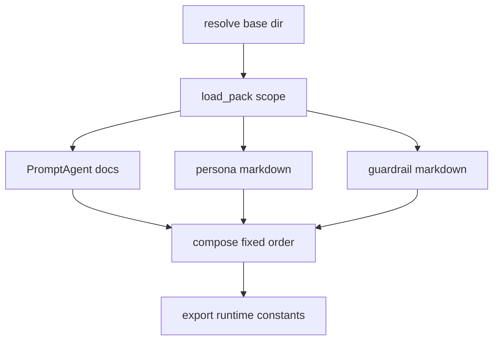

# Prompt system

The backend no longer treats prompts as ad hoc string constants. `app/agents/definitions.py` is the canonical loader for AgentSchema `PromptAgent` documents stored under `apps/backend/agents/`, and `app/agents/prompts.py` is the thin compatibility layer that composes those documents once and re-exports stable constant names for runtime consumers ([`apps/backend/app/agents/definitions.py`](https://github.com/ruinosus/foundry-assured/blob/7e41ad6f80befa024fae867b3fcdf763f8331a10/apps/backend/app/agents/definitions.py#L1-L10), [`apps/backend/app/agents/prompts.py`](https://github.com/ruinosus/foundry-assured/blob/7e41ad6f80befa024fae867b3fcdf763f8331a10/apps/backend/app/agents/prompts.py#L1-L21)).

## What is in schema and what is repository-owned

The loader docs are explicit about the split:

- one agent document is an AgentSchema `PromptAgent`,
- the scope catalog lives in `agents/<scope>/scope.yaml`,
- shared personas live in `agents/<scope>/personas/*.md`, and
- cross-cutting guardrails live in `agents/<scope>/guardrails/*.md`.

Those latter three are *not* bent into schema fields with new meanings. Instead agents reference personas and guardrails by name through the repository’s vendor metadata key `x-foundry-assured`, and prompt composition assembles them in a fixed order: persona first, then `instructions`, then `additionalInstructions`, then guardrails ([`apps/backend/app/agents/definitions.py`](https://github.com/ruinosus/foundry-assured/blob/7e41ad6f80befa024fae867b3fcdf763f8331a10/apps/backend/app/agents/definitions.py#L12-L35), [`apps/backend/app/agents/definitions.py`](https://github.com/ruinosus/foundry-assured/blob/7e41ad6f80befa024fae867b3fcdf763f8331a10/apps/backend/app/agents/definitions.py#L71-L77), [`apps/backend/app/agents/definitions.py`](https://github.com/ruinosus/foundry-assured/blob/7e41ad6f80befa024fae867b3fcdf763f8331a10/apps/backend/app/agents/definitions.py#L117-L161)).

## Loader data model and fail-loud behavior

The loader defines `Scope`, `Persona`, `Guardrail`, and `PromptPack`. `PromptPack.agent(name)` and `PromptPack.guardrail(name)` refuse unknown names by raising `AgentNotFound`, and `PromptPack.compose(name)` raises if the final prompt would be empty. The comments explain the reasoning: a missing or renamed document must fail boot rather than silently degrade into a placeholder instruction ([`apps/backend/app/agents/definitions.py`](https://github.com/ruinosus/foundry-assured/blob/7e41ad6f80befa024fae867b3fcdf763f8331a10/apps/backend/app/agents/definitions.py#L80-L181)).

Unknown vendor extension keys are also rejected. `host_extensions(definition)` extracts only the recognized `persona` and `guardrails` keys from the metadata bag and raises on any other key, because silent acceptance would turn typos into invisible configuration bugs ([`apps/backend/app/agents/definitions.py`](https://github.com/ruinosus/foundry-assured/blob/7e41ad6f80befa024fae867b3fcdf763f8331a10/apps/backend/app/agents/definitions.py#L210-L219)).

## PowerFx is refused, not interpreted loosely

One of the strongest invariants in the loader is `refuse_powerfx_indirection`. The code comments say `agent-framework-declarative` evaluates strings starting with `=` as PowerFx expressions, but without the .NET runtime it silently returns the literal string. That means something like `=Env.SECRET` could reach a prompt as text. This repository refuses such values at load time and instructs operators to resolve environment values in the host instead ([`apps/backend/app/agents/definitions.py`](https://github.com/ruinosus/foundry-assured/blob/7e41ad6f80befa024fae867b3fcdf763f8331a10/apps/backend/app/agents/definitions.py#L30-L35), [`apps/backend/app/agents/definitions.py`](https://github.com/ruinosus/foundry-assured/blob/7e41ad6f80befa024fae867b3fcdf763f8331a10/apps/backend/app/agents/definitions.py#L184-L208)).

That rule applies recursively to agent documents and Markdown front matter for personas and guardrails because `refuse_powerfx_indirection` walks mappings and lists. This is why the loader can safely treat prompt source as data even though the underlying framework supports expression evaluation.

## Scope resolution and external overrides

`app/agents/prompts.py` chooses where prompt documents come from through `_resolve_base_dir()`. The default is the baked copy under `apps/backend/agents`. If `AGENTS_DIR` is unset, the backend uses the baked version and stays self-contained. If `AGENTS_DIR` is set and the expected scope exists there, the backend uses the external directory. If `AGENTS_DIR` is set but the scope is absent, the backend logs loudly and falls back to the baked copy; the comments explain that this case represents an unseeded share rather than a published-but-broken prompt set ([`apps/backend/app/agents/prompts.py`](https://github.com/ruinosus/foundry-assured/blob/7e41ad6f80befa024fae867b3fcdf763f8331a10/apps/backend/app/agents/prompts.py#L34-L77)).

Once a scope is chosen, `_load_pack()` calls `load_pack()` and fails loudly if the directory is missing or composition raises. The asymmetry is deliberate: unset `AGENTS_DIR` uses the baked copy, an absent external scope falls back with a warning, but a present external scope that fails inside `load_pack()` aborts boot because operators believe that published prompt set is live. `_compose(pack, agent)` then wraps composition errors with a boot-time refusal message so a bad prompt pack cannot be mistaken for a healthy startup ([`apps/backend/app/agents/prompts.py`](https://github.com/ruinosus/foundry-assured/blob/7e41ad6f80befa024fae867b3fcdf763f8331a10/apps/backend/app/agents/prompts.py#L95-L126), [`apps/backend/app/agents/definitions.py`](https://github.com/ruinosus/foundry-assured/blob/7e41ad6f80befa024fae867b3fcdf763f8331a10/apps/backend/app/agents/definitions.py#L284-L306)).

Caption: Runtime code reads stable constants, but those constants are composed from declarative prompt assets.

## Runtime consumers

`_AGENT_FOR_CONSTANT` maps runtime constant names to agent document names. The backend exports prompt constants for:

- workflow steps: triage, retrieve, resolve,
- concierge variants: grounded and ungrounded,
- grounded domains: cockpit and selfwiki,
- tool domain: platform.

That is why workflow and domain code can still import constants without knowing anything about AgentSchema internals ([`apps/backend/app/agents/prompts.py`](https://github.com/ruinosus/foundry-assured/blob/7e41ad6f80befa024fae867b3fcdf763f8331a10/apps/backend/app/agents/prompts.py#L82-L91), [`apps/backend/app/agents/prompts.py`](https://github.com/ruinosus/foundry-assured/blob/7e41ad6f80befa024fae867b3fcdf763f8331a10/apps/backend/app/agents/prompts.py#L129-L149)).

Examples of those consumers:

- `workflow/agents.py` uses `TRIAGE_INSTRUCTIONS`, `RETRIEVE_INSTRUCTIONS`, and `RESOLVE_INSTRUCTIONS` ([`apps/backend/app/workflow/agents.py`](https://github.com/ruinosus/foundry-assured/blob/7e41ad6f80befa024fae867b3fcdf763f8331a10/apps/backend/app/workflow/agents.py#L17-L21), [`apps/backend/app/workflow/agents.py`](https://github.com/ruinosus/foundry-assured/blob/7e41ad6f80befa024fae867b3fcdf763f8331a10/apps/backend/app/workflow/agents.py#L34-L70)).
- `agents/concierge.py` uses grounded and ungrounded concierge variants ([`apps/backend/app/agents/concierge.py`](https://github.com/ruinosus/foundry-assured/blob/7e41ad6f80befa024fae867b3fcdf763f8331a10/apps/backend/app/agents/concierge.py#L19-L22), [`apps/backend/app/agents/concierge.py`](https://github.com/ruinosus/foundry-assured/blob/7e41ad6f80befa024fae867b3fcdf763f8331a10/apps/backend/app/agents/concierge.py#L44-L62)).
- `agents/platform.py` uses `PLATFORM_INSTRUCTIONS` for the tool-driven concierge ([`apps/backend/app/agents/platform.py`](https://github.com/ruinosus/foundry-assured/blob/7e41ad6f80befa024fae867b3fcdf763f8331a10/apps/backend/app/agents/platform.py#L17-L19), [`apps/backend/app/agents/platform.py`](https://github.com/ruinosus/foundry-assured/blob/7e41ad6f80befa024fae867b3fcdf763f8331a10/apps/backend/app/agents/platform.py#L39-L44)).

## Why prompt contracts are a first-class test surface

`eval/prompt_contract_test.py` is the canonical prompt regression suite. Its docstring explains that the older byte-equivalence gate was retired because prompts are allowed to evolve, but the backend still depends on semantic contracts such as:

- `RESOLVE` emitting the `TICKET:` sentinel,
- `RETRIEVE` carrying the `NO_MATCH` sentinel,
- grounded prompts requiring citation discipline,
- ungrounded prompts *forbidding* that duty,
- platform prompts preserving HITL-related constraints.

The runner first guards the guard itself: it proves unknown agents raise, a failing check really fails, and `=Env.X` is refused. Only then does it run the YAML-defined prompt cases ([`apps/backend/eval/prompt_contract_test.py`](https://github.com/ruinosus/foundry-assured/blob/7e41ad6f80befa024fae867b3fcdf763f8331a10/apps/backend/eval/prompt_contract_test.py#L1-L30), [`apps/backend/eval/prompt_contract_test.py`](https://github.com/ruinosus/foundry-assured/blob/7e41ad6f80befa024fae867b3fcdf763f8331a10/apps/backend/eval/prompt_contract_test.py#L109-L142), [`apps/backend/eval/prompt_contract_test.py`](https://github.com/ruinosus/foundry-assured/blob/7e41ad6f80befa024fae867b3fcdf763f8331a10/apps/backend/eval/prompt_contract_test.py#L145-L166)).

## Safe extension points

- Add a new agent constant by adding a new document in the scope and wiring it into `_AGENT_FOR_CONSTANT`; do not hardcode a new string constant directly in runtime code ([`apps/backend/app/agents/prompts.py`](https://github.com/ruinosus/foundry-assured/blob/7e41ad6f80befa024fae867b3fcdf763f8331a10/apps/backend/app/agents/prompts.py#L82-L91)).
- Add a shared persona or guardrail through the scope directories and metadata references, not by pasting shared text into multiple agent documents ([`apps/backend/app/agents/definitions.py`](https://github.com/ruinosus/foundry-assured/blob/7e41ad6f80befa024fae867b3fcdf763f8331a10/apps/backend/app/agents/definitions.py#L16-L29), [`apps/backend/app/agents/definitions.py`](https://github.com/ruinosus/foundry-assured/blob/7e41ad6f80befa024fae867b3fcdf763f8331a10/apps/backend/app/agents/definitions.py#L252-L306)).
- If you need runtime environment-dependent values, resolve them in Python before agent creation. Do not attempt PowerFx indirection in prompt documents.

## Focused validation

- `uv run python -m eval.prompt_contract_test` is the primary regression suite for prompt semantics ([`apps/backend/eval/prompt_contract_test.py`](https://github.com/ruinosus/foundry-assured/blob/7e41ad6f80befa024fae867b3fcdf763f8331a10/apps/backend/eval/prompt_contract_test.py#L1-L30), [`apps/backend/eval/prompt_contract_test.py`](https://github.com/ruinosus/foundry-assured/blob/7e41ad6f80befa024fae867b3fcdf763f8331a10/apps/backend/eval/prompt_contract_test.py#L145-L166)).
- `uv run python -m eval.domain_registry_test` is also relevant after adding domain prompts because registry rows point at imported constants and grounded invariants ([`apps/backend/eval/domain_registry_test.py`](https://github.com/ruinosus/foundry-assured/blob/7e41ad6f80befa024fae867b3fcdf763f8331a10/apps/backend/eval/domain_registry_test.py#L38-L56)).
- A narrow local smoke test is importing `app.agents.prompts`; if scope loading fails, the backend should refuse to boot, which is expected by design ([`apps/backend/app/agents/prompts.py`](https://github.com/ruinosus/foundry-assured/blob/7e41ad6f80befa024fae867b3fcdf763f8331a10/apps/backend/app/agents/prompts.py#L95-L126)).
