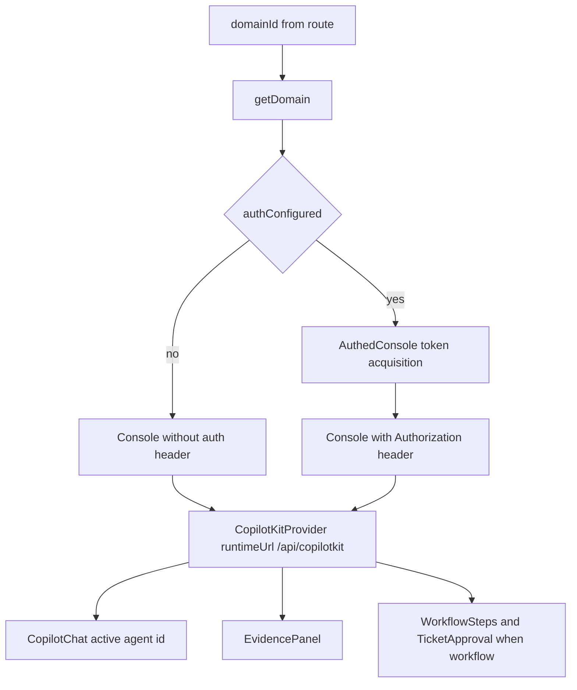

`AssuranceConsole` is the canonical frontend surface for every domain route under `/d/[domain]`. The component is intentionally generic: it looks up a domain by id, decides whether auth is required, and renders one console layout with per-domain differences driven by registry metadata and `domain.kind`.[`apps/frontend/components/console/AssuranceConsole.tsx`](https://github.com/ruinosus/foundry-assured/blob/4b749e7bac56789f0b1097cd4a8212b5c5c65d05/apps/frontend/components/console/AssuranceConsole.tsx#L3-L14) [`apps/frontend/components/console/AssuranceConsole.tsx`](https://github.com/ruinosus/foundry-assured/blob/4b749e7bac56789f0b1097cd4a8212b5c5c65d05/apps/frontend/components/console/AssuranceConsole.tsx#L151-L162)

## Layout and responsibilities

The console renders two primary panes:

- the main chat pane, with CopilotKit, suggested prompts, and optional workflow widgets
- the `EvidencePanel`, which is the right-hand proof surface for citations and assurance information

[`apps/frontend/components/console/AssuranceConsole.tsx`](https://github.com/ruinosus/foundry-assured/blob/4b749e7bac56789f0b1097cd4a8212b5c5c65d05/apps/frontend/components/console/AssuranceConsole.tsx#L46-L99)

Workflow domains render `WorkflowSteps` and `TicketApproval`. Grounded domains skip those and present simpler cited Q&A behavior.[`apps/frontend/components/console/AssuranceConsole.tsx`](https://github.com/ruinosus/foundry-assured/blob/4b749e7bac56789f0b1097cd4a8212b5c5c65d05/apps/frontend/components/console/AssuranceConsole.tsx#L61-L69)

## CopilotKit integration

The console creates a `CopilotKitProvider` pointing at `/api/copilotkit`. The active `agentId` is determined by domain id and, when applicable, the live-versus-hosted toggle. The frontend does not call backend AG-UI paths directly; CopilotKit goes through the proxy layer.[`apps/frontend/components/console/AssuranceConsole.tsx`](https://github.com/ruinosus/foundry-assured/blob/4b749e7bac56789f0b1097cd4a8212b5c5c65d05/apps/frontend/components/console/AssuranceConsole.tsx#L32-L45) [`apps/frontend/components/console/AssuranceConsole.tsx`](https://github.com/ruinosus/foundry-assured/blob/4b749e7bac56789f0b1097cd4a8212b5c5c65d05/apps/frontend/components/console/AssuranceConsole.tsx#L70-L94)

## Live-versus-hosted mode

If a domain declares `hostedAgentId`, the console shows a segmented toggle between `Live` and `Hosted`. The active agent id switches accordingly, which lets the same UI route exercise both the live backend path and the hosted-agent path.[`apps/frontend/components/console/AssuranceConsole.tsx`](https://github.com/ruinosus/foundry-assured/blob/4b749e7bac56789f0b1097cd4a8212b5c5c65d05/apps/frontend/components/console/AssuranceConsole.tsx#L32-L39) [`apps/frontend/components/console/AssuranceConsole.tsx`](https://github.com/ruinosus/foundry-assured/blob/4b749e7bac56789f0b1097cd4a8212b5c5c65d05/apps/frontend/components/console/AssuranceConsole.tsx#L70-L89)

This UI behavior mirrors architectural differences in the backend and hosted-agent packaging:

- live helpdesk gives AG-UI workflow steps and HITL
- hosted helpdesk is managed agent execution
- live platform offers tool steps and approval semantics
- hosted platform is the Invocations-based hosted twin

## Auth gating

When auth is configured, `AuthedConsole` acquires an access token silently for the API scope and refreshes it every four minutes to stay ahead of token expiry. If silent acquisition fails, it falls back to redirect login. If auth is not configured, the console renders directly without MSAL requirements.[`apps/frontend/components/console/AssuranceConsole.tsx`](https://github.com/ruinosus/foundry-assured/blob/4b749e7bac56789f0b1097cd4a8212b5c5c65d05/apps/frontend/components/console/AssuranceConsole.tsx#L113-L149) [`apps/frontend/components/console/AssuranceConsole.tsx`](https://github.com/ruinosus/foundry-assured/blob/4b749e7bac56789f0b1097cd4a8212b5c5c65d05/apps/frontend/components/console/AssuranceConsole.tsx#L151-L162)

That refresh timer is operationally important: without it, live OBO chat sessions could begin succeeding and then start failing mid-session with expired access tokens.

This diagram shows how domain lookup, auth gating, and CopilotKit composition drive the console.

## Evidence rendering contract

The console always renders `EvidencePanel`, and the backend grounded path emits a `sources` custom event whose payload is designed specifically so the UI can show source snippets inline even when blob URLs are private.[`apps/frontend/components/console/AssuranceConsole.tsx`](https://github.com/ruinosus/foundry-assured/blob/4b749e7bac56789f0b1097cd4a8212b5c5c65d05/apps/frontend/components/console/AssuranceConsole.tsx#L97-L99) [`apps/backend/app/services/grounded.py`](https://github.com/ruinosus/foundry-assured/blob/4b749e7bac56789f0b1097cd4a8212b5c5c65d05/apps/backend/app/services/grounded.py#L123-L140)

## Failure handling

If the route param does not map to a known domain, the console renders a not-found state instead of crashing. That behavior is useful when domain registry and routing get out of sync during development.[`apps/frontend/components/console/AssuranceConsole.tsx`](https://github.com/ruinosus/foundry-assured/blob/4b749e7bac56789f0b1097cd4a8212b5c5c65d05/apps/frontend/components/console/AssuranceConsole.tsx#L151-L159)

## Focused evidence

The best cross-system validation for this UI is Playwright smoke coverage that visits each domain page, sends prompts, and checks for workflow or citation behavior.[`e2e/smoke.spec.ts`](https://github.com/ruinosus/foundry-assured/blob/4b749e7bac56789f0b1097cd4a8212b5c5c65d05/e2e/smoke.spec.ts#L123-L132) [`e2e/smoke.spec.ts`](https://github.com/ruinosus/foundry-assured/blob/4b749e7bac56789f0b1097cd4a8212b5c5c65d05/e2e/smoke.spec.ts#L134-L168) [`e2e/smoke.spec.ts`](https://github.com/ruinosus/foundry-assured/blob/4b749e7bac56789f0b1097cd4a8212b5c5c65d05/e2e/smoke.spec.ts#L170-L209)

## Minimal validation

- `cd e2e && npm test`

That is the narrowest high-confidence validation because the console’s contracts are mostly cross-system rather than local component-only behavior.