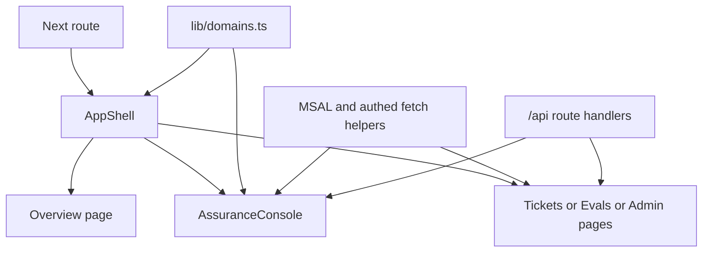

The frontend is a Next.js App Router application that presents the repository’s domains through one shared shell and one generic console route. Its job is not to implement agent logic locally; it provides UI state, routing, auth, and proxy boundaries for the backend and hosted agents.[`apps/frontend/package.json`](https://github.com/ruinosus/foundry-assured/blob/4b749e7bac56789f0b1097cd4a8212b5c5c65d05/apps/frontend/package.json#L1-L13) [`apps/frontend/app/d/[domain]/page.tsx`](https://github.com/ruinosus/foundry-assured/blob/4b749e7bac56789f0b1097cd4a8212b5c5c65d05/apps/frontend/app/d/[domain]/page.tsx#L3-L24)

## Route structure

The app has a small number of top-level route families:

- `/` overview landing page
- `/d/[domain]` generic agent console
- `/tickets` and `/evals` workspace pages
- `/admin/users` and `/admin/connections` admin workspace pages
- `/api/*` route handlers that proxy browser traffic to the backend

[`apps/frontend/app/page.tsx`](https://github.com/ruinosus/foundry-assured/blob/4b749e7bac56789f0b1097cd4a8212b5c5c65d05/apps/frontend/app/page.tsx#L27-L80) [`apps/frontend/app/tickets/page.tsx`](https://github.com/ruinosus/foundry-assured/blob/4b749e7bac56789f0b1097cd4a8212b5c5c65d05/apps/frontend/app/tickets/page.tsx#L1-L10) [`apps/frontend/app/evals/page.tsx`](https://github.com/ruinosus/foundry-assured/blob/4b749e7bac56789f0b1097cd4a8212b5c5c65d05/apps/frontend/app/evals/page.tsx#L1-L10) [`apps/frontend/app/admin/users/page.tsx`](https://github.com/ruinosus/foundry-assured/blob/4b749e7bac56789f0b1097cd4a8212b5c5c65d05/apps/frontend/app/admin/users/page.tsx#L1-L29) [`apps/frontend/app/admin/connections/page.tsx`](https://github.com/ruinosus/foundry-assured/blob/4b749e7bac56789f0b1097cd4a8212b5c5c65d05/apps/frontend/app/admin/connections/page.tsx#L1-L29)

## Domain registry is the frontend extension seam

`lib/domains.ts` is the frontend’s single source of truth for domain metadata. It defines each domain’s id, label, kind, suggested prompts, default endpoint, and optional hosted twin id. The sidebar, landing cards, and generic console all depend on this registry.[`apps/frontend/lib/domains.ts`](https://github.com/ruinosus/foundry-assured/blob/4b749e7bac56789f0b1097cd4a8212b5c5c65d05/apps/frontend/lib/domains.ts#L1-L26) [`apps/frontend/lib/domains.ts`](https://github.com/ruinosus/foundry-assured/blob/4b749e7bac56789f0b1097cd4a8212b5c5c65d05/apps/frontend/lib/domains.ts#L28-L95)

That means adding a domain usually starts in the registry, not in route creation. `/d/[domain]` is intentionally generic and simply resolves the path param into a domain id passed into `AssuranceConsole`.[`apps/frontend/app/d/[domain]/page.tsx`](https://github.com/ruinosus/foundry-assured/blob/4b749e7bac56789f0b1097cd4a8212b5c5c65d05/apps/frontend/app/d/[domain]/page.tsx#L16-L23)

## Shared shell

`AppShell` provides the fixed sidebar, workspace and agent navigation sections, breadcrumbs, account chip, and backend status check. It derives active nav state from the current pathname and only shows admin nav items to users whose roles include `Admin`.[`apps/frontend/components/shell/AppShell.tsx`](https://github.com/ruinosus/foundry-assured/blob/4b749e7bac56789f0b1097cd4a8212b5c5c65d05/apps/frontend/components/shell/AppShell.tsx#L16-L37) [`apps/frontend/components/shell/AppShell.tsx`](https://github.com/ruinosus/foundry-assured/blob/4b749e7bac56789f0b1097cd4a8212b5c5c65d05/apps/frontend/components/shell/AppShell.tsx#L39-L57) [`apps/frontend/components/shell/AppShell.tsx`](https://github.com/ruinosus/foundry-assured/blob/4b749e7bac56789f0b1097cd4a8212b5c5c65d05/apps/frontend/components/shell/AppShell.tsx#L91-L159)

The admin visibility check is explicitly advisory only. The page and backend API still re-check server-side authorization.[`apps/frontend/components/shell/AppShell.tsx`](https://github.com/ruinosus/foundry-assured/blob/4b749e7bac56789f0b1097cd4a8212b5c5c65d05/apps/frontend/components/shell/AppShell.tsx#L100-L103)

## Auth setup and demo mode

`lib/auth/msal.ts` reads `NEXT_PUBLIC_ENTRA_*` environment variables to decide whether auth is configured. If they are absent, or if demo mode is enabled, the app runs without auth and depends on backend local-dev fallbacks.[`apps/frontend/lib/auth/msal.ts`](https://github.com/ruinosus/foundry-assured/blob/4b749e7bac56789f0b1097cd4a8212b5c5c65d05/apps/frontend/lib/auth/msal.ts#L3-L18)

This split is important for safe changes:

- **production/cloud** expects sign-in and access-token forwarding
- **demo/local** must still render usable UI without MSAL-driven auth

The landing page also reflects that the frontend is a showcase for domain-swappable guarantees rather than a single-purpose chat screen.[`apps/frontend/app/page.tsx`](https://github.com/ruinosus/foundry-assured/blob/4b749e7bac56789f0b1097cd4a8212b5c5c65d05/apps/frontend/app/page.tsx#L5-L25) [`apps/frontend/app/page.tsx`](https://github.com/ruinosus/foundry-assured/blob/4b749e7bac56789f0b1097cd4a8212b5c5c65d05/apps/frontend/app/page.tsx#L27-L80)

This diagram shows how the frontend composes one shell around registry-driven console and workspace pages.

## Workspace views

Tickets and evals are simple page wrappers around client views that fetch backend data through frontend proxies. Admin pages are dynamic client-only views gated by frontend role checks before they render the heavy UI components.[`apps/frontend/components/tickets/TicketsView.tsx`](https://github.com/ruinosus/foundry-assured/blob/4b749e7bac56789f0b1097cd4a8212b5c5c65d05/apps/frontend/components/tickets/TicketsView.tsx#L3-L15) [`apps/frontend/components/evals/EvalsView.tsx`](https://github.com/ruinosus/foundry-assured/blob/4b749e7bac56789f0b1097cd4a8212b5c5c65d05/apps/frontend/components/evals/EvalsView.tsx#L3-L23) [`apps/frontend/app/admin/users/page.tsx`](https://github.com/ruinosus/foundry-assured/blob/4b749e7bac56789f0b1097cd4a8212b5c5c65d05/apps/frontend/app/admin/users/page.tsx#L13-L28)

## Focused tests and validation

There is no large frontend unit-test suite in the repo; the strongest validation is end-to-end through Playwright and runtime lint/typecheck scripts exposed in `package.json`.[`apps/frontend/package.json`](https://github.com/ruinosus/foundry-assured/blob/4b749e7bac56789f0b1097cd4a8212b5c5c65d05/apps/frontend/package.json#L5-L13) [`e2e/smoke.spec.ts`](https://github.com/ruinosus/foundry-assured/blob/4b749e7bac56789f0b1097cd4a8212b5c5c65d05/e2e/smoke.spec.ts#L123-L131)

Minimal checks:

- `cd apps/frontend && npm run lint`
- `cd apps/frontend && npm run typecheck`
- `cd e2e && npm test`

Those validate local frontend correctness and the deployed, authenticated experience.