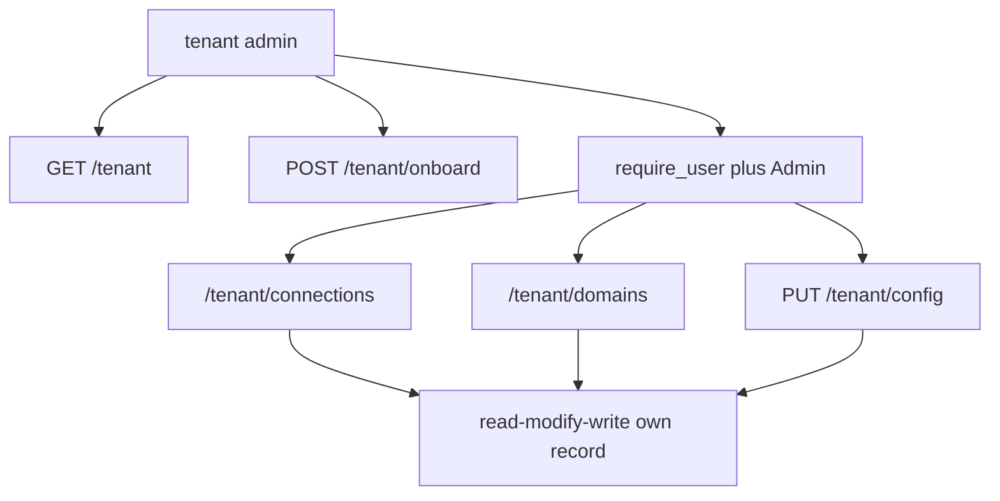

# Backend API surface

The backend splits its HTTP surface between ordinary FastAPI routers aggregated by `api_router` and live AG-UI domain mounts registered separately through `mount_domains(app)`. `api_router` includes health, tickets, evals, hosted chat bridges, admin, and `me`, and conditionally includes the tenant router only in shared mode. The mounted domain paths are `/helpdesk`, `/cockpit`, `/selfwiki`, and `/platform` ([`apps/backend/app/api/__init__.py`](https://github.com/ruinosus/foundry-assured/blob/7e41ad6f80befa024fae867b3fcdf763f8331a10/apps/backend/app/api/__init__.py#L1-L19), [`apps/backend/app/main.py`](https://github.com/ruinosus/foundry-assured/blob/7e41ad6f80befa024fae867b3fcdf763f8331a10/apps/backend/app/main.py#L44-L49), [`apps/backend/app/domains.py`](https://github.com/ruinosus/foundry-assured/blob/7e41ad6f80befa024fae867b3fcdf763f8331a10/apps/backend/app/domains.py#L167-L176)).

## Route families and gates

| Family | Paths | Primary gate | Key invariant |
| --- | --- | --- | --- |
| Health | `/healthz` | none | Always cheap and unconditional |
| Identity | `/me` | `require_user` when auth is on | Returns API-app roles, not browser token roles |
| Tickets | `/tickets` | `auth_dependencies()` | Shows persisted HITL-created tickets |
| Evals | `/eval/runs`, `/eval/foundry` | `auth_dependencies()` | Read-only diagnostics, degrade empty not 500 |
| Hosted bridges | `/helpdesk-hosted`, `/platform-hosted` | auth plus domain gate for platform | Mirror live domains with hosted transport |
| Admin | `/admin/*` | `require_role("Admin")` | Graph-backed admin-only operations |
| Tenant | `/tenant*` | mix of Admin, onboarding, and tenant-scoped gates | Shared-mode config/connection/domain mutation only |
| Live domains | `/helpdesk`, `/cockpit`, `/selfwiki`, `/platform` | `_domain_deps(domain_id)` | Shared-mode domain entitlement is request-time |

This table is only the route map; the rest of this page focuses on the contract and safety rules each family enforces.

## Health, identity, and tickets

`/healthz` is intentionally trivial and unauthenticated: it returns `{"status": "ok"}` and nothing more. Any logic added here would break its role as a cheap liveness probe ([`apps/backend/app/api/health.py`](https://github.com/ruinosus/foundry-assured/blob/7e41ad6f80befa024fae867b3fcdf763f8331a10/apps/backend/app/api/health.py#L1-L8)).

`GET /me` exists because the frontend cannot read API-app roles from the SPA id token; the comments say those roles live in the access token for this backend API. In auth-off local development it returns a dev identity with all app roles to keep the UI usable, which means this endpoint is a UX aid and not a security gate by itself ([`apps/backend/app/api/me.py`](https://github.com/ruinosus/foundry-assured/blob/7e41ad6f80befa024fae867b3fcdf763f8331a10/apps/backend/app/api/me.py#L1-L7), [`apps/backend/app/api/me.py`](https://github.com/ruinosus/foundry-assured/blob/7e41ad6f80befa024fae867b3fcdf763f8331a10/apps/backend/app/api/me.py#L19-L31)).

`GET /tickets` is behind `auth_dependencies()` and returns the most recent persisted tickets from `data/tickets.jsonl`. Its docstring explicitly ties those tickets to the HITL approval flow and notes that the deployed app uses Azure Files so the file survives scale-to-zero ([`apps/backend/app/api/tickets.py`](https://github.com/ruinosus/foundry-assured/blob/7e41ad6f80befa024fae867b3fcdf763f8331a10/apps/backend/app/api/tickets.py#L1-L15), [`apps/backend/app/tools/tickets.py`](https://github.com/ruinosus/foundry-assured/blob/7e41ad6f80befa024fae867b3fcdf763f8331a10/apps/backend/app/tools/tickets.py#L21-L60)).

## Evals endpoints

`GET /eval/runs` serves the local offline harness mirror from `apps/backend/eval/runs.jsonl`, newest first. `GET /eval/foundry` calls `list_eval_runs` to read the canonical evaluation store live from Foundry. Both endpoints are behind auth, and both are intentionally read-only diagnostics: `foundry_evals.py` catches all exceptions and returns an empty list rather than 500ing the page if Foundry is absent or unreachable ([`apps/backend/app/api/evals.py`](https://github.com/ruinosus/foundry-assured/blob/7e41ad6f80befa024fae867b3fcdf763f8331a10/apps/backend/app/api/evals.py#L16-L42), [`apps/backend/app/services/foundry_evals.py`](https://github.com/ruinosus/foundry-assured/blob/7e41ad6f80befa024fae867b3fcdf763f8331a10/apps/backend/app/services/foundry_evals.py#L1-L11), [`apps/backend/app/services/foundry_evals.py`](https://github.com/ruinosus/foundry-assured/blob/7e41ad6f80befa024fae867b3fcdf763f8331a10/apps/backend/app/services/foundry_evals.py#L36-L80)).

## Hosted chat bridges

`POST /helpdesk-hosted` uses `auth_dependencies()` and streams the named hosted helpdesk agent through `stream_agui`. `POST /platform-hosted` uses `_domain_deps("platform")`, so in shared mode it enforces the same domain entitlement gate as the live `/platform` endpoint. This is an important contract choice: the hosted twin is not an auth bypass around live-domain policy ([`apps/backend/app/api/chat.py`](https://github.com/ruinosus/foundry-assured/blob/7e41ad6f80befa024fae867b3fcdf763f8331a10/apps/backend/app/api/chat.py#L12-L34)).

The actual bridge behavior is documented in hosted-bridges, but from the API perspective the key rule is that hosted endpoints preserve the same coarse access model as their live counterparts.

## Admin API family

All `/admin/*` routes share one dependency instance: `Depends(require_role("Admin"))`. The module docstring is explicit that every operation is server-side Admin-gated and calls Microsoft Graph through `app/services/graph.py`; there is no parallel user store or browser-side Graph access ([`apps/backend/app/api/admin.py`](https://github.com/ruinosus/foundry-assured/blob/7e41ad6f80befa024fae867b3fcdf763f8331a10/apps/backend/app/api/admin.py#L1-L6), [`apps/backend/app/api/admin.py`](https://github.com/ruinosus/foundry-assured/blob/7e41ad6f80befa024fae867b3fcdf763f8331a10/apps/backend/app/api/admin.py#L17-L20)).

The routes are:

- `GET /admin/roles` returns the app’s role vocabulary from `APP_ROLES`.
- `GET /admin/users` lists users.
- `POST /admin/users/invite` invites a B2B guest.
- `POST /admin/users` creates an internal user.
- `DELETE /admin/users/{user_id}` deletes a user.
- `GET /admin/role-assignments` lists app-role assignments.
- `POST /admin/role-assignments` assigns an app role.
- `DELETE /admin/role-assignments/{assignment_id}` revokes an assignment ([`apps/backend/app/api/admin.py`](https://github.com/ruinosus/foundry-assured/blob/7e41ad6f80befa024fae867b3fcdf763f8331a10/apps/backend/app/api/admin.py#L47-L88)).

`_guard(fn)` wraps every Graph call and translates `GraphError` into FastAPI `HTTPException`, so callers see Graph’s status and message instead of a backend stack trace ([`apps/backend/app/api/admin.py`](https://github.com/ruinosus/foundry-assured/blob/7e41ad6f80befa024fae867b3fcdf763f8331a10/apps/backend/app/api/admin.py#L23-L29)).

On the service side, `graph.py` acquires an app-only Graph token with `ClientSecretCredential`, caches the API service principal id and app-role ids, and implements all user and role operations over plain REST. It also validates requested role names against `APP_ROLES` before assigning them, so invalid role names fail cleanly before Graph calls ([`apps/backend/app/services/graph.py`](https://github.com/ruinosus/foundry-assured/blob/7e41ad6f80befa024fae867b3fcdf763f8331a10/apps/backend/app/services/graph.py#L1-L15), [`apps/backend/app/services/graph.py`](https://github.com/ruinosus/foundry-assured/blob/7e41ad6f80befa024fae867b3fcdf763f8331a10/apps/backend/app/services/graph.py#L34-L66), [`apps/backend/app/services/graph.py`](https://github.com/ruinosus/foundry-assured/blob/7e41ad6f80befa024fae867b3fcdf763f8331a10/apps/backend/app/services/graph.py#L75-L166)).

## Tenant API family

The tenant API only exists in shared mode because the router is conditionally included from `api_router` when `settings.deployment_mode == "shared"` ([`apps/backend/app/api/__init__.py`](https://github.com/ruinosus/foundry-assured/blob/7e41ad6f80befa024fae867b3fcdf763f8331a10/apps/backend/app/api/__init__.py#L17-L19)).

Its module docstring states the key design rule: writes are read-modify-write of the caller’s own record via `current_tenant_id()`, and no route accepts a `tid` path parameter. The API therefore has no surface for one tenant admin to mutate another tenant’s record through simple URL changes ([`apps/backend/app/api/tenant.py`](https://github.com/ruinosus/foundry-assured/blob/7e41ad6f80befa024fae867b3fcdf763f8331a10/apps/backend/app/api/tenant.py#L1-L7), [`apps/backend/app/api/tenant.py`](https://github.com/ruinosus/foundry-assured/blob/7e41ad6f80befa024fae867b3fcdf763f8331a10/apps/backend/app/api/tenant.py#L31-L41)).

### Why `GET /tenant` is special

`GET /tenant` uses the Admin gate alone, not `require_user`. The comment explains why: it must tolerate a not-yet-onboarded tenant, whereas `require_user` in shared mode would try to resolve that tenant and fail with 403. The handler manually stores the current user and then returns either `{onboarded: false, can_onboard: ...}` or a redacted record ([`apps/backend/app/api/tenant.py`](https://github.com/ruinosus/foundry-assured/blob/7e41ad6f80befa024fae867b3fcdf763f8331a10/apps/backend/app/api/tenant.py#L72-L80)).

### Onboarding contract

`POST /tenant/onboard` is gated by `onboarding_guard`, not by general tenant resolution. It creates a tenant record idempotently, sets `status="active"`, and seeds `enabled_domains` from the requested tier or the default `shared` tier. This is the API boundary where allowed self-onboarding is enforced ([`apps/backend/app/api/tenant.py`](https://github.com/ruinosus/foundry-assured/blob/7e41ad6f80befa024fae867b3fcdf763f8331a10/apps/backend/app/api/tenant.py#L82-L100), [`apps/backend/app/core/onboarding.py`](https://github.com/ruinosus/foundry-assured/blob/7e41ad6f80befa024fae867b3fcdf763f8331a10/apps/backend/app/core/onboarding.py#L1-L23)).

### Config, connections, and domain entitlement

`PUT /tenant/config`, `GET/POST/DELETE /tenant/connections`, and `GET/PUT /tenant/domains` all use `_user_admin = [Depends(require_user), Depends(require_role("Admin"))]`. That means the caller must be an onboarded tenant admin before any read or mutation occurs ([`apps/backend/app/api/tenant.py`](https://github.com/ruinosus/foundry-assured/blob/7e41ad6f80befa024fae867b3fcdf763f8331a10/apps/backend/app/api/tenant.py#L26-L29), [`apps/backend/app/api/tenant.py`](https://github.com/ruinosus/foundry-assured/blob/7e41ad6f80befa024fae867b3fcdf763f8331a10/apps/backend/app/api/tenant.py#L103-L150)).

Important invariants enforced there:

- `_redacted(rec)` blanks `_SECRET_CONFIG_FIELDS` like `mcp_github_pat` before echoing records back, preserving the “never echo secrets” rule ([`apps/backend/app/api/tenant.py`](https://github.com/ruinosus/foundry-assured/blob/7e41ad6f80befa024fae867b3fcdf763f8331a10/apps/backend/app/api/tenant.py#L62-L80)).
- Deprecated compatibility fields are still preserved in the stored models even though newer shared-mode paths prefer connection references: `Connection.keyvault_ref` remains accepted on connections, and `TenantConfig` still carries deprecated flat MCP fallback fields `mcp_ado_organization`, `mcp_github_pat`, and `mcp_azure_url` for backward compatibility ([`apps/backend/app/core/tenant_store.py`](https://github.com/ruinosus/foundry-assured/blob/7e41ad6f80befa024fae867b3fcdf763f8331a10/apps/backend/app/core/tenant_store.py#L16-L28), [`apps/backend/app/core/tenant.py`](https://github.com/ruinosus/foundry-assured/blob/7e41ad6f80befa024fae867b3fcdf763f8331a10/apps/backend/app/core/tenant.py#L100-L105)).
- `add_connection` rejects unknown kinds and rejects connection bodies that provide neither `foundry_connection_id` nor `keyvault_ref` ([`apps/backend/app/api/tenant.py`](https://github.com/ruinosus/foundry-assured/blob/7e41ad6f80befa024fae867b3fcdf763f8331a10/apps/backend/app/api/tenant.py#L115-L123)).
- `put_domains` rejects unknown domain ids and preserves catalog order while deduping the enabled set ([`apps/backend/app/api/tenant.py`](https://github.com/ruinosus/foundry-assured/blob/7e41ad6f80befa024fae867b3fcdf763f8331a10/apps/backend/app/api/tenant.py#L132-L150)).
- Table Storage round-trips `data_plane`, `connections`, and `enabled_domains` as JSON properties. `TableStorageTenantStore.put` serializes `asdict(rec.data_plane)`, `[asdict(c) for c in rec.connections]`, and `list(rec.enabled_domains)` into entity fields, while `_record_from_entity` reconstructs `TenantConfig(**json.loads(...))`, `tuple(Connection(**c) ...)`, and enabled-domain tuples on readback. That preserves tenant-scoped config and connection shape across API write-read cycles instead of flattening them into ad hoc scalar columns ([`apps/backend/app/core/tenant_store.py`](https://github.com/ruinosus/foundry-assured/blob/7e41ad6f80befa024fae867b3fcdf763f8331a10/apps/backend/app/core/tenant_store.py#L79-L117)).

Caption: Tenant mutations are always scoped to the current resolved tenant record, never to a path tid.

## Live domain endpoints

The live domain routes are mounted rather than declared in `api/*`, but they are part of the API contract. `_domain_deps(domain_id)` ensures that auth applies when enabled and shared mode adds `require_domain(domain_id)` as a 403 fail-closed entitlement check. This is why `helpdesk`, `cockpit`, `selfwiki`, and `platform` all share the same coarse access model despite different runtime implementations ([`apps/backend/app/domains.py`](https://github.com/ruinosus/foundry-assured/blob/7e41ad6f80befa024fae867b3fcdf763f8331a10/apps/backend/app/domains.py#L102-L108), [`apps/backend/app/core/tenant.py`](https://github.com/ruinosus/foundry-assured/blob/7e41ad6f80befa024fae867b3fcdf763f8331a10/apps/backend/app/core/tenant.py#L234-L252)).

## API-facing validation

The backend has focused tests for these boundary rules:

- `tenant_admin_e2e_test.py` proves tenant onboarding and admin mutation flows under real shared-mode assumptions ([`apps/backend/eval/tenant_admin_e2e_test.py`](https://github.com/ruinosus/foundry-assured/blob/7e41ad6f80befa024fae867b3fcdf763f8331a10/apps/backend/eval/tenant_admin_e2e_test.py#L1-L80)).
- `tenant_scope_test.py` is the focused isolation proof for management writes: it verifies that connection updates mutate only the current tenant’s record rather than crossing tenant boundaries ([`apps/backend/eval/tenant_scope_test.py`](https://github.com/ruinosus/foundry-assured/blob/7e41ad6f80befa024fae867b3fcdf763f8331a10/apps/backend/eval/tenant_scope_test.py#L1-L37)).
- `tenant_store_test.py` and `enabled_domains_roundtrip_test.py` cover storage round-trip shape and enabled-domain persistence semantics ([`apps/backend/eval/tenant_store_test.py`](https://github.com/ruinosus/foundry-assured/blob/7e41ad6f80befa024fae867b3fcdf763f8331a10/apps/backend/eval/tenant_store_test.py#L1-L41), [`apps/backend/eval/enabled_domains_roundtrip_test.py`](https://github.com/ruinosus/foundry-assured/blob/7e41ad6f80befa024fae867b3fcdf763f8331a10/apps/backend/eval/enabled_domains_roundtrip_test.py#L1-L45)).
- `domains_api_test.py` and `domain_gate_test.py` prove `/tenant/domains` behavior and request-time entitlement gating ([`apps/backend/eval/domains_api_test.py`](https://github.com/ruinosus/foundry-assured/blob/7e41ad6f80befa024fae867b3fcdf763f8331a10/apps/backend/eval/domains_api_test.py#L1-L46), [`apps/backend/eval/domain_gate_test.py`](https://github.com/ruinosus/foundry-assured/blob/7e41ad6f80befa024fae867b3fcdf763f8331a10/apps/backend/eval/domain_gate_test.py#L1-L52)).
- `onboarding_guard_test.py` proves onboarding allow-list semantics ([`apps/backend/eval/onboarding_guard_test.py`](https://github.com/ruinosus/foundry-assured/blob/7e41ad6f80befa024fae867b3fcdf763f8331a10/apps/backend/eval/onboarding_guard_test.py#L1-L44)).
- `access_control_test.py` exercises access-control expectations through retrieval-facing APIs and supporting runtime seams ([`apps/backend/eval/access_control_test.py`](https://github.com/ruinosus/foundry-assured/blob/7e41ad6f80befa024fae867b3fcdf763f8331a10/apps/backend/eval/access_control_test.py#L1-L80)).

## Minimal validation commands by change area

- Admin or Graph boundary changes: `uv run python -m eval.tenant_admin_e2e_test` plus targeted manual Graph config verification.
- Tenant API contract changes: `uv run python -m eval.domains_api_test`, `uv run python -m eval.domain_gate_test`, `uv run python -m eval.onboarding_guard_test`.
- Hosted endpoint gate changes: `uv run python -m eval.platform_hosted_bridge_test` and the hosted tests listed in hosted-bridges.
- Mounted-domain dependency changes: `uv run python -m eval.domain_registry_test`.
