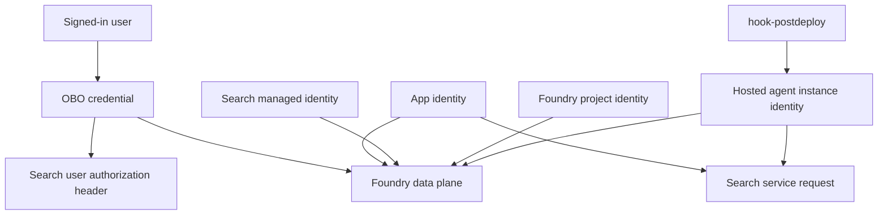

Identity and RBAC are central to the repository design because the system tries to stay keyless wherever possible and because both live user OBO and hosted-agent execution depend on correctly layered Azure permissions.`README.md` [`infra/resources.bicep`](https://github.com/ruinosus/foundry-assured/blob/4b749e7bac56789f0b1097cd4a8212b5c5c65d05/infra/resources.bicep#L67-L76)

## Principal types in the system

The main principals are:

- signed-in end users, whose access tokens drive OBO in live backend flows
- the shared user-assigned app identity for backend and web deployment/runtime
- the Search service system-assigned identity
- the Foundry project managed identity
- hosted-agent instance identities minted at deploy time
- optional deploy-time principal ids for local or CI provisioning

[`apps/backend/app/core/auth.py`](https://github.com/ruinosus/foundry-assured/blob/4b749e7bac56789f0b1097cd4a8212b5c5c65d05/apps/backend/app/core/auth.py#L1-L20) [`infra/main.bicep`](https://github.com/ruinosus/foundry-assured/blob/4b749e7bac56789f0b1097cd4a8212b5c5c65d05/infra/main.bicep#L20-L31) [`infra/resources.bicep`](https://github.com/ruinosus/foundry-assured/blob/4b749e7bac56789f0b1097cd4a8212b5c5c65d05/infra/resources.bicep#L239-L244) [`infra/resources.bicep`](https://github.com/ruinosus/foundry-assured/blob/4b749e7bac56789f0b1097cd4a8212b5c5c65d05/infra/resources.bicep#L273-L280)

## OBO user path

The live backend’s OBO path works because the frontend acquires an API token, the backend validates it, and `credential_for_request()` exchanges the user assertion for an OBO credential. That is then used for Foundry and other user-bound calls. Infra also assigns the app-users group Foundry User on the account so end users can run inference as themselves, which is why selfwiki and other OBO-backed experiences can work for ordinary app users.[`apps/backend/app/core/auth.py`](https://github.com/ruinosus/foundry-assured/blob/4b749e7bac56789f0b1097cd4a8212b5c5c65d05/apps/backend/app/core/auth.py#L3-L20) [`apps/backend/app/core/auth.py`](https://github.com/ruinosus/foundry-assured/blob/4b749e7bac56789f0b1097cd4a8212b5c5c65d05/apps/backend/app/core/auth.py#L186-L196) [`infra/main.bicep`](https://github.com/ruinosus/foundry-assured/blob/4b749e7bac56789f0b1097cd4a8212b5c5c65d05/infra/main.bicep#L23-L24) [`infra/resources.bicep`](https://github.com/ruinosus/foundry-assured/blob/4b749e7bac56789f0b1097cd4a8212b5c5c65d05/infra/resources.bicep#L24-L25)

Infra supports this by optionally taking Entra tenant id, API client id, and API client secret as parameters that are passed through to the deployed app environment.[`infra/main.bicep`](https://github.com/ruinosus/foundry-assured/blob/4b749e7bac56789f0b1097cd4a8212b5c5c65d05/infra/main.bicep#L38-L47) [`infra/main.bicep`](https://github.com/ruinosus/foundry-assured/blob/4b749e7bac56789f0b1097cd4a8212b5c5c65d05/infra/main.bicep#L90-L97)

## Role assignments encoded in Bicep

`resources.bicep` documents stable built-in role ids and applies them across resources. Key relationships include:

- app identity gets `AcrPull`, `Azure AI User`, and `Search Index Data Reader`
- Search service identity gets `Cognitive Services User`
- Foundry project identity gets `Azure AI User`

[`infra/resources.bicep`](https://github.com/ruinosus/foundry-assured/blob/4b749e7bac56789f0b1097cd4a8212b5c5c65d05/infra/resources.bicep#L67-L76) [`infra/resources.bicep`](https://github.com/ruinosus/foundry-assured/blob/4b749e7bac56789f0b1097cd4a8212b5c5c65d05/infra/resources.bicep#L282-L310) [`infra/resources.bicep`](https://github.com/ruinosus/foundry-assured/blob/4b749e7bac56789f0b1097cd4a8212b5c5c65d05/infra/resources.bicep#L316-L338)

These assignments explain why backend retrieval and hosted packaging can stay keyless.

## Hosted-agent RBAC reconciliation

Hosted-agent instance identities are a special case: the platform creates a fresh identity at deploy time, so Bicep cannot preassign the needed roles. The repo solves that with `hook-postdeploy.sh`, which enumerates deployed agents and grants each one `Azure AI User` on the account and `Search Index Data Reader` on Search.[`scripts/hook-postdeploy.sh`](https://github.com/ruinosus/foundry-assured/blob/4b749e7bac56789f0b1097cd4a8212b5c5c65d05/scripts/hook-postdeploy.sh#L1-L18) [`scripts/hook-postdeploy.sh`](https://github.com/ruinosus/foundry-assured/blob/4b749e7bac56789f0b1097cd4a8212b5c5c65d05/scripts/hook-postdeploy.sh#L41-L58)

This is one of the most failure-prone deployment steps in the repo: without it, agents deploy but can 403 at runtime.

## Search authorization split

Retrieval uses two layers of identity:

- app identity or primary credential for the actual Search request
- end-user OBO token in `x-ms-query-source-authorization` for per-user ACL trim on protected domains

[`apps/backend/app/services/retrieval.py`](https://github.com/ruinosus/foundry-assured/blob/4b749e7bac56789f0b1097cd4a8212b5c5c65d05/apps/backend/app/services/retrieval.py#L16-L24) [`apps/backend/app/services/retrieval.py`](https://github.com/ruinosus/foundry-assured/blob/4b749e7bac56789f0b1097cd4a8212b5c5c65d05/apps/backend/app/services/retrieval.py#L62-L73)

That split is why Search RBAC alone is not the full access-control story.

This diagram shows the main Azure identities and where they are applied.

## Focused validation

- inspect `scripts/hook-postdeploy.sh` after any hosted deployment change
- run `cd apps/backend && uv run python -m eval.credential_wiring_test`
- run `cd apps/backend && uv run python -m eval.access_control_test`

These checks cover user credential wiring and the resulting access-control effect at runtime.[`scripts/hook-postdeploy.sh`](https://github.com/ruinosus/foundry-assured/blob/4b749e7bac56789f0b1097cd4a8212b5c5c65d05/scripts/hook-postdeploy.sh#L41-L58) [`apps/backend/eval/credential_wiring_test.py`](https://github.com/ruinosus/foundry-assured/blob/4b749e7bac56789f0b1097cd4a8212b5c5c65d05/apps/backend/eval/credential_wiring_test.py#L1-L58) [`apps/backend/eval/access_control_test.py`](https://github.com/ruinosus/foundry-assured/blob/4b749e7bac56789f0b1097cd4a8212b5c5c65d05/apps/backend/eval/access_control_test.py#L1-L15)