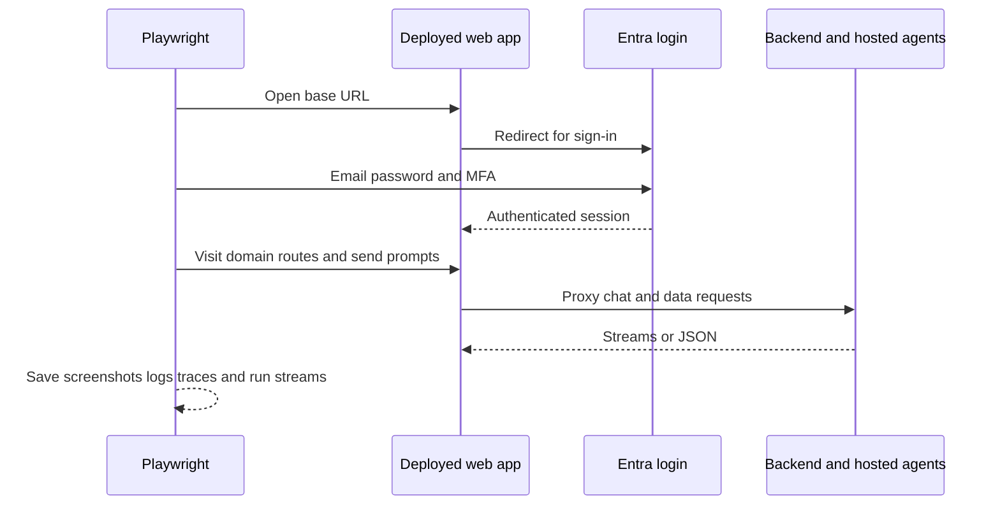

The `e2e/` package is a Playwright suite against the deployed cloud application. It does not spin up a local web server; instead it expects `E2E_BASE_URL` to point at a real deployed frontend and uses real browser navigation and Entra sign-in.[`e2e/playwright.config.ts`](https://github.com/ruinosus/foundry-assured/blob/4b749e7bac56789f0b1097cd4a8212b5c5c65d05/e2e/playwright.config.ts#L3-L13) [`e2e/package.json`](https://github.com/ruinosus/foundry-assured/blob/4b749e7bac56789f0b1097cd4a8212b5c5c65d05/e2e/package.json#L5-L10)

## Runner configuration

The suite is intentionally single-worker and non-parallel because it depends on one browser context carrying an MSAL session in sessionStorage. It stores artifacts under `artifacts/results`, `artifacts/report`, and `artifacts/steps`.[`e2e/playwright.config.ts`](https://github.com/ruinosus/foundry-assured/blob/4b749e7bac56789f0b1097cd4a8212b5c5c65d05/e2e/playwright.config.ts#L15-L38)

The long timeouts are deliberate too: the deployed containers may cold-start from zero.[`e2e/playwright.config.ts`](https://github.com/ruinosus/foundry-assured/blob/4b749e7bac56789f0b1097cd4a8212b5c5c65d05/e2e/playwright.config.ts#L19-L24)

## Entra sign-in and MFA harness

`smoke.spec.ts` defines `entraSignIn()`, which navigates through Microsoft login, password entry, optional stay-signed-in prompt, and MFA. MFA is delegated to `completeMfa()` in `entra-mfa.ts`, which handles software OATH registration and code challenge flows.[`e2e/smoke.spec.ts`](https://github.com/ruinosus/foundry-assured/blob/4b749e7bac56789f0b1097cd4a8212b5c5c65d05/e2e/smoke.spec.ts#L30-L70) [`e2e/entra-mfa.ts`](https://github.com/ruinosus/foundry-assured/blob/4b749e7bac56789f0b1097cd4a8212b5c5c65d05/e2e/entra-mfa.ts#L1-L76)

That makes the suite unusually valuable: it exercises not just app UI but the real identity assumptions the cloud deployment depends on.

## Domain coverage in smoke

The main smoke test does four high-value things:

1. signs in once and captures diagnostics
2. visits every domain page to prove the chat composer renders
3. asks a grounded helpdesk question and checks that the welcome screen is replaced and the user turn appears
4. exercises hosted and grounded-citation paths on selfwiki and cockpit

[`e2e/smoke.spec.ts`](https://github.com/ruinosus/foundry-assured/blob/4b749e7bac56789f0b1097cd4a8212b5c5c65d05/e2e/smoke.spec.ts#L72-L76) [`e2e/smoke.spec.ts`](https://github.com/ruinosus/foundry-assured/blob/4b749e7bac56789f0b1097cd4a8212b5c5c65d05/e2e/smoke.spec.ts#L123-L132) [`e2e/smoke.spec.ts`](https://github.com/ruinosus/foundry-assured/blob/4b749e7bac56789f0b1097cd4a8212b5c5c65d05/e2e/smoke.spec.ts#L134-L168) [`e2e/smoke.spec.ts`](https://github.com/ruinosus/foundry-assured/blob/4b749e7bac56789f0b1097cd4a8212b5c5c65d05/e2e/smoke.spec.ts#L170-L209)

## Diagnostics and artifacts

The smoke test captures:

- ordered screenshots for each major step
- console warnings and errors
- failed requests
- interesting HTTP responses and snippets of error-bearing response bodies
- per-agent CopilotKit run stream dumps
- a `diagnostics.log` file

[`e2e/smoke.spec.ts`](https://github.com/ruinosus/foundry-assured/blob/4b749e7bac56789f0b1097cd4a8212b5c5c65d05/e2e/smoke.spec.ts#L77-L118) [`e2e/smoke.spec.ts`](https://github.com/ruinosus/foundry-assured/blob/4b749e7bac56789f0b1097cd4a8212b5c5c65d05/e2e/smoke.spec.ts#L13-L18)

This diagnostic layer is why the suite is useful operationally: when a chat run fails, the artifacts usually explain whether the problem was auth, transport, backend, or hosted agent behavior.

This diagram shows the end-to-end path exercised by the deployed-browser suite.

## Related suites

The E2E package also includes:

- `cockpit-acl.spec.ts` for access-control-focused browser behavior
- `trigger.spec.ts` for targeted interaction checks

[`e2e/cockpit-acl.spec.ts`](https://github.com/ruinosus/foundry-assured/blob/4b749e7bac56789f0b1097cd4a8212b5c5c65d05/e2e/cockpit-acl.spec.ts#L1-L70) [`e2e/trigger.spec.ts`](https://github.com/ruinosus/foundry-assured/blob/4b749e7bac56789f0b1097cd4a8212b5c5c65d05/e2e/trigger.spec.ts#L1-L58)

## Minimal validation

- `cd e2e && npm test`
- `cd e2e && npm run report`

The first runs the cloud E2E suite; the second opens the collected HTML report.