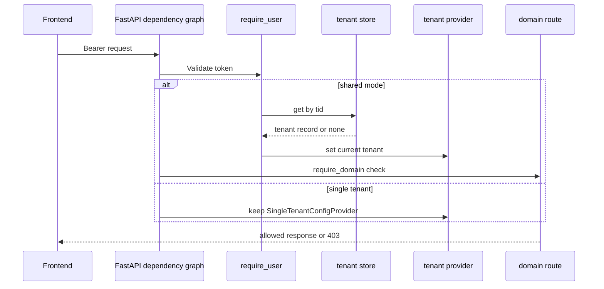

The backend’s auth and tenancy architecture is built around one principle: request-time identity and tenant resolution should be concentrated in `app.core`, so workflow, retrieval, and domain code can mostly consume `current_user()`, `credential_for_request()`, and `tenant_config()` without knowing which deployment mode they are in.[`apps/backend/app/core/auth.py`](https://github.com/ruinosus/foundry-assured/blob/4b749e7bac56789f0b1097cd4a8212b5c5c65d05/apps/backend/app/core/auth.py#L1-L20) [`apps/backend/app/core/tenant.py`](https://github.com/ruinosus/foundry-assured/blob/4b749e7bac56789f0b1097cd4a8212b5c5c65d05/apps/backend/app/core/tenant.py#L1-L6)

## Entra bearer validation

When auth is enabled, the backend chooses one of two bearer schemes:

- `SingleTenantAzureAuthorizationCodeBearer` for `self_hosted` and `dedicated`
- `MultiTenantAzureAuthorizationCodeBearer` for `shared`

The multi-tenant version uses an issuer callback keyed by `tid` so token validation stays tenant-specific even in the shared deployment mode.[`apps/backend/app/core/auth.py`](https://github.com/ruinosus/foundry-assured/blob/4b749e7bac56789f0b1097cd4a8212b5c5c65d05/apps/backend/app/core/auth.py#L46-L49) [`apps/backend/app/core/auth.py`](https://github.com/ruinosus/foundry-assured/blob/4b749e7bac56789f0b1097cd4a8212b5c5c65d05/apps/backend/app/core/auth.py#L52-L74)

If auth is disabled, `require_user` becomes a no-op so local development can proceed with app identity only.[`apps/backend/app/core/auth.py`](https://github.com/ruinosus/foundry-assured/blob/4b749e7bac56789f0b1097cd4a8212b5c5c65d05/apps/backend/app/core/auth.py#L130-L138)

## Request-scoped user context

`require_user` validates the token and stores the resulting `User` in a contextvar. That contextvar is what later code reads when it needs the caller’s identity but only has access to lower-level workflow hooks or helper functions.[`apps/backend/app/core/auth.py`](https://github.com/ruinosus/foundry-assured/blob/4b749e7bac56789f0b1097cd4a8212b5c5c65d05/apps/backend/app/core/auth.py#L42-L44) [`apps/backend/app/core/auth.py`](https://github.com/ruinosus/foundry-assured/blob/4b749e7bac56789f0b1097cd4a8212b5c5c65d05/apps/backend/app/core/auth.py#L116-L128) [`apps/backend/app/core/auth.py`](https://github.com/ruinosus/foundry-assured/blob/4b749e7bac56789f0b1097cd4a8212b5c5c65d05/apps/backend/app/core/auth.py#L168-L175)

That is why `credential_for_request()` can build an OBO credential from `user.access_token` without the workflow builder receiving an explicit request object.[`apps/backend/app/core/auth.py`](https://github.com/ruinosus/foundry-assured/blob/4b749e7bac56789f0b1097cd4a8212b5c5c65d05/apps/backend/app/core/auth.py#L186-L196)

## Deployment-mode seam

`TenantConfig` is the data-plane record that downstream code consumes: Foundry endpoint, model names, search pointers, storage pointers, memory store name, hosted agent names, ACL group mappings, and a few compatibility fields.[`apps/backend/app/core/tenant.py`](https://github.com/ruinosus/foundry-assured/blob/4b749e7bac56789f0b1097cd4a8212b5c5c65d05/apps/backend/app/core/tenant.py#L18-L24) [`apps/backend/app/core/tenant.py`](https://github.com/ruinosus/foundry-assured/blob/4b749e7bac56789f0b1097cd4a8212b5c5c65d05/apps/backend/app/core/tenant.py#L25-L106)

The seam is implemented through two providers:

- `SingleTenantConfigProvider` reads `.env` once and keeps static process-wide config.[`apps/backend/app/core/tenant.py`](https://github.com/ruinosus/foundry-assured/blob/4b749e7bac56789f0b1097cd4a8212b5c5c65d05/apps/backend/app/core/tenant.py#L175-L186)
- `MultiTenantConfigProvider` reads the current request’s resolved tenant record from a contextvar.[`apps/backend/app/core/tenant.py`](https://github.com/ruinosus/foundry-assured/blob/4b749e7bac56789f0b1097cd4a8212b5c5c65d05/apps/backend/app/core/tenant.py#L196-L203)

The active provider is swapped at boot only in shared mode.[`apps/backend/app/core/auth.py`](https://github.com/ruinosus/foundry-assured/blob/4b749e7bac56789f0b1097cd4a8212b5c5c65d05/apps/backend/app/core/auth.py#L106-L114)

## Shared-mode tenant resolution

In shared mode, `require_user` does extra work after token validation: it calls `resolve_tenant(user, _tenant_store)`. That lookup is fail-closed. If no tenant record exists or the record is not active, the backend returns `403 tenant not onboarded` and does not set active tenant state.[`apps/backend/app/core/auth.py`](https://github.com/ruinosus/foundry-assured/blob/4b749e7bac56789f0b1097cd4a8212b5c5c65d05/apps/backend/app/core/auth.py#L97-L104) [`apps/backend/app/core/auth.py`](https://github.com/ruinosus/foundry-assured/blob/4b749e7bac56789f0b1097cd4a8212b5c5c65d05/apps/backend/app/core/auth.py#L116-L123)

`current_tenant_id()` then becomes available for downstream code such as memory scope construction.[`apps/backend/app/core/tenant.py`](https://github.com/ruinosus/foundry-assured/blob/4b749e7bac56789f0b1097cd4a8212b5c5c65d05/apps/backend/app/core/tenant.py#L206-L213) [`apps/backend/app/core/auth.py`](https://github.com/ruinosus/foundry-assured/blob/4b749e7bac56789f0b1097cd4a8212b5c5c65d05/apps/backend/app/core/auth.py#L199-L209)

## Domain entitlement gate

Shared mode also adds `require_domain(domain_id)` on top of auth. It depends on `require_user`, reads the resolved tenant’s `enabled_domains`, and rejects any request for a domain not enabled for that tenant.[`apps/backend/app/core/tenant.py`](https://github.com/ruinosus/foundry-assured/blob/4b749e7bac56789f0b1097cd4a8212b5c5c65d05/apps/backend/app/core/tenant.py#L216-L252) [`apps/backend/app/domains.py`](https://github.com/ruinosus/foundry-assured/blob/4b749e7bac56789f0b1097cd4a8212b5c5c65d05/apps/backend/app/domains.py#L102-L108)

This is why `_domain_deps()` is an important abstraction: it keeps single-tenant behavior byte-identical while layering shared-mode entitlement checks only where needed.[`apps/backend/app/domains.py`](https://github.com/ruinosus/foundry-assured/blob/4b749e7bac56789f0b1097cd4a8212b5c5c65d05/apps/backend/app/domains.py#L102-L108)

This diagram shows how auth and tenancy resolution diverge between single-tenant and shared mode.

## Roles and defense in depth

Role checks are intentionally independent from UI visibility. `require_role()` inspects the token’s `roles` claim, rejects unauthorized callers server-side, and stays a no-op only when auth is turned off for local development.[`apps/backend/app/core/auth.py`](https://github.com/ruinosus/foundry-assured/blob/4b749e7bac56789f0b1097cd4a8212b5c5c65d05/apps/backend/app/core/auth.py#L141-L165)

Two helpers expose role state outside route handlers:

- `current_roles()` for current token roles
- `has_role()` for imperative checks inside workflow or services, including escalation approval logic

[`apps/backend/app/core/auth.py`](https://github.com/ruinosus/foundry-assured/blob/4b749e7bac56789f0b1097cd4a8212b5c5c65d05/apps/backend/app/core/auth.py#L172-L183) [`apps/backend/app/workflow/escalation.py`](https://github.com/ruinosus/foundry-assured/blob/4b749e7bac56789f0b1097cd4a8212b5c5c65d05/apps/backend/app/workflow/escalation.py#L73-L81)

## Focused tests

The auth-and-tenancy seam is best validated by:

- `eval/tenant_provider_test.py` for provider switching semantics.[`apps/backend/eval/tenant_provider_test.py`](https://github.com/ruinosus/foundry-assured/blob/4b749e7bac56789f0b1097cd4a8212b5c5c65d05/apps/backend/eval/tenant_provider_test.py#L1-L7)
- `eval/tenant_resolution_test.py`, `eval/tenant_scope_test.py`, and `eval/domain_gate_test.py` for fail-closed shared-mode behavior.[`apps/backend/eval/tenant_resolution_test.py`](https://github.com/ruinosus/foundry-assured/blob/4b749e7bac56789f0b1097cd4a8212b5c5c65d05/apps/backend/eval/tenant_resolution_test.py#L1-L58) [`apps/backend/eval/tenant_scope_test.py`](https://github.com/ruinosus/foundry-assured/blob/4b749e7bac56789f0b1097cd4a8212b5c5c65d05/apps/backend/eval/tenant_scope_test.py#L1-L56) [`apps/backend/eval/domain_gate_test.py`](https://github.com/ruinosus/foundry-assured/blob/4b749e7bac56789f0b1097cd4a8212b5c5c65d05/apps/backend/eval/domain_gate_test.py#L1-L54)
- `eval/credential_wiring_test.py` and `eval/memory_scope_test.py` for OBO and scope behavior.[`apps/backend/eval/credential_wiring_test.py`](https://github.com/ruinosus/foundry-assured/blob/4b749e7bac56789f0b1097cd4a8212b5c5c65d05/apps/backend/eval/credential_wiring_test.py#L1-L58) [`apps/backend/eval/memory_scope_test.py`](https://github.com/ruinosus/foundry-assured/blob/4b749e7bac56789f0b1097cd4a8212b5c5c65d05/apps/backend/eval/memory_scope_test.py#L1-L52)

## Minimal validation

- `cd apps/backend && uv run python -m eval.tenant_provider_test`
- `cd apps/backend && uv run python -m eval.domain_gate_test`
- `cd apps/backend && uv run python -m eval.credential_wiring_test`

These checks cover provider choice, entitlement gating, and user-to-OBO credential wiring.