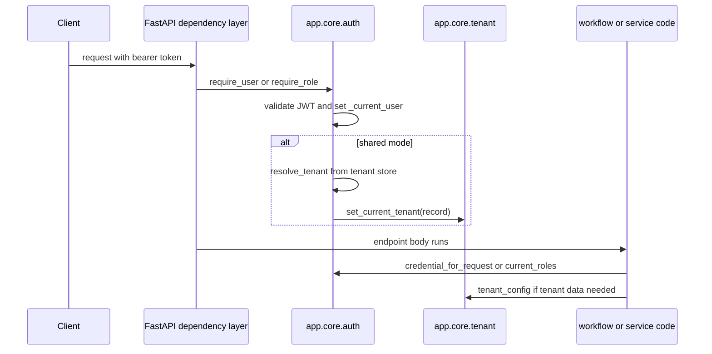
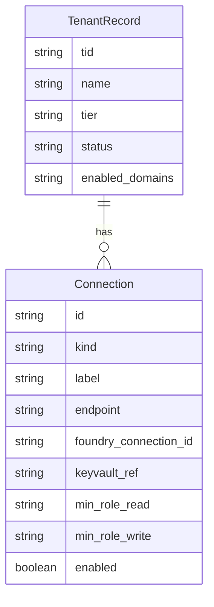

# Auth and tenancy

`app.core.auth` is the backend's authorization choke point. It validates Entra access tokens, stores the validated user in a request-scoped contextvar, optionally resolves the active tenant record in shared mode, exposes role helpers for route and runtime checks, and mints the per-request credential that downstream Foundry, Search, and memory calls use. The design goal is explicit in the module docstring: the workflow factory only receives a thread ID, not the request, so user identity must travel through a contextvar set by a FastAPI dependency and read later in the same request task. [auth.py](https://github.com/ruinosus/foundry-assured/blob/4d10c9a42e5d5c2a2b7f60d26a3e694620a9bcaa/apps/backend/app/core/auth.py#L1-L21) [workflow/graph.py](https://github.com/ruinosus/foundry-assured/blob/4d10c9a42e5d5c2a2b7f60d26a3e694620a9bcaa/apps/backend/app/workflow/graph.py#L28-L39)

## Authentication modes

Auth is enabled only when both `entra_tenant_id` and `entra_api_client_id` are configured. If auth is off, route dependencies degrade to no-ops, `credential_for_request()` falls back to `DefaultAzureCredential()`, and memory scope falls back to a local dev namespace. This is intentional so the backend can still boot and function in local development without Entra. [settings.py](https://github.com/ruinosus/foundry-assured/blob/4d10c9a42e5d5c2a2b7f60d26a3e694620a9bcaa/apps/backend/app/core/settings.py#L49-L56) [auth.py](https://github.com/ruinosus/foundry-assured/blob/4d10c9a42e5d5c2a2b7f60d26a3e694620a9bcaa/apps/backend/app/core/auth.py#L130-L138) [auth.py](https://github.com/ruinosus/foundry-assured/blob/4d10c9a42e5d5c2a2b7f60d26a3e694620a9bcaa/apps/backend/app/core/auth.py#L186-L209)

When auth is enabled, the backend chooses bearer validation strategy by deployment mode:

- `self_hosted` and `dedicated` use `SingleTenantAzureAuthorizationCodeBearer`.
- `shared` uses `MultiTenantAzureAuthorizationCodeBearer` with `validate_iss=True` and a custom `iss_callable` whose parameter must be named exactly `tid`. [auth.py](https://github.com/ruinosus/foundry-assured/blob/4d10c9a42e5d5c2a2b7f60d26a3e694620a9bcaa/apps/backend/app/core/auth.py#L46-L75)

That split matters because shared mode is the only mode that must accept tokens from many Entra tenants and then resolve the caller to a tenant record inside the backend. [auth.py](https://github.com/ruinosus/foundry-assured/blob/4d10c9a42e5d5c2a2b7f60d26a3e694620a9bcaa/apps/backend/app/core/auth.py#L97-L123)

## Request lifecycle

This diagram shows the invariant ordering: user validation happens before any tenant-dependent service code, and shared-mode tenant resolution happens before `tenant_config()` may be read.

Two contextvars carry that state:

- `_current_user` stores the validated `User` object for later access through `current_user()`, `current_roles()`, `has_role()`, and `credential_for_request()`. [auth.py](https://github.com/ruinosus/foundry-assured/blob/4d10c9a42e5d5c2a2b7f60d26a3e694620a9bcaa/apps/backend/app/core/auth.py#L42-L44) [auth.py](https://github.com/ruinosus/foundry-assured/blob/4d10c9a42e5d5c2a2b7f60d26a3e694620a9bcaa/apps/backend/app/core/auth.py#L168-L196)
- `_current_tenant` stores the resolved `TenantRecord` for shared-mode request processing and is exposed through `current_tenant_id()` and `tenant_config()`. [tenant.py](https://github.com/ruinosus/foundry-assured/blob/4d10c9a42e5d5c2a2b7f60d26a3e694620a9bcaa/apps/backend/app/core/tenant.py#L189-L213) [tenant.py](https://github.com/ruinosus/foundry-assured/blob/4d10c9a42e5d5c2a2b7f60d26a3e694620a9bcaa/apps/backend/app/core/tenant.py#L255-L266)

## OBO and credential propagation

`credential_for_request()` is the main identity seam. If auth is enabled and a current user exists, it returns `OnBehalfOfCredential(tenant_id, client_id, client_secret, user_assertion=user.access_token)`. Otherwise it returns `DefaultAzureCredential()`. This means downstream services do not decide whether to use OBO; they simply ask for the request credential. [auth.py](https://github.com/ruinosus/foundry-assured/blob/4d10c9a42e5d5c2a2b7f60d26a3e694620a9bcaa/apps/backend/app/core/auth.py#L186-L196)

That credential is used in three important places:

- The helpdesk workflow factory builds Foundry chat agents and memory providers with the request credential. [workflow/graph.py](https://github.com/ruinosus/foundry-assured/blob/4d10c9a42e5d5c2a2b7f60d26a3e694620a9bcaa/apps/backend/app/workflow/graph.py#L28-L39) [workflow/agents.py](https://github.com/ruinosus/foundry-assured/blob/4d10c9a42e5d5c2a2b7f60d26a3e694620a9bcaa/apps/backend/app/workflow/agents.py#L25-L70)
- The platform domain uses it to build a tool-capable `FoundryChatClient` and to mint OBO headers for MCP servers. [agents/platform.py](https://github.com/ruinosus/foundry-assured/blob/4d10c9a42e5d5c2a2b7f60d26a3e694620a9bcaa/apps/backend/app/agents/platform.py#L31-L44) [agents/mcp/tools.py](https://github.com/ruinosus/foundry-assured/blob/4d10c9a42e5d5c2a2b7f60d26a3e694620a9bcaa/apps/backend/app/agents/mcp/tools.py#L36-L41)
- The grounded-domain bridge has a separate async OBO helper because it runs inside an async generator and must not rely on the lost request contextvar there. [grounded.py](https://github.com/ruinosus/foundry-assured/blob/4d10c9a42e5d5c2a2b7f60d26a3e694620a9bcaa/apps/backend/app/services/grounded.py#L58-L73)

## Roles and route-time authorization

The backend owns exactly four app roles: `Admin`, `Author`, `Approver`, and `Reader`. `require_role(*roles)` enforces that the caller has any listed role; it does not implicitly grant `Admin`, so callers must list `Admin` explicitly where it should pass. That keeps access checks obvious at each route. [auth.py](https://github.com/ruinosus/foundry-assured/blob/4d10c9a42e5d5c2a2b7f60d26a3e694620a9bcaa/apps/backend/app/core/auth.py#L38-L40) [auth.py](https://github.com/ruinosus/foundry-assured/blob/4d10c9a42e5d5c2a2b7f60d26a3e694620a9bcaa/apps/backend/app/core/auth.py#L141-L165)

Route usage follows a few consistent patterns:

- `/admin/*` is uniformly guarded by `require_role("Admin")`. [api/admin.py](https://github.com/ruinosus/foundry-assured/blob/4d10c9a42e5d5c2a2b7f60d26a3e694620a9bcaa/apps/backend/app/api/admin.py#L17-L20) [api/admin.py](https://github.com/ruinosus/foundry-assured/blob/4d10c9a42e5d5c2a2b7f60d26a3e694620a9bcaa/apps/backend/app/api/admin.py#L47-L88)
- `/me` uses `require_user` only. [api/me.py](https://github.com/ruinosus/foundry-assured/blob/4d10c9a42e5d5c2a2b7f60d26a3e694620a9bcaa/apps/backend/app/api/me.py#L19-L31)
- Shared-mode tenant write routes combine `require_user` and `require_role("Admin")`. [api/tenant.py](https://github.com/ruinosus/foundry-assured/blob/4d10c9a42e5d5c2a2b7f60d26a3e694620a9bcaa/apps/backend/app/api/tenant.py#L26-L29) [api/tenant.py](https://github.com/ruinosus/foundry-assured/blob/4d10c9a42e5d5c2a2b7f60d26a3e694620a9bcaa/apps/backend/app/api/tenant.py#L103-L151)
- Workflow-time approval additionally checks `has_role("Approver", "Admin")` before actually creating a ticket. [workflow/escalation.py](https://github.com/ruinosus/foundry-assured/blob/4d10c9a42e5d5c2a2b7f60d26a3e694620a9bcaa/apps/backend/app/workflow/escalation.py#L66-L89)

## Tenant resolution and config providers

`TenantConfigProvider` is the abstraction that hides deployment mode from the rest of the backend. `SingleTenantConfigProvider` parses `.env` once and always returns the same `TenantConfig`. `MultiTenantConfigProvider` instead reads `_current_tenant` and raises `RuntimeError("no tenant resolved for this request")` if service code tries to read tenant config before shared-mode resolution has happened. [tenant.py](https://github.com/ruinosus/foundry-assured/blob/4d10c9a42e5d5c2a2b7f60d26a3e694620a9bcaa/apps/backend/app/core/tenant.py#L171-L203) [tenant.py](https://github.com/ruinosus/foundry-assured/blob/4d10c9a42e5d5c2a2b7f60d26a3e694620a9bcaa/apps/backend/app/core/tenant.py#L255-L266)

In shared mode, `app.core.auth` swaps the active provider to `MultiTenantConfigProvider()` and builds `_tenant_store` once at boot. `resolve_tenant(user, store)` is then the authorization choke point: it loads the tenant record by `tid`, rejects unknown or non-`active` tenants with `403 tenant not onboarded`, and calls `set_current_tenant(rec)` on success. [auth.py](https://github.com/ruinosus/foundry-assured/blob/4d10c9a42e5d5c2a2b7f60d26a3e694620a9bcaa/apps/backend/app/core/auth.py#L77-L113) [auth.py](https://github.com/ruinosus/foundry-assured/blob/4d10c9a42e5d5c2a2b7f60d26a3e694620a9bcaa/apps/backend/app/core/auth.py#L97-L103) [tenant_resolution_test.py](https://github.com/ruinosus/foundry-assured/blob/4d10c9a42e5d5c2a2b7f60d26a3e694620a9bcaa/apps/backend/eval/tenant_resolution_test.py#L20-L54)

## Domain entitlement model

The registered domain catalog is fixed as `("helpdesk", "cockpit", "selfwiki", "platform")`. In shared mode, the backend may still mount all domains globally, but `require_domain(domain_id)` enforces per-tenant entitlement at request time by checking whether `enabled_domains` on the resolved tenant record contains the domain. This gate is explicitly fail-closed: if there is no tenant record or the domain is absent, the dependency raises `403`. [tenant.py](https://github.com/ruinosus/foundry-assured/blob/4d10c9a42e5d5c2a2b7f60d26a3e694620a9bcaa/apps/backend/app/core/tenant.py#L216-L252) [domain_gate_test.py](https://github.com/ruinosus/foundry-assured/blob/4d10c9a42e5d5c2a2b7f60d26a3e694620a9bcaa/apps/backend/eval/domain_gate_test.py#L24-L72)

The seeding hook for that entitlement is `domains_for_tier(tier)`. `TIER_DOMAINS` currently maps `shared` to all domains and defines an illustrative `starter` subset of `("helpdesk", "selfwiki")`. Unknown or unset tiers also map to all domains for non-breaking behavior, but the runtime gate remains fail-closed regardless. [tenant.py](https://github.com/ruinosus/foundry-assured/blob/4d10c9a42e5d5c2a2b7f60d26a3e694620a9bcaa/apps/backend/app/core/tenant.py#L216-L231) [tier_domains_test.py](https://github.com/ruinosus/foundry-assured/blob/4d10c9a42e5d5c2a2b7f60d26a3e694620a9bcaa/apps/backend/eval/tier_domains_test.py#L18-L44)

## Onboarding and tenant management

`onboarding_guard` exists because pre-onboarding requests cannot go through `require_user`: that dependency would immediately attempt tenant resolution and reject the caller before onboarding could happen. Instead, `onboarding_guard` authenticates the user, stores it in `_current_user`, then checks two gates only: the caller must have the `Admin` role, and the caller's `tid` must be in `settings.allowed_tids`. It deliberately does not resolve a tenant record. [onboarding.py](https://github.com/ruinosus/foundry-assured/blob/4d10c9a42e5d5c2a2b7f60d26a3e694620a9bcaa/apps/backend/app/core/onboarding.py#L1-L24) [onboarding_guard_test.py](https://github.com/ruinosus/foundry-assured/blob/4d10c9a42e5d5c2a2b7f60d26a3e694620a9bcaa/apps/backend/eval/onboarding_guard_test.py#L18-L48)

`POST /tenant/onboard` then creates a `TenantRecord` with `status="active"`, default `TenantConfig()`, and `enabled_domains=domains_for_tier(tier)`. The handler is idempotent: if a record already exists for the `tid`, it returns success without replacing it. [api/tenant.py](https://github.com/ruinosus/foundry-assured/blob/4d10c9a42e5d5c2a2b7f60d26a3e694620a9bcaa/apps/backend/app/api/tenant.py#L82-L100) [domains_api_test.py](https://github.com/ruinosus/foundry-assured/blob/4d10c9a42e5d5c2a2b7f60d26a3e694620a9bcaa/apps/backend/eval/domains_api_test.py#L29-L59)

## Tenant store and record schema

This diagram reflects the persisted control-plane model: one tenant record owns zero or more connection records plus its enabled-domain entitlement.

`TenantRecord` is the persisted per-tenant control-plane object: `tid`, `name`, `tier`, `status`, `data_plane`, `connections`, and `enabled_domains`. `Connection` is deliberately secret-free: it stores identifiers, endpoint target, Foundry connection reference, RBAC thresholds, and an enable flag, but not raw credentials. [tenant_store.py](https://github.com/ruinosus/foundry-assured/blob/4d10c9a42e5d5c2a2b7f60d26a3e694620a9bcaa/apps/backend/app/core/tenant_store.py#L16-L38) [connection_store_test.py](https://github.com/ruinosus/foundry-assured/blob/4d10c9a42e5d5c2a2b7f60d26a3e694620a9bcaa/apps/backend/eval/connection_store_test.py#L22-L38)

Two store implementations exist:

- `InMemoryTenantStore` for tests and dev. [tenant_store.py](https://github.com/ruinosus/foundry-assured/blob/4d10c9a42e5d5c2a2b7f60d26a3e694620a9bcaa/apps/backend/app/core/tenant_store.py#L63-L77)
- `TableStorageTenantStore` for production-style shared mode, storing the record as a single Azure Table entity with JSON-encoded `data_plane`, `connections`, and `enabled_domains`. [tenant_store.py](https://github.com/ruinosus/foundry-assured/blob/4d10c9a42e5d5c2a2b7f60d26a3e694620a9bcaa/apps/backend/app/core/tenant_store.py#L79-L123)

The serialization helpers preserve newer fields while staying compatible with older entities: missing `enabled_domains` deserializes to `()`. [tenant_store.py](https://github.com/ruinosus/foundry-assured/blob/4d10c9a42e5d5c2a2b7f60d26a3e694620a9bcaa/apps/backend/app/core/tenant_store.py#L79-L86) [enabled_domains_roundtrip_test.py](https://github.com/ruinosus/foundry-assured/blob/4d10c9a42e5d5c2a2b7f60d26a3e694620a9bcaa/apps/backend/eval/enabled_domains_roundtrip_test.py#L19-L53)

## Focused invariants and tests

- Tenant resolution allows only onboarded active tenants: `uv run python -m eval.tenant_resolution_test` [tenant_resolution_test.py](https://github.com/ruinosus/foundry-assured/blob/4d10c9a42e5d5c2a2b7f60d26a3e694620a9bcaa/apps/backend/eval/tenant_resolution_test.py#L20-L54)
- Onboarding guard behavior: `uv run python -m eval.onboarding_guard_test` [onboarding_guard_test.py](https://github.com/ruinosus/foundry-assured/blob/4d10c9a42e5d5c2a2b7f60d26a3e694620a9bcaa/apps/backend/eval/onboarding_guard_test.py#L18-L48)
- Memory scope tenant-prefix rule: `uv run python -m eval.memory_scope_test` [memory_scope_test.py](https://github.com/ruinosus/foundry-assured/blob/4d10c9a42e5d5c2a2b7f60d26a3e694620a9bcaa/apps/backend/eval/memory_scope_test.py#L17-L44)
- Tenant admin persistence E2E: `uv run python -m eval.tenant_admin_e2e_test` [tenant_admin_e2e_test.py](https://github.com/ruinosus/foundry-assured/blob/4d10c9a42e5d5c2a2b7f60d26a3e694620a9bcaa/apps/backend/eval/tenant_admin_e2e_test.py#L1-L23)
