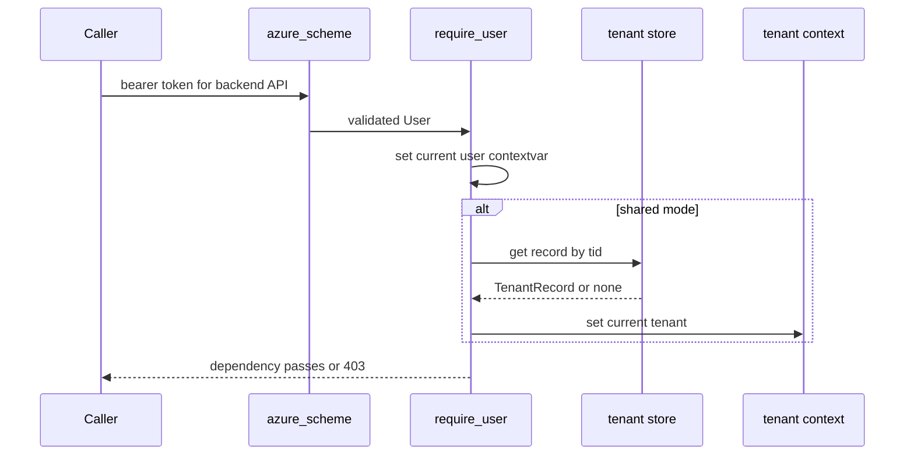
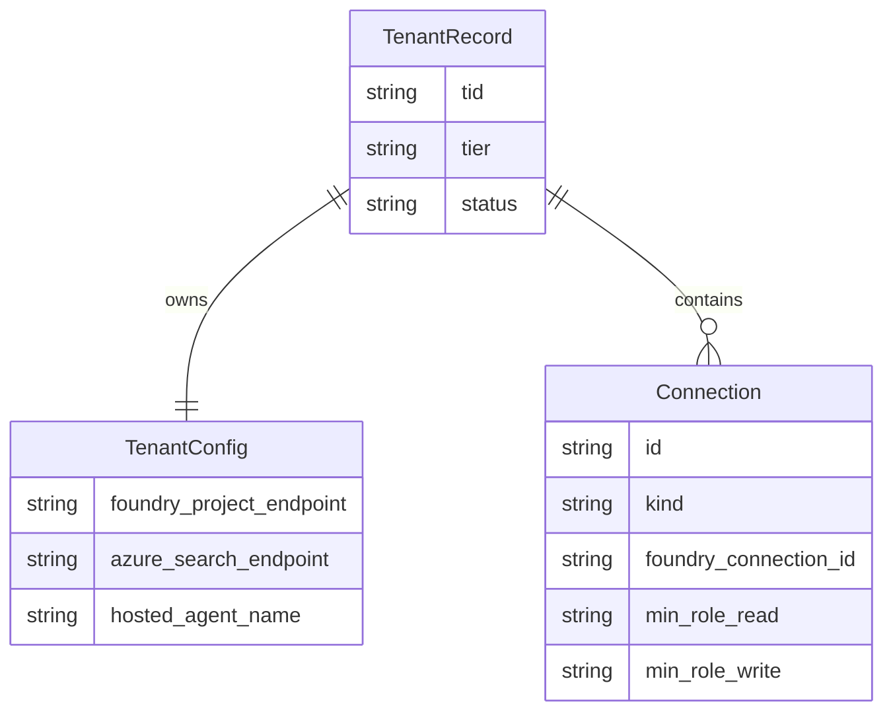

# Auth and tenancy

The backend’s auth and tenancy model is designed around a single seam: request handlers and runtime subsystems ask for the current user, credential, and tenant config through shared helpers, and the active deployment mode decides how those are resolved. The module docs in `app/core/auth.py` and `app/core/tenant.py` make that separation explicit: auth validates and stores the caller, while tenancy resolves per-tenant data-plane config behind `tenant_config()` so workflow, grounded retrieval, and hosted services do not branch on deployment mode directly ([`apps/backend/app/core/auth.py`](https://github.com/ruinosus/foundry-assured/blob/7e41ad6f80befa024fae867b3fcdf763f8331a10/apps/backend/app/core/auth.py#L1-L21), [`apps/backend/app/core/tenant.py`](https://github.com/ruinosus/foundry-assured/blob/7e41ad6f80befa024fae867b3fcdf763f8331a10/apps/backend/app/core/tenant.py#L1-L6)).

## Global settings versus tenant config

`PlatformSettings` is intentionally small. It holds deployment mode, tenant-store connection information, Entra app registration settings, global MCP flags, rollout allow-lists, and CORS origin. Its `auth_enabled` property is true only when the Entra tenant id and API client id are configured; otherwise the backend stays bootable in local dev with default credentials ([`apps/backend/app/core/settings.py`](https://github.com/ruinosus/foundry-assured/blob/7e41ad6f80befa024fae867b3fcdf763f8331a10/apps/backend/app/core/settings.py#L11-L22), [`apps/backend/app/core/settings.py`](https://github.com/ruinosus/foundry-assured/blob/7e41ad6f80befa024fae867b3fcdf763f8331a10/apps/backend/app/core/settings.py#L24-L62)).

`TenantConfig`, by contrast, is the tenant-scoped data plane: Foundry endpoints and model names, main helpdesk KB, cockpit and selfwiki KB/index pairs, ACL groups, storage pointers, memory store, hosted agent names, and per-tenant MCP connection fallbacks. The class docstring is important: it says “ZERO secrets”, so tenant records should carry references and identifiers but not the actual secret material ([`apps/backend/app/core/tenant.py`](https://github.com/ruinosus/foundry-assured/blob/7e41ad6f80befa024fae867b3fcdf763f8331a10/apps/backend/app/core/tenant.py#L18-L24), [`apps/backend/app/core/tenant.py`](https://github.com/ruinosus/foundry-assured/blob/7e41ad6f80befa024fae867b3fcdf763f8331a10/apps/backend/app/core/tenant.py#L25-L105)).

## Request authentication flow

When auth is enabled, the backend builds an Entra bearer validator at import time. In self-hosted and dedicated modes it uses `SingleTenantAzureAuthorizationCodeBearer`; in shared mode it uses `MultiTenantAzureAuthorizationCodeBearer` with `validate_iss=True` and a custom `iss_callable` named `_iss_callable(tid)`, because `fastapi_azure_auth` requires that exact parameter name to validate issuers per tenant ([`apps/backend/app/core/auth.py`](https://github.com/ruinosus/foundry-assured/blob/7e41ad6f80befa024fae867b3fcdf763f8331a10/apps/backend/app/core/auth.py#L46-L75)).

`require_user` is the main dependency. In all auth-enabled modes it stores the validated `User` in `_current_user`. In shared mode it also calls `resolve_tenant(user, _tenant_store)`, which looks up the tenant by `tid`, rejects missing or non-active tenants with HTTP 403, and stores the resolved record for later request processing ([`apps/backend/app/core/auth.py`](https://github.com/ruinosus/foundry-assured/blob/7e41ad6f80befa024fae867b3fcdf763f8331a10/apps/backend/app/core/auth.py#L97-L104), [`apps/backend/app/core/auth.py`](https://github.com/ruinosus/foundry-assured/blob/7e41ad6f80befa024fae867b3fcdf763f8331a10/apps/backend/app/core/auth.py#L116-L138)).

Caption: Shared mode extends auth with tenant resolution instead of inventing a second request gate.

If auth is disabled, `require_user` becomes a no-op and `auth_dependencies()` returns an empty list. This is why local development can still exercise routes and UI flows without Entra, but every production route must still be written as if `require_user` can enforce identity ([`apps/backend/app/core/auth.py`](https://github.com/ruinosus/foundry-assured/blob/7e41ad6f80befa024fae867b3fcdf763f8331a10/apps/backend/app/core/auth.py#L130-L139)).

## Role checks and caller-derived credentials

`APP_ROLES` is the app’s flat role vocabulary: `Admin`, `Author`, `Approver`, and `Reader`. `require_role(*roles)` is the FastAPI dependency for route-level checks, while `has_role(*roles)` is the runtime helper for code paths outside route dependency injection, such as escalation. The code comments explicitly reject implicit admin inheritance: if a route or operation should accept admin, it must include `"Admin"` in the requested set ([`apps/backend/app/core/auth.py`](https://github.com/ruinosus/foundry-assured/blob/7e41ad6f80befa024fae867b3fcdf763f8331a10/apps/backend/app/core/auth.py#L38-L40), [`apps/backend/app/core/auth.py`](https://github.com/ruinosus/foundry-assured/blob/7e41ad6f80befa024fae867b3fcdf763f8331a10/apps/backend/app/core/auth.py#L141-L183)).

`credential_for_request()` is the credential seam most backend subsystems use. With auth enabled and a current user present, it mints an `OnBehalfOfCredential` from the user’s access token; otherwise it returns `DefaultAzureCredential`. That is the credential the live helpdesk workflow, the platform domain, and some hosted operations use when they need downstream calls to run as the signed-in user ([`apps/backend/app/core/auth.py`](https://github.com/ruinosus/foundry-assured/blob/7e41ad6f80befa024fae867b3fcdf763f8331a10/apps/backend/app/core/auth.py#L186-L196)).

## Tenant config providers

`TenantConfigProvider` has two implementations:

- `SingleTenantConfigProvider` parses `.env` once into `_TenantEnv` and returns the same `TenantConfig` forever.
- `MultiTenantConfigProvider` reads the current request’s `TenantRecord` from `_current_tenant` and returns its `data_plane` field.

The active provider defaults to single-tenant and can be replaced via `set_provider`. This is the core “deployment-mode seam” used everywhere else ([`apps/backend/app/core/tenant.py`](https://github.com/ruinosus/foundry-assured/blob/7e41ad6f80befa024fae867b3fcdf763f8331a10/apps/backend/app/core/tenant.py#L125-L186), [`apps/backend/app/core/tenant.py`](https://github.com/ruinosus/foundry-assured/blob/7e41ad6f80befa024fae867b3fcdf763f8331a10/apps/backend/app/core/tenant.py#L196-L266)).

At auth-module import time, shared mode flips the provider to `MultiTenantConfigProvider` and constructs a tenant store once, failing fast if a table-backed store is selected without `TENANT_STORE_ACCOUNT_URL`. The code deliberately allows an in-memory store only for dev and CI; the comments warn never to use it in production because it is ephemeral and not shared across instances ([`apps/backend/app/core/auth.py`](https://github.com/ruinosus/foundry-assured/blob/7e41ad6f80befa024fae867b3fcdf763f8331a10/apps/backend/app/core/auth.py#L77-L95), [`apps/backend/app/core/auth.py`](https://github.com/ruinosus/foundry-assured/blob/7e41ad6f80befa024fae867b3fcdf763f8331a10/apps/backend/app/core/auth.py#L106-L114)).

## Tenant persistence and connection records

`TenantStore` is the persistence protocol for shared mode. `InMemoryTenantStore` is the test/dev fake, while `TableStorageTenantStore` persists one `TenantRecord` per `tid` under `PartitionKey=tid` and `RowKey='config'`. The implementation is lazy-imported so single-tenant mode never imports `azure-data-tables` unnecessarily ([`apps/backend/app/core/tenant_store.py`](https://github.com/ruinosus/foundry-assured/blob/7e41ad6f80befa024fae867b3fcdf763f8331a10/apps/backend/app/core/tenant_store.py#L1-L4), [`apps/backend/app/core/tenant_store.py`](https://github.com/ruinosus/foundry-assured/blob/7e41ad6f80befa024fae867b3fcdf763f8331a10/apps/backend/app/core/tenant_store.py#L57-L123)).

A `TenantRecord` stores `tid`, `name`, `tier`, `status`, `data_plane`, a tuple of `Connection` records, and `enabled_domains`. `Connection` is the per-tenant connection reference model for MCP-backed platform access: it records registry `kind`, display label, endpoint override, Foundry connection id or deprecated key vault ref, minimum roles, and enabled state. The comments again reinforce that no secrets live here ([`apps/backend/app/core/tenant_store.py`](https://github.com/ruinosus/foundry-assured/blob/7e41ad6f80befa024fae867b3fcdf763f8331a10/apps/backend/app/core/tenant_store.py#L16-L38)).

Caption: Shared-mode tenant persistence separates data-plane config from per-tenant tool connection references.

## Domain entitlement gate

Shared mode does not hide domains by mounting only some routes. Instead it mounts all registered domains and uses `require_domain(domain_id)` as a request-time gate. `DOMAIN_IDS` is the catalog, `TIER_DOMAINS` seeds default entitlements for known tiers, and `domains_for_tier` falls back to all domains for unknown tiers so onboarding stays non-breaking. `require_domain` itself is fail-closed: unless the current resolved tenant exists and its `enabled_domains` contains the requested id, the request gets a 403 ([`apps/backend/app/core/tenant.py`](https://github.com/ruinosus/foundry-assured/blob/7e41ad6f80befa024fae867b3fcdf763f8331a10/apps/backend/app/core/tenant.py#L216-L252)).

This gate is why `app.domains._domain_deps()` appends `Depends(require_domain(domain_id))` only in shared mode. The domain runtime stays unchanged; only the dependency list changes ([`apps/backend/app/domains.py`](https://github.com/ruinosus/foundry-assured/blob/7e41ad6f80befa024fae867b3fcdf763f8331a10/apps/backend/app/domains.py#L102-L108)).

## Memory namespace rules

`memory_scope()` is one of the easiest auth/tenancy helpers to break accidentally. The code preserves bare `user.oid` in single-tenant mode because memory keys are persisted and adding a prefix there would orphan existing memories. Only multi-tenant mode prefixes with `tid:`. That means changing scope format is a migration, not just a refactor ([`apps/backend/app/core/auth.py`](https://github.com/ruinosus/foundry-assured/blob/7e41ad6f80befa024fae867b3fcdf763f8331a10/apps/backend/app/core/auth.py#L199-L208)).

## Operational invariants

- Shared mode must construct its tenant store at boot and fail fast if required control-plane settings are absent; otherwise first-request failures would be delayed and harder to diagnose ([`apps/backend/app/core/auth.py`](https://github.com/ruinosus/foundry-assured/blob/7e41ad6f80befa024fae867b3fcdf763f8331a10/apps/backend/app/core/auth.py#L77-L95), [`apps/backend/app/core/auth.py`](https://github.com/ruinosus/foundry-assured/blob/7e41ad6f80befa024fae867b3fcdf763f8331a10/apps/backend/app/core/auth.py#L106-L114)).
- `TenantConfig` must stay secret-free. Secrets belong in brokered Foundry connections or other external stores, not tenant records or APIs ([`apps/backend/app/core/tenant.py`](https://github.com/ruinosus/foundry-assured/blob/7e41ad6f80befa024fae867b3fcdf763f8331a10/apps/backend/app/core/tenant.py#L18-L24), [`apps/backend/app/core/tenant_store.py`](https://github.com/ruinosus/foundry-assured/blob/7e41ad6f80befa024fae867b3fcdf763f8331a10/apps/backend/app/core/tenant_store.py#L16-L28)).
- Role checks are defense in depth, not UI hints. The browser may hide UI, but every protected route still re-checks server-side ([`apps/backend/app/core/auth.py`](https://github.com/ruinosus/foundry-assured/blob/7e41ad6f80befa024fae867b3fcdf763f8331a10/apps/backend/app/core/auth.py#L141-L148)).

## Focused tests and validation

- `uv run python -m eval.tenant_resolution_test` and `uv run python -m eval.tenant_provider_test` are the narrow checks for provider switching and current-tenant resolution, including 403 behavior for unknown and suspended tenants once resolution runs ([`apps/backend/eval/tenant_resolution_test.py`](https://github.com/ruinosus/foundry-assured/blob/7e41ad6f80befa024fae867b3fcdf763f8331a10/apps/backend/eval/tenant_resolution_test.py#L1-L45), [`apps/backend/eval/tenant_provider_test.py`](https://github.com/ruinosus/foundry-assured/blob/7e41ad6f80befa024fae867b3fcdf763f8331a10/apps/backend/eval/tenant_provider_test.py#L1-L41)).
- `uv run python -m eval.onboarding_guard_test` is the focused pre-onboarding route guard proof: it shows Admin plus allow-list behavior before normal tenant resolution can apply ([`apps/backend/eval/onboarding_guard_test.py`](https://github.com/ruinosus/foundry-assured/blob/7e41ad6f80befa024fae867b3fcdf763f8331a10/apps/backend/eval/onboarding_guard_test.py#L1-L44)).
- `uv run python -m eval.memory_scope_test` is the focused regression test for tenant-prefixed memory keys ([`apps/backend/eval/memory_scope_test.py`](https://github.com/ruinosus/foundry-assured/blob/7e41ad6f80befa024fae867b3fcdf763f8331a10/apps/backend/eval/memory_scope_test.py#L1-L38)).
- `uv run python -m eval.tenant_scope_test`, `uv run python -m eval.domain_gate_test`, and `uv run python -m eval.tier_domains_test` cover request-time entitlement behavior, including fail-closed denial when a domain is not enabled for the resolved tenant ([`apps/backend/eval/tenant_scope_test.py`](https://github.com/ruinosus/foundry-assured/blob/7e41ad6f80befa024fae867b3fcdf763f8331a10/apps/backend/eval/tenant_scope_test.py#L1-L37), [`apps/backend/eval/domain_gate_test.py`](https://github.com/ruinosus/foundry-assured/blob/7e41ad6f80befa024fae867b3fcdf763f8331a10/apps/backend/eval/domain_gate_test.py#L1-L52), [`apps/backend/eval/tier_domains_test.py`](https://github.com/ruinosus/foundry-assured/blob/7e41ad6f80befa024fae867b3fcdf763f8331a10/apps/backend/eval/tier_domains_test.py#L1-L44)).
- `uv run python -m eval.tenant_e2e_test` is the infra-gated proof that real tokens from two tenants resolve to distinct tenant configs and memory prefixes ([`apps/backend/eval/tenant_e2e_test.py`](https://github.com/ruinosus/foundry-assured/blob/7e41ad6f80befa024fae867b3fcdf763f8331a10/apps/backend/eval/tenant_e2e_test.py#L1-L19), [`apps/backend/eval/tenant_e2e_test.py`](https://github.com/ruinosus/foundry-assured/blob/7e41ad6f80befa024fae867b3fcdf763f8331a10/apps/backend/eval/tenant_e2e_test.py#L217-L260)).
