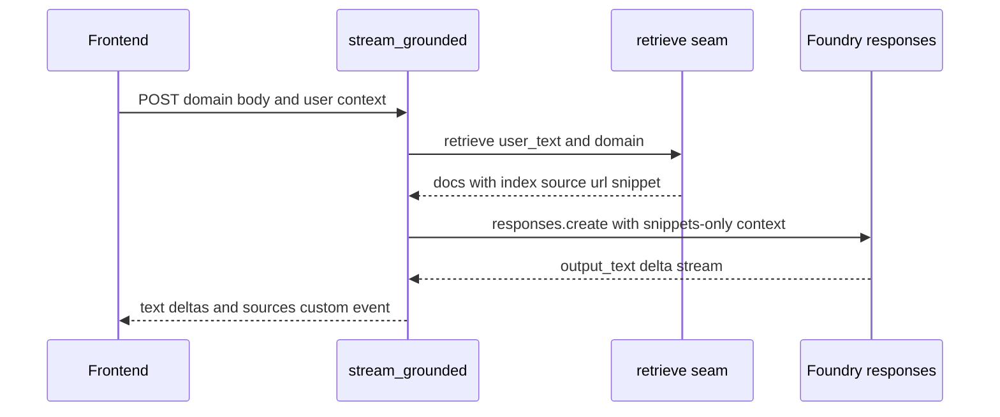

The `cockpit` and `selfwiki` domains are both mounted as `grounded` domains. They differ in prompts, KB pointers, and ACL audience, but they intentionally share the same backend execution model: one retrieval seam, one synthesis path, and one AG-UI emission contract for citations.[`apps/backend/app/domains.py`](https://github.com/ruinosus/foundry-assured/blob/4b749e7bac56789f0b1097cd4a8212b5c5c65d05/apps/backend/app/domains.py#L75-L97) [`apps/backend/app/domains.py`](https://github.com/ruinosus/foundry-assured/blob/4b749e7bac56789f0b1097cd4a8212b5c5c65d05/apps/backend/app/domains.py#L111-L129)

## Mounting and domain data

Grounded domains are registry rows with:

- `instructions`
- either `kb_name` or `search_index`
- `search_endpoint`
- optional `acl_group_map`

For cockpit, the map comes from parsed tenant ACL config. For selfwiki, the ACL map is synthesized from `app_users_group_id` when available so the repo wiki can behave as a private audience for all app users.[`apps/backend/app/domains.py`](https://github.com/ruinosus/foundry-assured/blob/4b749e7bac56789f0b1097cd4a8212b5c5c65d05/apps/backend/app/domains.py#L76-L84) [`apps/backend/app/domains.py`](https://github.com/ruinosus/foundry-assured/blob/4b749e7bac56789f0b1097cd4a8212b5c5c65d05/apps/backend/app/domains.py#L86-L97)

## The four-station grounded archetype

`stream_grounded()` documents itself as a four-station path:

1. capture user identity for OBO
2. retrieve authorized docs through `retrieve()`
3. synthesize strictly from those docs
4. emit AG-UI text deltas plus a `sources` custom event

That function is the canonical implementation for grounded live answering.[`apps/backend/app/services/grounded.py`](https://github.com/ruinosus/foundry-assured/blob/4b749e7bac56789f0b1097cd4a8212b5c5c65d05/apps/backend/app/services/grounded.py#L1-L18) [`apps/backend/app/services/grounded.py`](https://github.com/ruinosus/foundry-assured/blob/4b749e7bac56789f0b1097cd4a8212b5c5c65d05/apps/backend/app/services/grounded.py#L76-L84) [`apps/backend/app/services/grounded.py`](https://github.com/ruinosus/foundry-assured/blob/4b749e7bac56789f0b1097cd4a8212b5c5c65d05/apps/backend/app/services/grounded.py#L108-L141)

This diagram shows the shared runtime path for cockpit and selfwiki live answering.

## Retrieval seam

`retrieve()` is the single retrieval seam for all grounded domains. It chooses between two engines:

- **primary**: native KB retrieve for `searchIndex`-backed knowledge bases
- **fallback**: direct Search query over a configured search index

Both flow through the same projection step that deduplicates by URL and reindexes results to produce `[{index, source, url, snippet}]`.[`apps/backend/app/services/retrieval.py`](https://github.com/ruinosus/foundry-assured/blob/4b749e7bac56789f0b1097cd4a8212b5c5c65d05/apps/backend/app/services/retrieval.py#L1-L18) [`apps/backend/app/services/retrieval.py`](https://github.com/ruinosus/foundry-assured/blob/4b749e7bac56789f0b1097cd4a8212b5c5c65d05/apps/backend/app/services/retrieval.py#L48-L79) [`apps/backend/app/services/retrieval.py`](https://github.com/ruinosus/foundry-assured/blob/4b749e7bac56789f0b1097cd4a8212b5c5c65d05/apps/backend/app/services/retrieval.py#L278-L295)

Important invariants in this seam:

- the service credential on the retrieve call is app identity, but the user distinction comes from the `x-ms-query-source-authorization` header when the domain is ACL-protected.[`apps/backend/app/services/retrieval.py`](https://github.com/ruinosus/foundry-assured/blob/4b749e7bac56789f0b1097cd4a8212b5c5c65d05/apps/backend/app/services/retrieval.py#L21-L24) [`apps/backend/app/services/retrieval.py`](https://github.com/ruinosus/foundry-assured/blob/4b749e7bac56789f0b1097cd4a8212b5c5c65d05/apps/backend/app/services/retrieval.py#L62-L73)
- ACL domains fail closed: if no user token is available, the header is omitted and protected search returns zero docs rather than leaking content.[`apps/backend/app/services/retrieval.py`](https://github.com/ruinosus/foundry-assured/blob/4b749e7bac56789f0b1097cd4a8212b5c5c65d05/apps/backend/app/services/retrieval.py#L21-L24) [`apps/backend/app/services/retrieval.py`](https://github.com/ruinosus/foundry-assured/blob/4b749e7bac56789f0b1097cd4a8212b5c5c65d05/apps/backend/app/services/retrieval.py#L157-L163)
- native retrieve parsing depends on verified `docKey` decoding and `sourceData.snippet`, not guessed response-chunk joins.[`apps/backend/app/services/retrieval.py`](https://github.com/ruinosus/foundry-assured/blob/4b749e7bac56789f0b1097cd4a8212b5c5c65d05/apps/backend/app/services/retrieval.py#L25-L35) [`apps/backend/app/services/retrieval.py`](https://github.com/ruinosus/foundry-assured/blob/4b749e7bac56789f0b1097cd4a8212b5c5c65d05/apps/backend/app/services/retrieval.py#L177-L208) [`apps/backend/app/services/retrieval.py`](https://github.com/ruinosus/foundry-assured/blob/4b749e7bac56789f0b1097cd4a8212b5c5c65d05/apps/backend/app/services/retrieval.py#L227-L245)

## Synthesis contract

The synthesis payload is built by `build_synthesis_kwargs()`. It prepends a directive saying the model must answer only from the supplied documents, cite by bracketed index, and say it does not know if the documents are insufficient. The docs list becomes the only grounding context passed into Foundry.[`apps/backend/app/services/grounded.py`](https://github.com/ruinosus/foundry-assured/blob/4b749e7bac56789f0b1097cd4a8212b5c5c65d05/apps/backend/app/services/grounded.py#L29-L35) [`apps/backend/app/services/grounded.py`](https://github.com/ruinosus/foundry-assured/blob/4b749e7bac56789f0b1097cd4a8212b5c5c65d05/apps/backend/app/services/grounded.py#L38-L56)

This is the core invariant for safe grounded changes: retrieval may evolve, but grounded synthesis is only trusted because the answer context is limited to the retrieved docs.

## Citation and UI contract

After text streaming completes, `stream_grounded()` emits a `CustomEvent(name="sources", value=sources)` where each source carries `index`, `source`, `url`, and inline `content` capped at 800 characters. The inline content exists because the blob URLs are private and may 403 when opened directly; the UI can still render an evidence panel from the snippets.[`apps/backend/app/services/grounded.py`](https://github.com/ruinosus/foundry-assured/blob/4b749e7bac56789f0b1097cd4a8212b5c5c65d05/apps/backend/app/services/grounded.py#L123-L140)

That event shape is consumed by the frontend evidence panel and is therefore a cross-system contract, not an implementation detail.

## Identity capture caveat

The grounded endpoint captures `current_user()` outside the async generator and passes it into `stream_grounded()`. This is necessary because the contextvar does not survive into the `StreamingResponse` generator; if you tried to read it inside the generator, the code would silently fall back to app identity.[`apps/backend/app/domains.py`](https://github.com/ruinosus/foundry-assured/blob/4b749e7bac56789f0b1097cd4a8212b5c5c65d05/apps/backend/app/domains.py#L111-L122) [`apps/backend/app/services/grounded.py`](https://github.com/ruinosus/foundry-assured/blob/4b749e7bac56789f0b1097cd4a8212b5c5c65d05/apps/backend/app/services/grounded.py#L58-L73)

## Focused tests

The representative proof surfaces for grounded behavior are:

- `eval/retrieval_shape_test.py` and `eval/grounded_payload_test.py` for payload and projection semantics.[`apps/backend/eval/retrieval_shape_test.py`](https://github.com/ruinosus/foundry-assured/blob/4b749e7bac56789f0b1097cd4a8212b5c5c65d05/apps/backend/eval/retrieval_shape_test.py#L1-L65) [`apps/backend/eval/grounded_payload_test.py`](https://github.com/ruinosus/foundry-assured/blob/4b749e7bac56789f0b1097cd4a8212b5c5c65d05/apps/backend/eval/grounded_payload_test.py#L1-L61)
- `eval/native_snippet_test.py` and `eval/dockey_decode_test.py` for native retrieve parsing assumptions.[`apps/backend/eval/native_snippet_test.py`](https://github.com/ruinosus/foundry-assured/blob/4b749e7bac56789f0b1097cd4a8212b5c5c65d05/apps/backend/eval/native_snippet_test.py#L1-L62) [`apps/backend/eval/dockey_decode_test.py`](https://github.com/ruinosus/foundry-assured/blob/4b749e7bac56789f0b1097cd4a8212b5c5c65d05/apps/backend/eval/dockey_decode_test.py#L1-L56)
- `eval/access_control_test.py` and `eval/retrieval_acl_parity_test.py` for ACL behavior.[`apps/backend/eval/access_control_test.py`](https://github.com/ruinosus/foundry-assured/blob/4b749e7bac56789f0b1097cd4a8212b5c5c65d05/apps/backend/eval/access_control_test.py#L1-L15) [`apps/backend/eval/retrieval_acl_parity_test.py`](https://github.com/ruinosus/foundry-assured/blob/4b749e7bac56789f0b1097cd4a8212b5c5c65d05/apps/backend/eval/retrieval_acl_parity_test.py#L1-L64)

## Minimal validation

- `cd apps/backend && uv run python -m eval.retrieval_shape_test`
- `cd apps/backend && uv run python -m eval.dockey_decode_test`
- `cd apps/backend && uv run python -m eval.access_control_test`

That set validates the grounded architecture at three levels: shape, parsing, and access control.