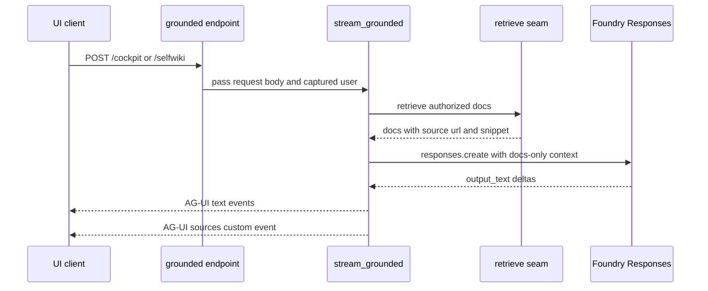

# Grounded domains

The backend has two grounded domains, `cockpit` and `selfwiki`, and they deliberately share one implementation path. In the domain registry both are declared as `kind="grounded"`, each with instructions, a knowledge-base name, a search-index fallback target, and a `search_endpoint`; `cockpit` also carries the tenant ACL group map, while `selfwiki` derives a single-audience ACL map from `app_users_group_id` when configured. The comments state that `selfwiki`’s audience is intentionally the app-users group rather than a per-user ACL matrix ([`apps/backend/app/domains.py`](https://github.com/ruinosus/foundry-assured/blob/7e41ad6f80befa024fae867b3fcdf763f8331a10/apps/backend/app/domains.py#L63-L99)).

`_mount_grounded` turns each grounded spec into `POST /{id}` and captures `current_user()` before entering `StreamingResponse`. That capture is a hard invariant, not a convenience: the module comment says the contextvar is lost inside the async generator, so identity must be passed explicitly into `stream_grounded` ([`apps/backend/app/domains.py`](https://github.com/ruinosus/foundry-assured/blob/7e41ad6f80befa024fae867b3fcdf763f8331a10/apps/backend/app/domains.py#L111-L129), [`apps/backend/app/services/grounded.py`](https://github.com/ruinosus/foundry-assured/blob/7e41ad6f80befa024fae867b3fcdf763f8331a10/apps/backend/app/services/grounded.py#L5-L8)).

## Domain-specific configuration meaning

The two helper modules `app/agents/cockpit.py` and `app/agents/selfwiki.py` show the intended contract for these domains. Both are mounted globally in shared mode and decided per tenant later; outside shared mode they only count as configured when the necessary search settings exist. Cockpit is described as internal platform documentation with the same Foundry IQ retrieval pattern as helpdesk, while selfwiki is “the mechanism turned on itself” and is intentionally single-audience rather than per-user ACL-trimmed ([`apps/backend/app/agents/cockpit.py`](https://github.com/ruinosus/foundry-assured/blob/7e41ad6f80befa024fae867b3fcdf763f8331a10/apps/backend/app/agents/cockpit.py#L1-L15), [`apps/backend/app/agents/cockpit.py`](https://github.com/ruinosus/foundry-assured/blob/7e41ad6f80befa024fae867b3fcdf763f8331a10/apps/backend/app/agents/cockpit.py#L21-L25), [`apps/backend/app/agents/selfwiki.py`](https://github.com/ruinosus/foundry-assured/blob/7e41ad6f80befa024fae867b3fcdf763f8331a10/apps/backend/app/agents/selfwiki.py#L1-L14), [`apps/backend/app/agents/selfwiki.py`](https://github.com/ruinosus/foundry-assured/blob/7e41ad6f80befa024fae867b3fcdf763f8331a10/apps/backend/app/agents/selfwiki.py#L21-L25)).

That is why `DomainSpec.acl_group_map` is data, not logic. For cockpit it passes through the tenant’s parsed ACL map. For selfwiki it becomes `{"app-users": cfg.app_users_group_id}` when the app-users group is configured, which enables the retrieval seam to attach a user-scoped search token while still treating the wiki as a single audience ([`apps/backend/app/domains.py`](https://github.com/ruinosus/foundry-assured/blob/7e41ad6f80befa024fae867b3fcdf763f8331a10/apps/backend/app/domains.py#L82-L96)).

## Shared four-station grounded path

`app/services/grounded.py` calls the architecture “ONE archetype over the `retrieve()` seam”. It splits the request into four stations:

1. build an async credential that runs synthesis as the signed-in user when auth is enabled,
2. retrieve authorized docs through `app.services.retrieval.retrieve`,
3. synthesize against only those docs, and
4. emit AG-UI text deltas plus a `sources` custom event for the frontend ([`apps/backend/app/services/grounded.py`](https://github.com/ruinosus/foundry-assured/blob/7e41ad6f80befa024fae867b3fcdf763f8331a10/apps/backend/app/services/grounded.py#L1-L18), [`apps/backend/app/services/grounded.py`](https://github.com/ruinosus/foundry-assured/blob/7e41ad6f80befa024fae867b3fcdf763f8331a10/apps/backend/app/services/grounded.py#L76-L150)).

Caption: Both grounded domains use the same retrieval-to-synthesis-to-AG-UI bridge.

### Station 1: synthesis identity

`_async_credential(user)` mirrors the synchronous auth credential path but uses the async Azure identity types. When auth is enabled and a user is present, it returns `OnBehalfOfCredential`; otherwise it falls back to `DefaultAzureCredential`. The comments are unusually strong here because getting this wrong produces a silent identity downgrade: reading `current_user()` inside the generator would return `None` and fall back to app identity, which the code notes would 403 on raw inference in the service-principal gap ([`apps/backend/app/services/grounded.py`](https://github.com/ruinosus/foundry-assured/blob/7e41ad6f80befa024fae867b3fcdf763f8331a10/apps/backend/app/services/grounded.py#L58-L73)).

### Station 2: retrieval seam

`retrieve(query, user, domain)` is the canonical retrieval interface. It chooses between two engines:

- native Foundry IQ KB `retrieve` when `domain.kb_name` is set, and
- direct search against `domain.search_index` otherwise.

In both cases the service credential on the call is the app identity, while the per-user distinction comes from `x-ms-query-source-authorization`, attached only when the domain carries a truthy `acl_group_map`. The comments define the fail-closed behavior explicitly: for an ACL domain, missing user identity means no header, which on a permission-filtered index returns zero docs instead of leaking content ([`apps/backend/app/services/retrieval.py`](https://github.com/ruinosus/foundry-assured/blob/7e41ad6f80befa024fae867b3fcdf763f8331a10/apps/backend/app/services/retrieval.py#L1-L35), [`apps/backend/app/services/retrieval.py`](https://github.com/ruinosus/foundry-assured/blob/7e41ad6f80befa024fae867b3fcdf763f8331a10/apps/backend/app/services/retrieval.py#L48-L79)).

The native path `_native_retrieve` is built from the proved searchIndex KB contract: it posts to `/knowledgebases/{kb}/retrieve`, sets `kind: "searchIndex"`, and requests `includeReferenceSourceData=true` so each returned reference carries the snippet and blob URL data needed for citations. The code comments emphasize that this is copied from the successful probe rather than inferred from prose docs, because searchIndex-vs-blob behavior and sourceData availability were empirically sensitive in this repository ([`apps/backend/app/services/retrieval.py`](https://github.com/ruinosus/foundry-assured/blob/7e41ad6f80befa024fae867b3fcdf763f8331a10/apps/backend/app/services/retrieval.py#L105-L169)).

The direct-search fallback `_direct_search_authorized` issues a plain search API request against the tenant’s index, again with the optional query-source-authorization header. When there is no user token it adds `x-ms-enable-elevated-read=true` so local auth-off development is not fail-closed to public-only docs, but that behavior is explicitly labeled dev-only best effort ([`apps/backend/app/services/retrieval.py`](https://github.com/ruinosus/foundry-assured/blob/7e41ad6f80befa024fae867b3fcdf763f8331a10/apps/backend/app/services/retrieval.py#L248-L275)).

### Station 2b: citation materialization

The retrieval subsystem has two important parsing helpers:

- `_decode_dockey` converts opaque searchIndex `docKey` values back into blob URLs. The comments say the old naive split-based decode failed on roughly half the keys and the new implementation was verified live against 38 real keys ([`apps/backend/app/services/retrieval.py`](https://github.com/ruinosus/foundry-assured/blob/7e41ad6f80befa024fae867b3fcdf763f8331a10/apps/backend/app/services/retrieval.py#L172-L209)).
- `_sourcedata_snippet` extracts the per-reference snippet from `references[].sourceData`, preferring `snippet` and falling back to `content`. This replaced an earlier join strategy that never fired for `answerSynthesis` KBs ([`apps/backend/app/services/retrieval.py`](https://github.com/ruinosus/foundry-assured/blob/7e41ad6f80befa024fae867b3fcdf763f8331a10/apps/backend/app/services/retrieval.py#L211-L245)).

Finally `_project` centralizes deduplication by URL and assigns 1-based indexes. That means both retrieval engines share the same citation numbering and duplicate elimination semantics ([`apps/backend/app/services/retrieval.py`](https://github.com/ruinosus/foundry-assured/blob/7e41ad6f80befa024fae867b3fcdf763f8331a10/apps/backend/app/services/retrieval.py#L278-L295)).

### Station 3: docs-only synthesis

`build_synthesis_kwargs` prepends a hard directive that the model must answer only from the provided documents, cite by bracket number, and say it does not know if the documents do not contain the answer. It then constructs a single body that contains numbered document snippets followed by the user question. If there are no authorized docs it still sends the same directive with an explicit “no authorized documents were found” marker. This makes citation discipline part of the prompt contract rather than a UI convention ([`apps/backend/app/services/grounded.py`](https://github.com/ruinosus/foundry-assured/blob/7e41ad6f80befa024fae867b3fcdf763f8331a10/apps/backend/app/services/grounded.py#L29-L55)).

### Station 4: AG-UI emission

`stream_grounded` emits `RunStartedEvent`, `TextMessageStartEvent`, output deltas, `TextMessageEndEvent`, an optional `CustomEvent(name="sources")`, and finally `RunFinishedEvent`. The `sources` payload includes `content` capped to 800 characters because the code comments explain that the underlying blob URLs are private and will 403 when opened directly, so the UI must be able to render the source inline ([`apps/backend/app/services/grounded.py`](https://github.com/ruinosus/foundry-assured/blob/7e41ad6f80befa024fae867b3fcdf763f8331a10/apps/backend/app/services/grounded.py#L103-L145)).

## ACL and security behavior

Older defensive logic survives in `app/agents/secure_search.py` as background context: the backend originally used app-side trimming as defense in depth when service-side agentic retrieval did not enforce ACLs correctly. That module documents the design goal that access should be authoritative and fail-closed, deriving authorized components from the search service’s own ACL evaluation and dropping unattributable chunks rather than guessing. Even though the main grounded path now lives behind `app.services.retrieval`, the security principles did not change ([`apps/backend/app/agents/secure_search.py`](https://github.com/ruinosus/foundry-assured/blob/7e41ad6f80befa024fae867b3fcdf763f8331a10/apps/backend/app/agents/secure_search.py#L1-L19), [`apps/backend/app/agents/secure_search.py`](https://github.com/ruinosus/foundry-assured/blob/7e41ad6f80befa024fae867b3fcdf763f8331a10/apps/backend/app/agents/secure_search.py#L36-L88)).

The grounded path therefore depends on the knowledge pipeline to stamp indexes correctly. `acl_setup.py` adds the `groups` permission field, disables trimming only during a maintenance window, stamps docs from manifest groups or defaults, and re-enables trimming in `finally`, specifically to avoid leaving the index open on failure ([`apps/backend/app/knowledge/acl_setup.py`](https://github.com/ruinosus/foundry-assured/blob/7e41ad6f80befa024fae867b3fcdf763f8331a10/apps/backend/app/knowledge/acl_setup.py#L97-L169)). That ingestion side is covered in knowledge-pipeline.

## Safe change surface

- To add another grounded domain, add a new `DomainSpec` row with `kind="grounded"`, domain instructions, and either a KB or search index. Do not bypass the registry with a custom route because you will lose the shared dependency and retrieval semantics ([`apps/backend/app/domains.py`](https://github.com/ruinosus/foundry-assured/blob/7e41ad6f80befa024fae867b3fcdf763f8331a10/apps/backend/app/domains.py#L34-L60), [`apps/backend/app/domains.py`](https://github.com/ruinosus/foundry-assured/blob/7e41ad6f80befa024fae867b3fcdf763f8331a10/apps/backend/app/domains.py#L167-L176)).
- To change citation behavior, start in the retrieval seam or synthesis directive, not in the frontend, because source numbering and snippets are determined before AG-UI emission ([`apps/backend/app/services/grounded.py`](https://github.com/ruinosus/foundry-assured/blob/7e41ad6f80befa024fae867b3fcdf763f8331a10/apps/backend/app/services/grounded.py#L38-L55), [`apps/backend/app/services/retrieval.py`](https://github.com/ruinosus/foundry-assured/blob/7e41ad6f80befa024fae867b3fcdf763f8331a10/apps/backend/app/services/retrieval.py#L278-L295)).
- To change ACL semantics, start in ingestion and retrieval together. Changing only one side can produce empty results or leaks.

## Focused tests and validation

- `uv run python -m eval.retrieval_acl_parity_test` proves the production retrieval seam enforces A-vs-B ACL differences end to end, not just the raw search endpoint ([`apps/backend/eval/retrieval_acl_parity_test.py`](https://github.com/ruinosus/foundry-assured/blob/7e41ad6f80befa024fae867b3fcdf763f8331a10/apps/backend/eval/retrieval_acl_parity_test.py#L1-L30), [`apps/backend/eval/retrieval_acl_parity_test.py`](https://github.com/ruinosus/foundry-assured/blob/7e41ad6f80befa024fae867b3fcdf763f8331a10/apps/backend/eval/retrieval_acl_parity_test.py#L104-L143)).
- `uv run python -m eval.native_snippet_test` and `uv run python -m eval.dockey_decode_test` are the narrow checks for native sourceData snippets and docKey decoding correctness ([`apps/backend/eval/native_snippet_test.py`](https://github.com/ruinosus/foundry-assured/blob/7e41ad6f80befa024fae867b3fcdf763f8331a10/apps/backend/eval/native_snippet_test.py#L1-L79), [`apps/backend/eval/dockey_decode_test.py`](https://github.com/ruinosus/foundry-assured/blob/7e41ad6f80befa024fae867b3fcdf763f8331a10/apps/backend/eval/dockey_decode_test.py#L1-L76)).
- `uv run python -m eval.grounded_payload_test` is the focused check for AG-UI grounded response payload shape ([`apps/backend/eval/grounded_payload_test.py`](https://github.com/ruinosus/foundry-assured/blob/7e41ad6f80befa024fae867b3fcdf763f8331a10/apps/backend/eval/grounded_payload_test.py#L1-L38)).
- `uv run python -m eval.domain_registry_test` remains the narrow route-mount check when adding or reshaping grounded domains ([`apps/backend/eval/domain_registry_test.py`](https://github.com/ruinosus/foundry-assured/blob/7e41ad6f80befa024fae867b3fcdf763f8331a10/apps/backend/eval/domain_registry_test.py#L118-L127)).
