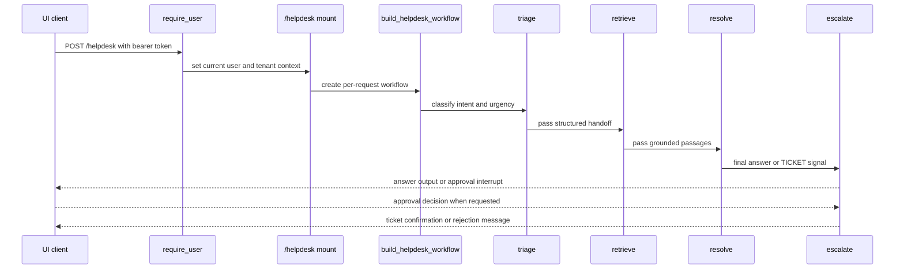
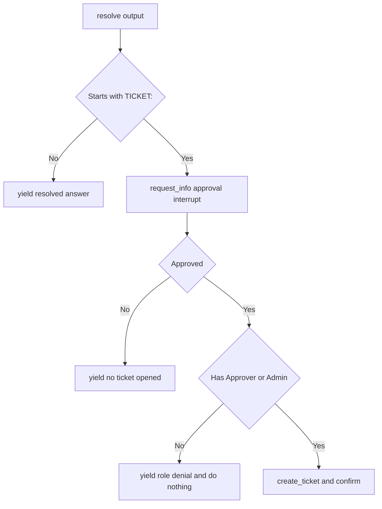

# Helpdesk workflow

The live helpdesk path is the backend’s richest runtime: a request enters through the mounted `/helpdesk` AG-UI endpoint, the backend builds a workflow for the current caller, runs `triage -> retrieve -> resolve -> escalate`, and streams workflow state back to the UI. The module docs stress that this factory is per-request because both the credential and the memory scope come from request-scoped auth state, not from a long-lived singleton ([`apps/backend/app/workflow/graph.py`](https://github.com/ruinosus/foundry-assured/blob/7e41ad6f80befa024fae867b3fcdf763f8331a10/apps/backend/app/workflow/graph.py#L1-L14), [`apps/backend/app/workflow/graph.py`](https://github.com/ruinosus/foundry-assured/blob/7e41ad6f80befa024fae867b3fcdf763f8331a10/apps/backend/app/workflow/graph.py#L28-L53)).

## How the endpoint is mounted

`app.domains._mount_helpdesk` mounts `/helpdesk` through `add_agent_framework_fastapi_endpoint`. If knowledge is configured, it serves `OrderedAgentFrameworkWorkflow(workflow_factory=build_helpdesk_workflow)`; if not, it falls back to a single concierge agent so the app can still boot without a configured knowledge base. The same mount also applies domain dependencies, which means auth always applies when enabled and shared mode adds a per-tenant entitlement gate ([`apps/backend/app/domains.py`](https://github.com/ruinosus/foundry-assured/blob/7e41ad6f80befa024fae867b3fcdf763f8331a10/apps/backend/app/domains.py#L132-L149), [`apps/backend/app/domains.py`](https://github.com/ruinosus/foundry-assured/blob/7e41ad6f80befa024fae867b3fcdf763f8331a10/apps/backend/app/domains.py#L102-L108)).

The fallback check is `_knowledge_configured()`. In shared mode it returns `True` unconditionally because domains are mounted globally and tenant-specific availability is decided later per request. In self-hosted and dedicated modes it requires both `azure_search_endpoint` and `azure_search_knowledge_base`, preserving local boot behavior when infra is incomplete ([`apps/backend/app/agents/concierge.py`](https://github.com/ruinosus/foundry-assured/blob/7e41ad6f80befa024fae867b3fcdf763f8331a10/apps/backend/app/agents/concierge.py#L27-L32)).

Caption: The live helpdesk route is a per-request workflow, not a singleton agent.

## Per-request identity and memory

`build_helpdesk_workflow` starts by deriving two request-scoped values: `credential_for_request()` and `memory_scope()`. It then builds the memory provider, creates each workflow agent with the same credential, and attaches memory only to the resolve agent. That arrangement is intentional: retrieval and triage do not need long-term memory, while resolve is the step that should read prior user context and write new memories after resolution ([`apps/backend/app/workflow/graph.py`](https://github.com/ruinosus/foundry-assured/blob/7e41ad6f80befa024fae867b3fcdf763f8331a10/apps/backend/app/workflow/graph.py#L28-L40), [`apps/backend/app/workflow/agents.py`](https://github.com/ruinosus/foundry-assured/blob/7e41ad6f80befa024fae867b3fcdf763f8331a10/apps/backend/app/workflow/agents.py#L58-L70)).

The auth side explains why this must happen at request time. `require_user` stores the validated `User` in a contextvar, and `credential_for_request()` turns that into an `OnBehalfOfCredential` when auth is enabled; otherwise it falls back to `DefaultAzureCredential` for local development. `memory_scope()` uses the current user’s `oid` and prefixes it with the resolved tenant id only in multi-tenant mode, preserving old single-tenant memory keys while preventing cross-tenant collisions in shared mode ([`apps/backend/app/core/auth.py`](https://github.com/ruinosus/foundry-assured/blob/7e41ad6f80befa024fae867b3fcdf763f8331a10/apps/backend/app/core/auth.py#L1-L21), [`apps/backend/app/core/auth.py`](https://github.com/ruinosus/foundry-assured/blob/7e41ad6f80befa024fae867b3fcdf763f8331a10/apps/backend/app/core/auth.py#L186-L208)).

`build_memory_provider` is enabled only when both `foundry_project_endpoint` and `foundry_memory_store` are present. When it is enabled, it uses `FoundryMemoryProvider` with `update_delay=0`, so memory writes happen immediately rather than waiting the provider’s default five minutes. The comments call out user scoping as the primary defense against memory poisoning ([`apps/backend/app/workflow/memory.py`](https://github.com/ruinosus/foundry-assured/blob/7e41ad6f80befa024fae867b3fcdf763f8331a10/apps/backend/app/workflow/memory.py#L1-L10), [`apps/backend/app/workflow/memory.py`](https://github.com/ruinosus/foundry-assured/blob/7e41ad6f80befa024fae867b3fcdf763f8331a10/apps/backend/app/workflow/memory.py#L22-L41)).

## The three Foundry-backed steps

`app/workflow/agents.py` defines the workflow’s three model-backed executors. All use a shared `_client(credential)` that reads `tenant_config()` for the Foundry project endpoint and model, ensuring the current tenant’s configuration applies without special cases in each step ([`apps/backend/app/workflow/agents.py`](https://github.com/ruinosus/foundry-assured/blob/7e41ad6f80befa024fae867b3fcdf763f8331a10/apps/backend/app/workflow/agents.py#L25-L31)).

- `build_triage_agent` creates `name="triage"` with instructions from `TRIAGE_INSTRUCTIONS` and a description that it classifies intent and urgency ([`apps/backend/app/workflow/agents.py`](https://github.com/ruinosus/foundry-assured/blob/7e41ad6f80befa024fae867b3fcdf763f8331a10/apps/backend/app/workflow/agents.py#L34-L40)).
- `build_retrieve_agent` adds `AzureAISearchContextProvider` in `mode="agentic"` against the tenant’s main helpdesk KB and produces the `retrieve` executor ([`apps/backend/app/workflow/agents.py`](https://github.com/ruinosus/foundry-assured/blob/7e41ad6f80befa024fae867b3fcdf763f8331a10/apps/backend/app/workflow/agents.py#L42-L55)).
- `build_resolve_agent` is the final model step. Its comments are explicit that ticket escalation is only *decided* there by emitting a `TICKET:` signal, while approval and ticket creation happen later in the escalation executor so “no ticket without approval” holds structurally ([`apps/backend/app/workflow/agents.py`](https://github.com/ruinosus/foundry-assured/blob/7e41ad6f80befa024fae867b3fcdf763f8331a10/apps/backend/app/workflow/agents.py#L58-L70)).

Prompt content for these steps is sourced indirectly: `app/agents/prompts.py` loads a declarative AgentSchema scope once, composes each named prompt, and exports constants like `TRIAGE_INSTRUCTIONS`, `RETRIEVE_INSTRUCTIONS`, and `RESOLVE_INSTRUCTIONS`. Safe prompt changes therefore belong in the declarative definitions and prompt-contract tests, not by editing workflow code directly ([`apps/backend/app/agents/prompts.py`](https://github.com/ruinosus/foundry-assured/blob/7e41ad6f80befa024fae867b3fcdf763f8331a10/apps/backend/app/agents/prompts.py#L1-L21), [`apps/backend/app/agents/prompts.py`](https://github.com/ruinosus/foundry-assured/blob/7e41ad6f80befa024fae867b3fcdf763f8331a10/apps/backend/app/agents/prompts.py#L95-L148)).

## Escalation and human approval

`EscalationExecutor` is the last node in the chain. If the resolve output starts with `TICKET:`, `on_resolve` extracts the summary and pauses the workflow via `ctx.request_info`, asking the frontend for a boolean approval response. If the resolve output is ordinary text, it simply yields that text as workflow output ([`apps/backend/app/workflow/escalation.py`](https://github.com/ruinosus/foundry-assured/blob/7e41ad6f80befa024fae867b3fcdf763f8331a10/apps/backend/app/workflow/escalation.py#L44-L65)).

The response handler applies a second gate: even if a human approves, the caller must have `Approver` or `Admin` role or the workflow returns a denial message and creates nothing. Only an approved and authorized path calls `create_ticket`. That function persists a ticket to `data/tickets.jsonl` and returns its generated id and metadata, so escalation is not a simulated action ([`apps/backend/app/workflow/escalation.py`](https://github.com/ruinosus/foundry-assured/blob/7e41ad6f80befa024fae867b3fcdf763f8331a10/apps/backend/app/workflow/escalation.py#L66-L93), [`apps/backend/app/tools/tickets.py`](https://github.com/ruinosus/foundry-assured/blob/7e41ad6f80befa024fae867b3fcdf763f8331a10/apps/backend/app/tools/tickets.py#L1-L10), [`apps/backend/app/tools/tickets.py`](https://github.com/ruinosus/foundry-assured/blob/7e41ad6f80befa024fae867b3fcdf763f8331a10/apps/backend/app/tools/tickets.py#L28-L60)).

This architecture is explicitly preferred over an approval-gated tool call on the agent because `agent-framework-ag-ui 1.0.0rc5` duplicates tool-start events for approval-gated agent tools, breaking stream behavior. Using the workflow’s native `request_info` interrupt avoids that broken path and matches the original design intent documented in code comments ([`apps/backend/app/workflow/escalation.py`](https://github.com/ruinosus/foundry-assured/blob/7e41ad6f80befa024fae867b3fcdf763f8331a10/apps/backend/app/workflow/escalation.py#L9-L17)).

Caption: Ticket creation is structurally impossible without both human approval and the right role.

## Stream-ordering workaround

The mounted workflow is wrapped in `OrderedAgentFrameworkWorkflow` because the upstream AG-UI adapter emits `RUN_FINISHED` before draining open assistant text messages when the terminal output comes from `yield_output(text)`. The code comments show the exact consequence: CopilotKit rejects the stream with “Cannot send 'RUN_FINISHED' while text messages are still active”. The wrapper fixes this by emitting `TextMessageEndEvent` before terminal events and by suppressing the `request_info` tool-call trio that otherwise leaves a stuck spinner in the UI ([`apps/backend/app/workflow/stream_fix.py`](https://github.com/ruinosus/foundry-assured/blob/7e41ad6f80befa024fae867b3fcdf763f8331a10/apps/backend/app/workflow/stream_fix.py#L1-L31), [`apps/backend/app/workflow/stream_fix.py`](https://github.com/ruinosus/foundry-assured/blob/7e41ad6f80befa024fae867b3fcdf763f8331a10/apps/backend/app/workflow/stream_fix.py#L51-L87)).

This is a narrow compatibility layer, not a new workflow engine. It post-processes events coming from the parent adapter and intentionally leaves snapshot/replay persistence untouched because the upstream `run()` observes the original events before yielding them. If upstream AG-UI fixes the bug, this wrapper can become a pass-through or be removed with targeted tests ([`apps/backend/app/workflow/stream_fix.py`](https://github.com/ruinosus/foundry-assured/blob/7e41ad6f80befa024fae867b3fcdf763f8331a10/apps/backend/app/workflow/stream_fix.py#L27-L31)).

## Boundaries and extension points

The safest extension seams are:

- Prompt changes through declarative prompt documents and prompt-contract tests, not by rewriting workflow control flow ([`apps/backend/app/agents/prompts.py`](https://github.com/ruinosus/foundry-assured/blob/7e41ad6f80befa024fae867b3fcdf763f8331a10/apps/backend/app/agents/prompts.py#L8-L18), [`apps/backend/eval/prompt_contract_test.py`](https://github.com/ruinosus/foundry-assured/blob/7e41ad6f80befa024fae867b3fcdf763f8331a10/apps/backend/eval/prompt_contract_test.py#L1-L30)).
- Retrieval behavior by changing the helpdesk KB or the retrieval prompt, while leaving the workflow chain shape intact unless you also re-evaluate step streaming and approval semantics ([`apps/backend/app/workflow/agents.py`](https://github.com/ruinosus/foundry-assured/blob/7e41ad6f80befa024fae867b3fcdf763f8331a10/apps/backend/app/workflow/agents.py#L42-L55)).
- Escalation behavior inside `EscalationExecutor`, because that is the one node designed to gate external actions ([`apps/backend/app/workflow/escalation.py`](https://github.com/ruinosus/foundry-assured/blob/7e41ad6f80befa024fae867b3fcdf763f8331a10/apps/backend/app/workflow/escalation.py#L44-L93)).

Unsafe changes include moving approval into resolve, skipping the role check in `on_decision`, or replacing request-scoped credentials with a singleton service credential; all three would violate invariants the code documents explicitly.

## Focused tests and validation

- `uv run python -m eval.prompt_contract_test` proves the prompt side still carries the sentinel strings and instructions that workflow code branches on ([`apps/backend/eval/prompt_contract_test.py`](https://github.com/ruinosus/foundry-assured/blob/7e41ad6f80befa024fae867b3fcdf763f8331a10/apps/backend/eval/prompt_contract_test.py#L1-L30), [`apps/backend/eval/prompt_contract_test.py`](https://github.com/ruinosus/foundry-assured/blob/7e41ad6f80befa024fae867b3fcdf763f8331a10/apps/backend/eval/prompt_contract_test.py#L145-L166)).
- `uv run python -m eval.approval_mode_test` is the narrow check when changing approval semantics ([`apps/backend/eval/approval_mode_test.py`](https://github.com/ruinosus/foundry-assured/blob/7e41ad6f80befa024fae867b3fcdf763f8331a10/apps/backend/eval/approval_mode_test.py#L1-L44)).
- `uv run python -m eval.memory_scope_test` is the focused safety check when changing request identity or memory key construction ([`apps/backend/eval/memory_scope_test.py`](https://github.com/ruinosus/foundry-assured/blob/7e41ad6f80befa024fae867b3fcdf763f8331a10/apps/backend/eval/memory_scope_test.py#L1-L38)).
- Broader runtime coverage comes from shared-mode and access-control evals once the change crosses auth or tenancy boundaries.
