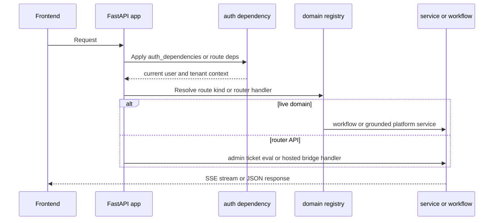

The backend is a Python 3.12 FastAPI service that owns three kinds of runtime surface at once: plain HTTP APIs, live AG-UI domain endpoints, and bridges to hosted Azure AI agents. The composition root is intentionally thin: `app.main` creates the app, preloads OpenID metadata when auth is enabled, applies CORS, includes the router bundle, and delegates all live domain registration to `mount_domains(app)`.[`apps/backend/pyproject.toml`](https://github.com/ruinosus/foundry-assured/blob/4b749e7bac56789f0b1097cd4a8212b5c5c65d05/apps/backend/pyproject.toml#L1-L18) [`apps/backend/app/main.py`](https://github.com/ruinosus/foundry-assured/blob/4b749e7bac56789f0b1097cd4a8212b5c5c65d05/apps/backend/app/main.py#L1-L10) [`apps/backend/app/main.py`](https://github.com/ruinosus/foundry-assured/blob/4b749e7bac56789f0b1097cd4a8212b5c5c65d05/apps/backend/app/main.py#L26-L35) [`apps/backend/app/main.py`](https://github.com/ruinosus/foundry-assured/blob/4b749e7bac56789f0b1097cd4a8212b5c5c65d05/apps/backend/app/main.py#L37-L49)

## Composition root and package map

The top-level backend packages break down as follows:

- `app/api`: conventional HTTP routers for health, hosted chat bridges, tickets, evals, me, admin, and shared-mode tenant APIs.[`apps/backend/app/api/__init__.py`](https://github.com/ruinosus/foundry-assured/blob/4b749e7bac56789f0b1097cd4a8212b5c5c65d05/apps/backend/app/api/__init__.py#L1-L19)
- `app/core`: auth, settings, tenant config/provider seam, onboarding, and shared-mode store setup.[`apps/backend/app/core/auth.py`](https://github.com/ruinosus/foundry-assured/blob/4b749e7bac56789f0b1097cd4a8212b5c5c65d05/apps/backend/app/core/auth.py#L1-L20) [`apps/backend/app/core/tenant.py`](https://github.com/ruinosus/foundry-assured/blob/4b749e7bac56789f0b1097cd4a8212b5c5c65d05/apps/backend/app/core/tenant.py#L18-L25)
- `app/services`: grounded answering, hosted-agent bridging, retrieval seam, Foundry evals, and Graph-backed admin service code.[`apps/backend/app/services/grounded.py`](https://github.com/ruinosus/foundry-assured/blob/4b749e7bac56789f0b1097cd4a8212b5c5c65d05/apps/backend/app/services/grounded.py#L1-L18) [`apps/backend/app/services/hosted.py`](https://github.com/ruinosus/foundry-assured/blob/4b749e7bac56789f0b1097cd4a8212b5c5c65d05/apps/backend/app/services/hosted.py#L1-L8) [`apps/backend/app/services/retrieval.py`](https://github.com/ruinosus/foundry-assured/blob/4b749e7bac56789f0b1097cd4a8212b5c5c65d05/apps/backend/app/services/retrieval.py#L1-L18)
- `app/workflow`: helpdesk workflow graph, individual workflow agents, escalation executor, memory integration, and AG-UI stream-order workaround.[`apps/backend/app/workflow/graph.py`](https://github.com/ruinosus/foundry-assured/blob/4b749e7bac56789f0b1097cd4a8212b5c5c65d05/apps/backend/app/workflow/graph.py#L1-L14) [`apps/backend/app/workflow/stream_fix.py`](https://github.com/ruinosus/foundry-assured/blob/4b749e7bac56789f0b1097cd4a8212b5c5c65d05/apps/backend/app/workflow/stream_fix.py#L1-L15)
- `app/knowledge`: ingest, ACL setup, docbundle schema/adapter logic, and wiki generation/adaptation pipeline.[`apps/backend/app/knowledge/adapt_openwiki.py`](https://github.com/ruinosus/foundry-assured/blob/4b749e7bac56789f0b1097cd4a8212b5c5c65d05/apps/backend/app/knowledge/adapt_openwiki.py#L1-L16) [`apps/backend/app/knowledge/ingest_docbundles.py`](https://github.com/ruinosus/foundry-assured/blob/4b749e7bac56789f0b1097cd4a8212b5c5c65d05/apps/backend/app/knowledge/ingest_docbundles.py#L1-L18)

## Domain mounting is the live runtime seam

The most important backend extension surface is `app.domains`. A `DomainSpec` row captures the domain id, kind, grounding pointers, ACL map, and optional hosted twin, and `mount_domains()` walks the registry once to register live endpoints based on `kind`. Crucially, `_domains()` reads `tenant_config()` lazily when called rather than at import time, so importing `app.domains` has no request-time side effects and shared mode can defer tenant-specific values until a request has resolved the current tenant.[`apps/backend/app/domains.py`](https://github.com/ruinosus/foundry-assured/blob/4b749e7bac56789f0b1097cd4a8212b5c5c65d05/apps/backend/app/domains.py#L34-L60) [`apps/backend/app/domains.py`](https://github.com/ruinosus/foundry-assured/blob/4b749e7bac56789f0b1097cd4a8212b5c5c65d05/apps/backend/app/domains.py#L63-L99) [`apps/backend/app/domains.py`](https://github.com/ruinosus/foundry-assured/blob/4b749e7bac56789f0b1097cd4a8212b5c5c65d05/apps/backend/app/domains.py#L167-L176)

That has two important consequences for safe changes:

- Adding or changing a live domain usually starts in the domain registry, not in `main.py`.[`apps/backend/app/main.py`](https://github.com/ruinosus/foundry-assured/blob/4b749e7bac56789f0b1097cd4a8212b5c5c65d05/apps/backend/app/main.py#L44-L49)
- Grounded domains must supply either `kb_name` or `search_index`, or the registry raises immediately in `__post_init__` rather than allowing broken retrieval URLs to surface later.[`apps/backend/app/domains.py`](https://github.com/ruinosus/foundry-assured/blob/4b749e7bac56789f0b1097cd4a8212b5c5c65d05/apps/backend/app/domains.py#L36-L42) [`apps/backend/app/domains.py`](https://github.com/ruinosus/foundry-assured/blob/4b749e7bac56789f0b1097cd4a8212b5c5c65d05/apps/backend/app/domains.py#L54-L60)

## Router aggregation and API families

`api_router` deliberately excludes the live `/helpdesk`, `/cockpit`, `/selfwiki`, and `/platform` endpoints; those are registered directly on the FastAPI app through the domain mounting loop. The router bundle instead owns the standard REST-like surfaces and hosted bridges.[`apps/backend/app/api/__init__.py`](https://github.com/ruinosus/foundry-assured/blob/4b749e7bac56789f0b1097cd4a8212b5c5c65d05/apps/backend/app/api/__init__.py#L1-L17)

The main API families are:

- `health` for simple service readiness.[`apps/backend/app/api/health.py`](https://github.com/ruinosus/foundry-assured/blob/4b749e7bac56789f0b1097cd4a8212b5c5c65d05/apps/backend/app/api/health.py#L1-L4)
- `chat` for `/helpdesk-hosted` and `/platform-hosted`, which wrap hosted-agent access behind the same auth and domain gates as the live paths.[`apps/backend/app/api/chat.py`](https://github.com/ruinosus/foundry-assured/blob/4b749e7bac56789f0b1097cd4a8212b5c5c65d05/apps/backend/app/api/chat.py#L12-L34)
- `admin` and Graph-backed role/user management.[`apps/backend/app/api/admin.py`](https://github.com/ruinosus/foundry-assured/blob/4b749e7bac56789f0b1097cd4a8212b5c5c65d05/apps/backend/app/api/admin.py#L1-L18)
- `me`, `tickets`, and `evals` for frontend workspace pages.[`apps/backend/app/api/me.py`](https://github.com/ruinosus/foundry-assured/blob/4b749e7bac56789f0b1097cd4a8212b5c5c65d05/apps/backend/app/api/me.py#L1-L18) [`apps/backend/app/api/tickets.py`](https://github.com/ruinosus/foundry-assured/blob/4b749e7bac56789f0b1097cd4a8212b5c5c65d05/apps/backend/app/api/tickets.py#L1-L12) [`apps/backend/app/api/evals.py`](https://github.com/ruinosus/foundry-assured/blob/4b749e7bac56789f0b1097cd4a8212b5c5c65d05/apps/backend/app/api/evals.py#L1-L19)
- `tenant` only in shared mode, enabled conditionally in router aggregation.[`apps/backend/app/api/__init__.py`](https://github.com/ruinosus/foundry-assured/blob/4b749e7bac56789f0b1097cd4a8212b5c5c65d05/apps/backend/app/api/__init__.py#L17-L19)

## Lifecycle invariants

Several backend invariants are structural rather than stylistic:

1. **Auth metadata is preloaded during lifespan** so the first authenticated request does not pay that setup cost.[`apps/backend/app/main.py`](https://github.com/ruinosus/foundry-assured/blob/4b749e7bac56789f0b1097cd4a8212b5c5c65d05/apps/backend/app/main.py#L26-L33)
2. **Hosted clients are closed on app shutdown** by calling `hosted_aclose()` in lifespan teardown.[`apps/backend/app/main.py`](https://github.com/ruinosus/foundry-assured/blob/4b749e7bac56789f0b1097cd4a8212b5c5c65d05/apps/backend/app/main.py#L27-L33) [`apps/backend/app/services/hosted.py`](https://github.com/ruinosus/foundry-assured/blob/4b749e7bac56789f0b1097cd4a8212b5c5c65d05/apps/backend/app/services/hosted.py#L47-L56)
3. **CORS is applied directly in FastAPI**, not delegated to the AG-UI adapter, because the adapter’s `allow_origins` support is explicitly not trusted here yet.[`apps/backend/app/main.py`](https://github.com/ruinosus/foundry-assured/blob/4b749e7bac56789f0b1097cd4a8212b5c5c65d05/apps/backend/app/main.py#L3-L10) [`apps/backend/app/main.py`](https://github.com/ruinosus/foundry-assured/blob/4b749e7bac56789f0b1097cd4a8212b5c5c65d05/apps/backend/app/main.py#L37-L42)
4. **Shared-mode boot is fail-fast**: when auth is enabled and deployment mode is `shared`, the backend switches providers and constructs the tenant store at import time so misconfiguration fails immediately.[`apps/backend/app/core/auth.py`](https://github.com/ruinosus/foundry-assured/blob/4b749e7bac56789f0b1097cd4a8212b5c5c65d05/apps/backend/app/core/auth.py#L77-L94) [`apps/backend/app/core/auth.py`](https://github.com/ruinosus/foundry-assured/blob/4b749e7bac56789f0b1097cd4a8212b5c5c65d05/apps/backend/app/core/auth.py#L106-L114)

This diagram shows the backend request path from FastAPI entrypoint to live domain or router service.

## Primary change surfaces

For most backend changes, the canonical owning files are:

- new live domain or domain metadata: `app/domains.py`
- workflow logic: `app/workflow/*`
- grounded retrieval or citation behavior: `app/services/grounded.py` and `app/services/retrieval.py`
- auth, OBO, roles, memory scope, or shared-mode boot: `app/core/auth.py`
- tenant resolution and config seam: `app/core/tenant.py` and `app/core/tenant_store.py`
- hosted bridge behavior: `app/api/chat.py` and `app/services/hosted.py`
- assurance and wiki/docbundle pipeline: `app/knowledge/*`

## Focused tests

The backend’s own tests encode the most important invariants:

- `eval/domain_registry_test.py` and `eval/domains_api_test.py` cover registry-driven mounting and route behavior.[`apps/backend/eval/domain_registry_test.py`](https://github.com/ruinosus/foundry-assured/blob/4b749e7bac56789f0b1097cd4a8212b5c5c65d05/apps/backend/eval/domain_registry_test.py#L1-L40) [`apps/backend/eval/domains_api_test.py`](https://github.com/ruinosus/foundry-assured/blob/4b749e7bac56789f0b1097cd4a8212b5c5c65d05/apps/backend/eval/domains_api_test.py#L1-L43)
- `eval/shared_boot_smoke_test.py` proves shared-mode import/boot expectations.[`apps/backend/eval/shared_boot_smoke_test.py`](https://github.com/ruinosus/foundry-assured/blob/4b749e7bac56789f0b1097cd4a8212b5c5c65d05/apps/backend/eval/shared_boot_smoke_test.py#L1-L43)
- `eval/platform_hosted_bridge_test.py` covers a key hosted bridge failure path.[`apps/backend/eval/platform_hosted_bridge_test.py`](https://github.com/ruinosus/foundry-assured/blob/4b749e7bac56789f0b1097cd4a8212b5c5c65d05/apps/backend/eval/platform_hosted_bridge_test.py#L1-L18)

## Minimal validation

- `cd apps/backend && uv run python -m eval.domain_registry_test`
- `cd apps/backend && uv run python -m eval.shared_boot_smoke_test`
- `cd apps/backend && uv run python -m eval.platform_hosted_bridge_test`

These three checks validate routing composition, shared boot invariants, and one hosted bridge boundary without requiring full cloud deployment.[`apps/backend/eval/domain_registry_test.py`](https://github.com/ruinosus/foundry-assured/blob/4b749e7bac56789f0b1097cd4a8212b5c5c65d05/apps/backend/eval/domain_registry_test.py#L1-L40) [`apps/backend/eval/shared_boot_smoke_test.py`](https://github.com/ruinosus/foundry-assured/blob/4b749e7bac56789f0b1097cd4a8212b5c5c65d05/apps/backend/eval/shared_boot_smoke_test.py#L1-L43) [`apps/backend/eval/platform_hosted_bridge_test.py`](https://github.com/ruinosus/foundry-assured/blob/4b749e7bac56789f0b1097cd4a8212b5c5c65d05/apps/backend/eval/platform_hosted_bridge_test.py#L1-L18)