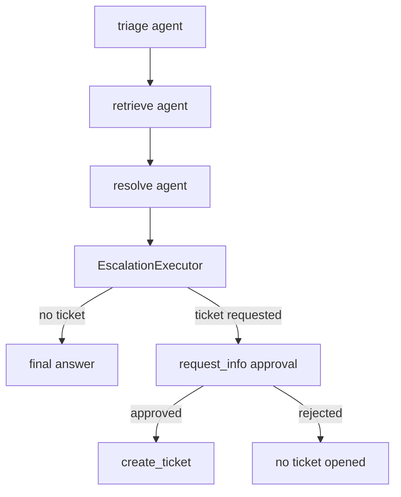

# Helpdesk workflow

The live helpdesk path is a four-step workflow: triage → retrieve → resolve → escalate. `build_helpdesk_workflow(thread_id=None)` is a per-request factory, not a singleton builder, because each run must use the current caller's credential and memory scope. The workflow creates three Foundry chat agents plus an `EscalationExecutor`, chains them with `WorkflowBuilder.add_chain`, and returns the built workflow. [workflow/graph.py](https://github.com/ruinosus/foundry-assured/blob/4d10c9a42e5d5c2a2b7f60d26a3e694620a9bcaa/apps/backend/app/workflow/graph.py#L1-L54)

## Why the workflow is per request

The AG-UI adapter passes only a thread ID into the workflow factory. Because of that, the backend cannot read request state from a FastAPI request object when building the workflow. Instead, the auth layer sets `_current_user` in a contextvar, and `build_helpdesk_workflow()` reads identity indirectly through `credential_for_request()` and `memory_scope()`. [auth.py](https://github.com/ruinosus/foundry-assured/blob/4d10c9a42e5d5c2a2b7f60d26a3e694620a9bcaa/apps/backend/app/core/auth.py#L3-L18) [workflow/graph.py](https://github.com/ruinosus/foundry-assured/blob/4d10c9a42e5d5c2a2b7f60d26a3e694620a9bcaa/apps/backend/app/workflow/graph.py#L28-L33)

That design has two direct consequences:

- Foundry and memory operations run as the signed-in user in auth-enabled deployments. [auth.py](https://github.com/ruinosus/foundry-assured/blob/4d10c9a42e5d5c2a2b7f60d26a3e694620a9bcaa/apps/backend/app/core/auth.py#L186-L196)
- Shared-mode tenant config is read at request time rather than boot time. [agents/per_request.py](https://github.com/ruinosus/foundry-assured/blob/4d10c9a42e5d5c2a2b7f60d26a3e694620a9bcaa/apps/backend/app/agents/per_request.py#L1-L16)

## Workflow structure

This diagram shows the structural invariant that protects the helpdesk path: ticket creation is not an agent tool call in the resolve step, but a separate final executor that can interrupt for human approval.

The workflow builder comment explains another practical invariant: it does not use `output_from` because that caused duplicate `TOOL_CALL_START` events. Instead, step streaming relies on executor STEP events from the chain itself. [workflow/graph.py](https://github.com/ruinosus/foundry-assured/blob/4d10c9a42e5d5c2a2b7f60d26a3e694620a9bcaa/apps/backend/app/workflow/graph.py#L42-L53)

## Step agents

`app.workflow.agents` builds three Foundry-backed agents:

- `build_triage_agent()` classifies intent and urgency and restates the question. [workflow/agents.py](https://github.com/ruinosus/foundry-assured/blob/4d10c9a42e5d5c2a2b7f60d26a3e694620a9bcaa/apps/backend/app/workflow/agents.py#L34-L39)
- `build_retrieve_agent()` attaches `AzureAISearchContextProvider` in `mode="agentic"` against the helpdesk KB. [workflow/agents.py](https://github.com/ruinosus/foundry-assured/blob/4d10c9a42e5d5c2a2b7f60d26a3e694620a9bcaa/apps/backend/app/workflow/agents.py#L42-L55)
- `build_resolve_agent()` writes the final grounded answer and optionally gets memory as a context provider. [workflow/agents.py](https://github.com/ruinosus/foundry-assured/blob/4d10c9a42e5d5c2a2b7f60d26a3e694620a9bcaa/apps/backend/app/workflow/agents.py#L58-L70)

The module docstring calls out another invariant: agent names are lowercase and UI-facing because the AG-UI adapter uses `agent.name` as the workflow executor ID that the frontend renders as the step name. [workflow/agents.py](https://github.com/ruinosus/foundry-assured/blob/4d10c9a42e5d5c2a2b7f60d26a3e694620a9bcaa/apps/backend/app/workflow/agents.py#L1-L10)

## Memory model

`build_helpdesk_workflow()` computes `scope = memory_scope()` and then builds a `FoundryMemoryProvider` if memory is configured. The memory provider is attached only to the resolve step, so it can inject prior developer-specific facts before resolution and store new facts immediately after the run thanks to `update_delay=0`. [workflow/graph.py](https://github.com/ruinosus/foundry-assured/blob/4d10c9a42e5d5c2a2b7f60d26a3e694620a9bcaa/apps/backend/app/workflow/graph.py#L30-L39) [workflow/memory.py](https://github.com/ruinosus/foundry-assured/blob/4d10c9a42e5d5c2a2b7f60d26a3e694620a9bcaa/apps/backend/app/workflow/memory.py#L22-L41)

The scope is a security boundary. `memory_scope()` uses bare `user.oid` in single-tenant mode to preserve existing keys, but prefixes with `tid:` in multi-tenant mode so different tenants never collide in the same memory namespace. [auth.py](https://github.com/ruinosus/foundry-assured/blob/4d10c9a42e5d5c2a2b7f60d26a3e694620a9bcaa/apps/backend/app/core/auth.py#L199-L209) [memory_scope_test.py](https://github.com/ruinosus/foundry-assured/blob/4d10c9a42e5d5c2a2b7f60d26a3e694620a9bcaa/apps/backend/eval/memory_scope_test.py#L25-L44)

## HITL escalation

`EscalationExecutor` is the final node of the workflow. It reads the resolve agent's output; if the text starts with `TICKET:`, it converts that into a `TicketApprovalRequest` and pauses the workflow with `ctx.request_info(response_type=bool)`. Only the response handler, `on_decision`, may actually call `create_ticket()`. [workflow/escalation.py](https://github.com/ruinosus/foundry-assured/blob/4d10c9a42e5d5c2a2b7f60d26a3e694620a9bcaa/apps/backend/app/workflow/escalation.py#L34-L65) [workflow/escalation.py](https://github.com/ruinosus/foundry-assured/blob/4d10c9a42e5d5c2a2b7f60d26a3e694620a9bcaa/apps/backend/app/workflow/escalation.py#L66-L93)

The code comment explains why this is a workflow interrupt instead of an approval-gated tool call: the AG-UI adapter duplicates `TOOL_CALL_START` for an agent's approval-gated tool call, which breaks the stream. The workflow-native request/response path emits a clean `request_info` interrupt that CopilotKit can render. [workflow/escalation.py](https://github.com/ruinosus/foundry-assured/blob/4d10c9a42e5d5c2a2b7f60d26a3e694620a9bcaa/apps/backend/app/workflow/escalation.py#L9-L17)

A second authorization layer lives here too. Even if the human approves the escalation, `on_decision` refuses to open a ticket unless `has_role("Approver", "Admin")` passes. Human approval is necessary but not sufficient. [workflow/escalation.py](https://github.com/ruinosus/foundry-assured/blob/4d10c9a42e5d5c2a2b7f60d26a3e694620a9bcaa/apps/backend/app/workflow/escalation.py#L73-L89)

The live-versus-hosted divergence is intentional and easy to miss. In the live workflow, ticket creation is never exposed as a free agent tool call; it is mediated by `EscalationExecutor` so there is structurally no path to create a ticket without the workflow interrupt and RBAC check. In contrast, `app.tools.tickets` also exports `create_ticket_tool = tool(create_ticket, ...)`, and the module docstring says the hosted agent uses this model-callable tool autonomously. Both paths persist to the same `data/tickets.jsonl` store and surface through `GET /tickets`, but only the live workflow guarantees approval-before-create at the backend workflow layer. [tools/tickets.py](https://github.com/ruinosus/foundry-assured/blob/4d10c9a42e5d5c2a2b7f60d26a3e694620a9bcaa/apps/backend/app/tools/tickets.py#L1-L10) [tools/tickets.py](https://github.com/ruinosus/foundry-assured/blob/4d10c9a42e5d5c2a2b7f60d26a3e694620a9bcaa/apps/backend/app/tools/tickets.py#L28-L69) [api/tickets.py](https://github.com/ruinosus/foundry-assured/blob/4d10c9a42e5d5c2a2b7f60d26a3e694620a9bcaa/apps/backend/app/api/tickets.py#L9-L16)

A focused related runtime guard is `eval.approval_mode_test`, which proves the connection-built MCP path marks write tools as `always_require_approval` and reads as `never_require_approval`. That test is for the platform/MCP approval split rather than helpdesk tickets directly, but it protects the repository's broader approval semantics where user-visible writes must be explicitly gated instead of silently treated like reads. [approval_mode_test.py](https://github.com/ruinosus/foundry-assured/blob/4d10c9a42e5d5c2a2b7f60d26a3e694620a9bcaa/apps/backend/eval/approval_mode_test.py#L1-L39)

## Stream-ordering workaround

`OrderedAgentFrameworkWorkflow` exists because `agent-framework-ag-ui 1.0.0rc5` can emit `RUN_FINISHED` before closing the active text message when the terminal workflow output is produced with `yield_output(text)`. The wrapper fixes this by inserting `TEXT_MESSAGE_END` before terminal events and suppressing the duplicated `request_info` tool-call trio that otherwise leaves a stuck spinner in the frontend. [workflow/stream_fix.py](https://github.com/ruinosus/foundry-assured/blob/4d10c9a42e5d5c2a2b7f60d26a3e694620a9bcaa/apps/backend/app/workflow/stream_fix.py#L1-L31) [workflow/stream_fix.py](https://github.com/ruinosus/foundry-assured/blob/4d10c9a42e5d5c2a2b7f60d26a3e694620a9bcaa/apps/backend/app/workflow/stream_fix.py#L51-L87)

This wrapper sits downstream of the parent `run()` method, so it does not change snapshot persistence behavior: the parent has already observed the original events before the wrapper suppresses or reorders them for emission. [workflow/stream_fix.py](https://github.com/ruinosus/foundry-assured/blob/4d10c9a42e5d5c2a2b7f60d26a3e694620a9bcaa/apps/backend/app/workflow/stream_fix.py#L27-L31)

## Prompt coupling

The workflow's branching semantics depend on prompt contracts, not just agent wiring. `build_triage_agent`, `build_retrieve_agent`, and `build_resolve_agent` all consume constants from `app.agents.prompts`, and `eval.prompt_contract_test` explicitly calls out that the resolve `TICKET:` sentinel and retrieve no-match behavior are contracts other runtime code branches on. [workflow/agents.py](https://github.com/ruinosus/foundry-assured/blob/4d10c9a42e5d5c2a2b7f60d26a3e694620a9bcaa/apps/backend/app/workflow/agents.py#L17-L21) [prompt_contract_test.py](https://github.com/ruinosus/foundry-assured/blob/4d10c9a42e5d5c2a2b7f60d26a3e694620a9bcaa/apps/backend/eval/prompt_contract_test.py#L1-L17)

## Focused validation

- Prompt semantics that the workflow branches on: `uv run python -m eval.prompt_contract_test`
- Memory scope safety: `uv run python -m eval.memory_scope_test`
- Platform-independent stream fix smoke remains indirect through live endpoint flows; the AG-UI workflow mount path is covered in `uv run python -m eval.domain_registry_test` [domain_registry_test.py](https://github.com/ruinosus/foundry-assured/blob/4d10c9a42e5d5c2a2b7f60d26a3e694620a9bcaa/apps/backend/eval/domain_registry_test.py#L87-L141)
