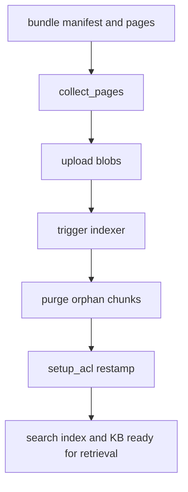

# Knowledge pipeline

The backend owns the full path from source-grounded documentation artifacts to live searchable corpora. That path has three distinct stages:

1. generate or adapt a bundle in the common docbundle format,
2. validate fidelity and contract constraints, and
3. ingest the bundle into blob storage, search indexes, knowledge sources, and knowledge bases with ACL metadata preserved.

The code treats this as one system, not unrelated scripts. `wiki_builder.py` and `adapt_openwiki.py` produce the same manifest-and-pages contract that `ingest_docbundles.py` consumes, while `acl_setup.py` stamps the resulting index so retrieval can enforce access at query time ([`apps/backend/app/knowledge/wiki_builder.py`](https://github.com/ruinosus/foundry-assured/blob/7e41ad6f80befa024fae867b3fcdf763f8331a10/apps/backend/app/knowledge/wiki_builder.py#L1-L27), [`apps/backend/app/knowledge/adapt_openwiki.py`](https://github.com/ruinosus/foundry-assured/blob/7e41ad6f80befa024fae867b3fcdf763f8331a10/apps/backend/app/knowledge/adapt_openwiki.py#L1-L27), [`apps/backend/app/knowledge/ingest_docbundles.py`](https://github.com/ruinosus/foundry-assured/blob/7e41ad6f80befa024fae867b3fcdf763f8331a10/apps/backend/app/knowledge/ingest_docbundles.py#L1-L19), [`apps/backend/app/knowledge/acl_setup.py`](https://github.com/ruinosus/foundry-assured/blob/7e41ad6f80befa024fae867b3fcdf763f8331a10/apps/backend/app/knowledge/acl_setup.py#L1-L18)).

## Bundle contract and why it matters

The common bundle contract is vendored as `docbundle.schema.json` and enforced through `validate_manifest`. `docbundle_contract_test.py` explains why this is treated as a hard cross-repo contract: the ingest pipeline reads fields like `groups`, `component`, and `pages`, and silent divergence between producers and consumers already caused problems before this gate existed ([`apps/backend/app/knowledge/docbundle_schema.py`](https://github.com/ruinosus/foundry-assured/blob/7e41ad6f80befa024fae867b3fcdf763f8331a10/apps/backend/app/knowledge/docbundle_schema.py#L1-L73), [`apps/backend/eval/docbundle_contract_test.py`](https://github.com/ruinosus/foundry-assured/blob/7e41ad6f80befa024fae867b3fcdf763f8331a10/apps/backend/eval/docbundle_contract_test.py#L1-L27), [`apps/backend/eval/docbundle_contract_test.py`](https://github.com/ruinosus/foundry-assured/blob/7e41ad6f80befa024fae867b3fcdf763f8331a10/apps/backend/eval/docbundle_contract_test.py#L124-L218)).

A particularly important distinction is “absent groups” versus `groups: []`. The contract gate and ingest code both preserve that difference because `None` means “no access declaration supplied here” while `[]` means “explicitly nobody may read this”, which should fail closed rather than fall through to a default audience ([`apps/backend/app/knowledge/ingest_docbundles.py`](https://github.com/ruinosus/foundry-assured/blob/7e41ad6f80befa024fae867b3fcdf763f8331a10/apps/backend/app/knowledge/ingest_docbundles.py#L194-L201), [`apps/backend/eval/docbundle_contract_test.py`](https://github.com/ruinosus/foundry-assured/blob/7e41ad6f80befa024fae867b3fcdf763f8331a10/apps/backend/eval/docbundle_contract_test.py#L187-L217)).

## Generation path: `wiki_builder.py`

`wiki_builder.py` is the Foundry-based generator. Its module docstring says it creates a faithful LLM wiki from real source, using a Foundry agent to plan pages and write them into the same bundle format ingest already reads. It deliberately excludes build artifacts and worktrees from source gathering so generated citations point to canonical paths rather than scratch copies ([`apps/backend/app/knowledge/wiki_builder.py`](https://github.com/ruinosus/foundry-assured/blob/7e41ad6f80befa024fae867b3fcdf763f8331a10/apps/backend/app/knowledge/wiki_builder.py#L1-L27), [`apps/backend/app/knowledge/wiki_builder.py`](https://github.com/ruinosus/foundry-assured/blob/7e41ad6f80befa024fae867b3fcdf763f8331a10/apps/backend/app/knowledge/wiki_builder.py#L55-L67), [`apps/backend/app/knowledge/wiki_builder.py`](https://github.com/ruinosus/foundry-assured/blob/7e41ad6f80befa024fae867b3fcdf763f8331a10/apps/backend/app/knowledge/wiki_builder.py#L150-L161)).

It also contains the repository’s source-fidelity gate. `_fidelity_report` scans generated pages for file citations, resolves them against gathered source, tracks whether line ranges are present, and rejects worktree citations; `_fidelity_floor()` reads the required threshold from `eval/assurance.yaml` so the gate and policy use one source of truth ([`apps/backend/app/knowledge/wiki_builder.py`](https://github.com/ruinosus/foundry-assured/blob/7e41ad6f80befa024fae867b3fcdf763f8331a10/apps/backend/app/knowledge/wiki_builder.py#L72-L148), [`apps/backend/eval/assurance.yaml`](https://github.com/ruinosus/foundry-assured/blob/7e41ad6f80befa024fae867b3fcdf763f8331a10/apps/backend/eval/assurance.yaml#L16-L20)).

The generator is also paced intentionally. It does one planning call, then one page-writing call per page with delays and transient retries because the code comments say agentic bursts can exceed deployment TPM limits on smaller Foundry deployments ([`apps/backend/app/knowledge/wiki_builder.py`](https://github.com/ruinosus/foundry-assured/blob/7e41ad6f80befa024fae867b3fcdf763f8331a10/apps/backend/app/knowledge/wiki_builder.py#L9-L13), [`apps/backend/app/knowledge/wiki_builder.py`](https://github.com/ruinosus/foundry-assured/blob/7e41ad6f80befa024fae867b3fcdf763f8331a10/apps/backend/app/knowledge/wiki_builder.py#L295-L350)).

## Adaptation path: OpenWiki bundles

`adapt_openwiki.py` is the third generation path in this repository’s ADR trail. It reads Markdown plus YAML front matter from `openwiki/`, strips non-content scaffolding like `index.md`, `_skeleton.md`, and `.last-update.json`, flattens internal wiki-to-wiki links so they do not pollute fidelity scoring, and writes the same bundle structure as the generator ([`apps/backend/app/knowledge/adapt_openwiki.py`](https://github.com/ruinosus/foundry-assured/blob/7e41ad6f80befa024fae867b3fcdf763f8331a10/apps/backend/app/knowledge/adapt_openwiki.py#L1-L33), [`apps/backend/app/knowledge/adapt_openwiki.py`](https://github.com/ruinosus/foundry-assured/blob/7e41ad6f80befa024fae867b3fcdf763f8331a10/apps/backend/app/knowledge/adapt_openwiki.py#L46-L56), [`apps/backend/app/knowledge/adapt_openwiki.py`](https://github.com/ruinosus/foundry-assured/blob/7e41ad6f80befa024fae867b3fcdf763f8331a10/apps/backend/app/knowledge/adapt_openwiki.py#L124-L145), [`apps/backend/app/knowledge/adapt_openwiki.py`](https://github.com/ruinosus/foundry-assured/blob/7e41ad6f80befa024fae867b3fcdf763f8331a10/apps/backend/app/knowledge/adapt_openwiki.py#L158-L212)).

The run receipt matters operationally: the adapted manifest records the commit and model from OpenWiki’s `.last-update.json`, not “whatever HEAD is now”, because freshness checks compare the bundle to the tree it actually documented ([`apps/backend/app/knowledge/adapt_openwiki.py`](https://github.com/ruinosus/foundry-assured/blob/7e41ad6f80befa024fae867b3fcdf763f8331a10/apps/backend/app/knowledge/adapt_openwiki.py#L147-L166), [`apps/backend/app/knowledge/adapt_openwiki.py`](https://github.com/ruinosus/foundry-assured/blob/7e41ad6f80befa024fae867b3fcdf763f8331a10/apps/backend/app/knowledge/adapt_openwiki.py#L183-L205)).

## Ingestion path: from bundle pages to searchable blobs

`ingest_docbundles.py` is the backend’s substantial ingestion subsystem. It is domain-generic even though many defaults still say “cockpit”: comments explain that the same module serves multiple corpora by overriding knowledge source names, container names, and KB names ([`apps/backend/app/knowledge/ingest_docbundles.py`](https://github.com/ruinosus/foundry-assured/blob/7e41ad6f80befa024fae867b3fcdf763f8331a10/apps/backend/app/knowledge/ingest_docbundles.py#L58-L67)).

### Collecting bundle pages

`collect_pages(docbundles)` walks every `manifest.json`, builds blob names like `{key}__{page-id}.md`, and prefixes page bodies with a component-and-version-qualified H1 so citations become meaningful sources inside the KB. At the same time it derives `component_groups`, the per-component access map used later by ACL stamping. Only manifests that explicitly declare `groups` enter that map ([`apps/backend/app/knowledge/ingest_docbundles.py`](https://github.com/ruinosus/foundry-assured/blob/7e41ad6f80befa024fae867b3fcdf763f8331a10/apps/backend/app/knowledge/ingest_docbundles.py#L168-L218)).

### Upload and incremental refresh

`upload()` creates the target blob container if needed and overwrites page blobs by name. The ingest pipeline is therefore blob-replacement based rather than append-only ([`apps/backend/app/knowledge/ingest_docbundles.py`](https://github.com/ruinosus/foundry-assured/blob/7e41ad6f80befa024fae867b3fcdf763f8331a10/apps/backend/app/knowledge/ingest_docbundles.py#L221-L233)).

`trigger_indexer()` then kicks a fresh indexer run explicitly. The code explains why this is needed: the blob data source has no deletion/change detection policy and `create_or_update_knowledge_source` does not trigger an immediate run. By default the function does not block for completion because indexing is embedding-bound and the index becomes incrementally queryable while the run continues ([`apps/backend/app/knowledge/ingest_docbundles.py`](https://github.com/ruinosus/foundry-assured/blob/7e41ad6f80befa024fae867b3fcdf763f8331a10/apps/backend/app/knowledge/ingest_docbundles.py#L69-L108)).

`purge_orphans()` handles the deletion side. Since the indexer never removes docs for deleted blobs, the pipeline reconciles the index against the live blob container and deletes orphan chunks by `uid`. On ACL-enabled indexes it uses `x-ms-enable-elevated-read` so permission trimming does not cause the purge pass to see zero docs and silently skip cleanup ([`apps/backend/app/knowledge/ingest_docbundles.py`](https://github.com/ruinosus/foundry-assured/blob/7e41ad6f80befa024fae867b3fcdf763f8331a10/apps/backend/app/knowledge/ingest_docbundles.py#L111-L165)).

Caption: Ingestion is not just upload; it also refreshes indexing state and re-stamps access control metadata.

## Provisioning knowledge sources and knowledge bases

`create_knowledge_source()` provisions the blob-backed knowledge source, but only if it does not already exist. The comment explains why it skips re-creation: re-creating the knowledge source can regenerate the index schema without the out-of-band `groups` permission field added by `setup_acl`, and Azure refuses to delete that field. So knowledge-source creation is a one-time provisioning step, while content refresh is upload plus reindexing ([`apps/backend/app/knowledge/ingest_docbundles.py`](https://github.com/ruinosus/foundry-assured/blob/7e41ad6f80befa024fae867b3fcdf763f8331a10/apps/backend/app/knowledge/ingest_docbundles.py#L236-L279)).

`create_knowledge_base()` provisions the blob-backed KB with `output_mode="answerSynthesis"` and a domain-specific answer-instructions string. For cockpit that string says architecture questions should prefer authoritative architecture/platform docs over component summaries and should never invent answers off corpus ([`apps/backend/app/knowledge/ingest_docbundles.py`](https://github.com/ruinosus/foundry-assured/blob/7e41ad6f80befa024fae867b3fcdf763f8331a10/apps/backend/app/knowledge/ingest_docbundles.py#L281-L311)).

### SearchIndex KB cutover path

The module also contains the non-destructive searchIndex migration path. `create_searchindex_knowledge_source()` provisions a separate searchIndex-backed knowledge source over the existing ACL-stamped index, enabling native Foundry IQ retrieve to honor per-user ACL headers. The comments emphasize that this is reversible and does not rebuild the existing index: cutover is just repointing config to the searchIndex KB, and rollback is repointing it back ([`apps/backend/app/knowledge/ingest_docbundles.py`](https://github.com/ruinosus/foundry-assured/blob/7e41ad6f80befa024fae867b3fcdf763f8331a10/apps/backend/app/knowledge/ingest_docbundles.py#L314-L360)).

This cutover is what lets the retrieval seam’s native path work correctly for ACL-sensitive corpora like cockpit.

## ACL stamping and restamping

`acl_setup.py` is the second half of ingestion. It adds a `groups` permission filter field if missing, resolves group names to Entra object ids through `tenant_config().acl_group_map`, and stamps every indexed document with the groups that may read its source. The comments repeatedly stress that access follows the source and this code does not classify documents into policy tiers on its own ([`apps/backend/app/knowledge/acl_setup.py`](https://github.com/ruinosus/foundry-assured/blob/7e41ad6f80befa024fae867b3fcdf763f8331a10/apps/backend/app/knowledge/acl_setup.py#L1-L18), [`apps/backend/app/knowledge/acl_setup.py`](https://github.com/ruinosus/foundry-assured/blob/7e41ad6f80befa024fae867b3fcdf763f8331a10/apps/backend/app/knowledge/acl_setup.py#L59-L76)).

Important behaviors:

- `_component(blob_url)` extracts a deterministic identity key from blob naming conventions; it is identity extraction, not classification ([`apps/backend/app/knowledge/acl_setup.py`](https://github.com/ruinosus/foundry-assured/blob/7e41ad6f80befa024fae867b3fcdf763f8331a10/apps/backend/app/knowledge/acl_setup.py#L38-L57)).
- `setup_acl()` can take explicit `component_groups`, fall back to an external ACL map, or stamp every doc with `default_groups` when passed `{}`. The docstring calls out selfwiki as the example of a single-audience corpus that uses this mode ([`apps/backend/app/knowledge/acl_setup.py`](https://github.com/ruinosus/foundry-assured/blob/7e41ad6f80befa024fae867b3fcdf763f8331a10/apps/backend/app/knowledge/acl_setup.py#L97-L109)).
- Trimming is disabled only during the restamp window because docs without groups become invisible under enforcement; it is always re-enabled in `finally`, so failures do not leave the index open ([`apps/backend/app/knowledge/acl_setup.py`](https://github.com/ruinosus/foundry-assured/blob/7e41ad6f80befa024fae867b3fcdf763f8331a10/apps/backend/app/knowledge/acl_setup.py#L132-L169)).

For selfwiki, the effective audience comes from `app_users_group_id` via the domain registry, and the ACL setup path can stamp that single group onto the selfwiki index as its audience. That keeps retrieval identity-aware without needing a large per-document policy map for the wiki corpus ([`apps/backend/app/domains.py`](https://github.com/ruinosus/foundry-assured/blob/7e41ad6f80befa024fae867b3fcdf763f8331a10/apps/backend/app/domains.py#L89-L97)).

## Freshness and fidelity gates

Externally generated bundles do not pass through `wiki_builder` automatically, so the backend applies the same fidelity logic in `eval/wiki_fidelity_test.py`. That script reuses `_fidelity_report` and `_fidelity_floor()` and fails bundles that fall below the configured floor or include any worktree citations ([`apps/backend/eval/wiki_fidelity_test.py`](https://github.com/ruinosus/foundry-assured/blob/7e41ad6f80befa024fae867b3fcdf763f8331a10/apps/backend/eval/wiki_fidelity_test.py#L1-L20), [`apps/backend/eval/wiki_fidelity_test.py`](https://github.com/ruinosus/foundry-assured/blob/7e41ad6f80befa024fae867b3fcdf763f8331a10/apps/backend/eval/wiki_fidelity_test.py#L59-L97)).

`wiki_freshness_test.py` is the temporal counterpart: it compares each bundle’s `generatedAt` against the newest commit touching the source area and fails if the code changed after generation. The script also explains why per-area bundle grading was retired in favor of a single bundle for the full repository ([`apps/backend/eval/wiki_freshness_test.py`](https://github.com/ruinosus/foundry-assured/blob/7e41ad6f80befa024fae867b3fcdf763f8331a10/apps/backend/eval/wiki_freshness_test.py#L1-L13), [`apps/backend/eval/wiki_freshness_test.py`](https://github.com/ruinosus/foundry-assured/blob/7e41ad6f80befa024fae867b3fcdf763f8331a10/apps/backend/eval/wiki_freshness_test.py#L26-L49), [`apps/backend/eval/wiki_freshness_test.py`](https://github.com/ruinosus/foundry-assured/blob/7e41ad6f80befa024fae867b3fcdf763f8331a10/apps/backend/eval/wiki_freshness_test.py#L71-L119)).

## Safe change surface

- Change bundle shape only through the shared schema and keep producer and consumer in lockstep. Do not invent local manifest fields ([`apps/backend/eval/docbundle_contract_test.py`](https://github.com/ruinosus/foundry-assured/blob/7e41ad6f80befa024fae867b3fcdf763f8331a10/apps/backend/eval/docbundle_contract_test.py#L12-L27)).
- Treat knowledge-source re-creation as destructive to ACL field state unless you have revalidated the index schema path.
- Keep ACL restamping fail-closed and always re-enable trimming, even on partial failure.
- If you add a new corpus, decide whether it is blob-KB, searchIndex-KB, or both, and wire retrieval expectations accordingly.

## Focused validation

- `uv run python -m eval.docbundle_contract_test` for contract drift, including the end-to-end proof that absent `groups` stays undeclared while `groups: []` remains an explicit fail-closed ACL declaration ([`apps/backend/eval/docbundle_contract_test.py`](https://github.com/ruinosus/foundry-assured/blob/7e41ad6f80befa024fae867b3fcdf763f8331a10/apps/backend/eval/docbundle_contract_test.py#L1-L27), [`apps/backend/eval/docbundle_contract_test.py`](https://github.com/ruinosus/foundry-assured/blob/7e41ad6f80befa024fae867b3fcdf763f8331a10/apps/backend/eval/docbundle_contract_test.py#L187-L217)).
- `uv run python -m eval.wiki_fidelity_test --component <component>` for externally generated or adapted bundle fidelity ([`apps/backend/eval/wiki_fidelity_test.py`](https://github.com/ruinosus/foundry-assured/blob/7e41ad6f80befa024fae867b3fcdf763f8331a10/apps/backend/eval/wiki_fidelity_test.py#L59-L97)).
- `uv run python -m eval.wiki_freshness_test` for staleness ([`apps/backend/eval/wiki_freshness_test.py`](https://github.com/ruinosus/foundry-assured/blob/7e41ad6f80befa024fae867b3fcdf763f8331a10/apps/backend/eval/wiki_freshness_test.py#L71-L119)).
- `uv run python -m eval.cockpit_acl_stamp_test`, `uv run python -m eval.retrieval_acl_parity_test`, and `uv run python -m eval.native_snippet_test` for ACL and retrieval correctness once ingest changes affect query-time behavior ([`apps/backend/eval/cockpit_acl_stamp_test.py`](https://github.com/ruinosus/foundry-assured/blob/7e41ad6f80befa024fae867b3fcdf763f8331a10/apps/backend/eval/cockpit_acl_stamp_test.py#L1-L63), [`apps/backend/eval/retrieval_acl_parity_test.py`](https://github.com/ruinosus/foundry-assured/blob/7e41ad6f80befa024fae867b3fcdf763f8331a10/apps/backend/eval/retrieval_acl_parity_test.py#L1-L30), [`apps/backend/eval/native_snippet_test.py`](https://github.com/ruinosus/foundry-assured/blob/7e41ad6f80befa024fae867b3fcdf763f8331a10/apps/backend/eval/native_snippet_test.py#L1-L79)).
a10/apps/backend/eval/native_snippet_test.py#L1-L79)).
