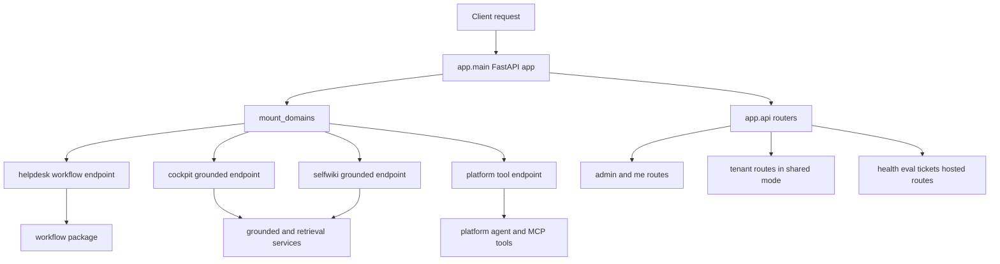

# Backend overview

The backend is a FastAPI service that keeps `app/main.py` thin: it builds the app, applies CORS, preloads OpenID metadata during lifespan startup, includes the HTTP routers from `app.api`, and then mounts all live domain endpoints through one domain-registry loop in `mount_domains(app)`. That split is intentional: HTTP routing stays in `app/api`, while domain-specific runtime composition lives in `app/domains.py`. [main.py](https://github.com/ruinosus/foundry-assured/blob/4d10c9a42e5d5c2a2b7f60d26a3e694620a9bcaa/apps/backend/app/main.py#L1-L53) [api/__init__.py](https://github.com/ruinosus/foundry-assured/blob/4d10c9a42e5d5c2a2b7f60d26a3e694620a9bcaa/apps/backend/app/api/__init__.py#L1-L18) [domains.py](https://github.com/ruinosus/foundry-assured/blob/4d10c9a42e5d5c2a2b7f60d26a3e694620a9bcaa/apps/backend/app/domains.py#L1-L18)

The repository constrains this backend to four runtime domains: `helpdesk`, `cockpit`, `selfwiki`, and `platform`. Each domain is represented by a `DomainSpec` row with a `kind` of `workflow`, `grounded`, or `tool`, and `mount_domains` dispatches by that kind to the correct serving strategy. Grounded domains must declare either a KB name or a direct search index; `DomainSpec.__post_init__` refuses a grounded row that would otherwise fall through to an invalid `.../indexes/None/docs/search` path. [domains.py](https://github.com/ruinosus/foundry-assured/blob/4d10c9a42e5d5c2a2b7f60d26a3e694620a9bcaa/apps/backend/app/domains.py#L34-L60) [domains.py](https://github.com/ruinosus/foundry-assured/blob/4d10c9a42e5d5c2a2b7f60d26a3e694620a9bcaa/apps/backend/app/domains.py#L63-L99) [domain_registry_test.py](https://github.com/ruinosus/foundry-assured/blob/4d10c9a42e5d5c2a2b7f60d26a3e694620a9bcaa/apps/backend/eval/domain_registry_test.py#L38-L71)

The backend has two major configuration layers. `PlatformSettings` owns process-global behavior such as deployment mode, tenant-store wiring, Entra app registration settings, CORS origin, and the platform-wide MCP feature flag. `TenantConfig` owns per-tenant data-plane pointers such as Foundry project endpoint, model names, search endpoints, KB names, storage containers, ACL group mapping, memory-store name, and hosted-agent names. Runtime code is expected to read tenant-varying data only through `tenant_config()`, which hides whether the current process is single-tenant or shared multi-tenant. [settings.py](https://github.com/ruinosus/foundry-assured/blob/4d10c9a42e5d5c2a2b7f60d26a3e694620a9bcaa/apps/backend/app/core/settings.py#L1-L63) [tenant.py](https://github.com/ruinosus/foundry-assured/blob/4d10c9a42e5d5c2a2b7f60d26a3e694620a9bcaa/apps/backend/app/core/tenant.py#L1-L24) [tenant.py](https://github.com/ruinosus/foundry-assured/blob/4d10c9a42e5d5c2a2b7f60d26a3e694620a9bcaa/apps/backend/app/core/tenant.py#L171-L266)

## Runtime map

This diagram shows the backend composition root: one FastAPI app, one router aggregate, and one domain-mount loop that fans requests into workflow, grounded, or tool subsystems.

## Domain kinds and why they differ

### Workflow domain: `helpdesk`

`helpdesk` is the only `workflow` domain. When knowledge is configured, the backend mounts an `OrderedAgentFrameworkWorkflow` built from `build_helpdesk_workflow`; otherwise it falls back to a single concierge agent so the app still boots without KB provisioning. The workflow path is where the triage → retrieve → resolve → escalate chain, per-user memory scope, and HITL ticket approval live. [domains.py](https://github.com/ruinosus/foundry-assured/blob/4d10c9a42e5d5c2a2b7f60d26a3e694620a9bcaa/apps/backend/app/domains.py#L132-L149) [workflow/graph.py](https://github.com/ruinosus/foundry-assured/blob/4d10c9a42e5d5c2a2b7f60d26a3e694620a9bcaa/apps/backend/app/workflow/graph.py#L1-L54) [agents/concierge.py](https://github.com/ruinosus/foundry-assured/blob/4d10c9a42e5d5c2a2b7f60d26a3e694620a9bcaa/apps/backend/app/agents/concierge.py#L1-L62)

### Grounded domains: `cockpit` and `selfwiki`

`cockpit` and `selfwiki` are `grounded` domains. They do not use the AG-UI workflow adapter. Instead, `_mount_grounded` adds an ordinary POST route that captures `current_user()` in the endpoint body and hands the request to `stream_grounded`. That detail is load-bearing: the code comments explain that the request-scoped user contextvar is lost inside the streaming generator, so the user identity must be captured before creating the `StreamingResponse`. [domains.py](https://github.com/ruinosus/foundry-assured/blob/4d10c9a42e5d5c2a2b7f60d26a3e694620a9bcaa/apps/backend/app/domains.py#L111-L129) [grounded.py](https://github.com/ruinosus/foundry-assured/blob/4d10c9a42e5d5c2a2b7f60d26a3e694620a9bcaa/apps/backend/app/services/grounded.py#L76-L83) [grounded_archetype_roundtrip_test.py](https://github.com/ruinosus/foundry-assured/blob/4d10c9a42e5d5c2a2b7f60d26a3e694620a9bcaa/apps/backend/eval/grounded_archetype_roundtrip_test.py#L1-L18)

### Tool domain: `platform`

`platform` is the `tool` domain. It is only mounted when `platform_configured()` passes. The mounted object is not a prebuilt agent but `platform_agent_proxy`, a `PerRequestAgent` that rebuilds the real platform agent on every call so tool visibility and OBO credentialing reflect the current caller. This is especially important in shared mode, where boot happens before any tenant is resolved. [domains.py](https://github.com/ruinosus/foundry-assured/blob/4d10c9a42e5d5c2a2b7f60d26a3e694620a9bcaa/apps/backend/app/domains.py#L152-L176) [agents/platform.py](https://github.com/ruinosus/foundry-assured/blob/4d10c9a42e5d5c2a2b7f60d26a3e694620a9bcaa/apps/backend/app/agents/platform.py#L1-L56) [agents/per_request.py](https://github.com/ruinosus/foundry-assured/blob/4d10c9a42e5d5c2a2b7f60d26a3e694620a9bcaa/apps/backend/app/agents/per_request.py#L1-L48)

## Deployment modes and their impact

The backend is explicitly mode-aware. `PlatformSettings.deployment_mode` defaults to `self_hosted`, but major control paths branch for `shared` multi-tenancy. In shared mode, `app.core.auth` switches the tenant-config provider to `MultiTenantConfigProvider`, constructs a tenant store at boot, and domain dependencies add `require_domain(domain_id)` on top of authentication. In self-hosted or dedicated mode, `_domain_deps` is exactly `auth_dependencies()`, preserving previous single-tenant behavior byte-for-byte. [settings.py](https://github.com/ruinosus/foundry-assured/blob/4d10c9a42e5d5c2a2b7f60d26a3e694620a9bcaa/apps/backend/app/core/settings.py#L16-L23) [auth.py](https://github.com/ruinosus/foundry-assured/blob/4d10c9a42e5d5c2a2b7f60d26a3e694620a9bcaa/apps/backend/app/core/auth.py#L106-L138) [domains.py](https://github.com/ruinosus/foundry-assured/blob/4d10c9a42e5d5c2a2b7f60d26a3e694620a9bcaa/apps/backend/app/domains.py#L102-L109) [configured_mode_test.py](https://github.com/ruinosus/foundry-assured/blob/4d10c9a42e5d5c2a2b7f60d26a3e694620a9bcaa/apps/backend/eval/configured_mode_test.py#L1-L10) [shared_boot_smoke_test.py](https://github.com/ruinosus/foundry-assured/blob/4d10c9a42e5d5c2a2b7f60d26a3e694620a9bcaa/apps/backend/eval/shared_boot_smoke_test.py#L1-L40)

A second deployment seam is prompt-source selection. The backend ships a baked-in `agents/` directory, but `AGENTS_DIR` can point to an external definitions directory. If the configured external directory contains the `helpdesk` scope, the backend uses it and any load failure is fatal. If the scope is absent there, the backend logs a warning and falls back to the baked copy so a fresh, unseeded environment does not crash-loop. README.md [agents/prompts.py](https://github.com/ruinosus/foundry-assured/blob/4d10c9a42e5d5c2a2b7f60d26a3e694620a9bcaa/apps/backend/app/agents/prompts.py#L40-L80)

## Subsystems and canonical docs

- API details, route families, and mounted-versus-router endpoint behavior: API surface
- Authentication, OBO, tenant resolution, onboarding, and entitlement gates: Auth and tenancy
- Prompt definitions, AgentSchema composition, and boot-fail invariants: Prompt system
- Multi-agent helpdesk workflow, memory, approval flow, and stream workaround: Helpdesk workflow
- Grounded `cockpit` and `selfwiki` retrieval/synthesis path: Grounded domains
- Tool-driven `platform` domain and MCP brokering: Platform domain
- Runtime settings, startup/shutdown lifecycle, persistence, and operational caveats: Operations and runtime
- Ingestion, docbundle adaptation, and schema contract: Knowledge pipeline
- Eval harness and backend guarantees encoded as tests: Evaluation and assurance

## Focused validation

- Boot and route-composition smoke: `uv run python -m eval.domain_registry_test`
- Shared-mode boot guard: `uv run python -m eval.shared_boot_smoke_test`
- Mode-aware configured checks: `uv run python -m eval.configured_mode_test`
