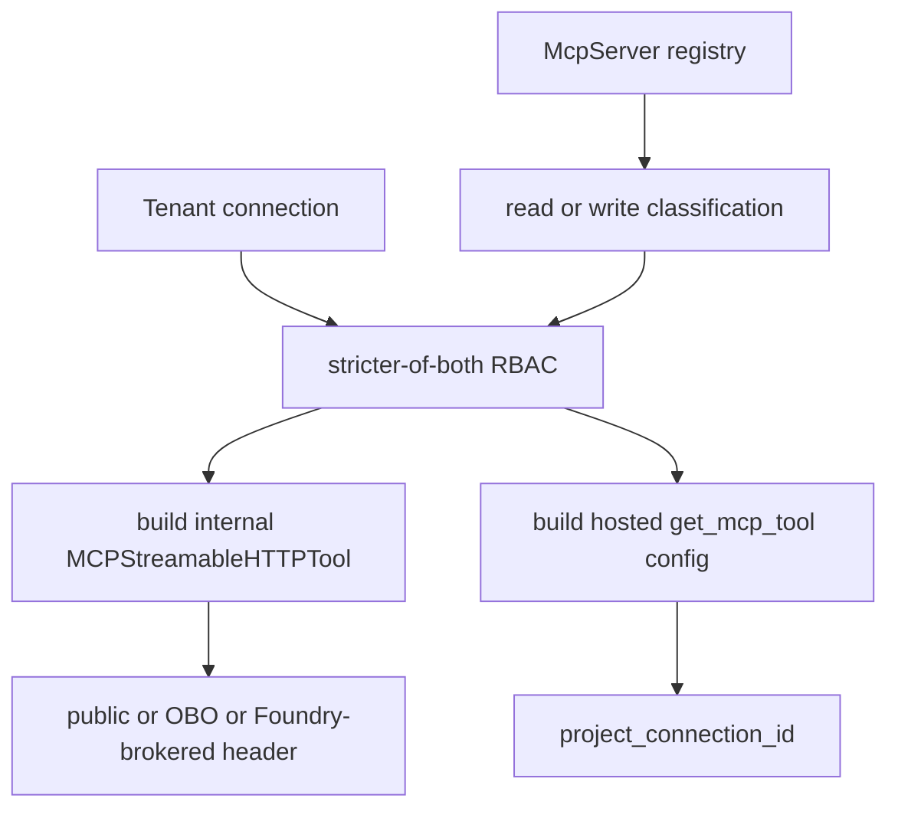

The platform domain’s real change surface is not only `platform.py`; it is the MCP registry and tool-building subsystem under `app/agents/mcp`. That subsystem decides which tools exist, who may see them, how they authenticate, and whether they are built for internal live execution or hosted execution.[`apps/backend/app/agents/mcp/registry.py`](https://github.com/ruinosus/foundry-assured/blob/4b749e7bac56789f0b1097cd4a8212b5c5c65d05/apps/backend/app/agents/mcp/registry.py#L1-L12) [`apps/backend/app/agents/mcp/tools.py`](https://github.com/ruinosus/foundry-assured/blob/4b749e7bac56789f0b1097cd4a8212b5c5c65d05/apps/backend/app/agents/mcp/tools.py#L1-L18)

## Registry as data

`McpServer` rows define:

- server id and label
- URL or URL template
- auth mode
- read and write tool names
- minimum read and write role grants
- enabled flag

[`apps/backend/app/agents/mcp/registry.py`](https://github.com/ruinosus/foundry-assured/blob/4b749e7bac56789f0b1097cd4a8212b5c5c65d05/apps/backend/app/agents/mcp/registry.py#L24-L35) [`apps/backend/app/agents/mcp/registry.py`](https://github.com/ruinosus/foundry-assured/blob/4b749e7bac56789f0b1097cd4a8212b5c5c65d05/apps/backend/app/agents/mcp/registry.py#L42-L116)

This keeps governance in data rather than in scattered role checks.

## Classification and fail-closed policy

`classify_tool()` treats any tool not explicitly listed in `read_tools` as a write. That is the repo’s fail-closed rule for unclassified tools: a new tool can become more restrictive by default, but not more permissive.[`apps/backend/app/agents/mcp/registry.py`](https://github.com/ruinosus/foundry-assured/blob/4b749e7bac56789f0b1097cd4a8212b5c5c65d05/apps/backend/app/agents/mcp/registry.py#L130-L135)

Role grants are also data-driven:

- `Reader` grant maps to `Reader`, `Author`, `Approver`, `Admin`
- `Author` grant maps to `Author`, `Admin`

[`apps/backend/app/agents/mcp/registry.py`](https://github.com/ruinosus/foundry-assured/blob/4b749e7bac56789f0b1097cd4a8212b5c5c65d05/apps/backend/app/agents/mcp/registry.py#L18-L22)

## Server defaults versus tenant overrides

The platform subsystem merges two permission layers:

- server-default minimum roles from the registry
- tenant-specific minimum roles on each `Connection`

`visible_tools_for()` uses the stricter of both: the caller must satisfy the registry grant and the connection override grant. Tenants can tighten visibility but not loosen the server’s baseline governance.[`apps/backend/app/agents/mcp/registry.py`](https://github.com/ruinosus/foundry-assured/blob/4b749e7bac56789f0b1097cd4a8212b5c5c65d05/apps/backend/app/agents/mcp/registry.py#L158-L175)

## Internal live tool construction

The internal path builds `MCPStreamableHTTPTool` instances. `_build_one()` and `_build_from_connection()` set:

- `allowed_tools` to the visible read and write set
- approval configuration for the internal path
- auth-specific headers or providers

Auth handling differs by server type:

- `public` → no auth header
- `obo` → header provider that mints a user OBO bearer at call time
- non-OBO with `foundry_connection_id` → lazy Foundry-connection brokered header provider

[`apps/backend/app/agents/mcp/tools.py`](https://github.com/ruinosus/foundry-assured/blob/4b749e7bac56789f0b1097cd4a8212b5c5c65d05/apps/backend/app/agents/mcp/tools.py#L36-L48) [`apps/backend/app/agents/mcp/tools.py`](https://github.com/ruinosus/foundry-assured/blob/4b749e7bac56789f0b1097cd4a8212b5c5c65d05/apps/backend/app/agents/mcp/tools.py#L50-L68) [`apps/backend/app/agents/mcp/tools.py`](https://github.com/ruinosus/foundry-assured/blob/4b749e7bac56789f0b1097cd4a8212b5c5c65d05/apps/backend/app/agents/mcp/tools.py#L82-L109) [`apps/backend/app/agents/mcp/tools.py`](https://github.com/ruinosus/foundry-assured/blob/4b749e7bac56789f0b1097cd4a8212b5c5c65d05/apps/backend/app/agents/mcp/tools.py#L150-L175)

## Hosted tool construction

The hosted path uses `build_hosted_from_connections()`, which does not attach a header provider. Instead, it passes `project_connection_id` into the injected `get_tool` callable so Foundry can resolve the credential from the configured project connection at runtime.[`apps/backend/app/agents/mcp/tools.py`](https://github.com/ruinosus/foundry-assured/blob/4b749e7bac56789f0b1097cd4a8212b5c5c65d05/apps/backend/app/agents/mcp/tools.py#L184-L210)

That is the most important live-versus-hosted distinction in the platform tool layer:

- live path can mint OBO headers or broker API keys lazily in-process
- hosted path delegates credential resolution to Foundry connection plumbing

This diagram shows how the platform tool subsystem turns server metadata and tenant overlays into live or hosted tool instances.

## Focused tests

The best proof surfaces are:

- `eval/rbac_per_tool_test.py` for classification and stricter-of-both RBAC behavior.[`apps/backend/eval/rbac_per_tool_test.py`](https://github.com/ruinosus/foundry-assured/blob/4b749e7bac56789f0b1097cd4a8212b5c5c65d05/apps/backend/eval/rbac_per_tool_test.py#L1-L64)
- `eval/hosted_build_test.py` for hosted tool construction and approval dict shape.[`apps/backend/eval/hosted_build_test.py`](https://github.com/ruinosus/foundry-assured/blob/4b749e7bac56789f0b1097cd4a8212b5c5c65d05/apps/backend/eval/hosted_build_test.py#L1-L62)
- `eval/mcp_brokering_e2e_test.py` for the infra-gated live Foundry/OBO brokering surface.[`apps/backend/eval/mcp_brokering_e2e_test.py`](https://github.com/ruinosus/foundry-assured/blob/4b749e7bac56789f0b1097cd4a8212b5c5c65d05/apps/backend/eval/mcp_brokering_e2e_test.py#L1-L62)

## Minimal validation

- `cd apps/backend && uv run python -m eval.rbac_per_tool_test`
- `cd apps/backend && uv run python -m eval.hosted_build_test`

Use the first when changing visibility logic; use the second when changing hosted tool construction.