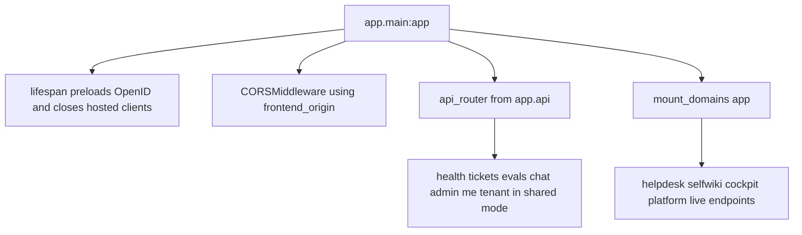
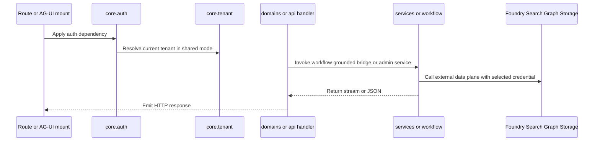

# Backend application overview

The backend in `apps/backend` is the operational core of the repository. It exposes:

- live AG-UI endpoints for helpdesk, grounded domains, and the platform domain,
- hosted-agent bridges that re-emit hosted responses as AG-UI,
- REST APIs for health, tickets, evals, admin, me, and shared-mode tenant management,
- auth, tenancy, and OBO credential resolution,
- the helpdesk workflow graph,
- grounded retrieval and synthesis,
- Graph-backed admin operations,
- and the knowledge ingestion and wiki adaptation pipeline.

Its runtime entrypoint is [`apps/backend/app/main.py`](../../apps/backend/app/main.py).

## Composition root

`app/main.py` is intentionally thin. It does four things:

1. creates the FastAPI app and lifespan handler,
2. preloads OpenID config when auth is enabled,
3. installs CORS using `settings.frontend_origin`,
4. includes REST routers through `api_router` and mounts domain endpoints through `mount_domains(app)`.

That means the composition root delegates almost all domain-specific behavior to lower layers.

This diagram shows how the backend app is assembled at process startup.

## Package boundaries

### `app/core`

This package owns process-global runtime concerns:

- [`core/settings.py`](../../apps/backend/app/core/settings.py): platform-global environment settings such as deployment mode, tenant store backend, auth config, MCP global switches, onboarding allow-list, and CORS origin.
- [`core/auth.py`](../../apps/backend/app/core/auth.py): incoming token validation, role checks, OBO credential creation, current-user context propagation, and shared-mode tenant resolution at auth time.
- [`core/tenant.py`](../../apps/backend/app/core/tenant.py): `TenantConfig`, `SingleTenantConfigProvider`, `MultiTenantConfigProvider`, per-tier domain catalog, and `require_domain()` entitlement checks.
- [`core/tenant_store.py`](../../apps/backend/app/core/tenant_store.py): storage model and helper functions for tenant records and connections.
- [`core/onboarding.py`](../../apps/backend/app/core/onboarding.py): onboarding gate used by the tenant onboarding endpoint.

These modules are described in more detail in Backend auth and tenancy.

### `app/api`

Routers aggregated by [`app/api/__init__.py`](../../apps/backend/app/api/__init__.py):

- `health.py` for backend liveness,
- `tickets.py` for reading persisted tickets,
- `evals.py` for local and Foundry-backed eval views,
- `chat.py` for hosted bridges,
- `admin.py` for Graph-backed user and role management,
- `me.py` for caller info,
- `tenant.py` only in shared mode for per-tenant onboarding and connection management.

Live AG-UI domain endpoints are *not* mounted in the routers; they are mounted by [`app/domains.py`](../../apps/backend/app/domains.py) directly on the application.

### `app/workflow`

This package is the live helpdesk workflow runtime:

- `graph.py` builds the workflow graph per request,
- `agents.py` builds triage, retrieve, and resolve executors over `FoundryChatClient`,
- `memory.py` constructs `FoundryMemoryProvider`,
- `escalation.py` turns the resolve sentinel into a human approval interrupt and persisted ticket action,
- `stream_fix.py` wraps the workflow for AG-UI ordering behavior.

See Helpdesk workflow.

### `app/services`

These are operational service seams called by routes and workflows:

- `grounded.py` handles grounded synthesis and AG-UI SSE emission,
- `retrieval.py` owns the single retrieval seam used by grounded domains,
- `hosted.py` bridges hosted agents into AG-UI,
- `graph.py` talks to Microsoft Graph using app-only credentials,
- `foundry_evals.py` reads Foundry evaluation runs,
- additional domain services compose shared runtime behavior.

### `app/agents`

There are two different ideas in this package and both matter:

1. **Runtime agent builders**, such as `concierge.py`, `platform.py`, `cockpit.py`, `selfwiki.py`, and `per_request.py`, which bind definitions to actual runtime clients and tools.
2. **Declarative definition loading** in [`app/agents/definitions.py`](../../apps/backend/app/agents/definitions.py), which loads AgentSchema `PromptAgent` documents, personas, and guardrails from `apps/backend/agents/*`.

See Agent definitions.

### `app/knowledge`

This package owns the corpus and generated-wiki ingestion pipeline:

- corpus ingest and docbundle ingest,
- OpenWiki and deepwiki adapters,
- ACL stamping support,
- docbundle schema validation,
- the in-repo wiki builder and IDE skills.

See Knowledge pipeline.

## Public backend surfaces

The backend exposes two main classes of public interface.

### Live AG-UI endpoints

Mounted by `mount_domains(app)` in `app/domains.py`:

- `POST /helpdesk`
- `POST /cockpit`
- `POST /selfwiki`
- `POST /platform`

These endpoints are domain-driven and may apply additional shared-mode entitlement dependencies through `_domain_deps(domain_id)`.

### REST routers

Mounted by `api_router`:

- `GET /health`
- `GET /tickets`
- `GET /eval/runs`
- `GET /eval/foundry`
- `POST /helpdesk-hosted`
- `POST /platform-hosted`
- `/admin/*` role- and user-management endpoints
- `/me`
- `/tenant/*` in shared mode only

See Domains and endpoints.

## Lifespan and cached resources

The app lifespan in `main.py` has two key responsibilities:

- preload the OpenID configuration for `azure_scheme` so the first authenticated request avoids that latency,
- close hosted bridge clients via `app.services.hosted.aclose()` on shutdown.

This matters because `app/services/hosted.py` caches async OpenAI clients keyed by hosted agent name. That cache improves warm-path behavior, but it also means shutdown must explicitly close the client, project, and credential objects.

## Dependency flow

A typical backend request crosses several layers:

This diagram shows the boundary crossings shared by most backend request types.

## Important design choices

### Thin composition, thick services

`main.py` and the routers contain very little business logic. That keeps public surface mapping readable and concentrates operational behavior in services, workflow executors, and core auth/tenant code.

### One domain mount loop

`app/domains.py` is the canonical place where live domain endpoints are mounted. Instead of scattering AG-UI registration across the composition root and chat routers, the code keeps a single registry and dispatch loop based on `DomainSpec.kind`.

### Tenant config as an accessor seam

Business logic does not ask "am I in shared mode" at every callsite. Instead it calls `tenant_config()`, `current_tenant_id()`, or `require_domain()` through the provider seam. That reduces mode-specific branching and keeps multi-tenant behavior centralized.

### Evaluation as runtime support, not an offline afterthought

The backend serves eval history to the frontend, the repository keeps threshold config in `eval/assurance.yaml`, and wiki regeneration uses backend-side fidelity gates. Assurance code is therefore part of the operational backend, not a detached test-only directory.

## Focused tests that define the backend shape

The `apps/backend/eval` suite acts as the best index of what the repository treats as non-negotiable:

- `domains_api_test.py`, `domain_registry_test.py`, `enabled_domains_roundtrip_test.py`: domain registry and entitlement behavior.
- `tenant_resolution_test.py`, `tenant_provider_test.py`, `tenant_scope_test.py`: tenant seam correctness.
- `platform_hosted_bridge_test.py`, `hosted_build_test.py`, `grounded_deployed_roundtrip_test.py`: hosted bridge and deployment behavior.
- `prompt_contract_test.py`: declarative prompt/AgentSchema invariants.
- `wiki_fidelity_test.py`, `wiki_freshness_test.py`, `docbundle_contract_test.py`: knowledge pipeline guarantees.

## Related pages

- Backend auth and tenancy
- Domains and endpoints
- Helpdesk workflow
- Knowledge pipeline
- Evaluation harness
