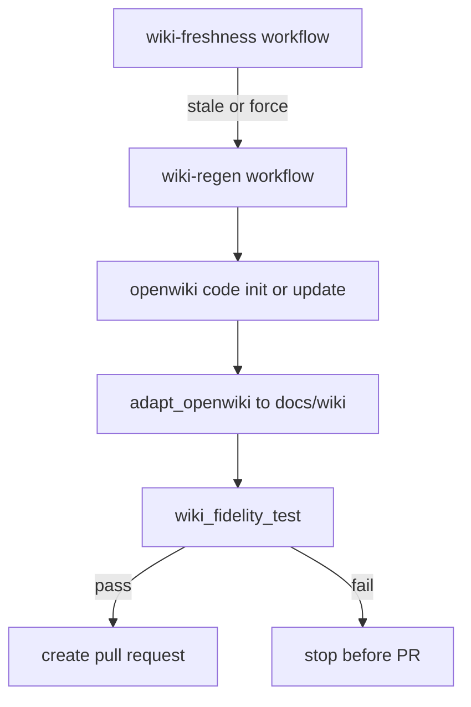

# Automation and release workflows

<!-- openwiki: broken internal link [../../.github/workflows] file "../../.github/workflows" does not exist. Fix the href or restore the target, then delete this comment. -->
Repository automation is concentrated in [`.github/workflows`](../../.github/workflows). These workflows are part of the product's operating model: they build, validate, release, deploy, provision knowledge assets, and maintain generated wiki artifacts.

## Workflow inventory

| Workflow | Purpose |
| --- | --- |
| `ci.yml` | Core pull-request and main-branch CI for backend, frontend, and infra compile checks. |
| `deploy.yml` | Gated Azure deploy of backend and frontend via azd. |
| `release.yml` | Release automation. |
| `security-gates.yml` | Scheduled or manual live access-control and red-team assurance checks. |
| `agent-evals.yml` | Hosted-agent evaluation automation. |
| `eval-cloud.yml` | Cloud eval execution workflow. |
| `provision-kb.yml` | Provisioning workflow for knowledge-base assets. |
| `wiki-freshness.yml` | Detect source drift relevant to generated wiki areas. |
| `wiki-regen.yml` | Regenerate wiki, adapt bundle, fidelity-gate it, and open a PR. |
| `openwiki-update.yml` | Repository OpenWiki automation support. |

## CI workflow

`ci.yml` has three main jobs plus an aggregate pass/fail job.

### Backend job

Runs in `apps/backend/` and includes:

- advisory `ruff` lint
- `uv sync --frozen`
- `eval.run_eval --self-test`
- `eval.test_attribution`
- `eval.docbundle_contract_test`
- `eval.prompt_contract_test`

This makes prompt contracts and docbundle schema integrity required CI behavior, not optional specialty checks.

### Frontend job

Runs in `apps/frontend/` and includes:

- `npm ci`
- `npm run typecheck`
- advisory `npm run lint`
- `npm run build`

The inline comments document that lint is intentionally advisory because it now exposes real issues rather than a misconfigured no-op.

### Infra job

Compiles `infra/main.bicep` with Bicep CLI.

### Aggregate status

`ci-ok` is the branch-protection-friendly summary job. It passes only if backend, frontend, and infra jobs all succeeded.

## Deploy workflow

`deploy.yml` handles backend and web deployment to Azure Container Apps via azd.

Important semantics:

- triggers on release publication and manual dispatch,
- uses GitHub Environment `production` for approval gating,
- requires Azure OIDC,
- installs the azd `azure.ai.agents` extension,
- runs `azd provision` idempotently,
- then deploys selected services.

The workflow comments add several practical requirements:

- hosted-agent service declarations require the extension just to parse `azure.yaml`,
- CI deployer principal type must be `ServicePrincipal`,
- `AZURE_SEARCH_LOCATION` may need overriding,
- `APP_USERS_GROUP_ID` is required for selfwiki ACL behavior after deploy.

## Security gates workflow

`security-gates.yml` runs:

- `eval.access_control_test`
- `eval.red_team_test`

It is designed to run against the **live KB** using test identities, on manual dispatch or a weekly schedule.

This is one of the strongest pieces of evidence that assurance is part of operations, not only local development.

## Wiki freshness and regeneration

The wiki automation loop is especially important because the selfwiki domain depends on generated documentation quality.

### Freshness

`wiki-freshness.yml` detects whether a source area has drifted enough to justify wiki refresh.

### Regeneration

`wiki-regen.yml` performs the full loop:

1. run freshness as a prerequisite,
2. install a pinned OpenWiki version,
3. generate or update `/openwiki`,
4. adapt output into docbundle format with `app.knowledge.adapt_openwiki`,
5. run `eval.wiki_fidelity_test` against the exact produced bundle version,
6. open a pull request with `openwiki` and `docs/wiki` changes.

The workflow comments are especially revealing here: they document prior failure modes such as using `--update` before a wiki existed or grading the wrong bundle version.



This diagram shows the guarded wiki maintenance loop.

## KB provisioning and cloud evals

Although not fully read here line by line, the workflow inventory and repository structure make `provision-kb.yml` and `eval-cloud.yml` part of the operational backbone:

- KB provisioning aligns infrastructure and ingest operations with actual grounded-domain readiness,
- cloud evals align Foundry project assurance with CI and review workflows.

## Release workflow

`release.yml` is part of the documented merge → release → gated deploy story described in the repository docs. Together with `deploy.yml`, it separates release creation from production deployment approval.

## Required variables and secrets

Across workflows, the main categories of required configuration are:

- Azure OIDC identifiers: client ID, tenant ID, subscription ID
- azd environment identifiers and region settings
- Entra application identifiers and secrets for OBO
- OpenWiki base URL, model, and API key for wiki regeneration
- test identity usernames and passwords for live security checks

The exact names are visible in each workflow file and should be treated as the source of truth.

## Change guidance

When editing operational workflows:

1. respect pinned tool versions when the workflow comments say the generator or tool is gated,
2. preserve the distinction between advisory checks and required gates unless the source rationale changes,
3. treat fidelity, freshness, and security workflows as product behavior, not docs-only automation,
4. review related backend eval scripts before changing workflow invocation arguments.

## Validation

Workflow validation is mostly source review plus targeted local command parity. Representative equivalents:

```bash
cd apps/backend && uv run python -m eval.run_eval --self-test
cd apps/backend && uv run python -m eval.docbundle_contract_test
cd apps/backend && uv run python -m eval.prompt_contract_test
cd apps/frontend && npm run typecheck && npm run build
bicep build infra/main.bicep --stdout > /dev/null
```

## Related pages

- Infrastructure deployment
- Evaluation harness
- Security and fidelity gates
- Knowledge pipeline
