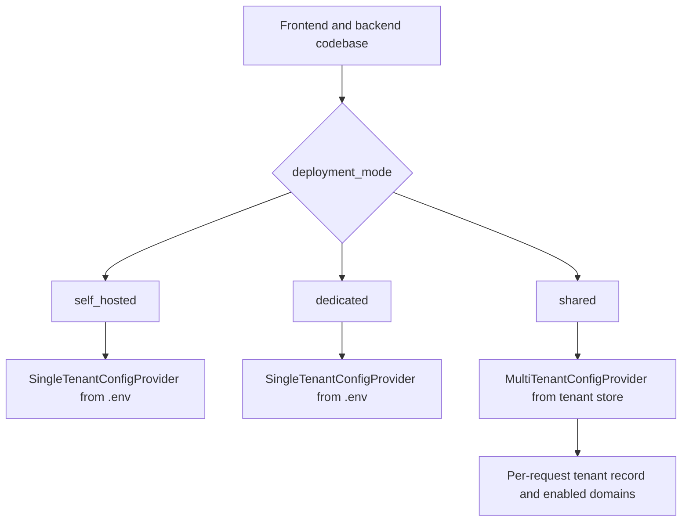
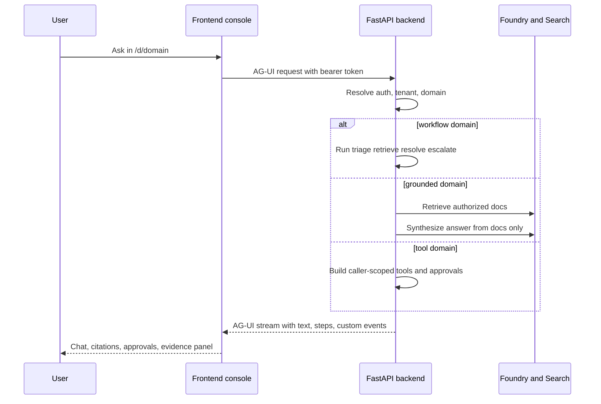

# Repository architecture

Foundry Assured is a monorepo for a multi-domain engineering concierge built on Microsoft Foundry. The repository combines:

- a **Next.js frontend** that provides the operator and end-user console,
- a **FastAPI backend** that exposes AG-UI and REST surfaces,
- several **hosted agent containers** for Foundry Agent Service deployment,
- **Bicep and azd infrastructure** that provisions the runtime,
- a **knowledge pipeline** that turns source documents and generated wiki output into grounded corpora,
- and an **assurance harness** that continuously validates grounding, access control, and fidelity.

The runtime center of gravity is the backend in `apps/backend`, but the repository is intentionally split into reusable seams so the same logical domains can run either as a live AG-UI workflow or as hosted agents.

## Major runtime surfaces

| Surface | Entry points | Purpose |
| --- | --- | --- |
| Frontend web app | `apps/frontend/app/layout.tsx`, `apps/frontend/app/d/[domain]/page.tsx`, workspace pages under `apps/frontend/app/*` | Provides the shell, auth gate, CopilotKit chat, evidence panel, admin UI, eval view, tickets view, and demo mode. |
| Backend live app | `apps/backend/app/main.py`, `apps/backend/app/domains.py`, `apps/backend/app/api/__init__.py` | Mounts AG-UI endpoints and REST APIs, resolves auth and tenancy, runs workflows, grounded retrieval, hosted bridges, admin APIs, and eval APIs. |
| Hosted agents | `apps/hosted-agent/main.py`, `apps/hosted-platform/main.py`, `apps/hosted-selfwiki/main.py`, `apps/hosted-cockpit/main.py` | Package selected domains for Foundry-hosted deployment over Responses or Invocations protocols. |
| Provisioning | `azure.yaml`, `infra/main.bicep`, `infra/resources.bicep`, `infra/containerapps.bicep` | Defines azd services and Azure resources for backend, web, hosted agents, identity, storage, and search. |
| Assurance and evaluation | `apps/backend/eval/run_eval.py`, `apps/backend/eval/assurance.yaml`, `.github/workflows/security-gates.yml`, `.github/workflows/wiki-regen.yml` | Enforces groundedness, fidelity, ACL parity, red-team limits, and wiki freshness/regeneration. |

## Domain model

The product is organized around four user-facing domains. The canonical frontend registry is [`apps/frontend/lib/domains.ts`](../../apps/frontend/lib/domains.ts); the backend twin is [`apps/backend/app/domains.py`](../../apps/backend/app/domains.py). Both registries treat domains as configuration rows rather than hard-coded pages or routers.

| Domain | Kind | Live backend path | Hosted twin | Core behavior |
| --- | --- | --- | --- | --- |
| `helpdesk` | `workflow` | `/helpdesk` | `/helpdesk-hosted` bridge to `helpdesk-concierge` | Multi-step workflow: triage, retrieve, resolve, escalate with human approval. |
| `cockpit` | `grounded` | `/cockpit` | `cockpit-expert` | Grounded Q&A over cockpit docbundles and ACL-aware retrieval. |
| `selfwiki` | `grounded` | `/selfwiki` | `selfwiki-expert` | Grounded Q&A over a generated wiki of this repository. |
| `platform` | `tool` | `/platform` | `/platform-hosted` bridge to `platform-concierge` | Tool-driven ops concierge over Microsoft MCP-connected systems with approval on writes. |

The frontend currently hides `cockpit` by commenting its row out in `domains.ts`, but the backend still defines and mounts it when configured. In addition, the legacy route `apps/frontend/app/cockpit/page.tsx` explicitly redirects to `/` so users do not land on a broken cockpit-specific page while the unified-console domain is hidden. That means cockpit remains a supported backend domain and must be treated as part of the architecture even when a specific environment does not expose it in navigation.

## Deployment modes

The repository supports three deployment modes, selected by `settings.deployment_mode` in [`apps/backend/app/core/settings.py`](../../apps/backend/app/core/settings.py) and resolved through the tenant provider seam in [`apps/backend/app/core/tenant.py`](../../apps/backend/app/core/tenant.py).

This diagram shows the configuration seam that changes across deployment modes.

- **`self_hosted`**: single-tenant deployment, customer-operated, current default. The backend uses `SingleTenantConfigProvider`, and route dependencies are just auth checks.
- **`dedicated`**: single-tenant customer-cloud deployment operated through managed application packaging and Lighthouse delegation. Runtime code still uses `SingleTenantConfigProvider`; the main difference is packaging and operational control. See Dedicated mode infrastructure.
- **`shared`**: multi-tenant SaaS mode. The backend switches to `MultiTenantConfigProvider`, resolves tenant state from the caller token, and adds per-tenant domain entitlement gates with `require_domain(domain_id)`.

## Live versus hosted execution paths

The same logical domain may be consumed in two different ways.

### Live path

The live path is the richest experience:

- frontend sends chat traffic through CopilotKit to backend AG-UI endpoints,
- backend runs workflows or grounded/tool logic directly,
- workflow domains emit intermediate steps and approval interrupts,
- grounded domains emit structured citations through AG-UI custom events,
- auth uses the signed-in user's bearer token and OBO where required.

This diagram shows the live AG-UI request path used by the frontend console.

### Hosted path

Hosted paths package selected domains into dedicated containers and then bridge them back into the frontend. These are intentionally narrower:

- the helpdesk, selfwiki, and cockpit hosted agents use **Responses** protocol containers,
- the platform hosted agent targets **Invocations** protocol because write approval needs AG-UI-compatible interrupts,
- hosted helpdesk drops live OBO, per-user memory, and HITL workflow mechanics because its container is a single-identity request-response runtime.

The frontend exposes hosted usage through the live/hosted toggle in the generic console, and the backend bridges hosted responses back into AG-UI SSE so the same CopilotKit UI can render both modes.

See Hosted agents overview and domain-specific hosted pages for the exact tradeoffs.

## Repository subsystems

### Frontend

The frontend is a client-rendered Next.js App Router application. Its most important structure is:

- `app/layout.tsx` sets global metadata and providers,
- `components/shell/Providers.tsx` installs the app-wide MSAL gate,
- `components/shell/AppShell.tsx` builds the sidebar, workspace nav, agent nav, account chip, and backend health probe,
- `components/console/AssuranceConsole.tsx` hosts the generic domain console used for every `/d/[domain]` route.

See Frontend application overview.

### Backend

The backend owns nearly all domain behavior and exposes both AG-UI and REST surfaces. Its internal package split is meaningful:

- `app/main.py` is the composition root,
- `app/domains.py` mounts domain endpoints,
- `app/core/*` handles auth, settings, tenant resolution, onboarding, and tenant store access,
- `app/workflow/*` defines the live helpdesk workflow,
- `app/services/*` contains grounded synthesis, retrieval, hosted bridges, Graph integrations, and Foundry eval listing,
- `app/knowledge/*` turns corpora and generated wiki output into grounded assets,
- `app/api/*` exposes routers for health, hosted bridges, evals, tickets, admin, me, and tenant management.

See Backend application overview.

### Hosted agents

Each hosted agent is intentionally self-contained because it runs in a Foundry-hosted container, not inside the FastAPI process. Shared patterns include:

- environment-driven config via `agent.yaml`,
- `DefaultAzureCredential` for platform-injected identity,
- `FoundryChatClient` for model access,
- `ResponsesHostServer` or `InvocationsHostServer` to expose the hosted protocol.

See Hosted agents overview.

### Infrastructure and operations

`azure.yaml` declares azd services for backend, web, and all hosted agents. The Bicep modules provision the shared Azure estate, while GitHub Actions implement CI, deploy, release, KB provisioning, wiki regeneration, and assurance loops.

See Infrastructure deployment and Automation and release.

## Cross-system invariants

Several repository-wide invariants recur across systems:

1. **Domains are config-driven**. Frontend and backend registries are expected to stay aligned; adding a domain means adding one registry row and one backend implementation seam, not a new page family or one-off route.
2. **Grounded domains answer only from retrieved documents**. `apps/backend/app/services/grounded.py` constructs synthesis input entirely from retrieved snippets, and retrieval is ACL-aware where domains declare `acl_group_map`.
3. **Shared mode is enforced through data, not special-case business logic**. The tenant record controls data-plane pointers and enabled domains; runtime code calls `tenant_config()` and `require_domain()` instead of branching everywhere.
4. **Hosted twins are not always feature-equivalent**. The architecture deliberately documents what is dropped in hosted mode rather than implying full parity.
5. **Assurance gates are part of the product**. Evaluation, fidelity, and security tests are not optional extras; CI and operational workflows treat them as deployment and regeneration gates.

## Where to go next

- For backend package ownership and route composition, read Backend application overview.
- For auth, OBO, and multi-tenant mode, read Backend auth and tenancy.
- For AG-UI and frontend runtime behavior, read Frontend domain console.
- For infrastructure packaging, read Infrastructure deployment.
- For assurance and repository automation, read Evaluation harness and Automation and release.
