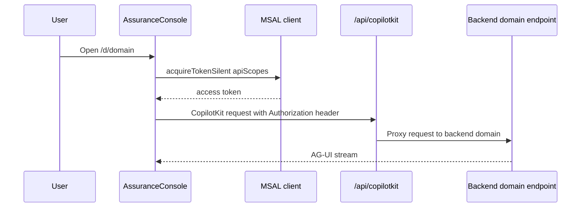

# Domain console

The generic domain console is implemented in [`apps/frontend/components/console/AssuranceConsole.tsx`](../../apps/frontend/components/console/AssuranceConsole.tsx). It is the main UI for all chat-based domains and is rendered by `/d/[domain]`.

Its purpose is to keep domain-specific behavior data-driven while preserving one coherent runtime shell.

## Domain resolution

`app/d/[domain]/page.tsx` extracts the route parameter and passes it into `AssuranceConsole`. The console resolves the row with `getDomain(domainId)` from `lib/domains.ts`.

If no domain is found, it renders a simple not-found state instead of mounting CopilotKit against an invalid agent ID.

## Main structure

The console has two panes:

- **main pane**: chat, prompts, workflow widgets, mode toggle
- **evidence pane**: sources and assurance guarantees

This layout is implemented inside a `CopilotKitProvider`.

## CopilotKit runtime wiring

`Console` in `AssuranceConsole.tsx` configures:

- `runtimeUrl="/api/copilotkit"`
- optional `headers={ Authorization: ... }`
- `showDevConsole` in non-production

`activeAgentId` is selected from:

- live mode: `domain.id`
- hosted mode: `domain.hostedAgentId` when present

That is how the same UI component can talk either to the live backend domain or to the hosted bridge.

## Auth token flow inside the console

When `authConfigured` is true, `AssuranceConsole` renders `AuthedConsole`.

`AuthedConsole`:

- uses MSAL hooks to access the current account,
- acquires a token silently for `apiScopes`,
- falls back to redirect-based acquisition when silent flow fails,
- refreshes periodically before token expiry,
- passes `Authorization: Bearer ...` into `CopilotKitProvider`.

This is important because the backend depends on the incoming user token for OBO and shared-mode tenant resolution.



This diagram shows the frontend-side token acquisition and runtime proxy path.

## Workflow widgets

The console conditionally renders workflow-specific widgets only for `domain.kind === "workflow"`:

- `WorkflowSteps`
- `TicketApproval`

That means `helpdesk` gets step streaming and approval UI, while grounded and tool-driven domains render a simpler chat layout.

## Suggested prompts

`SuggestedPrompts` receives the entire `domain` row and shows starter chips derived from `domain.suggested`.

Because prompts come from the registry, adding or changing a domain prompt set does not require UI component rewrites.

## Live versus hosted toggle

If a domain declares `hostedAgentId`, the console renders a segmented `Live` / `Hosted` switch.

Current domains with hosted IDs in `domains.ts`:

- `helpdesk`
- `platform`

The label text explains the tradeoff:

- live: AG-UI with steps and write approval
- hosted: Foundry Agent Service managed hosted agent

This toggle is registry-driven, so any future domain that gains a hosted twin gets the toggle automatically.

## Evidence panel

The right-side evidence pane is implemented in [`apps/frontend/components/console/EvidencePanel.tsx`](../../apps/frontend/components/console/EvidencePanel.tsx).

### Structured citation contract

It subscribes to the active agent and listens for:

- `RUN_STARTED` to clear old citations,
- `CUSTOM` events named `sources` to load structured citations.

Those `sources` events are emitted by the backend grounded stream. Each citation can contain:

- `index`
- `source`
- `url`
- `content`

When present, the evidence panel renders numbered citations with expandable inline content.

### Fallback heuristic

If structured citations are unavailable, the component falls back to parsing the last assistant message for likely file names or component names. This is intentionally weaker and only exists so older or non-grounded paths still show some evidence-like context.

### Guarantees section

The evidence panel also renders three static guarantee statements:

- fidelity
- access
- evaluation

These echo the product story from the landing page and keep the assurance framing visible during domain interaction.

## Mermaid zoom support

`MermaidZoom` is mounted below `CopilotChat` so Mermaid diagrams emitted in answers can be viewed comfortably. This is especially relevant for selfwiki and cockpit answers that may include architecture diagrams.

## UX invariants

1. **One route renders all domains**. The console should stay generic unless the source shows a true domain-specific seam.
2. **Hosted mode is opt-in by registry row**. The UI should not guess hosted availability.
3. **Workflow widgets are kind-driven**. `workflow` kind, not domain name, determines whether they render.
4. **Evidence prefers structured citations**. If backend citation format changes, update this contract rather than relying on the heuristic fallback.

## Validation

From `apps/frontend/`:

```bash
npm run lint
npm run typecheck
```

Then run the app locally and verify:

- `/d/helpdesk` shows steps and approval widgets,
- `/d/selfwiki` shows evidence citations from backend `sources` events,
- domains with `hostedAgentId` show the mode toggle.

## Related pages

- Frontend application overview
- Backend grounded domains
- Helpdesk workflow
- Hosted agents overview
