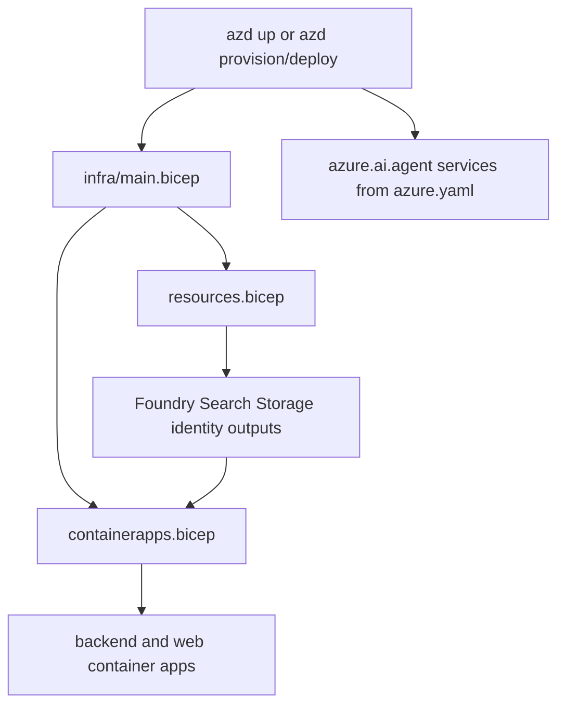

# Infrastructure deployment

Infrastructure is declared through:

- [`azure.yaml`](../../azure.yaml)
- [`infra/main.bicep`](../../infra/main.bicep)
- [`infra/resources.bicep`](../../infra/resources.bicep)
- [`infra/containerapps.bicep`](../../infra/containerapps.bicep)

This is the main deployment path for the default self-hosted experience and the base topology reused by other packaging modes.

## azd service inventory

`azure.yaml` declares six services:

| Service | Project | Host |
| --- | --- | --- |
| `backend` | `apps/backend` | `containerapp` |
| `cockpit-expert` | `apps/hosted-cockpit` | `azure.ai.agent` |
| `helpdesk-concierge` | `apps/hosted-agent` | `azure.ai.agent` |
| `platform-concierge` | `apps/hosted-platform` | `azure.ai.agent` |
| `selfwiki-expert` | `apps/hosted-selfwiki` | `azure.ai.agent` |
| `web` | `apps/frontend` | `containerapp` |

Important implications:

- the repository deploys both the live web/backend stack and hosted agents from one azd project,
- hosted-agent service declarations require the azd `azure.ai.agents` extension to parse and deploy,
- `web` passes Next public Entra settings as Docker build args.

## Bicep root module

`infra/main.bicep` is subscription-scoped.

Responsibilities:

- create `rg-${environmentName}`
- compose `resources.bicep` at resource-group scope
- compose `containerapps.bicep` at resource-group scope
- surface outputs back into the azd environment

The root parameters include deployment identity, Search region override, OBO Entra settings, and app-users group ID.

## Resource composition

### `resources.bicep`

This module provisions the shared Azure estate used by the app. Source-backed responsibilities include:

- Foundry account and project with system-assigned identities,
- chat and embedding model deployments,
- Azure Search with system-assigned identity and AAD-or-API-key auth challenge mode,
- Storage with private blobs and Azure Files shares,
- Container Registry,
- shared user-assigned `appIdentity` for the web and backend runtime,
- data-plane role assignments that remove the need for secret keys.

Concrete role assignment resources and roles include:

- `appToRegistry`: `AcrPull` for `appIdentity` on the registry,
- `appToFoundry`: `Azure AI User` for `appIdentity` on the Foundry account,
- `appToSearch`: `Search Index Data Reader` for `appIdentity` on the Search service,
- `searchToFoundry`: `Cognitive Services User` for the Search service identity on the Foundry account,
- `projectToFoundry`: `Azure AI User` for the Foundry project identity on the Foundry account,
- `projectToRegistry`: `AcrPull` for the Foundry project identity on the registry,
- `searchToStorage`: `Storage Blob Data Reader` for the Search identity on Storage.

The module also defines caller- and user-facing roles through parameters such as `principalId`, `ciPrincipalId`, and `appUsersGroupId`, so deployers, CI, and end users can access the data plane without embedded keys.

Concrete resource settings that matter to runtime behavior include:

- Foundry account `kind: 'AIServices'`, `allowProjectManagement: true`, and `publicNetworkAccess: 'Enabled'`,
- Search `authOptions.aadOrApiKey.aadAuthFailureMode = 'http401WithBearerChallenge'`, enabling AAD challenge behavior for retrieval,
- Storage `allowBlobPublicAccess: false`, which is why evidence snippets are shown inline instead of relying on open blob URLs,
- Azure Files shares `assured-data` and `assured-prompts`, later mounted by the backend container app.

### `containerapps.bicep`

This module deploys:

- backend container app,
- web container app,
- environment wiring for the apps to consume outputs from `resources.bicep`.

`main.bicep` passes values such as:

- Foundry project endpoint and model,
- Search endpoint and KB name,
- Storage account and shares,
- app identity IDs,
- Entra OBO settings,
- app-users group ID.

The concrete runtime wiring in `containerapps.bicep` is important:

- both apps attach the shared user-assigned `appIdentity`,
- backend mounts Azure Files `data` read-write at `/app/data` so `tickets.jsonl` persists across restarts and scale-to-zero,
- backend mounts Azure Files `prompts` read-only at `/mnt/agents` for runtime agent-definition overrides,
- backend env vars include `FOUNDRY_PROJECT_ENDPOINT`, `FOUNDRY_MODEL`, `AZURE_SEARCH_ENDPOINT`, `AZURE_SEARCH_KNOWLEDGE_BASE`, `SELFWIKI_SEARCH_KNOWLEDGE_BASE`, `MCP_ENABLED`, `FRONTEND_ORIGIN`, `AZURE_CLIENT_ID`, `ENTRA_*`, `APP_USERS_GROUP_ID`, and `AGENTS_DIR`,
- web env vars include `BACKEND_URL`, `AGUI_URL`, `HOSTED_AGUI_URL`, and `COCKPIT_AGUI_URL` so server-side route handlers know the backend targets,
- backend scale is `minReplicas: 0, maxReplicas: 1` because append-based JSONL persistence is not safe with concurrent writers,
- web may scale beyond one replica because it does not own that append-based persistence assumption.

This explicit single-replica backend setting is why persisted ticket writes and mounted-file prompt overrides remain coherent.

## Output contract

`main.bicep` publishes a large set of outputs into `.azure/<env>/.env` through azd. These outputs are part of the runtime contract because backend scripts and apps consume them later.

Key outputs include:

- `BACKEND_URL`
- `WEB_URL`
- `FOUNDRY_PROJECT_ENDPOINT`
- `AZURE_AI_PROJECT_ID`
- `AZURE_AI_ACCOUNT_ID`
- `AZURE_SEARCH_ID`
- `FOUNDRY_MODEL`
- `FOUNDRY_EMBEDDING_MODEL`
- `AZURE_AI_ACCOUNT_ENDPOINT`
- `AZURE_AI_OPENAI_ENDPOINT`
- `AZURE_SEARCH_ENDPOINT`
- `AZURE_SEARCH_KNOWLEDGE_BASE`
- `AZURE_STORAGE_ACCOUNT`
- `AZURE_STORAGE_RESOURCE_ID`
- `AZURE_STORAGE_CONTAINER`
- `AZURE_PROMPTS_FILE_SHARE`
- ACR endpoint and name

These outputs are later used for app bootstrapping, KB provisioning, and post-deploy steps.



This diagram shows how azd combines Bicep resource provisioning with service deployment declarations.

## Hooks

`azure.yaml` defines two hooks:

- `postprovision`: `./scripts/hook-postprovision.sh`
- `postdeploy`: `./scripts/hook-postdeploy.sh`

Both use `continueOnError: true`, so they are important operational helpers but not hard deployment blockers.

Their responsibilities are concrete and important:

- `hook-postprovision.sh` pushes local `NEXT_PUBLIC_*` and `ENTRA_*` auth settings into the azd environment before image build, because the web image bakes browser-visible sign-in config at build time.
- `hook-postdeploy.sh` reconciles runtime RBAC for each hosted agent's newly created instance identity and then patches the SPA app registration to add the deployed `WEB_URL` as a redirect URI after the final FQDN exists.

### Hosted-agent postdeploy RBAC reconciliation sequence

`hook-postdeploy.sh` performs a hosted-agent-specific sequence after deployment:

1. read `AZURE_AI_ACCOUNT_ID` and `AZURE_SEARCH_ID` from the azd environment, with backward-compatible fallback derivation,
2. iterate the hosted agent names `helpdesk-concierge`, `cockpit-expert`, `selfwiki-expert`, and `platform-concierge`,
3. query each deployed agent through `azd ai agent show` to extract its fresh `instance_identity.principal_id`,
4. assign `Azure AI User` on the Foundry account scope to that instance identity,
5. assign `Search Index Data Reader` on the Search scope as well.

That sequence exists because the hosted agent instance identities do not exist until deploy time, so Bicep cannot pre-wire those assignments.

## Key deployment details from workflows

The GitHub deploy workflow adds a few important facts about infrastructure deployment:

- azd must install the `azure.ai.agents` extension before parsing hosted services,
- CI deploys set `AZURE_PRINCIPAL_TYPE=ServicePrincipal` so ARM role assignments match the actual deployer identity,
- `AZURE_SEARCH_LOCATION` may need to differ from the primary environment location due to capacity constraints,
- `APP_USERS_GROUP_ID` must be set for selfwiki ACL behavior in deployed environments.

If `APP_USERS_GROUP_ID` is empty, backend env wiring and domain construction leave selfwiki fail-closed: the retrieval ACL header is not sent for `/selfwiki`, so authorized document retrieval reduces to zero docs instead of becoming public.

These are practical deployment invariants, not optional notes.

## Relationship to other deployment modes

- **self_hosted** uses this topology directly.
- **shared** reuses most runtime infrastructure concepts but changes the backend control-plane behavior through shared-mode auth and tenant storage.
- **dedicated** reuses the same underlying modules but packages them differently through Managed Application and Lighthouse. See Dedicated mode infrastructure.

## Validation

Compile-level validation from the repo root:

```bash
bicep build infra/main.bicep --stdout > /dev/null
```

Operational validation:

```bash
azd up
```

Or in split form:

```bash
azd provision
azd deploy backend
azd deploy web
```

## Related pages

- Dedicated mode infrastructure
- Infrastructure identity and access
- Automation and release
