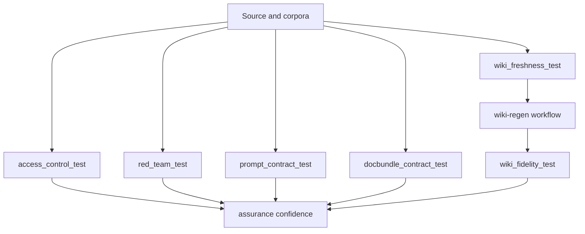

# Security and fidelity gates

The repository's assurance story depends on several hard gates that protect different failure modes. These gates are implemented mostly in `apps/backend/eval/` and orchestrated further by CI and automation workflows.

## Gate families

### Access-control gate

Main test:

- `apps/backend/eval/access_control_test.py`

Purpose:

- prove no cross-group leak in retrieval and answer behavior,
- validate that document-level access follows the source ACL model.

This is reinforced by related tests such as `retrieval_acl_parity_test.py` and `cockpit_acl_stamp_test.py`.

### Red-team gate

Main test:

- `apps/backend/eval/red_team_test.py`

Purpose:

- probe prompt-injection and exfiltration attacks against the same trimmed retrieval path,
- enforce an attack success-rate ceiling from `assurance.yaml`.

This is the repository's explicit defense-in-depth check that source-following access is robust against hostile prompts.

### Prompt contract gate

Main test:

- `apps/backend/eval/prompt_contract_test.py`

Purpose:

- lock down declarative prompt invariants after the AgentSchema migration,
- verify sentinel outputs and behavior guarantees such as citation duties and write-action discipline.

This protects the prompt layer from semantically dangerous edits that would not show up in pure syntax validation.

### Docbundle contract gate

Main test:

- `apps/backend/eval/docbundle_contract_test.py`

Purpose:

- prevent producer-consumer schema drift,
- ensure every manifest field the repository reads or writes exists in the vendored schema.

This exists because the format reportedly forked once in the past.

### Wiki fidelity gate

Main test:

- `apps/backend/eval/wiki_fidelity_test.py`

Purpose:

- verify generated wiki claims cite real files strongly enough to pass `build.fidelity_min`.

This is the main gate used by the wiki regeneration automation before opening a pull request.

### Wiki freshness gate

Main test or workflow input:

- `apps/backend/eval/wiki_freshness_test.py`
- `.github/workflows/wiki-freshness.yml`

Purpose:

- detect drift between source changes and the generated wiki areas,
- decide when regeneration is needed.

## How the gates connect



This diagram shows how security and fidelity gates reinforce one another across source, wiki generation, and runtime behavior.

## Operational workflows using these gates

- `ci.yml` runs self-test, attribution, docbundle contract, and prompt contract checks.
- `security-gates.yml` runs access-control and red-team checks against live KB state on a schedule or manual dispatch.
- `wiki-regen.yml` uses the fidelity gate after generating and adapting new wiki output.
- `wiki-freshness.yml` decides when the regen workflow should matter.

## Why these gates matter together

Each gate protects a different class of risk:

- **ACL and red-team**: security leak risk
- **prompt contracts**: behavioral drift risk
- **docbundle contract**: upstream format divergence risk
- **wiki fidelity**: generated-knowledge hallucination risk
- **wiki freshness**: stale-knowledge risk

Together they make the assurance mechanism measurable instead of purely narrative.

## Validation

From `apps/backend/`:

```bash
uv run pytest eval/access_control_test.py eval/red_team_test.py eval/prompt_contract_test.py eval/docbundle_contract_test.py eval/wiki_fidelity_test.py eval/wiki_freshness_test.py
```

## Related pages

- Evaluation harness
- Retrieval and ACL
- Knowledge pipeline
- Automation and release
