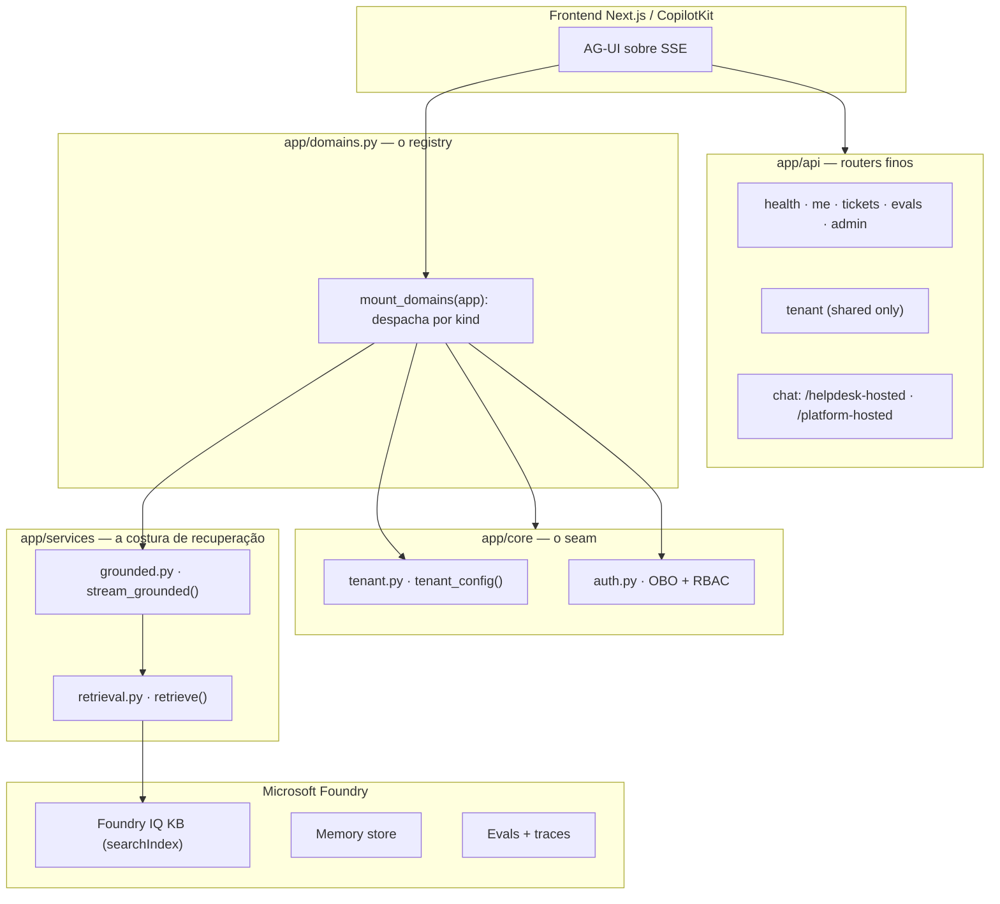

# Visão Geral do Backend (SaaS Híbrido + Arquétipo Grounded Unificado)

## Por que este backend existe

O backend é um concierge de suporte de engenharia construído sobre o **Microsoft Foundry** e o **Microsoft Agent Framework**, exposto ao frontend via **AG-UI sobre SSE**. Ele tria a intenção do desenvolvedor, busca em bases de conhecimento (Foundry IQ), redige respostas fundamentadas com citações, decide se precisa de uma ação humana (abrir ticket) e lembra preferências entre sessões — tudo avaliado e rastreável.

**Fato (lido no código):** o entrypoint declara `FastAPI(title="Foundry Assured", version="0.1.0", ...)` e roda como `app.main:app` ([apps/backend/app/main.py:35](https://github.com/ruinosus/foundry-assured/blob/3333d60d0e9c02b64a532f2c9bad94692cf50075/apps/backend/app/main.py#L35)). O `pyproject.toml` declara o pacote como `name = "foundry-helpdesk-backend"`, `version = "0.1.0"` ([apps/backend/pyproject.toml:2-4](https://github.com/ruinosus/foundry-assured/blob/3333d60d0e9c02b64a532f2c9bad94692cf50075/apps/backend/pyproject.toml#L2-L4)); este bundle de wiki é **v0.3.0** por refletir a evolução da arquitetura, não a versão do pacote Python.

## O que mudou desde a v0.2.0

A v0.2.0 já descrevia o seam SaaS (A→B→C→D) e os quatro domínios. A **v0.3.0 é uma refatoração de unificação**: o caminho grounded que era um fork (ACL vs MCP-bridge, com hosted twins) colapsou num **único arquétipo** sobre uma **única costura de recuperação — `retrieve()`** — e o wiring dos endpoints saiu do split `main.py` / `chat.py` para um **registry de domínios + `mount_domains`**.

| Mudança (v0.3.0) | Antes (v0.2.0) | Depois | Fonte |
|---|---|---|---|
| **Costura de recuperação única** | providers por-agente (`Secure`/`Grounded` AzureAISearchProvider) | um `retrieve()` — retrieve nativo + header ACL sobre KB **searchIndex** | [apps/backend/app/services/retrieval.py:48-76](https://github.com/ruinosus/foundry-assured/blob/3333d60d0e9c02b64a532f2c9bad94692cf50075/apps/backend/app/services/retrieval.py#L48-L76) |
| **Um arquétipo grounded** | fork acl/MCP-bridge | `stream_grounded()` — 4 estações, um caminho | [apps/backend/app/services/grounded.py:1-18](https://github.com/ruinosus/foundry-assured/blob/3333d60d0e9c02b64a532f2c9bad94692cf50075/apps/backend/app/services/grounded.py#L1-L18) |
| **Registry + `mount_domains`** | split `main.py` (adapter) + `api/chat.py` (routers) | `DomainSpec` + um loop que despacha por `kind` | [apps/backend/app/domains.py:164-173](https://github.com/ruinosus/foundry-assured/blob/3333d60d0e9c02b64a532f2c9bad94692cf50075/apps/backend/app/domains.py#L164-L173) |
| **Hosted twins grounded removidos** | `/cockpit-hosted`, `/selfwiki-hosted` | grounded roda **live-OBO**; só `/helpdesk-hosted` + `/platform-hosted` restam | [apps/backend/app/api/chat.py:12-34](https://github.com/ruinosus/foundry-assured/blob/3333d60d0e9c02b64a532f2c9bad94692cf50075/apps/backend/app/api/chat.py#L12-L34) |
| **Eval sobre o `retrieve()` de produção** | eval sobre os agent builders | golden harness escora o caminho `retrieve()` real | [apps/backend/eval/run_eval.py:89-124](https://github.com/ruinosus/foundry-assured/blob/3333d60d0e9c02b64a532f2c9bad94692cf50075/apps/backend/eval/run_eval.py#L89-L124) |
| **Snippet de citação no path nativo** | join `id`↔`response` (nunca disparava) | `references[].sourceData.snippet` (content-on-click) | [apps/backend/app/services/retrieval.py:208-242](https://github.com/ruinosus/foundry-assured/blob/3333d60d0e9c02b64a532f2c9bad94692cf50075/apps/backend/app/services/retrieval.py#L208-L242) |

O detalhe do `retrieve()` (as duas identidades, o header `x-ms-query-source-authorization`, a decodificação do `docKey`) está em [Conhecimento, ACL e o retrieve() Unificado](./page-7.md).

## Mapa de camadas (big picture)



<!-- Sources: apps/backend/app/main.py:44-49, apps/backend/app/domains.py:164-173, apps/backend/app/services/grounded.py:76-115 -->

## Os quatro domínios de agente

`DOMAIN_IDS` enumera explicitamente os domínios registrados ([apps/backend/app/core/tenant.py:207](https://github.com/ruinosus/foundry-assured/blob/3333d60d0e9c02b64a532f2c9bad94692cf50075/apps/backend/app/core/tenant.py#L207)):

```python
DOMAIN_IDS: tuple[str, ...] = ("helpdesk", "cockpit", "selfwiki", "platform")
```

O backend agora tem um **registry gêmeo do frontend** (`apps/frontend/lib/domains.ts`): cada domínio é uma linha `DomainSpec` com um `kind`, e `mount_domains` monta o endpoint certo por kind ([apps/backend/app/domains.py:63-96](https://github.com/ruinosus/foundry-assured/blob/3333d60d0e9c02b64a532f2c9bad94692cf50075/apps/backend/app/domains.py#L63-L96)):

| Domínio | `kind` | Endpoint | Como é montado | Fonte |
|---|---|---|---|---|
| `helpdesk` | `workflow` | `/helpdesk` | `add_agent_framework_fastapi_endpoint` (workflow-as-agent) | [apps/backend/app/domains.py:129-146](https://github.com/ruinosus/foundry-assured/blob/3333d60d0e9c02b64a532f2c9bad94692cf50075/apps/backend/app/domains.py#L129-L146) |
| `cockpit` | `grounded` | `/cockpit` | `POST` → `stream_grounded` (ACL trim) | [apps/backend/app/domains.py:108-126](https://github.com/ruinosus/foundry-assured/blob/3333d60d0e9c02b64a532f2c9bad94692cf50075/apps/backend/app/domains.py#L108-L126) |
| `selfwiki` | `grounded` | `/selfwiki` | `POST` → `stream_grounded` (single-audience) | [apps/backend/app/domains.py:85-94](https://github.com/ruinosus/foundry-assured/blob/3333d60d0e9c02b64a532f2c9bad94692cf50075/apps/backend/app/domains.py#L85-L94) |
| `platform` | `tool` | `/platform` | adapter + `platform_agent_proxy` (MCP) | [apps/backend/app/domains.py:149-161](https://github.com/ruinosus/foundry-assured/blob/3333d60d0e9c02b64a532f2c9bad94692cf50075/apps/backend/app/domains.py#L149-L161) |

O quarto domínio (`platform`) é o único **tool-driven** — ver [O Quarto Domínio: Platform e Integração MCP](./page-6.md). Os dois grounded (`cockpit`/`selfwiki`) compartilham o mesmo `stream_grounded` + `retrieve()`, diferindo só nos dados (KB, instructions, presença de `acl_group_map`).

## Stack e dependências

| Dependência | Papel | Fonte |
|---|---|---|
| `agent-framework>=1.9.0` | agentes + `WorkflowBuilder` | [apps/backend/pyproject.toml:8](https://github.com/ruinosus/foundry-assured/blob/3333d60d0e9c02b64a532f2c9bad94692cf50075/apps/backend/pyproject.toml#L8) |
| `agent-framework-ag-ui>=1.0.0rc5` | adapter AG-UI | [apps/backend/pyproject.toml:9](https://github.com/ruinosus/foundry-assured/blob/3333d60d0e9c02b64a532f2c9bad94692cf50075/apps/backend/pyproject.toml#L9) |
| `azure-ai-projects>=2.2.0` | cliente Foundry (síntese Responses, memory, eval) | [apps/backend/pyproject.toml:10](https://github.com/ruinosus/foundry-assured/blob/3333d60d0e9c02b64a532f2c9bad94692cf50075/apps/backend/pyproject.toml#L10) |
| `azure-search-documents>=11.7.0b2` | ingestão da KB (knowledge source/base) | [apps/backend/pyproject.toml:11](https://github.com/ruinosus/foundry-assured/blob/3333d60d0e9c02b64a532f2c9bad94692cf50075/apps/backend/pyproject.toml#L11) |
| `fastapi-azure-auth>=5.2.0` | validação de JWT Entra (Single/Multi) | [apps/backend/pyproject.toml:14](https://github.com/ruinosus/foundry-assured/blob/3333d60d0e9c02b64a532f2c9bad94692cf50075/apps/backend/pyproject.toml#L14) |
| `azure-data-tables>=12.7.0` | tenant store (Table Storage) | [apps/backend/pyproject.toml:20](https://github.com/ruinosus/foundry-assured/blob/3333d60d0e9c02b64a532f2c9bad94692cf50075/apps/backend/pyproject.toml#L20) |
| `httpx>=0.28.1` | POST direto ao KB `retrieve` + passthrough hosted | [apps/backend/pyproject.toml:21](https://github.com/ruinosus/foundry-assured/blob/3333d60d0e9c02b64a532f2c9bad94692cf50075/apps/backend/pyproject.toml#L21) |

## Regra inegociável: auth sempre via credencial Azure

Não há API key hardcoded. No caminho grounded, a **síntese** (Responses API) roda **On-Behalf-Of** do usuário assinado, e o `retrieve()` usa a identidade do app (managed identity) como credencial de serviço **mais** o token de busca do usuário no header ACL ([apps/backend/app/services/grounded.py:58-73](https://github.com/ruinosus/foundry-assured/blob/3333d60d0e9c02b64a532f2c9bad94692cf50075/apps/backend/app/services/grounded.py#L58-L73), [apps/backend/app/services/retrieval.py:60-70](https://github.com/ruinosus/foundry-assured/blob/3333d60d0e9c02b64a532f2c9bad94692cf50075/apps/backend/app/services/retrieval.py#L60-L70)). Quando o Entra está off, cai para `DefaultAzureCredential`. Ver [Autenticação, OBO e RBAC](./page-3.md).

## Inconsistências observadas no código (a wiki relata as suas próprias)

- **`title="Foundry Assured"` vs pacote `foundry-helpdesk-backend`:** o app FastAPI mantém o título/histórico "Foundry Assured" ([apps/backend/app/main.py:35](https://github.com/ruinosus/foundry-assured/blob/3333d60d0e9c02b64a532f2c9bad94692cf50075/apps/backend/app/main.py#L35)) enquanto o pacote se chama `foundry-helpdesk-backend` ([apps/backend/pyproject.toml:2](https://github.com/ruinosus/foundry-assured/blob/3333d60d0e9c02b64a532f2c9bad94692cf50075/apps/backend/pyproject.toml#L2)). Cosmético, mas um mismatch de nome real.
- **`cockpit.py`/`selfwiki.py` viraram vestigiais:** ambos só carregam um `*_configured()` que checa o campo **legado** (`cockpit_search_knowledge_base`) e cujas docstrings ainda descrevem o antigo `AzureAISearchContextProvider` — mas o path grounded de produção agora é `stream_grounded` + `retrieve()`, e `mount_domains` **não** chama esses helpers. Ver [Domínios de Agente](./page-5.md#os-arquivos-vestigiais-cockpit-py-selfwiki-py).

## Related Pages

| Página | Relação |
|------|-------------|
| [Modos de Implantação e o Seam de Tenant](./page-2.md) | O seam `DEPLOYMENT_MODE` que esta visão introduz |
| [Autenticação, OBO e RBAC](./page-3.md) | Como a identidade do usuário/tenant chega ao core |
| [Registry de Domínios e mount_domains](./page-4.md) | Como os domínios são montados no FastAPI |
| [Domínios de Agente e Workflow](./page-5.md) | Detalhe dos grounded + workflow |
| [Conhecimento, ACL e o retrieve() Unificado](./page-7.md) | A costura de recuperação nova |
