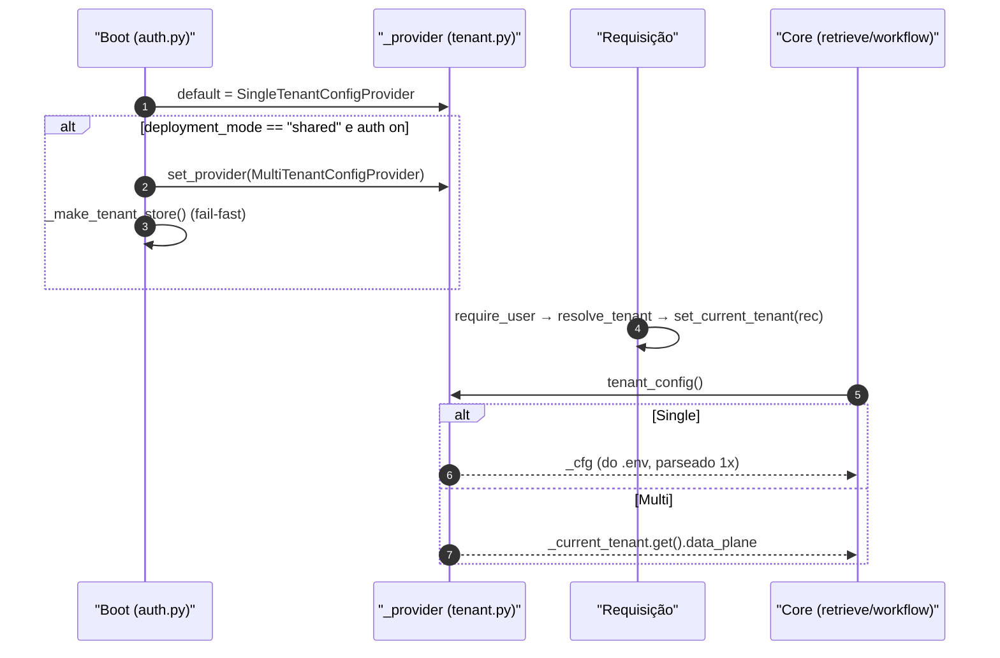
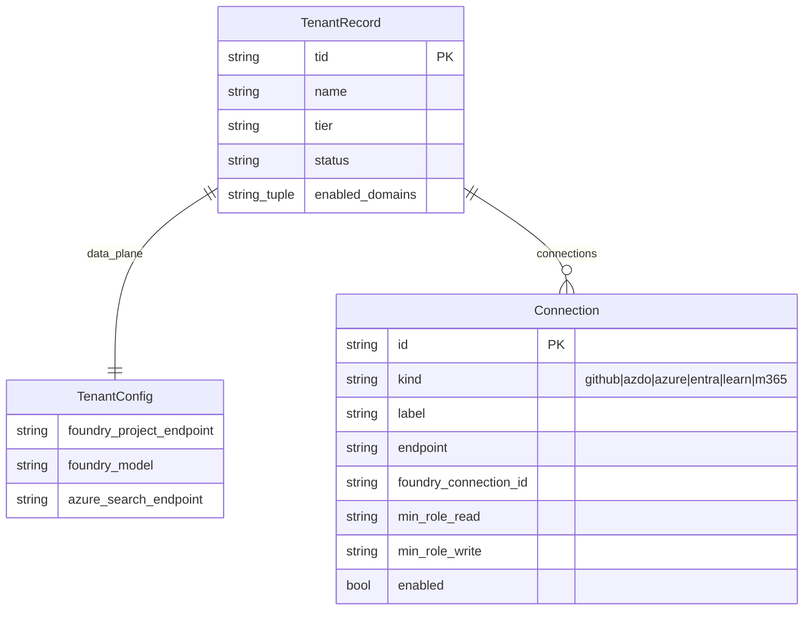

# Modos de Implantação e o Seam de Tenant

## Por que existe um seam

A passagem de single-tenant para SaaS poderia ter contaminado todo o core com `if multi_tenant:`. Em vez disso, o backend isola **toda** a variação por tenant atrás de uma única função — `tenant_config()` — e troca a implementação dela no boot. A docstring do módulo é explícita: *"o core (agentes, workflow) só chama `tenant_config()`; ele nunca conhece o modo"* ([apps/backend/app/core/tenant.py:1-6](https://github.com/ruinosus/foundry-assured/blob/3333d60d0e9c02b64a532f2c9bad94692cf50075/apps/backend/app/core/tenant.py#L1-L6)). Isso vale igualmente para a nova costura `retrieve()`, que lê os KBs/índices do tenant via `tenant_config()` no registry ([apps/backend/app/domains.py:63-96](https://github.com/ruinosus/foundry-assured/blob/3333d60d0e9c02b64a532f2c9bad94692cf50075/apps/backend/app/domains.py#L63-L96)).

## Os três modos

| Modo (`deployment_mode`) | Tenancy | Config de tenant | Auth | Fonte |
|---|---|---|---|---|
| `self_hosted` (default) | Único, do cliente | `.env` estático (`SingleTenantConfigProvider`) | SingleTenant Entra ou off | [apps/backend/app/core/settings.py:17](https://github.com/ruinosus/foundry-assured/blob/3333d60d0e9c02b64a532f2c9bad94692cf50075/apps/backend/app/core/settings.py#L17) |
| `dedicated` | Único, dedicado | `.env` estático | SingleTenant Entra | [apps/backend/app/core/auth.py:56-64](https://github.com/ruinosus/foundry-assured/blob/3333d60d0e9c02b64a532f2c9bad94692cf50075/apps/backend/app/core/auth.py#L56-L64) |
| `shared` | Multi-tenant | Por requisição (`MultiTenantConfigProvider`) | MultiTenant Entra + tenant store | [apps/backend/app/core/auth.py:65-74](https://github.com/ruinosus/foundry-assured/blob/3333d60d0e9c02b64a532f2c9bad94692cf50075/apps/backend/app/core/auth.py#L65-L74) |

## Sumário do módulo

| Conceito | Símbolo | Arquivo | Fonte |
|---|---|---|---|
| Dados de plano-de-dados por tenant | `TenantConfig` (frozen, ZERO segredos) | `tenant.py` | [apps/backend/app/core/tenant.py:17-23](https://github.com/ruinosus/foundry-assured/blob/3333d60d0e9c02b64a532f2c9bad94692cf50075/apps/backend/app/core/tenant.py#L17-L23) |
| Provider abstrato | `TenantConfigProvider` (Protocol) | `tenant.py` | [apps/backend/app/core/tenant.py:161-162](https://github.com/ruinosus/foundry-assured/blob/3333d60d0e9c02b64a532f2c9bad94692cf50075/apps/backend/app/core/tenant.py#L161-L162) |
| Single-tenant (`.env`) | `SingleTenantConfigProvider` | `tenant.py` | [apps/backend/app/core/tenant.py:165-176](https://github.com/ruinosus/foundry-assured/blob/3333d60d0e9c02b64a532f2c9bad94692cf50075/apps/backend/app/core/tenant.py#L165-L176) |
| Multi-tenant (por requisição) | `MultiTenantConfigProvider` | `tenant.py` | [apps/backend/app/core/tenant.py:186-193](https://github.com/ruinosus/foundry-assured/blob/3333d60d0e9c02b64a532f2c9bad94692cf50075/apps/backend/app/core/tenant.py#L186-L193) |
| Acessor único do core | `tenant_config()` | `tenant.py` | [apps/backend/app/core/tenant.py:254-256](https://github.com/ruinosus/foundry-assured/blob/3333d60d0e9c02b64a532f2c9bad94692cf50075/apps/backend/app/core/tenant.py#L254-L256) |
| Registro persistido | `TenantRecord`, `Connection` | `tenant_store.py` | [apps/backend/app/core/tenant_store.py:16-38](https://github.com/ruinosus/foundry-assured/blob/3333d60d0e9c02b64a532f2c9bad94692cf50075/apps/backend/app/core/tenant_store.py#L16-L38) |

## `TenantConfig`: o que varia por tenant

`TenantConfig` é uma dataclass **frozen** que carrega apenas ponteiros de plano-de-dados — **zero segredos** ([apps/backend/app/core/tenant.py:17-23](https://github.com/ruinosus/foundry-assured/blob/3333d60d0e9c02b64a532f2c9bad94692cf50075/apps/backend/app/core/tenant.py#L17-L23)). Campos que a costura `retrieve()` da v0.3.0 lê por domínio:

| Campo | Para quê | Fonte |
|---|---|---|
| `foundry_project_endpoint`, `foundry_model` | projeto + deployment (síntese Responses) | [apps/backend/app/core/tenant.py:25-27](https://github.com/ruinosus/foundry-assured/blob/3333d60d0e9c02b64a532f2c9bad94692cf50075/apps/backend/app/core/tenant.py#L25-L27) |
| `azure_search_endpoint` | endpoint da busca (retrieve nativo + fallback) | [apps/backend/app/core/tenant.py:36](https://github.com/ruinosus/foundry-assured/blob/3333d60d0e9c02b64a532f2c9bad94692cf50075/apps/backend/app/core/tenant.py#L36) |
| `cockpit_searchindex_knowledge_base`, `cockpit_searchindex_knowledge_source` | **KB searchIndex** do cockpit (path nativo + ACL header) | [apps/backend/app/core/tenant.py:55-56](https://github.com/ruinosus/foundry-assured/blob/3333d60d0e9c02b64a532f2c9bad94692cf50075/apps/backend/app/core/tenant.py#L55-L56) |
| `selfwiki_searchindex_knowledge_base`, `selfwiki_searchindex_knowledge_source` | **KB searchIndex** do selfwiki (single-audience) | [apps/backend/app/core/tenant.py:68-69](https://github.com/ruinosus/foundry-assured/blob/3333d60d0e9c02b64a532f2c9bad94692cf50075/apps/backend/app/core/tenant.py#L68-L69) |
| `cockpit_search_index` / `selfwiki_search_index` | alvo do **direct-search** fallback (ACL trima aqui também) | [apps/backend/app/core/tenant.py:50-63](https://github.com/ruinosus/foundry-assured/blob/3333d60d0e9c02b64a532f2c9bad94692cf50075/apps/backend/app/core/tenant.py#L50-L63) |
| `cockpit_acl_*` | controle de acesso por documento (grupos → object-ID) | [apps/backend/app/core/tenant.py:71-77](https://github.com/ruinosus/foundry-assured/blob/3333d60d0e9c02b64a532f2c9bad94692cf50075/apps/backend/app/core/tenant.py#L71-L77) |
| `foundry_memory_store` | memória por usuário (workflow helpdesk) | [apps/backend/app/core/tenant.py:83](https://github.com/ruinosus/foundry-assured/blob/3333d60d0e9c02b64a532f2c9bad94692cf50075/apps/backend/app/core/tenant.py#L83) |

**Fato (lido no código):** os campos `cockpit_search_knowledge_base` (KB azureBlob legado) e os hosted twins grounded `cockpit_hosted_agent_name`/`selfwiki_hosted_agent_name` ainda existem no `TenantConfig` ([apps/backend/app/core/tenant.py:49](https://github.com/ruinosus/foundry-assured/blob/3333d60d0e9c02b64a532f2c9bad94692cf50075/apps/backend/app/core/tenant.py#L49), [apps/backend/app/core/tenant.py:90-91](https://github.com/ruinosus/foundry-assured/blob/3333d60d0e9c02b64a532f2c9bad94692cf50075/apps/backend/app/core/tenant.py#L90-L91)) — resíduos de config que a v0.3.0 deixou de consumir no path grounded (que roda live-OBO sobre a KB searchIndex). Ver [Domínios de Agente](./page-5.md).

A property `acl_group_map` resolve nomes de grupo → object-IDs do Entra, combinando o trio demo (`public`/`internal`/`confidential`) com o CSV `cockpit_acl_group_map` ([apps/backend/app/core/tenant.py:100-115](https://github.com/ruinosus/foundry-assured/blob/3333d60d0e9c02b64a532f2c9bad94692cf50075/apps/backend/app/core/tenant.py#L100-L115)).

## Os dois providers e como a seleção acontece



<!-- Sources: apps/backend/app/core/tenant.py:165-193, apps/backend/app/core/auth.py:110-113 -->

- **Single:** `SingleTenantConfigProvider` parseia `_TenantEnv()` (um `BaseSettings` lendo `.env`) **uma vez** na construção, porque o core chama `tenant_config()` várias vezes por run ([apps/backend/app/core/tenant.py:165-176](https://github.com/ruinosus/foundry-assured/blob/3333d60d0e9c02b64a532f2c9bad94692cf50075/apps/backend/app/core/tenant.py#L165-L176), [apps/backend/app/core/tenant.py:118-158](https://github.com/ruinosus/foundry-assured/blob/3333d60d0e9c02b64a532f2c9bad94692cf50075/apps/backend/app/core/tenant.py#L118-L158)).
- **Multi:** `MultiTenantConfigProvider.current()` lê o `TenantRecord` da requisição via o contextvar `_current_tenant`; se nenhum tenant foi resolvido, **levanta `RuntimeError`** (fail-closed) ([apps/backend/app/core/tenant.py:186-193](https://github.com/ruinosus/foundry-assured/blob/3333d60d0e9c02b64a532f2c9bad94692cf50075/apps/backend/app/core/tenant.py#L186-L193)).

O provider ativo é uma global trocada por `set_provider()` ([apps/backend/app/core/tenant.py:249-251](https://github.com/ruinosus/foundry-assured/blob/3333d60d0e9c02b64a532f2c9bad94692cf50075/apps/backend/app/core/tenant.py#L249-L251)). O contextvar é setado por `set_current_tenant()` e lido por `current_tenant_id()` (usado pelo `memory_scope`) ([apps/backend/app/core/tenant.py:196-203](https://github.com/ruinosus/foundry-assured/blob/3333d60d0e9c02b64a532f2c9bad94692cf50075/apps/backend/app/core/tenant.py#L196-L203)).

## Entitlement por domínio e por tier (ADR-010)

Em shared mode, **todos** os domínios são montados, mas o acesso é filtrado por tenant. Dois mecanismos:

1. **Seed por tier** no onboarding: `TIER_DOMAINS` mapeia tier → tupla de domínios; `domains_for_tier(tier)` cai para `DOMAIN_IDS` (todos) quando o tier é desconhecido ([apps/backend/app/core/tenant.py:212-221](https://github.com/ruinosus/foundry-assured/blob/3333d60d0e9c02b64a532f2c9bad94692cf50075/apps/backend/app/core/tenant.py#L212-L221)).
2. **Gate por requisição** `require_domain(domain_id)`: dependência FastAPI fail-closed que retorna **403** a menos que o `enabled_domains` do tenant contenha o domínio ([apps/backend/app/core/tenant.py:224-242](https://github.com/ruinosus/foundry-assured/blob/3333d60d0e9c02b64a532f2c9bad94692cf50075/apps/backend/app/core/tenant.py#L224-L242)).

```python
# require_domain — fail-closed (app/core/tenant.py:236-240)
async def _check(_user=Depends(require_user)) -> None:
    rec = _current_tenant.get()
    enabled = getattr(rec, "enabled_domains", None) or ()
    if rec is None or domain_id not in enabled:
        raise HTTPException(status_code=403, detail=f"domain '{domain_id}' not enabled for tenant")
```

`require_domain` **sub-depende de `require_user`**, então o FastAPI resolve o tenant antes do gate rodar — a ordem vem do grafo de dependências ([apps/backend/app/core/tenant.py:224-234](https://github.com/ruinosus/foundry-assured/blob/3333d60d0e9c02b64a532f2c9bad94692cf50075/apps/backend/app/core/tenant.py#L224-L234)). É exatamente o `_domain_deps` do registry que anexa esse gate — ver [Registry de Domínios e mount_domains](./page-4.md).

## O tenant store: persistência por tid

`TenantRecord` é o agregado persistido, keyed por `tid` ([apps/backend/app/core/tenant_store.py:30-38](https://github.com/ruinosus/foundry-assured/blob/3333d60d0e9c02b64a532f2c9bad94692cf50075/apps/backend/app/core/tenant_store.py#L30-L38)):



<!-- Sources: apps/backend/app/core/tenant_store.py:16-38 -->

`Connection` é uma dataclass frozen cujo `kind` deve ser um id do registry MCP **verbatim**; **não carrega segredo** — a auth flui via Foundry connection ou Key Vault (ADR-005/008) ([apps/backend/app/core/tenant_store.py:16-28](https://github.com/ruinosus/foundry-assured/blob/3333d60d0e9c02b64a532f2c9bad94692cf50075/apps/backend/app/core/tenant_store.py#L16-L28)). Helpers imutáveis fazem upsert/remoção: `with_connection`/`without_connection` ([apps/backend/app/core/tenant_store.py:46-54](https://github.com/ruinosus/foundry-assured/blob/3333d60d0e9c02b64a532f2c9bad94692cf50075/apps/backend/app/core/tenant_store.py#L46-L54)), e `validate_kind` confirma contra o catálogo `SERVERS` ([apps/backend/app/core/tenant_store.py:41-43](https://github.com/ruinosus/foundry-assured/blob/3333d60d0e9c02b64a532f2c9bad94692cf50075/apps/backend/app/core/tenant_store.py#L41-L43)).

### Implementações de store (swappable)

| Impl | Quando | Persistência | Fonte |
|---|---|---|---|
| `InMemoryTenantStore` | dev/CI | dict efêmero | [apps/backend/app/core/tenant_store.py:63-76](https://github.com/ruinosus/foundry-assured/blob/3333d60d0e9c02b64a532f2c9bad94692cf50075/apps/backend/app/core/tenant_store.py#L63-L76) |
| `TableStorageTenantStore` | produção | Azure Table (keyless), `PartitionKey=tid`, `RowKey='config'`, `data_plane` como JSON | [apps/backend/app/core/tenant_store.py:89-117](https://github.com/ruinosus/foundry-assured/blob/3333d60d0e9c02b64a532f2c9bad94692cf50075/apps/backend/app/core/tenant_store.py#L89-L117) |

A seleção é feita por `_make_tenant_store()` no boot: `tenant_store_backend == "memory"` → InMemory; senão Table, com **fail-fast** se `tenant_store_account_url` estiver vazio ([apps/backend/app/core/auth.py:77-94](https://github.com/ruinosus/foundry-assured/blob/3333d60d0e9c02b64a532f2c9bad94692cf50075/apps/backend/app/core/auth.py#L77-L94)). O `azure-data-tables` só é importado na construção da classe Table, então single-tenant nunca o importa ([apps/backend/app/core/tenant_store.py:94-100](https://github.com/ruinosus/foundry-assured/blob/3333d60d0e9c02b64a532f2c9bad94692cf50075/apps/backend/app/core/tenant_store.py#L94-L100)).

## Settings globais de plataforma vs. config de tenant

`PlatformSettings` carrega **apenas** o que é global (modo, wiring do tenant store, Entra, flags MCP globais, CORS) — explicitamente NÃO os ponteiros de plano-de-dados ([apps/backend/app/core/settings.py:1-6](https://github.com/ruinosus/foundry-assured/blob/3333d60d0e9c02b64a532f2c9bad94692cf50075/apps/backend/app/core/settings.py#L1-L6), [apps/backend/app/core/settings.py:11-22](https://github.com/ruinosus/foundry-assured/blob/3333d60d0e9c02b64a532f2c9bad94692cf50075/apps/backend/app/core/settings.py#L11-L22)). O catálogo de tids permitidos a auto-onboarding fica em `onboarding_allowed_tids`/`allowed_tids` ([apps/backend/app/core/settings.py:39-44](https://github.com/ruinosus/foundry-assured/blob/3333d60d0e9c02b64a532f2c9bad94692cf50075/apps/backend/app/core/settings.py#L39-L44)).

## Related Pages

| Página | Relação |
|------|-------------|
| [Visão Geral do Backend](./page-1.md) | Contexto do seam SaaS |
| [Autenticação, OBO e RBAC](./page-3.md) | Onde `resolve_tenant`/`set_current_tenant` rodam |
| [Registry de Domínios e mount_domains](./page-4.md) | A API `/tenant` que escreve no store; `require_domain` no registry |
| [Platform e MCP](./page-6.md) | Como `connections` viram tools por requisição |
