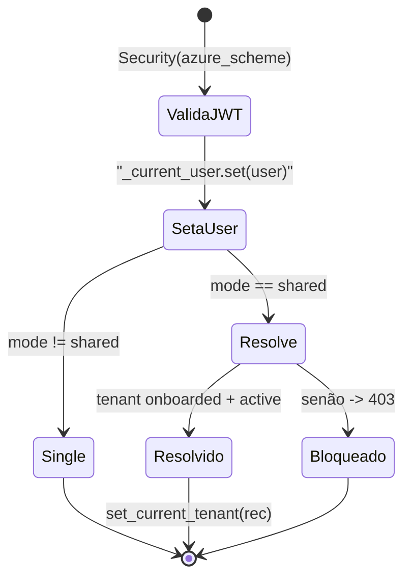

# Autenticação, OBO e RBAC Multi-Tenant

## O problema que o módulo resolve

Cada chamada ao Foundry, à busca e à memória deve acontecer **como o usuário assinado** (não como uma identidade de serviço compartilhada), e em shared mode também **dentro do tenant certo**. O `app/core/auth.py` é o ponto onde a identidade do request é validada, o tenant é resolvido, e a credencial On-Behalf-Of (OBO) é construída ([apps/backend/app/core/auth.py:1-21](https://github.com/ruinosus/foundry-assured/blob/3333d60d0e9c02b64a532f2c9bad94692cf50075/apps/backend/app/core/auth.py#L1-L21)).

Na v0.3.0 isso ganhou mais peso: com os hosted twins grounded removidos, o `/cockpit` e o `/selfwiki` rodam **live-OBO** — a síntese roda como o usuário e o `retrieve()` usa o token de busca do usuário no header ACL. Os dois caminhos **espelham** as funções deste módulo (ver a seção final).

## Sumário do fluxo

| Etapa | Função | O que faz | Fonte |
|---|---|---|---|
| Validar JWT | `azure_scheme` | esquema bearer Single ou Multi | [apps/backend/app/core/auth.py:54-74](https://github.com/ruinosus/foundry-assured/blob/3333d60d0e9c02b64a532f2c9bad94692cf50075/apps/backend/app/core/auth.py#L54-L74) |
| Capturar usuário | `require_user` | seta contextvar; em shared, resolve tenant | [apps/backend/app/core/auth.py:116-133](https://github.com/ruinosus/foundry-assured/blob/3333d60d0e9c02b64a532f2c9bad94692cf50075/apps/backend/app/core/auth.py#L116-L133) |
| Autorizar tenant | `resolve_tenant` | onboarded+active → set_current_tenant, senão 403 | [apps/backend/app/core/auth.py:97-103](https://github.com/ruinosus/foundry-assured/blob/3333d60d0e9c02b64a532f2c9bad94692cf50075/apps/backend/app/core/auth.py#L97-L103) |
| Construir OBO | `credential_for_request` | `OnBehalfOfCredential` ou `DefaultAzureCredential` | [apps/backend/app/core/auth.py:186-196](https://github.com/ruinosus/foundry-assured/blob/3333d60d0e9c02b64a532f2c9bad94692cf50075/apps/backend/app/core/auth.py#L186-L196) |
| Escopo de memória | `memory_scope` | `tid:oid` em multi, `oid` em single | [apps/backend/app/core/auth.py:199-209](https://github.com/ruinosus/foundry-assured/blob/3333d60d0e9c02b64a532f2c9bad94692cf50075/apps/backend/app/core/auth.py#L199-L209) |
| RBAC | `require_role`, `has_role` | App Roles do Entra | [apps/backend/app/core/auth.py:141-183](https://github.com/ruinosus/foundry-assured/blob/3333d60d0e9c02b64a532f2c9bad94692cf50075/apps/backend/app/core/auth.py#L141-L183) |

## Esquema bearer: Single vs Multi

O esquema é escolhido por `deployment_mode` (só quando `auth_enabled`):

- `self_hosted`/`dedicated` → `SingleTenantAzureAuthorizationCodeBearer`, com `allow_guest_users=True` porque a conta dev é um guest ([apps/backend/app/core/auth.py:56-64](https://github.com/ruinosus/foundry-assured/blob/3333d60d0e9c02b64a532f2c9bad94692cf50075/apps/backend/app/core/auth.py#L56-L64)).
- `shared` → `MultiTenantAzureAuthorizationCodeBearer` com `validate_iss=True` e um `iss_callable=_iss_callable`, cujo parâmetro **deve** se chamar exatamente `tid` (o `fastapi_azure_auth` introspecta o nome) ([apps/backend/app/core/auth.py:65-74](https://github.com/ruinosus/foundry-assured/blob/3333d60d0e9c02b64a532f2c9bad94692cf50075/apps/backend/app/core/auth.py#L65-L74), [apps/backend/app/core/auth.py:46-49](https://github.com/ruinosus/foundry-assured/blob/3333d60d0e9c02b64a532f2c9bad94692cf50075/apps/backend/app/core/auth.py#L46-L49)).

`auth_enabled` é uma property derivada: só liga quando `entra_tenant_id` E `entra_api_client_id` estão setados; sem isso, o app cai para `DefaultAzureCredential` e boota localmente ([apps/backend/app/core/settings.py:49-56](https://github.com/ruinosus/foundry-assured/blob/3333d60d0e9c02b64a532f2c9bad94692cf50075/apps/backend/app/core/settings.py#L49-L56)).

## `require_user`: três variantes compiladas no boot

`require_user` é definido **uma vez** no import, escolhendo a forma certa para não pagar branches por requisição ([apps/backend/app/core/auth.py:116-133](https://github.com/ruinosus/foundry-assured/blob/3333d60d0e9c02b64a532f2c9bad94692cf50075/apps/backend/app/core/auth.py#L116-L133)):

| Condição | Corpo | Fonte |
|---|---|---|
| auth on + shared | seta contextvar **e** `resolve_tenant(user, _tenant_store)` | [apps/backend/app/core/auth.py:117-122](https://github.com/ruinosus/foundry-assured/blob/3333d60d0e9c02b64a532f2c9bad94692cf50075/apps/backend/app/core/auth.py#L117-L122) |
| auth on + single | só seta o contextvar | [apps/backend/app/core/auth.py:124-128](https://github.com/ruinosus/foundry-assured/blob/3333d60d0e9c02b64a532f2c9bad94692cf50075/apps/backend/app/core/auth.py#L124-L128) |
| auth off | no-op, retorna `None` | [apps/backend/app/core/auth.py:130-133](https://github.com/ruinosus/foundry-assured/blob/3333d60d0e9c02b64a532f2c9bad94692cf50075/apps/backend/app/core/auth.py#L130-L133) |

`resolve_tenant` é o **choke point de autorização**: busca o `TenantRecord` por `user.tid`; se for `None` ou `status != "active"`, levanta **403**; senão chama `set_current_tenant(rec)` ([apps/backend/app/core/auth.py:97-103](https://github.com/ruinosus/foundry-assured/blob/3333d60d0e9c02b64a532f2c9bad94692cf50075/apps/backend/app/core/auth.py#L97-L103)).



<!-- Sources: apps/backend/app/core/auth.py:97-133 -->

## On-Behalf-Of: identidade do usuário propagada

A factory do workflow recebe só um `thread_id`, então a identidade chega via o **contextvar** `_current_user`, setado na dependência e lido depois na mesma task de requisição ([apps/backend/app/core/auth.py:42-44](https://github.com/ruinosus/foundry-assured/blob/3333d60d0e9c02b64a532f2c9bad94692cf50075/apps/backend/app/core/auth.py#L42-L44)). `credential_for_request()` constrói um `OnBehalfOfCredential(tenant_id, client_id, client_secret, user_assertion=user.access_token)` quando há usuário; senão `DefaultAzureCredential()` ([apps/backend/app/core/auth.py:186-196](https://github.com/ruinosus/foundry-assured/blob/3333d60d0e9c02b64a532f2c9bad94692cf50075/apps/backend/app/core/auth.py#L186-L196)).

## RBAC: App Roles do Entra

O app possui um conjunto pequeno de papéis no claim `roles` do token: `APP_ROLES = ("Admin", "Author", "Approver", "Reader")` ([apps/backend/app/core/auth.py:40](https://github.com/ruinosus/foundry-assured/blob/3333d60d0e9c02b64a532f2c9bad94692cf50075/apps/backend/app/core/auth.py#L40)).

| Helper | Comportamento | Auth off | Fonte |
|---|---|---|---|
| `require_role(*roles)` | dependência que exige QUALQUER um; 403 senão | no-op (`_open`) | [apps/backend/app/core/auth.py:141-165](https://github.com/ruinosus/foundry-assured/blob/3333d60d0e9c02b64a532f2c9bad94692cf50075/apps/backend/app/core/auth.py#L141-L165) |
| `has_role(*roles)` | bool; usado dentro do workflow (escalation) | sempre `True` (degrada aberto local) | [apps/backend/app/core/auth.py:178-183](https://github.com/ruinosus/foundry-assured/blob/3333d60d0e9c02b64a532f2c9bad94692cf50075/apps/backend/app/core/auth.py#L178-L183) |
| `current_roles()` | set dos papéis do caller (filtra tools MCP) | — | [apps/backend/app/core/auth.py:172-175](https://github.com/ruinosus/foundry-assured/blob/3333d60d0e9c02b64a532f2c9bad94692cf50075/apps/backend/app/core/auth.py#L172-L175) |

`Admin` **não** é implicitamente concedido — deve ser listado explicitamente onde deve passar (defesa em profundidade: o frontend esconde a UI admin, mas cada endpoint re-checa server-side) ([apps/backend/app/core/auth.py:141-148](https://github.com/ruinosus/foundry-assured/blob/3333d60d0e9c02b64a532f2c9bad94692cf50075/apps/backend/app/core/auth.py#L141-L148)).

## `memory_scope`: isolamento por usuário e por tenant

A memória é namespaced pelo `oid` do usuário (defesa primária contra memory poisoning). Em multi-tenant é **prefixada por tid**; em single mantém o `oid` puro para não orfanar memórias já persistidas ([apps/backend/app/core/auth.py:199-209](https://github.com/ruinosus/foundry-assured/blob/3333d60d0e9c02b64a532f2c9bad94692cf50075/apps/backend/app/core/auth.py#L199-L209)):

```python
base = user.oid if (user is not None and user.oid) else "dev-local"
tid = current_tenant_id()
return f"{tid}:{base}" if tid else base
```

## Onboarding: gate de criação de tenant

A criação self-service de tenant tem um guard **separado** de `require_user` (que resolveria o tenant e 403aria pré-onboarding). `onboarding_guard` autentica, seta o contextvar (para o handler ler o `tid`), e checa **dois** gates — papel `Admin` E a allow-list de plataforma (`allowed_tids`) — mas **não** resolve o tenant ([apps/backend/app/core/onboarding.py:1-24](https://github.com/ruinosus/foundry-assured/blob/3333d60d0e9c02b64a532f2c9bad94692cf50075/apps/backend/app/core/onboarding.py#L1-L24)).

## O grounded live-OBO herda esta identidade

Os hosted twins grounded foram removidos na v0.3.0; `/cockpit` e `/selfwiki` agora rodam ao vivo como o usuário. Como o `current_user()` contextvar se **perde** dentro do gerador async do `StreamingResponse`, o `user` é capturado no corpo do endpoint e passado adiante ([apps/backend/app/domains.py:112-119](https://github.com/ruinosus/foundry-assured/blob/3333d60d0e9c02b64a532f2c9bad94692cf50075/apps/backend/app/domains.py#L112-L119)). Duas funções de serviço **espelham** este módulo:

| Serviço | Espelha | O que faz | Fonte |
|---|---|---|---|
| `grounded._async_credential(user)` | `credential_for_request` | OBO (aio) para a síntese Responses; fallback `DefaultAzureCredential` | [apps/backend/app/services/grounded.py:58-73](https://github.com/ruinosus/foundry-assured/blob/3333d60d0e9c02b64a532f2c9bad94692cf50075/apps/backend/app/services/grounded.py#L58-L73) |
| `retrieval._user_search_token(user)` | (OBO para `search.azure.com`) | token de busca do usuário → header `x-ms-query-source-authorization` | [apps/backend/app/services/retrieval.py:78-99](https://github.com/ruinosus/foundry-assured/blob/3333d60d0e9c02b64a532f2c9bad94692cf50075/apps/backend/app/services/retrieval.py#L78-L99) |

## `GET /me`: a UI lê os papéis daqui

O claim `roles` vive no **access token** (audiência = a API app), não no id token da SPA, então o frontend pergunta a `/me`. Em auth off, retorna todos os papéis para a UI seguir usável ([apps/backend/app/api/me.py:1-31](https://github.com/ruinosus/foundry-assured/blob/3333d60d0e9c02b64a532f2c9bad94692cf50075/apps/backend/app/api/me.py#L1-L31)).

## Related Pages

| Página | Relação |
|------|-------------|
| [Modos de Implantação e o Seam de Tenant](./page-2.md) | `set_current_tenant`/`current_tenant_id` que o auth chama |
| [Registry de Domínios e mount_domains](./page-4.md) | `auth_dependencies()` e a API admin que usa `require_role` |
| [Domínios de Agente e Workflow](./page-5.md) | `credential_for_request`/`memory_scope` no workflow |
| [Conhecimento, ACL e o retrieve() Unificado](./page-7.md) | `_user_search_token` e o header ACL |
