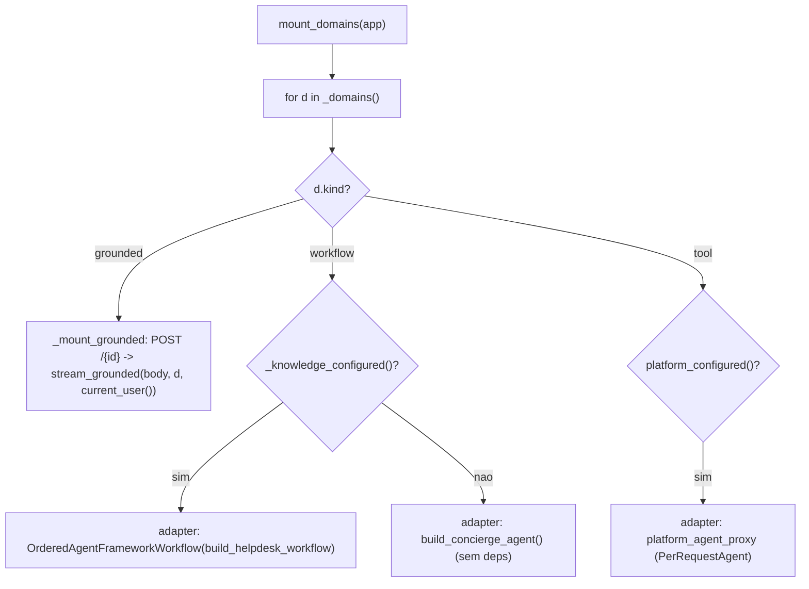
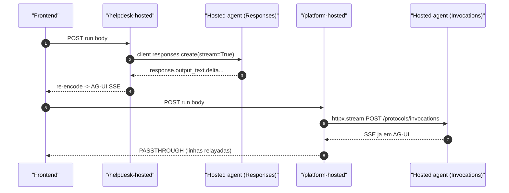

# Registry de Domínios, Endpoints e o Wiring do mount_domains

## Por que um registry (a mudança da v0.3.0)

Na v0.2.0 o wiring dos endpoints estava **dividido**: o `main.py` montava os endpoints AG-UI live (com helpers `_domain_deps`/`_grounded_agent`) e o `api/chat.py` montava os hosted. A v0.3.0 consolidou isso num **registry de domínios** (`app/domains.py`) — o gêmeo de backend do `apps/frontend/lib/domains.ts` — e um único loop `mount_domains(app)` que **despacha por `kind`** ([apps/backend/app/domains.py:1-18](https://github.com/ruinosus/foundry-assured/blob/3333d60d0e9c02b64a532f2c9bad94692cf50075/apps/backend/app/domains.py#L1-L18)).

O `main.py` ficou ainda mais fino: cria o app, aplica CORS, inclui os routers HTTP, e chama `mount_domains(app)` — uma linha ([apps/backend/app/main.py:44-49](https://github.com/ruinosus/foundry-assured/blob/3333d60d0e9c02b64a532f2c9bad94692cf50075/apps/backend/app/main.py#L44-L49)). O `lifespan` pré-carrega a config OpenID do Entra e fecha o cliente hosted no shutdown ([apps/backend/app/main.py:26-32](https://github.com/ruinosus/foundry-assured/blob/3333d60d0e9c02b64a532f2c9bad94692cf50075/apps/backend/app/main.py#L26-L32)).

## `DomainSpec`: uma linha por domínio

```python
@dataclass(frozen=True)
class DomainSpec:
    id: str
    kind: Literal["grounded", "workflow", "tool"]
    instructions: str = ""
    kb_name: str | None = None
    ks_name: str | None = None        # KB's knowledge-source name (native path)
    search_index: str | None = None   # direct-search fallback target
    search_endpoint: str = ""
    acl_group_map: dict | None = None # name→objectID; None/empty → no ACL trim
    hosted_agent_name: str | None = None
```

([apps/backend/app/domains.py:34-53](https://github.com/ruinosus/foundry-assured/blob/3333d60d0e9c02b64a532f2c9bad94692cf50075/apps/backend/app/domains.py#L34-L53))

**Fato (lido no código):** `__post_init__` faz o spec **fail fast** — um domínio grounded que não resolve nem `kb_name` nem `search_index` levantaria uma `ValueError` no build do registry, em vez de cair depois em `.../indexes/None/docs/search` no `retrieve()` ([apps/backend/app/domains.py:54-60](https://github.com/ruinosus/foundry-assured/blob/3333d60d0e9c02b64a532f2c9bad94692cf50075/apps/backend/app/domains.py#L54-L60)). A **ACL é DADO** (RULE #6): o registry só carrega `acl_group_map` (name→objectID) — nunca classifica.

`_domains()` lê `tenant_config()` **lazily** (nada roda no import) e devolve as quatro linhas ([apps/backend/app/domains.py:63-96](https://github.com/ruinosus/foundry-assured/blob/3333d60d0e9c02b64a532f2c9bad94692cf50075/apps/backend/app/domains.py#L63-L96)):

| Domínio | `kind` | `kb_name` (searchIndex) | `search_index` (fallback) | `acl_group_map`? | Fonte |
|---|---|---|---|---|---|
| helpdesk | workflow | — | — | — | [apps/backend/app/domains.py:70-74](https://github.com/ruinosus/foundry-assured/blob/3333d60d0e9c02b64a532f2c9bad94692cf50075/apps/backend/app/domains.py#L70-L74) |
| cockpit | grounded | `cockpit-si-kb` | `cockpit-docbundles-ks-index` | **sim** | [apps/backend/app/domains.py:75-84](https://github.com/ruinosus/foundry-assured/blob/3333d60d0e9c02b64a532f2c9bad94692cf50075/apps/backend/app/domains.py#L75-L84) |
| selfwiki | grounded | `selfwiki-si-kb` | `selfwiki-docbundles-ks-index` | não (single-audience) | [apps/backend/app/domains.py:85-94](https://github.com/ruinosus/foundry-assured/blob/3333d60d0e9c02b64a532f2c9bad94692cf50075/apps/backend/app/domains.py#L85-L94) |
| platform | tool | — | — | — | [apps/backend/app/domains.py:95](https://github.com/ruinosus/foundry-assured/blob/3333d60d0e9c02b64a532f2c9bad94692cf50075/apps/backend/app/domains.py#L95) |

## `mount_domains`: um loop, três branches



<!-- Sources: apps/backend/app/domains.py:108-173 -->

- **grounded** (`_mount_grounded`): registra `POST /{id}` que captura `current_user()` no corpo (o contextvar se perde no gerador) e devolve `StreamingResponse(stream_grounded(await request.json(), d, user))` ([apps/backend/app/domains.py:108-126](https://github.com/ruinosus/foundry-assured/blob/3333d60d0e9c02b64a532f2c9bad94692cf50075/apps/backend/app/domains.py#L108-L126)).
- **workflow** (`_mount_helpdesk`): com KB configurada, monta o workflow via `add_agent_framework_fastapi_endpoint` embrulhando `OrderedAgentFrameworkWorkflow(build_helpdesk_workflow)`; sem KB, cai para `build_concierge_agent()` sem deps ([apps/backend/app/domains.py:129-146](https://github.com/ruinosus/foundry-assured/blob/3333d60d0e9c02b64a532f2c9bad94692cf50075/apps/backend/app/domains.py#L129-L146)).
- **tool** (`_mount_platform`): só monta quando `platform_configured()`; serve o `platform_agent_proxy` ([apps/backend/app/domains.py:149-161](https://github.com/ruinosus/foundry-assured/blob/3333d60d0e9c02b64a532f2c9bad94692cf50075/apps/backend/app/domains.py#L149-L161)).

## `_domain_deps`: o gate por modo (canonizado no registry)

`_domain_deps(domain_id)` é agora o **helper canônico** (movido do `main.py` para o registry): retorna `auth_dependencies()` e, **só em shared**, anexa `Depends(require_domain(domain_id))`. Em self_hosted/dedicated é byte-idêntico ao de antes ([apps/backend/app/domains.py:99-105](https://github.com/ruinosus/foundry-assured/blob/3333d60d0e9c02b64a532f2c9bad94692cf50075/apps/backend/app/domains.py#L99-L105)). O `api/chat.py` **importa** `_domain_deps` do registry para manter o `/platform-hosted` em sincronia ([apps/backend/app/api/chat.py:1-7](https://github.com/ruinosus/foundry-assured/blob/3333d60d0e9c02b64a532f2c9bad94692cf50075/apps/backend/app/api/chat.py#L1-L7)).

Isto é exercitado offline por `domain_registry_test.py`, que dirige `mount_domains(fake_app)` com as factories/adapter monkeypatchados e assere: uma rota `POST` por grounded (`/cockpit`, `/selfwiki`), o adapter chamado por workflow+tool (`/helpdesk`, `/platform`), e o guard `ValueError` ([apps/backend/eval/domain_registry_test.py:38-71](https://github.com/ruinosus/foundry-assured/blob/3333d60d0e9c02b64a532f2c9bad94692cf50075/apps/backend/eval/domain_registry_test.py#L38-L71), [apps/backend/eval/domain_registry_test.py:117-127](https://github.com/ruinosus/foundry-assured/blob/3333d60d0e9c02b64a532f2c9bad94692cf50075/apps/backend/eval/domain_registry_test.py#L117-L127)).

## Mapa de endpoints

| Endpoint | Método/Protocolo | Gate | Fonte |
|---|---|---|---|
| `/healthz` | GET | nenhum | [apps/backend/app/api/health.py:6-8](https://github.com/ruinosus/foundry-assured/blob/3333d60d0e9c02b64a532f2c9bad94692cf50075/apps/backend/app/api/health.py#L6-L8) |
| `/me` | GET | `require_user` | [apps/backend/app/api/me.py:19-31](https://github.com/ruinosus/foundry-assured/blob/3333d60d0e9c02b64a532f2c9bad94692cf50075/apps/backend/app/api/me.py#L19-L31) |
| `/tickets` | GET | `auth_dependencies()` | [apps/backend/app/api/tickets.py:9-16](https://github.com/ruinosus/foundry-assured/blob/3333d60d0e9c02b64a532f2c9bad94692cf50075/apps/backend/app/api/tickets.py#L9-L16) |
| `/eval/runs`, `/eval/foundry` | GET | `auth_dependencies()` | [apps/backend/app/api/evals.py:16-42](https://github.com/ruinosus/foundry-assured/blob/3333d60d0e9c02b64a532f2c9bad94692cf50075/apps/backend/app/api/evals.py#L16-L42) |
| `/admin/*` | GET/POST/DELETE | `require_role("Admin")` | [apps/backend/app/api/admin.py:17-88](https://github.com/ruinosus/foundry-assured/blob/3333d60d0e9c02b64a532f2c9bad94692cf50075/apps/backend/app/api/admin.py#L17-L88) |
| `/tenant/*` | GET/POST/PUT/DELETE | Admin + tenant-scoped (**shared only**) | [apps/backend/app/api/tenant.py:26-151](https://github.com/ruinosus/foundry-assured/blob/3333d60d0e9c02b64a532f2c9bad94692cf50075/apps/backend/app/api/tenant.py#L26-L151) |
| `/helpdesk` | AG-UI (workflow ou concierge) | `_domain_deps("helpdesk")` | [apps/backend/app/domains.py:129-146](https://github.com/ruinosus/foundry-assured/blob/3333d60d0e9c02b64a532f2c9bad94692cf50075/apps/backend/app/domains.py#L129-L146) |
| `/cockpit`, `/selfwiki` | `POST` → SSE grounded | `_domain_deps(...)` | [apps/backend/app/domains.py:121-126](https://github.com/ruinosus/foundry-assured/blob/3333d60d0e9c02b64a532f2c9bad94692cf50075/apps/backend/app/domains.py#L121-L126) |
| `/platform` | AG-UI (MCP) | `_domain_deps("platform")` | [apps/backend/app/domains.py:155-161](https://github.com/ruinosus/foundry-assured/blob/3333d60d0e9c02b64a532f2c9bad94692cf50075/apps/backend/app/domains.py#L155-L161) |
| `/helpdesk-hosted` | Responses → AG-UI | `auth_dependencies()` | [apps/backend/app/api/chat.py:12-26](https://github.com/ruinosus/foundry-assured/blob/3333d60d0e9c02b64a532f2c9bad94692cf50075/apps/backend/app/api/chat.py#L12-L26) |
| `/platform-hosted` | Invocations passthrough | `_domain_deps("platform")` | [apps/backend/app/api/chat.py:29-34](https://github.com/ruinosus/foundry-assured/blob/3333d60d0e9c02b64a532f2c9bad94692cf50075/apps/backend/app/api/chat.py#L29-L34) |

## Agregação de routers

`api_router` inclui os routers fixos e, **só em shared mode**, inclui o router `/tenant` (importado lazy) ([apps/backend/app/api/__init__.py:9-19](https://github.com/ruinosus/foundry-assured/blob/3333d60d0e9c02b64a532f2c9bad94692cf50075/apps/backend/app/api/__init__.py#L9-L19)):

```python
if settings.deployment_mode == "shared":
    from app.api import tenant
    api_router.include_router(tenant.router)
```

## Pontes hosted: só duas restam

**Fato (lido no código):** os hosted twins **grounded** (`/cockpit-hosted`, `/selfwiki-hosted`) foram **removidos** na v0.3.0 — o `chat.py` só tem `/helpdesk-hosted` e `/platform-hosted` ([apps/backend/app/api/chat.py:1-34](https://github.com/ruinosus/foundry-assured/blob/3333d60d0e9c02b64a532f2c9bad94692cf50075/apps/backend/app/api/chat.py#L1-L34)). O grounded agora roda **live-OBO** (não há mais twin keyless para ele).



<!-- Sources: apps/backend/app/api/chat.py:12-34, apps/backend/app/services/hosted.py:1-8 -->

- **`/helpdesk-hosted`** (`stream_agui`): consome o protocolo **Responses** do hosted agent e re-encoda cada `response.output_text.delta`; o cliente async é cacheado, com um `TODO(multitenant)` de que o cache process-global liga-se ao primeiro tenant que o aquece ([apps/backend/app/services/hosted.py:18-44](https://github.com/ruinosus/foundry-assured/blob/3333d60d0e9c02b64a532f2c9bad94692cf50075/apps/backend/app/services/hosted.py#L18-L44)).
- **`/platform-hosted`** (`stream_platform_agui`): usa o protocolo **Invocations**, que já serve AG-UI — passthrough 1:1 ([apps/backend/app/api/chat.py:29-34](https://github.com/ruinosus/foundry-assured/blob/3333d60d0e9c02b64a532f2c9bad94692cf50075/apps/backend/app/api/chat.py#L29-L34)).

## A API de tenant (shared mode)

Gerenciamento per-tenant de config + connections, Admin-gated + tenant-scoped. Todo write é um **read-modify-write do próprio registro do caller** (`current_tenant_id()`) — nenhum `tid` vem do path ([apps/backend/app/api/tenant.py:1-7](https://github.com/ruinosus/foundry-assured/blob/3333d60d0e9c02b64a532f2c9bad94692cf50075/apps/backend/app/api/tenant.py#L1-L7)). O onboarding semeia `enabled_domains` pelo tier (`domains_for_tier`), e `PUT /domains` rejeita ids fora de `DOMAIN_IDS` ([apps/backend/app/api/tenant.py:86-100](https://github.com/ruinosus/foundry-assured/blob/3333d60d0e9c02b64a532f2c9bad94692cf50075/apps/backend/app/api/tenant.py#L86-L100)).

## A API admin (Microsoft Graph app-only)

`/admin/*` dirige o ciclo de vida de usuário + atribuição de papel via Microsoft Graph **app-only**, cada rota Admin-gated ([apps/backend/app/api/admin.py:1-6](https://github.com/ruinosus/foundry-assured/blob/3333d60d0e9c02b64a532f2c9bad94692cf50075/apps/backend/app/api/admin.py#L1-L6)). O cliente Graph usa REST puro via `urllib` + `ClientSecretCredential` ([apps/backend/app/services/graph.py:34-55](https://github.com/ruinosus/foundry-assured/blob/3333d60d0e9c02b64a532f2c9bad94692cf50075/apps/backend/app/services/graph.py#L34-L55)).

## Related Pages

| Página | Relação |
|------|-------------|
| [Modos de Implantação e o Seam de Tenant](./page-2.md) | `require_domain`, `TenantConfig`, `Connection` usados aqui |
| [Autenticação, OBO e RBAC](./page-3.md) | `auth_dependencies`, `require_role`, `onboarding_guard` |
| [Domínios de Agente e Workflow](./page-5.md) | Os builders que o registry monta nos endpoints |
| [Conhecimento, ACL e o retrieve() Unificado](./page-7.md) | `stream_grounded` servido em `/cockpit` e `/selfwiki` |
