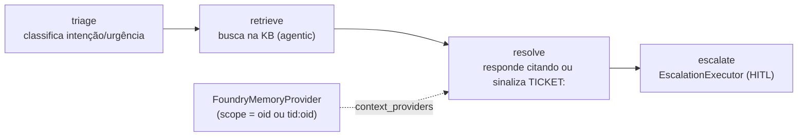
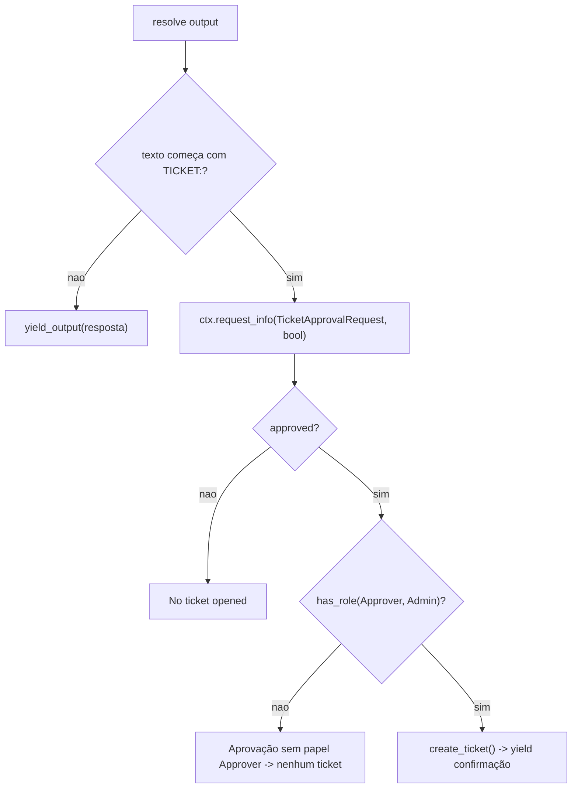

# Domínios de Agente e o Workflow Helpdesk

## Por que um workflow, não um agente único

O domínio `helpdesk` é o de maior risco do showcase: expor um **workflow multi-agente** sobre AG-UI de forma que o frontend receba os passos intermediários (triage, retrieve, draft), não só a resposta final. A solução é **workflow-as-agent** ([apps/backend/app/workflow/graph.py:1-14](https://github.com/ruinosus/foundry-assured/blob/3333d60d0e9c02b64a532f2c9bad94692cf50075/apps/backend/app/workflow/graph.py#L1-L14)). Os dois domínios grounded (`cockpit`/`selfwiki`) são Q&A simples e — desde a v0.3.0 — **não têm agente próprio**: rodam pela costura `stream_grounded` + `retrieve()`.

## O workflow construído por requisição

A Fase 3 tornou o workflow **per-request** para cada run usar a credencial OBO do usuário e seu próprio escopo de memória. `build_helpdesk_workflow(thread_id)` ([apps/backend/app/workflow/graph.py:28-54](https://github.com/ruinosus/foundry-assured/blob/3333d60d0e9c02b64a532f2c9bad94692cf50075/apps/backend/app/workflow/graph.py#L28-L54)):

1. `credential = credential_for_request()` e `scope = memory_scope()`;
2. `memory = build_memory_provider(credential, scope)`;
3. constrói os três agentes + o `EscalationExecutor`;
4. monta `add_chain([triage, retrieve, resolve, escalate])`.

<!-- Sources: apps/backend/app/workflow/graph.py:28-54, apps/backend/app/workflow/agents.py:42-70 -->

Os três agentes são `FoundryChatClient.as_agent(...)` com `name` **lowercase UI-facing** (`triage`/`retrieve`/`resolve`), porque o `name` vira o id do executor que o adapter AG-UI emite como o passo renderizado ([apps/backend/app/workflow/agents.py:1-10](https://github.com/ruinosus/foundry-assured/blob/3333d60d0e9c02b64a532f2c9bad94692cf50075/apps/backend/app/workflow/agents.py#L1-L10), [apps/backend/app/workflow/agents.py:34-70](https://github.com/ruinosus/foundry-assured/blob/3333d60d0e9c02b64a532f2c9bad94692cf50075/apps/backend/app/workflow/agents.py#L34-L70)). O `_client()` lê endpoint/modelo de `tenant_config()` — ponto onde o seam de tenant entra no workflow ([apps/backend/app/workflow/agents.py:25-31](https://github.com/ruinosus/foundry-assured/blob/3333d60d0e9c02b64a532f2c9bad94692cf50075/apps/backend/app/workflow/agents.py#L25-L31)).

### Nuance importante da v0.3.0

O nó `retrieve` do workflow **ainda** injeta `AzureAISearchContextProvider(mode="agentic")` apontando para `azure_search_knowledge_base` (a KB helpdesk) — ele **não** migrou para a costura `retrieve()` ([apps/backend/app/workflow/agents.py:42-55](https://github.com/ruinosus/foundry-assured/blob/3333d60d0e9c02b64a532f2c9bad94692cf50075/apps/backend/app/workflow/agents.py#L42-L55)). A unificação sobre `retrieve()` valeu para os **domínios grounded** (cockpit/selfwiki); o workflow helpdesk mantém o context-provider agentic nativo do agent-framework. É um ponto de assimetria real a ter em mente.

## Memória por usuário (Fase 3)

`build_memory_provider` retorna um `FoundryMemoryProvider` scoped a um usuário, ou `None` quando memória não está configurada ([apps/backend/app/workflow/memory.py:22-41](https://github.com/ruinosus/foundry-assured/blob/3333d60d0e9c02b64a532f2c9bad94692cf50075/apps/backend/app/workflow/memory.py#L22-L41)). Antes de um run, busca as memórias do usuário e as injeta; depois, armazena novas — com `update_delay=0` (grava imediatamente, vs o default de 5 min) ([apps/backend/app/workflow/memory.py:27-41](https://github.com/ruinosus/foundry-assured/blob/3333d60d0e9c02b64a532f2c9bad94692cf50075/apps/backend/app/workflow/memory.py#L27-L41)).

## HITL: ticket só após aprovação humana + papel

O `EscalationExecutor` é o nó final. Por que um nó `request_info` do workflow em vez de uma tool com approval-mode: o adapter AG-UI duplica o `TOOL_CALL_START` para tools approval-gated, quebrando o stream; o mecanismo nativo de request/response emite um interrupt limpo que o CopilotKit renderiza via `useInterrupt` ([apps/backend/app/workflow/escalation.py:1-17](https://github.com/ruinosus/foundry-assured/blob/3333d60d0e9c02b64a532f2c9bad94692cf50075/apps/backend/app/workflow/escalation.py#L1-L17)).

<!-- Sources: apps/backend/app/workflow/escalation.py:50-93, apps/backend/app/agents/prompts.py:26-41 -->

O contrato textual: `resolve` responde **exatamente** `TICKET: <one-line summary>` quando é um pedido de ação ([apps/backend/app/agents/prompts.py:26-41](https://github.com/ruinosus/foundry-assured/blob/3333d60d0e9c02b64a532f2c9bad94692cf50075/apps/backend/app/agents/prompts.py#L26-L41)). O `on_resolve` inspeciona o prefixo `TICKET:` e pausa com `ctx.request_info(... response_type=bool)`; o `on_decision` só cria o ticket se `approved` E `has_role("Approver", "Admin")` ([apps/backend/app/workflow/escalation.py:50-93](https://github.com/ruinosus/foundry-assured/blob/3333d60d0e9c02b64a532f2c9bad94692cf50075/apps/backend/app/workflow/escalation.py#L50-L93)). Assim "nenhum ticket sem aprovação" vale **estruturalmente**.

`create_ticket` é uma ação **real, persistida** em `data/tickets.jsonl`; também exposta como `@tool` para o hosted agent chamar autonomamente ([apps/backend/app/tools/tickets.py:1-10](https://github.com/ruinosus/foundry-assured/blob/3333d60d0e9c02b64a532f2c9bad94692cf50075/apps/backend/app/tools/tickets.py#L1-L10)).

## O fix de ordering do stream (workflow-as-agent)

O workflow live é servido por `OrderedAgentFrameworkWorkflow`, um wrap de `AgentFrameworkWorkflow` que corrige um bug de ordenação do adapter (rc5): reordena para fechar toda mensagem de texto aberta antes de qualquer evento terminal, e suprime o trio `TOOL_CALL` do `request_info` que deixava um spinner preso no CopilotChat ([apps/backend/app/workflow/stream_fix.py:1-52](https://github.com/ruinosus/foundry-assured/blob/3333d60d0e9c02b64a532f2c9bad94692cf50075/apps/backend/app/workflow/stream_fix.py#L1-L52)). É o que o `_mount_helpdesk` instancia com `workflow_factory=build_helpdesk_workflow` ([apps/backend/app/domains.py:136-142](https://github.com/ruinosus/foundry-assured/blob/3333d60d0e9c02b64a532f2c9bad94692cf50075/apps/backend/app/domains.py#L136-L142)).

## Os domínios grounded: sem agente, pela costura

Na v0.2.0 cada grounded tinha um builder (`build_cockpit_agent`, `build_selfwiki_agent`) com um provider de busca por-agente. A v0.3.0 **aposentou** todos esses builders + providers; o path grounded é agora `stream_grounded(body, domain, user)` sobre `retrieve()`, dirigido só pelos **dados** do `DomainSpec` (KB, instructions, `acl_group_map`).

| Domínio | Instructions | Diferença-chave | Fonte |
|---|---|---|---|
| cockpit | `COCKPIT_INSTRUCTIONS` | **ACL trim por usuário** (via header no `retrieve()`) | [apps/backend/app/agents/prompts.py:73-98](https://github.com/ruinosus/foundry-assured/blob/3333d60d0e9c02b64a532f2c9bad94692cf50075/apps/backend/app/agents/prompts.py#L73-L98) |
| selfwiki | `SELFWIKI_INSTRUCTIONS` | single-audience — sem ACL (dogfood do repo) | [apps/backend/app/agents/prompts.py:106-136](https://github.com/ruinosus/foundry-assured/blob/3333d60d0e9c02b64a532f2c9bad94692cf50075/apps/backend/app/agents/prompts.py#L106-L136) |

As instructions impõem a disciplina de citação (RULE #4): fundamentar exclusivamente nos documentos recuperados e, ao enumerar, ser exaustivo. O detalhe da costura está em [Conhecimento, ACL e o retrieve() Unificado](./page-7.md).

## Os arquivos vestigiais `cockpit.py` / `selfwiki.py`

**Inconsistência real (lida no código):** `app/agents/cockpit.py` e `app/agents/selfwiki.py` sobreviveram à refatoração mas ficaram **vestigiais**. Cada um só expõe um `*_configured()` que checa o campo **legado** `cockpit_search_knowledge_base` / `selfwiki_search_knowledge_base` ([apps/backend/app/agents/cockpit.py:21-25](https://github.com/ruinosus/foundry-assured/blob/3333d60d0e9c02b64a532f2c9bad94692cf50075/apps/backend/app/agents/cockpit.py#L21-L25), [apps/backend/app/agents/selfwiki.py:21-25](https://github.com/ruinosus/foundry-assured/blob/3333d60d0e9c02b64a532f2c9bad94692cf50075/apps/backend/app/agents/selfwiki.py#L21-L25)), enquanto o registry usa os campos **searchindex**. E `mount_domains` **não** chama esses helpers (o `_mount_grounded` monta incondicionalmente). Suas docstrings ainda descrevem o antigo `AzureAISearchContextProvider` ([apps/backend/app/agents/cockpit.py:1-15](https://github.com/ruinosus/foundry-assured/blob/3333d60d0e9c02b64a532f2c9bad94692cf50075/apps/backend/app/agents/cockpit.py#L1-L15)). Hoje só `eval/configured_mode_test.py` os importa — código morto em produção, mantido vivo por um teste.

## `PerRequestAgent`: o proxy que difere o build

O adapter quer um `SupportsAgentRun` *instance*, não uma factory. O `platform` domain usa `PerRequestAgent` para diferir o build ao request time: cada `.run()` chama `builder()` fresco, lendo a config do tenant DESTA requisição + as roles/OBO do caller atual ([apps/backend/app/agents/per_request.py:1-16](https://github.com/ruinosus/foundry-assured/blob/3333d60d0e9c02b64a532f2c9bad94692cf50075/apps/backend/app/agents/per_request.py#L1-L16), [apps/backend/app/agents/per_request.py:25-48](https://github.com/ruinosus/foundry-assured/blob/3333d60d0e9c02b64a532f2c9bad94692cf50075/apps/backend/app/agents/per_request.py#L25-L48)). Detalhe em [Platform e MCP](./page-6.md).

## Related Pages

| Página | Relação |
|------|-------------|
| [Autenticação, OBO e RBAC](./page-3.md) | `credential_for_request`/`memory_scope`/`has_role` |
| [Registry de Domínios e mount_domains](./page-4.md) | Onde os builders/streamers são montados |
| [Conhecimento, ACL e o retrieve() Unificado](./page-7.md) | `stream_grounded` e o `retrieve()` que os grounded usam |
| [O Quarto Domínio: Platform e MCP](./page-6.md) | O domínio tool-driven que também usa `PerRequestAgent` |
