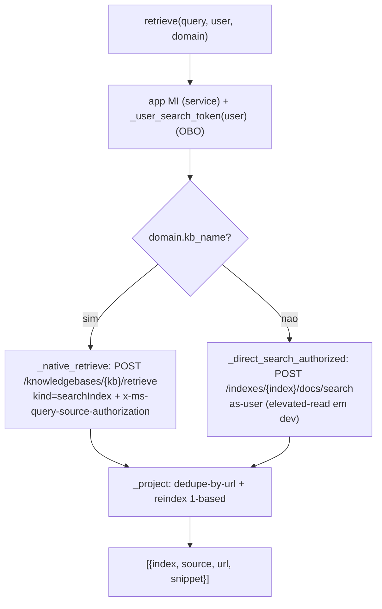
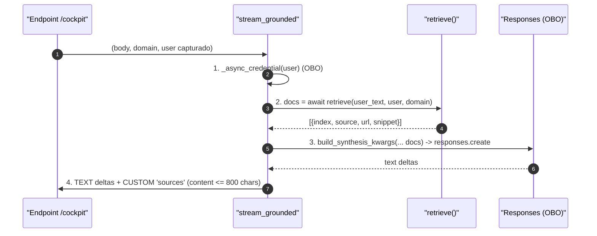
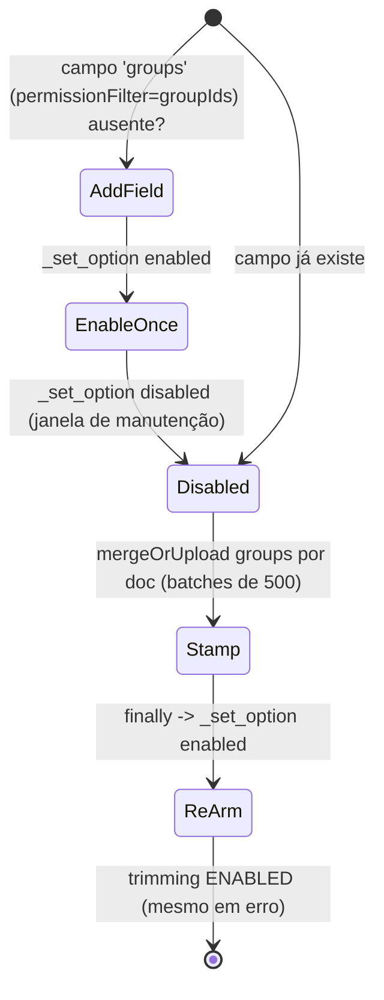

# Conhecimento, ACL e o retrieve() Unificado

## Por que uma costura única

A v0.2.0 tinha um **fork** no path grounded: um provider `SecureAzureAISearchProvider` (ACL, trim app-side) para o cockpit, um `GroundedAzureAISearchProvider` (fallback semântico) para o selfwiki, e uma ponte Responses+MCP à parte para citações. A v0.3.0 colapsou tudo numa **única costura — `retrieve()`** — com uma interface, duas identidades e dois motores atrás do mesmo seam ([apps/backend/app/services/retrieval.py:1-35](https://github.com/ruinosus/foundry-assured/blob/3333d60d0e9c02b64a532f2c9bad94692cf50075/apps/backend/app/services/retrieval.py#L1-L35)).

## Por que controle de acesso é DADO

Regra inegociável: **controle de acesso é dado** (os grupos de leitura de cada fonte), **nunca lógica de classificação no código**. O `acl_setup.py` é explícito: *"o mecanismo enforça acesso; ele nunca inventa. Não há lógica de classificação neste código — sem tiers, sem marcadores"* ([apps/backend/app/knowledge/acl_setup.py:1-19](https://github.com/ruinosus/foundry-assured/blob/3333d60d0e9c02b64a532f2c9bad94692cf50075/apps/backend/app/knowledge/acl_setup.py#L1-L19)). No registry isso aparece como o `acl_group_map` — só dado (name→objectID) ([apps/backend/app/domains.py:34-53](https://github.com/ruinosus/foundry-assured/blob/3333d60d0e9c02b64a532f2c9bad94692cf50075/apps/backend/app/domains.py#L34-L53)).

## Sumário

| Componente | Papel | Fonte |
|---|---|---|
| A costura de recuperação | `retrieve()` — nativo + fallback, dedupe | [apps/backend/app/services/retrieval.py:48-76](https://github.com/ruinosus/foundry-assured/blob/3333d60d0e9c02b64a532f2c9bad94692cf50075/apps/backend/app/services/retrieval.py#L48-L76) |
| O arquétipo grounded | `stream_grounded()` — 4 estações | [apps/backend/app/services/grounded.py:76-150](https://github.com/ruinosus/foundry-assured/blob/3333d60d0e9c02b64a532f2c9bad94692cf50075/apps/backend/app/services/grounded.py#L76-L150) |
| Ingestão da KB helpdesk | upload + knowledge source + KB | [apps/backend/app/knowledge/ingest.py:1-20](https://github.com/ruinosus/foundry-assured/blob/3333d60d0e9c02b64a532f2c9bad94692cf50075/apps/backend/app/knowledge/ingest.py#L1-L20) |
| Ingestão da KB Cockpit | 2º domínio (docbundles internos) | [apps/backend/app/knowledge/ingest_cockpit.py:1-19](https://github.com/ruinosus/foundry-assured/blob/3333d60d0e9c02b64a532f2c9bad94692cf50075/apps/backend/app/knowledge/ingest_cockpit.py#L1-L19) |
| Geração do deep-wiki (dogfood) | wiki fiel a partir do código real | [apps/backend/app/knowledge/wiki_builder.py:1-19](https://github.com/ruinosus/foundry-assured/blob/3333d60d0e9c02b64a532f2c9bad94692cf50075/apps/backend/app/knowledge/wiki_builder.py#L1-L19) |
| Stamp de ACL no índice | grava grupos por doc + liga trimming | [apps/backend/app/knowledge/acl_setup.py:98-161](https://github.com/ruinosus/foundry-assured/blob/3333d60d0e9c02b64a532f2c9bad94692cf50075/apps/backend/app/knowledge/acl_setup.py#L98-L161) |

## A costura `retrieve()`: uma interface, dois motores

<!-- Sources: apps/backend/app/services/retrieval.py:48-76, apps/backend/app/services/retrieval.py:275-292 -->

**As duas identidades** ([apps/backend/app/services/retrieval.py:60-70](https://github.com/ruinosus/foundry-assured/blob/3333d60d0e9c02b64a532f2c9bad94692cf50075/apps/backend/app/services/retrieval.py#L60-L70)):
- **credencial de serviço** na chamada = o **app managed identity** (`Search Index Data Reader`) — usuários finais não têm RBAC de busca;
- **distinção por usuário** = o header `x-ms-query-source-authorization`, com o token de busca OBO do usuário, anexado **só** em domínios ACL. `_user_search_token(user)` faz o OBO para `search.azure.com`; retorna `None` quando auth off / sem usuário / domínio público ([apps/backend/app/services/retrieval.py:78-99](https://github.com/ruinosus/foundry-assured/blob/3333d60d0e9c02b64a532f2c9bad94692cf50075/apps/backend/app/services/retrieval.py#L78-L99)).

**Fail-closed (RULE #6):** num domínio ACL cujo user token é `None`, nenhum header é enviado; sobre um índice `permissionFilterOption=enabled` o retrieve pertence a nenhum grupo e volta **zero docs** — o comportamento correto, nunca vazamento ([apps/backend/app/services/retrieval.py:20-23](https://github.com/ruinosus/foundry-assured/blob/3333d60d0e9c02b64a532f2c9bad94692cf50075/apps/backend/app/services/retrieval.py#L20-L23)).

### PRIMARY — retrieve nativo sobre searchIndex

`_native_retrieve` faz `POST {search}/knowledgebases/{kb}/retrieve?api-version=2026-05-01-preview`, com `knowledgeSourceParams[].kind = "searchIndex"` e o header ACL **bare** (sem `Bearer`) — o shape foi **copiado do probe provado** `step0_searchindex_filter_probe.py` (RULE #1) ([apps/backend/app/services/retrieval.py:102-166](https://github.com/ruinosus/foundry-assured/blob/3333d60d0e9c02b64a532f2c9bad94692cf50075/apps/backend/app/services/retrieval.py#L102-L166)). O `x-ms-query-source-authorization` só é anexado quando há user token ([apps/backend/app/services/retrieval.py:155-159](https://github.com/ruinosus/foundry-assured/blob/3333d60d0e9c02b64a532f2c9bad94692cf50075/apps/backend/app/services/retrieval.py#L155-L159)). A migração para KB **searchIndex** (`cockpit-si-kb`) é o que destrava o retrieve agentic nativo honrando ACL por usuário — o gap antigo (#44454, "agentic ignora ACL") era específico de blob.

### FALLBACK — direct-search-as-user

Sem `kb_name`, `_direct_search_authorized` faz uma busca DIRETA sobre `domain.search_index` **como o usuário** (mesmo header); o serviço trima pelo campo `groups` stampado. Sem user token (dev/auth-off) envia `x-ms-enable-elevated-read: true` para não ficar fail-closed a public-only localmente ([apps/backend/app/services/retrieval.py:245-272](https://github.com/ruinosus/foundry-assured/blob/3333d60d0e9c02b64a532f2c9bad94692cf50075/apps/backend/app/services/retrieval.py#L245-L272)). Ambos os motores desaguam em `_project`, que faz dedupe-by-url (first-wins) + reindex 1-based num só lugar ([apps/backend/app/services/retrieval.py:275-292](https://github.com/ruinosus/foundry-assured/blob/3333d60d0e9c02b64a532f2c9bad94692cf50075/apps/backend/app/services/retrieval.py#L275-L292)).

## `docKey` → blob URL: a decodificação verificada ao vivo

Cada `references[].docKey` do searchIndex codifica o blob URL. `_decode_dockey` foi **verificado ao vivo** contra 38 `docKeys` reais de `cockpit-si-kb`: o formato é `<12-hex>_<STANDARD-base64(blob_url + byte de cauda)>_pages_<M>` ([apps/backend/app/services/retrieval.py:174-205](https://github.com/ruinosus/foundry-assured/blob/3333d60d0e9c02b64a532f2c9bad94692cf50075/apps/backend/app/services/retrieval.py#L174-L205)). Três fatos corrigem o antigo `split("_")[1]` (que caía em base64 cru para metade das keys → citações quebradas): alfabeto **standard** (não url-safe), um byte de cauda colado ao URL, e padding removido no fio (segmento às vezes ≡ 1 mod 4). A estratégia strippa prefixo/sufixo por regex, tolera a cauda (trims 0..3) e extrai a primeira URL `…​.md`. É travado por `dockey_decode_test.py` ([apps/backend/eval/dockey_decode_test.py:1-20](https://github.com/ruinosus/foundry-assured/blob/3333d60d0e9c02b64a532f2c9bad94692cf50075/apps/backend/eval/dockey_decode_test.py#L1-L20)).

## O snippet de citação (content-on-click restaurado)

Um dos fixes-headline da v0.3.0: o `snippet` de cada citação vem de `references[].sourceData.snippet`, populado por `includeReferenceSourceData=true` no ksp ([apps/backend/app/services/retrieval.py:133-137](https://github.com/ruinosus/foundry-assured/blob/3333d60d0e9c02b64a532f2c9bad94692cf50075/apps/backend/app/services/retrieval.py#L133-L137), [apps/backend/app/services/retrieval.py:208-221](https://github.com/ruinosus/foundry-assured/blob/3333d60d0e9c02b64a532f2c9bad94692cf50075/apps/backend/app/services/retrieval.py#L208-L221)). Isto **substitui** o antigo join `references[].id` ↔ chunk `ref_id` do `response`, que **nunca disparava** na KB `answerSynthesis` (lá `response` é a prosa da resposta, não um array de chunks) — resultado: todo snippet vinha vazio. Verificado ao vivo: 39/39 (User A) e 37/37 (User B) referências voltaram com snippet não-vazio e o ACL trim intacto ([apps/backend/app/services/retrieval.py:224-242](https://github.com/ruinosus/foundry-assured/blob/3333d60d0e9c02b64a532f2c9bad94692cf50075/apps/backend/app/services/retrieval.py#L224-L242)). É travado, infra-free, por `native_snippet_test.py` (um dump real re-parseado por `_parse_native`) ([apps/backend/eval/native_snippet_test.py:1-16](https://github.com/ruinosus/foundry-assured/blob/3333d60d0e9c02b64a532f2c9bad94692cf50075/apps/backend/eval/native_snippet_test.py#L1-L16)).

## O arquétipo `stream_grounded`: quatro estações

<!-- Sources: apps/backend/app/services/grounded.py:76-150, apps/backend/app/services/grounded.py:38-55 -->

As quatro estações ([apps/backend/app/services/grounded.py:1-18](https://github.com/ruinosus/foundry-assured/blob/3333d60d0e9c02b64a532f2c9bad94692cf50075/apps/backend/app/services/grounded.py#L1-L18)):
1. **Identidade (OBO):** a síntese roda AS-USER; o `user` é capturado no endpoint porque o contextvar se perde no gerador ([apps/backend/app/services/grounded.py:58-73](https://github.com/ruinosus/foundry-assured/blob/3333d60d0e9c02b64a532f2c9bad94692cf50075/apps/backend/app/services/grounded.py#L58-L73)).
2. **Retrieve:** uma linha — `docs = await retrieve(...)` ([apps/backend/app/services/grounded.py:114-115](https://github.com/ruinosus/foundry-assured/blob/3333d60d0e9c02b64a532f2c9bad94692cf50075/apps/backend/app/services/grounded.py#L114-L115)).
3. **Sintetize:** `build_synthesis_kwargs` monta o payload com o `SYNTHESIS_DIRECTIVE` — o modelo responde APENAS dos docs, citando por `[n]`, senão "não sei" (RULE #4) ([apps/backend/app/services/grounded.py:38-55](https://github.com/ruinosus/foundry-assured/blob/3333d60d0e9c02b64a532f2c9bad94692cf50075/apps/backend/app/services/grounded.py#L38-L55)).
4. **Emit:** re-emite AG-UI SSE (text deltas + um CUSTOM `sources` com `content` capado em 800 chars, já que os blob URLs são privados e 403am ao abrir) ([apps/backend/app/services/grounded.py:123-140](https://github.com/ruinosus/foundry-assured/blob/3333d60d0e9c02b64a532f2c9bad94692cf50075/apps/backend/app/services/grounded.py#L123-L140)).

## Ingestão: o padrão Foundry IQ

`ingest.py` (Fase 1) constrói a KB do helpdesk: upload dos markdowns → **blob knowledge source** (auto-chunk + embed) → **knowledge base** que orquestra agentic retrieval, tudo com `DefaultAzureCredential` ([apps/backend/app/knowledge/ingest.py:1-20](https://github.com/ruinosus/foundry-assured/blob/3333d60d0e9c02b64a532f2c9bad94692cf50075/apps/backend/app/knowledge/ingest.py#L1-L20)). `ingest_cockpit.py` é o mesmo padrão apontado aos docbundles do Cockpit (~250 páginas, 21 componentes), num KB separado ([apps/backend/app/knowledge/ingest_cockpit.py:1-19](https://github.com/ruinosus/foundry-assured/blob/3333d60d0e9c02b64a532f2c9bad94692cf50075/apps/backend/app/knowledge/ingest_cockpit.py#L1-L19)). O mesmo módulo expõe um entrypoint dedicado **`--selfwiki`** (`ingest_selfwiki`) que ingere a deep-wiki deste repo (`docs/wiki`) na `selfwiki-si-kb` — direcionado inteiramente aos nomes selfwiki, **sem** overrides `COCKPIT_*` (que pós-unificação repontariam o twin searchIndex do Cockpit) e **sem** ACL (single-audience), podando blobs de versão antiga para um cutover limpo ([apps/backend/app/knowledge/ingest_cockpit.py:540-586](https://github.com/ruinosus/foundry-assured/blob/f74b913c7168ef88d4e933d837f4ffc0d80e41ee/apps/backend/app/knowledge/ingest_cockpit.py#L540-L586)). O `wiki_builder.py` é a outra metade: um agente Foundry lê o **código-fonte real** e escreve uma wiki citada no formato de bundle, dirigido pelo Agent Skill **wiki-page-writer** — a base do dogfood selfwiki ([apps/backend/app/knowledge/wiki_builder.py:1-19](https://github.com/ruinosus/foundry-assured/blob/3333d60d0e9c02b64a532f2c9bad94692cf50075/apps/backend/app/knowledge/wiki_builder.py#L1-L19)). (Este próprio bundle segue esse formato.)

## `setup_acl`: o stamp do índice

<!-- Sources: apps/backend/app/knowledge/acl_setup.py:98-161 -->

`setup_acl(component_groups)` adiciona o campo `groups` (se ausente), popula sob uma **janela disabled** (docs sem grupo ficam invisíveis quando enforçado), e re-arma o trimming no `finally` — então uma falha transitória nunca deixa o índice aberto ([apps/backend/app/knowledge/acl_setup.py:98-161](https://github.com/ruinosus/foundry-assured/blob/3333d60d0e9c02b64a532f2c9bad94692cf50075/apps/backend/app/knowledge/acl_setup.py#L98-L161)). Grupos são resolvidos por nome → object-ID via `tenant_config().acl_group_map` (GUIDs passam direto); docs sem grupo resolvível são **fail-closed** ([apps/backend/app/knowledge/acl_setup.py:59-68](https://github.com/ruinosus/foundry-assured/blob/3333d60d0e9c02b64a532f2c9bad94692cf50075/apps/backend/app/knowledge/acl_setup.py#L59-L68)). A identidade de componente (`_component`/`_canonical`) é extração determinística da convenção de nomeação do blob — **não classificação** ([apps/backend/app/knowledge/acl_setup.py:38-56](https://github.com/ruinosus/foundry-assured/blob/3333d60d0e9c02b64a532f2c9bad94692cf50075/apps/backend/app/knowledge/acl_setup.py#L38-L56)).

## A prova A-vs-B (paridade de ACL)

O ACL por usuário é provado em duas camadas: `retrieval_acl_parity_test.py` chama o `retrieve()` de produção para dois usuários reais (A confidential, B public-only) e assere nos `source` retornados; e `grounded_archetype_roundtrip_test.py` faz o mesmo THROUGH o endpoint `/cockpit` HTTP inteiro, assertando no CUSTOM `sources` ([apps/backend/eval/retrieval_acl_parity_test.py:1-30](https://github.com/ruinosus/foundry-assured/blob/3333d60d0e9c02b64a532f2c9bad94692cf50075/apps/backend/eval/retrieval_acl_parity_test.py#L1-L30), [apps/backend/eval/grounded_archetype_roundtrip_test.py:1-33](https://github.com/ruinosus/foundry-assured/blob/3333d60d0e9c02b64a532f2c9bad94692cf50075/apps/backend/eval/grounded_archetype_roundtrip_test.py#L1-L33)).

## Inconsistências reais no código

- **`secure_search.py` é legado test-only:** o antigo trim app-side (camadas B/C, `authorized_components`/`trim_agentic_content`) NÃO está mais no path grounded de produção (que trima via o header nativo no `retrieve()`). Ele só é importado por testes (`access_control_test.py`, `red_team_test.py`, `test_attribution.py`) ([apps/backend/app/agents/secure_search.py:1-19](https://github.com/ruinosus/foundry-assured/blob/3333d60d0e9c02b64a532f2c9bad94692cf50075/apps/backend/app/agents/secure_search.py#L1-L19)).
- **Skew de api-version:** `retrieve()` usa `2026-05-01-preview` ([apps/backend/app/services/retrieval.py:45](https://github.com/ruinosus/foundry-assured/blob/3333d60d0e9c02b64a532f2c9bad94692cf50075/apps/backend/app/services/retrieval.py#L45)), enquanto `acl_setup.py` (o stamp) e `secure_search.py` usam `2025-08-01-preview` ([apps/backend/app/knowledge/acl_setup.py:33](https://github.com/ruinosus/foundry-assured/blob/3333d60d0e9c02b64a532f2c9bad94692cf50075/apps/backend/app/knowledge/acl_setup.py#L33)). Convivem, mas é um skew a rastrear.

## Related Pages

| Página | Relação |
|------|-------------|
| [Modos de Implantação e o Seam de Tenant](./page-2.md) | `acl_group_map`/campos searchindex no `TenantConfig` |
| [Autenticação, OBO e RBAC](./page-3.md) | `_user_search_token`/`_async_credential` e o OBO |
| [Domínios de Agente e Workflow](./page-5.md) | Os domínios grounded que consomem `stream_grounded` |
| [Avaliação, Garantia e Testes](./page-8.md) | O golden sobre `retrieve()` + o gate de access-control |
