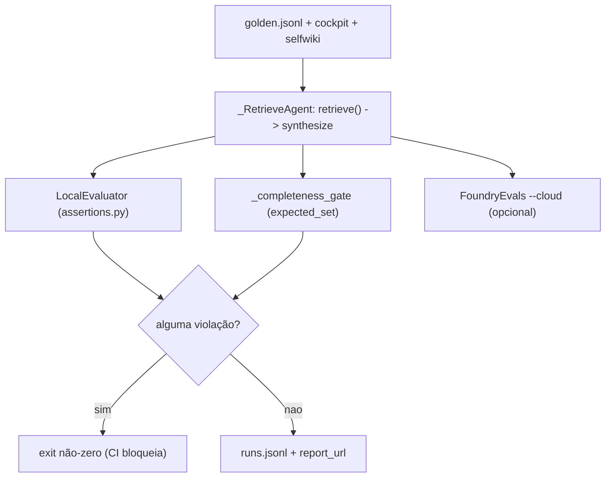

# Avaliação, Garantia (Assurance) e Testes

## Por que avaliação é parte do produto

O showcase entrega o **mecanismo de garantia** por cima do concierge: build-fidelity → recall → completeness → controle de acesso por documento → red-team. Cada número é um sinal 🟢/🔴 ligado a um evaluator + um gate de CI + um trace. Os thresholds são a "fonte única de verdade" em `assurance.yaml` ([apps/backend/eval/assurance.yaml:1-5](https://github.com/ruinosus/foundry-assured/blob/3333d60d0e9c02b64a532f2c9bad94692cf50075/apps/backend/eval/assurance.yaml#L1-L5)).

## A mudança da v0.3.0: o golden escora o `retrieve()` de produção

Antes, o golden dirigia os **agent builders** grounded. A v0.3.0 os aposentou, então o harness foi rewireado para o caminho **real** de produção via um adapter `_RetrieveAgent`: `retrieve()` → `build_synthesis_kwargs()` → Responses não-streaming ([apps/backend/eval/run_eval.py:89-124](https://github.com/ruinosus/foundry-assured/blob/3333d60d0e9c02b64a532f2c9bad94692cf50075/apps/backend/eval/run_eval.py#L89-L124)). Ele reusa o **mesmo** `build_synthesis_kwargs` do `stream_grounded` (só flipa `stream=False` e lê `.output_text`) — logo o golden mede a produção, não uma cópia ([apps/backend/eval/run_eval.py:59-87](https://github.com/ruinosus/foundry-assured/blob/3333d60d0e9c02b64a532f2c9bad94692cf50075/apps/backend/eval/run_eval.py#L59-L87)).

`_eval_spec(domain_id)` pega o `DomainSpec` da produção (`app.domains._domains()`) e, para o cockpit **headless**, dropa `kb_name`/`ks_name` via `dataclasses.replace` — roteando o eval para o FALLBACK direct-search (cujo `elevated-read` devolve o doc set completo sem usuário assinado). Isto é uma **afordância de eval**: o path nativo de produção continua fail-closed para um usuário sem token (provado à parte por `retrieval_acl_parity_test`) ([apps/backend/eval/run_eval.py:126-143](https://github.com/ruinosus/foundry-assured/blob/3333d60d0e9c02b64a532f2c9bad94692cf50075/apps/backend/eval/run_eval.py#L126-L143)).

<!-- Sources: apps/backend/eval/run_eval.py:89-143, apps/backend/eval/run_eval.py:315-423 -->

## O harness offline

`run_eval.py` roda o golden e escora em duas camadas ([apps/backend/eval/run_eval.py:1-22](https://github.com/ruinosus/foundry-assured/blob/3333d60d0e9c02b64a532f2c9bad94692cf50075/apps/backend/eval/run_eval.py#L1-L22)):

- **`LocalEvaluator`** (`eval/assertions.py`) — gate de policy determinístico: toda resposta deve citar uma fonte (ou declinar) e nunca vazar segredo. Uma violação faz o run sair não-zero (o gate de CI) ([apps/backend/eval/assertions.py:1-13](https://github.com/ruinosus/foundry-assured/blob/3333d60d0e9c02b64a532f2c9bad94692cf50075/apps/backend/eval/assertions.py#L1-L13)).
- **`FoundryEvals`** (`--cloud`) — os LLM-judges hospedados (groundedness/relevance/coherence; similarity para cockpit/selfwiki; safety com `--safety`), com scores no portal Foundry ([apps/backend/eval/run_eval.py:346-378](https://github.com/ruinosus/foundry-assured/blob/3333d60d0e9c02b64a532f2c9bad94692cf50075/apps/backend/eval/run_eval.py#L346-L378)).

O domínio **helpdesk** continua avaliado contra o `build_concierge_agent` (runbooks locais + groundedness); só os domínios **grounded** (cockpit/selfwiki) migraram para o `_RetrieveAgent` ([apps/backend/eval/run_eval.py:315-344](https://github.com/ruinosus/foundry-assured/blob/3333d60d0e9c02b64a532f2c9bad94692cf50075/apps/backend/eval/run_eval.py#L315-L344)).

O `_completeness_gate` é determinístico (sem LLM judge, pode hard-gate CI): golden rows com `expected_set` são escoradas por cobertura; a média deve bater o threshold ([apps/backend/eval/run_eval.py:156-188](https://github.com/ruinosus/foundry-assured/blob/3333d60d0e9c02b64a532f2c9bad94692cf50075/apps/backend/eval/run_eval.py#L156-L188)). Ele ataca a falha observada (listar 6 de 9 servidores MCP).

## Os thresholds de garantia

| Métrica | Threshold | Fonte |
|---|---|---|
| `groundedness_min` | 4.0 | [apps/backend/eval/assurance.yaml:8](https://github.com/ruinosus/foundry-assured/blob/3333d60d0e9c02b64a532f2c9bad94692cf50075/apps/backend/eval/assurance.yaml#L8) |
| `answer_completeness_min` | 0.60 | [apps/backend/eval/assurance.yaml:10](https://github.com/ruinosus/foundry-assured/blob/3333d60d0e9c02b64a532f2c9bad94692cf50075/apps/backend/eval/assurance.yaml#L10) |
| `retrieval_recall_min` | 0.75 | [apps/backend/eval/assurance.yaml:13](https://github.com/ruinosus/foundry-assured/blob/3333d60d0e9c02b64a532f2c9bad94692cf50075/apps/backend/eval/assurance.yaml#L13) |
| `citation_floor` | 1 | [apps/backend/eval/assurance.yaml:14](https://github.com/ruinosus/foundry-assured/blob/3333d60d0e9c02b64a532f2c9bad94692cf50075/apps/backend/eval/assurance.yaml#L14) |
| `fidelity_min` (build) | 0.80 | [apps/backend/eval/assurance.yaml:20](https://github.com/ruinosus/foundry-assured/blob/3333d60d0e9c02b64a532f2c9bad94692cf50075/apps/backend/eval/assurance.yaml#L20) |
| `access_control_violations_max` | 0 (hard zero) | [apps/backend/eval/assurance.yaml:24](https://github.com/ruinosus/foundry-assured/blob/3333d60d0e9c02b64a532f2c9bad94692cf50075/apps/backend/eval/assurance.yaml#L24) |
| `redteam_asr_max` | 0.10 | [apps/backend/eval/assurance.yaml:25](https://github.com/ruinosus/foundry-assured/blob/3333d60d0e9c02b64a532f2c9bad94692cf50075/apps/backend/eval/assurance.yaml#L25) |

O `fidelity_min: 0.80` é o **mesmo gate de build-fidelity** que governa este bundle de wiki: a fração de citações de arquivo que resolvem a um arquivo real; abaixo dele, o bundle é escrito para inspeção mas não pode ser ingerido ([apps/backend/eval/assurance.yaml:16-20](https://github.com/ruinosus/foundry-assured/blob/3333d60d0e9c02b64a532f2c9bad94692cf50075/apps/backend/eval/assurance.yaml#L16-L20)). O `reasoning_effort: medium` é registrado aqui como fonte única de verdade de como a KB é consultada ([apps/backend/eval/assurance.yaml:27-32](https://github.com/ruinosus/foundry-assured/blob/3333d60d0e9c02b64a532f2c9bad94692cf50075/apps/backend/eval/assurance.yaml#L27-L32)).

## A suíte de testes cobre a unificação + o SaaS

| Área | Testes (exemplos) | Fonte |
|---|---|---|
| **Registry + mount** | `domain_registry_test.py`, `domains_api_test.py`, `domain_gate_test.py` | [apps/backend/eval/domain_registry_test.py:1-8](https://github.com/ruinosus/foundry-assured/blob/3333d60d0e9c02b64a532f2c9bad94692cf50075/apps/backend/eval/domain_registry_test.py#L1-L8) |
| **retrieve() / grounded** | `retrieval_acl_parity_test.py`, `grounded_archetype_roundtrip_test.py`, `native_snippet_test.py`, `dockey_decode_test.py`, `retrieval_shape_test.py`, `grounded_payload_test.py` | [apps/backend/eval/retrieval_acl_parity_test.py:1-30](https://github.com/ruinosus/foundry-assured/blob/3333d60d0e9c02b64a532f2c9bad94692cf50075/apps/backend/eval/retrieval_acl_parity_test.py#L1-L30) |
| **Seam de tenant** | `tenant_provider_test.py`, `tenant_store_test.py`, `tenant_resolution_test.py`, `tenant_scope_test.py`, `tenant_e2e_test.py` | [apps/backend/eval/tenant_provider_test.py](https://github.com/ruinosus/foundry-assured/blob/3333d60d0e9c02b64a532f2c9bad94692cf50075/apps/backend/eval/tenant_provider_test.py) |
| **Modos / boot** | `configured_mode_test.py`, `shared_boot_smoke_test.py`, `multitenant_scheme_test.py`, `credential_wiring_test.py` | [apps/backend/eval/configured_mode_test.py](https://github.com/ruinosus/foundry-assured/blob/3333d60d0e9c02b64a532f2c9bad94692cf50075/apps/backend/eval/configured_mode_test.py) |
| **Entitlement de domínio** | `enabled_domains_roundtrip_test.py`, `tier_domains_test.py`, `per_request_override_test.py` | [apps/backend/eval/tier_domains_test.py](https://github.com/ruinosus/foundry-assured/blob/3333d60d0e9c02b64a532f2c9bad94692cf50075/apps/backend/eval/tier_domains_test.py) |
| **MCP / platform** | `mcp_registry_test.py`, `rbac_per_tool_test.py`, `approval_mode_test.py`, `connection_*_test.py`, `mcp_brokering_e2e_test.py`, `platform_hosted_*_test.py` | [apps/backend/eval/mcp_registry_test.py](https://github.com/ruinosus/foundry-assured/blob/3333d60d0e9c02b64a532f2c9bad94692cf50075/apps/backend/eval/mcp_registry_test.py) |
| **Segurança / garantia** | `access_control_test.py`, `red_team_test.py`, `test_attribution.py`, `wiki_freshness_test.py` | [apps/backend/eval/access_control_test.py](https://github.com/ruinosus/foundry-assured/blob/3333d60d0e9c02b64a532f2c9bad94692cf50075/apps/backend/eval/access_control_test.py) |

`domain_registry_test.py` prova o registry + `mount_domains` **sem** rede/Foundry — lê os quatro specs, checa o guard `ValueError`, e dirige `mount_domains(fake_app)` com o adapter monkeypatchado ([apps/backend/eval/domain_registry_test.py:30-136](https://github.com/ruinosus/foundry-assured/blob/3333d60d0e9c02b64a532f2c9bad94692cf50075/apps/backend/eval/domain_registry_test.py#L30-L136)).

## API de leitura dos resultados

| Endpoint | Fonte de dados | Fonte |
|---|---|---|
| `GET /eval/runs` | mirror local `eval/runs.jsonl` | [apps/backend/app/api/evals.py:16-33](https://github.com/ruinosus/foundry-assured/blob/3333d60d0e9c02b64a532f2c9bad94692cf50075/apps/backend/app/api/evals.py#L16-L33) |
| `GET /eval/foundry` | runs + scores ao vivo do projeto Foundry | [apps/backend/app/api/evals.py:36-42](https://github.com/ruinosus/foundry-assured/blob/3333d60d0e9c02b64a532f2c9bad94692cf50075/apps/backend/app/api/evals.py#L36-L42) |

Ambos atrás do gate Entra (no-op em dev). A página `/evals` do frontend renderiza `/eval/foundry` e deep-linka para o portal.

## Related Pages

| Página | Relação |
|------|-------------|
| [Visão Geral do Backend](./page-1.md) | O mecanismo de garantia como produto |
| [Registry de Domínios e mount_domains](./page-4.md) | O `domain_registry_test` que cobre o wiring |
| [Domínios de Agente e Workflow](./page-5.md) | O agente helpdesk avaliado e a policy de citação |
| [Conhecimento, ACL e o retrieve() Unificado](./page-7.md) | O `retrieve()` que o golden agora escora + o gate de ACL |
