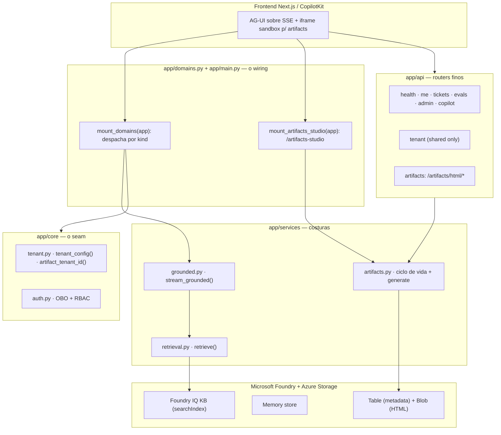

# Visão Geral do Backend (SaaS Híbrido + HTML Artifacts)

## Por que este backend existe

O backend é um concierge de suporte de engenharia construído sobre o **Microsoft Foundry** e o **Microsoft Agent Framework**, exposto ao frontend via **AG-UI sobre SSE**. Ele tria a intenção do desenvolvedor, busca em bases de conhecimento (Foundry IQ), redige respostas fundamentadas com citações, decide se precisa de uma ação humana (abrir ticket) e lembra preferências entre sessões — tudo avaliado e rastreável.

**Fato (lido no código):** o entrypoint declara `FastAPI(title="Foundry Assured", version="0.1.0", ...)` e roda como `app.main:app` (apps/backend/app/main.py:35). O `pyproject.toml` declara o pacote como `name = "foundry-helpdesk-backend"`, `version = "0.1.0"` (apps/backend/pyproject.toml:2-4); este bundle de wiki é **v0.4.0** por refletir a evolução da arquitetura, não a versão do pacote Python.

## O que mudou desde a v0.3.0

A v0.3.0 já descrevia o seam SaaS (A→B→C→D), os quatro domínios e a unificação grounded (a costura única `retrieve()` + o registry de domínios). A **v0.4.0 adiciona uma feature transversal grande: HTML Artifacts** — gerar, versionar e governar documentos HTML autocontidos que o frontend renderiza dentro de um `<iframe>` sandbox. São duas superfícies novas no backend:

| Novidade (v0.4.0) | O que é | Fonte |
|---|---|---|
| **Pacote `app/artifacts/`** | modelo imutável (`ArtifactRecord`) + stores swappable (Table/Blob/InMemory) + validação de HTML | (apps/backend/app/artifacts/models.py:37-53), (apps/backend/app/artifacts/store.py:13-140) |
| **Serviço de ciclo de vida** | `create_draft`/`replace_content`/`request_approval`/`approve`/`reject`/`archive` + `generate` (LLM) | (apps/backend/app/services/artifacts.py:61-207) |
| **Router `/artifacts`** | HTTP fino + RBAC por App Role + header `Content-Security-Policy: sandbox` | (apps/backend/app/api/artifacts.py:15-135) |
| **Studio agent (`/artifacts-studio`)** | agente generativo-UI **skill-driven** (SkillsProvider + `update_artifact` 4-arg + shared/predictive state + `require_confirmation`) | (apps/backend/app/agents/artifacts_studio.py:79-124) |
| **Grounding read-only** | `build_artifact_mcp_reads()` — MCP só de leitura para grounding, nunca write | (apps/backend/app/agents/mcp/tools.py:139-150) |
| **Biblioteca de skills** | 4 `SKILL.md` (`report`/`slides`/`walkthrough`/`dashboard`) que ensinam o modelo a construir cada tipo de artefato | (apps/backend/artifact-skills/report/SKILL.md:1-6) |

O detalhe completo da feature está em [HTML Artifacts: Persistência, Ciclo de Vida e o Studio Skill-Driven](./page-8.md).

## Mapa de camadas (big picture)



<!-- Sources: apps/backend/app/main.py:45-51, apps/backend/app/domains.py:178-187, apps/backend/app/agents/artifacts_studio.py:111-124, apps/backend/app/services/artifacts.py:61-82 -->

## Os quatro domínios de agente + as superfícies transversais

`DOMAIN_IDS` enumera explicitamente os domínios registrados (apps/backend/app/core/tenant.py:223):

```python
DOMAIN_IDS: tuple[str, ...] = ("helpdesk", "cockpit", "selfwiki", "platform")
```

O backend tem um **registry gêmeo do frontend** (`apps/frontend/lib/domains.ts`): cada domínio é uma linha `DomainSpec` com um `kind`, e `mount_domains` monta o endpoint certo por kind (apps/backend/app/domains.py:63-96).

| Domínio | `kind` | Endpoint | Como é montado | Fonte |
|---|---|---|---|---|
| `helpdesk` | `workflow` | `/helpdesk` | `add_agent_framework_fastapi_endpoint` (workflow-as-agent) | (apps/backend/app/domains.py:143-160) |
| `cockpit` | `grounded` | `/cockpit` | `POST` → `stream_grounded` (ACL trim) | (apps/backend/app/domains.py:122-140) |
| `selfwiki` | `grounded` | `/selfwiki` | `POST` → `stream_grounded` (single-audience) | (apps/backend/app/domains.py:85-94) |
| `platform` | `tool` | `/platform` | adapter + `platform_agent_proxy` (MCP) | (apps/backend/app/domains.py:163-175) |

**Fora do registry de domínios**, a v0.4.0 adiciona duas superfícies **transversais** montadas à parte em `main.py`: o **Studio de Artefatos** (`/artifacts-studio`, um AG-UI agent) e o **router HTTP `/artifacts`** (apps/backend/app/main.py:45-51). O Studio é deliberadamente **não** gated por entitlement de domínio (ADR-010) — é uma ferramenta de autoria Author/Admin, não um domínio `/d/[domain]` licenciável (apps/backend/app/agents/artifacts_studio.py:111-116).

## Stack e dependências

| Dependência | Papel | Fonte |
|---|---|---|
| `agent-framework>=1.9.0` | agentes + `WorkflowBuilder` + `SkillsProvider` + `@tool` | (apps/backend/pyproject.toml:8) |
| `agent-framework-ag-ui>=1.0.0rc5` | adapter AG-UI (`AgentFrameworkAgent`, shared state) | (apps/backend/pyproject.toml:9) |
| `azure-ai-projects>=2.2.0` | cliente Foundry (síntese Responses, memory, eval, geração de HTML) | (apps/backend/pyproject.toml:10) |
| `azure-search-documents>=11.7.0b2` | ingestão da KB (knowledge source/base) | (apps/backend/pyproject.toml:11) |
| `fastapi-azure-auth>=5.2.0` | validação de JWT Entra (Single/Multi) | (apps/backend/pyproject.toml:14) |
| `azure-data-tables>=12.7.0` | tenant store + **artifact store** (Table Storage) | (apps/backend/pyproject.toml:20) |
| `httpx>=0.28.1` | POST direto ao KB `retrieve` + passthrough hosted | (apps/backend/pyproject.toml:21) |

## Regra inegociável: auth sempre via credencial Azure

Não há API key hardcoded. No caminho grounded, a **síntese** (Responses API) roda **On-Behalf-Of** do usuário assinado, e o `retrieve()` usa a identidade do app (managed identity) como credencial de serviço **mais** o token de busca do usuário no header ACL (apps/backend/app/services/grounded.py:58-73, apps/backend/app/services/retrieval.py:60-70). A geração de HTML dos artifacts segue o mesmo padrão — OBO do usuário para a Responses API (apps/backend/app/services/artifacts.py:170-195). Ver [Autenticação, OBO e RBAC](./page-3.md).

## Inconsistências observadas no código (a wiki relata as suas próprias)

- **`title="Foundry Assured"` vs pacote `foundry-helpdesk-backend`:** o app FastAPI mantém o título/histórico "Foundry Assured" (apps/backend/app/main.py:35) enquanto o pacote se chama `foundry-helpdesk-backend` (apps/backend/pyproject.toml:2). Cosmético, mas um mismatch real.
- **`version="0.1.0"` estagnado:** `main.py`, `pyproject.toml` e `package.json` seguem em `0.1.0` enquanto o bundle de wiki é `v0.4.0` — o versionamento da wiki acompanha a arquitetura, não o pacote (apps/backend/app/main.py:35).
- **`ArtifactStatus.REJECTED` reservado mas sem uso:** o status `rejected` existe no enum mas `reject()` volta o artefato para `DRAFT` — reservado para uma trilha de auditoria futura (apps/backend/app/artifacts/models.py:13).

## Related Pages

| Página | Relação |
|------|-------------|
| [Modos de Implantação e o Seam de Tenant](./page-2.md) | O seam `DEPLOYMENT_MODE` + `artifact_tenant_id()` |
| [Autenticação, OBO e RBAC](./page-3.md) | Como a identidade do usuário/tenant chega ao core |
| [Registry de Domínios e mount](./page-4.md) | Como domínios + `/artifacts` + `/artifacts-studio` são montados |
| [HTML Artifacts + Studio Skill-Driven](./page-8.md) | A feature nova da v0.4.0 em detalhe |
| [Conhecimento, ACL e o retrieve() Unificado](./page-7.md) | A costura de recuperação grounded |
