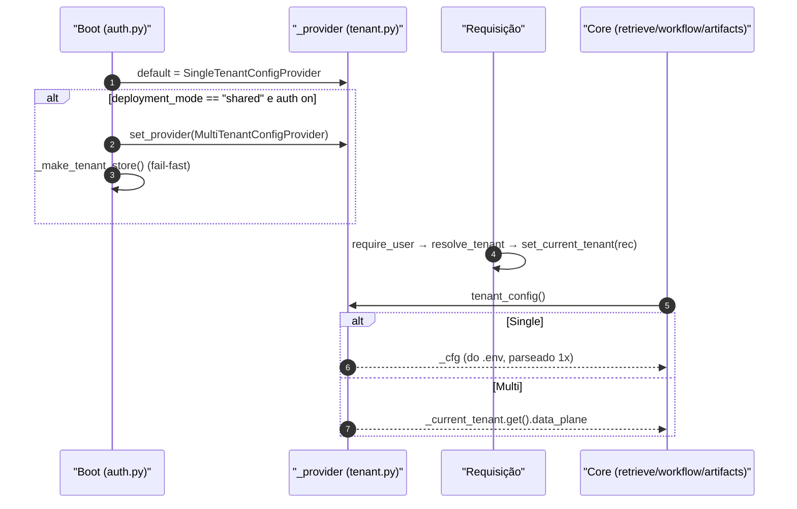
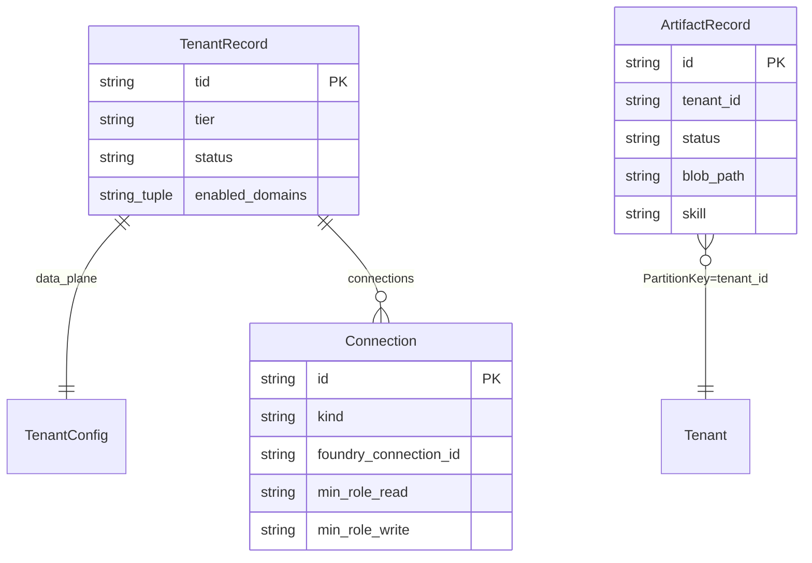

# Modos de Implantação e o Seam de Tenant

## Por que existe um seam

A passagem de single-tenant para SaaS poderia ter contaminado todo o core com `if multi_tenant:`. Em vez disso, o backend isola **toda** a variação por tenant atrás de uma única função — `tenant_config()` — e troca a implementação dela no boot (apps/backend/app/core/tenant.py:1-6). Isso vale igualmente para a costura `retrieve()` e para a nova feature de **HTML Artifacts**, cujas stores leem o tenant particionador via `artifact_tenant_id()` (apps/backend/app/core/tenant.py:216-219).

## Os três modos

| Modo (`deployment_mode`) | Tenancy | Config de tenant | Auth | Fonte |
|---|---|---|---|---|
| `self_hosted` (default) | Único, do cliente | `.env` estático (`SingleTenantConfigProvider`) | SingleTenant Entra ou off | (apps/backend/app/core/settings.py:17) |
| `dedicated` | Único, dedicado | `.env` estático | SingleTenant Entra | (apps/backend/app/core/auth.py:56-64) |
| `shared` | Multi-tenant | Por requisição (`MultiTenantConfigProvider`) | MultiTenant Entra + tenant store | (apps/backend/app/core/auth.py:65-74) |

## Sumário do módulo

| Conceito | Símbolo | Arquivo | Fonte |
|---|---|---|---|
| Dados de plano-de-dados por tenant | `TenantConfig` (frozen, ZERO segredos) | `tenant.py` | (apps/backend/app/core/tenant.py:19) |
| Provider abstrato | `TenantConfigProvider` (Protocol) | `tenant.py` | (apps/backend/app/core/tenant.py:171-172) |
| Single-tenant (`.env`) | `SingleTenantConfigProvider` | `tenant.py` | (apps/backend/app/core/tenant.py:175-185) |
| Multi-tenant (por requisição) | `MultiTenantConfigProvider` | `tenant.py` | (apps/backend/app/core/tenant.py:196-203) |
| Acessor único do core | `tenant_config()` | `tenant.py` | (apps/backend/app/core/tenant.py:270-272) |
| Partição de artifacts | `artifact_tenant_id()` | `tenant.py` | (apps/backend/app/core/tenant.py:216-219) |
| Registro persistido | `TenantRecord`, `Connection` | `tenant_store.py` | (apps/backend/app/core/tenant_store.py:16-38) |

## `TenantConfig`: o que varia por tenant

`TenantConfig` é uma dataclass **frozen** que carrega apenas ponteiros de plano-de-dados — **zero segredos** (apps/backend/app/core/tenant.py:19). Campos que a costura `retrieve()` lê por domínio:

| Campo | Para quê | Fonte |
|---|---|---|
| `foundry_project_endpoint`, `foundry_model` | projeto + deployment (síntese Responses; geração de HTML) | (apps/backend/app/core/tenant.py:26-28) |
| `azure_search_endpoint` | endpoint da busca (retrieve nativo + fallback) | (apps/backend/app/core/tenant.py:37) |
| `cockpit_searchindex_knowledge_base`, `cockpit_searchindex_knowledge_source` | **KB searchIndex** do cockpit (path nativo + ACL header) | (apps/backend/app/core/tenant.py:56-57) |
| `selfwiki_searchindex_knowledge_base`, `selfwiki_searchindex_knowledge_source` | **KB searchIndex** do selfwiki (single-audience) | (apps/backend/app/core/tenant.py:69-70) |
| `cockpit_search_index` / `selfwiki_search_index` | alvo do **direct-search** fallback (ACL trima aqui também) | (apps/backend/app/core/tenant.py:51-64) |
| `acl_*` | controle de acesso por documento (grupos → object-ID) | (apps/backend/app/core/tenant.py:57-62) |
| `foundry_memory_store` | memória por usuário (workflow helpdesk) | (apps/backend/app/core/tenant.py:90) |

**Fato (lido no código):** os campos `cockpit_search_knowledge_base` (KB azureBlob legado) e os hosted twins grounded `cockpit_hosted_agent_name`/`selfwiki_hosted_agent_name` ainda existem no `TenantConfig` (apps/backend/app/core/tenant.py:50, apps/backend/app/core/tenant.py:97-98) — resíduos de config que o path grounded (live-OBO sobre a KB searchIndex) deixou de consumir.

A property `acl_group_map` resolve nomes de grupo → object-IDs do Entra, combinando o trio demo (`public`/`internal`/`confidential`) com o CSV `acl_extra_group_map` (apps/backend/app/core/tenant.py:90-115).

## `artifact_tenant_id()`: a partição de artifacts

A feature de HTML Artifacts particiona metadados e blobs por tenant, mas — diferente do path grounded — **não** exige um tenant resolvido em todos os modos. A costura é uma função dedicada (apps/backend/app/core/tenant.py:216-219):

```python
def artifact_tenant_id() -> str:
    """Tenant partition for artifacts. In shared mode this is the resolved tid;
    in self_hosted/dedicated there is no per-request tenant, so use 'default'."""
    return current_tenant_id() or "default"
```

Em `shared` devolve o `tid` resolvido; em `self_hosted`/`dedicated` cai para o literal `"default"`. É a chave de PartitionKey de toda `ArtifactRecord` e o prefixo de todo blob path — ver [HTML Artifacts](./page-8.md).

## Os dois providers e como a seleção acontece



<!-- Sources: apps/backend/app/core/tenant.py:175-203, apps/backend/app/core/auth.py:77-97 -->

- **Single:** `SingleTenantConfigProvider` parseia `_TenantEnv()` (um `BaseSettings` lendo `.env`) **uma vez** na construção, porque o core chama `tenant_config()` várias vezes por run (apps/backend/app/core/tenant.py:175-185, apps/backend/app/core/tenant.py:125-167).
- **Multi:** `MultiTenantConfigProvider.current()` lê o `TenantRecord` da requisição via o contextvar `_current_tenant`; se nenhum tenant foi resolvido, **levanta `RuntimeError`** (fail-closed) (apps/backend/app/core/tenant.py:196-203).

O provider ativo é uma global trocada por `set_provider()` (apps/backend/app/core/tenant.py:265-267). O contextvar é setado por `set_current_tenant()` e lido por `current_tenant_id()` (usado pelo `memory_scope` e por `artifact_tenant_id`) (apps/backend/app/core/tenant.py:206-219).

## Entitlement por domínio e por tier (ADR-010)

Em shared mode, **todos** os domínios são montados, mas o acesso é filtrado por tenant. Dois mecanismos:

1. **Seed por tier** no onboarding: `TIER_DOMAINS` mapeia tier → tupla de domínios; `domains_for_tier(tier)` cai para `DOMAIN_IDS` (todos) quando o tier é desconhecido (apps/backend/app/core/tenant.py:228-237).
2. **Gate por requisição** `require_domain(domain_id)`: dependência FastAPI fail-closed que retorna **403** a menos que o `enabled_domains` do tenant contenha o domínio (apps/backend/app/core/tenant.py:240-256).

```python
# require_domain — fail-closed (app/core/tenant.py:252-256)
async def _check(_user=Depends(require_user)) -> None:
    rec = _current_tenant.get()
    enabled = getattr(rec, "enabled_domains", None) or ()
    if rec is None or domain_id not in enabled:
        raise HTTPException(status_code=403, detail=f"domain '{domain_id}' not enabled for tenant")
```

`require_domain` **sub-depende de `require_user`**, então o FastAPI resolve o tenant antes do gate rodar (apps/backend/app/core/tenant.py:240-252). **Nota:** o Studio de Artefatos **não** usa `require_domain` — é uma ferramenta transversal Author/Admin, não um domínio licenciável (apps/backend/app/agents/artifacts_studio.py:111-116).

## Os stores: persistência swappable (tenant + artifacts)

O padrão do tenant store — Protocol + fake InMemory + impl Azure com import preguiçoso — é **reusado verbatim** pela feature de artifacts (a docstring de `store.py` diz "Mirrors app/core/tenant_store.py") (apps/backend/app/artifacts/store.py:1-11).



<!-- Sources: apps/backend/app/core/tenant_store.py:16-38, apps/backend/app/artifacts/models.py:37-53 -->

`Connection` é uma dataclass frozen cujo `kind` deve ser um id do registry MCP **verbatim**; **não carrega segredo** (apps/backend/app/core/tenant_store.py:16-28). Helpers imutáveis fazem upsert/remoção (`with_connection`/`without_connection`) (apps/backend/app/core/tenant_store.py:46-54), e `validate_kind` confirma contra o catálogo `SERVERS` (apps/backend/app/core/tenant_store.py:41-43).

### Implementações de store (swappable)

| Domínio | Impl memory (dev/CI) | Impl Azure (produção) | Backend flag | Fonte |
|---|---|---|---|---|
| Tenant | `InMemoryTenantStore` | `TableStorageTenantStore` | `tenant_store_backend` | (apps/backend/app/core/tenant_store.py:63-117) |
| Artifact metadata | `InMemoryArtifactStore` | `TableArtifactStore` | `artifact_store_backend` | (apps/backend/app/artifacts/store.py:19-91) |
| Artifact content | `InMemoryContentStore` | `BlobContentStore` | `artifact_store_backend` | (apps/backend/app/artifacts/store.py:99-140) |

A seleção do tenant store é feita por `_make_tenant_store()` no boot, com **fail-fast** se `tenant_store_account_url` estiver vazio (apps/backend/app/core/auth.py:77-94); a dos artifact stores por `make_artifact_store()`/`make_content_store()` (apps/backend/app/artifacts/factory.py:7-44). Em todos os casos o SDK Azure só é importado na construção da classe, então dev/CI in-memory nunca o importa.

## Settings globais de plataforma vs. config de tenant

`PlatformSettings` carrega **apenas** o que é global (modo, wiring dos stores tenant/artifact, Entra, flags MCP, CORS) — explicitamente NÃO os ponteiros de plano-de-dados (apps/backend/app/core/settings.py:1-6). Os campos de artifacts (backend, account URLs, tabela, container, cap de 2 MB) vivem aqui (apps/backend/app/core/settings.py:24-30). O catálogo de tids permitidos a auto-onboarding fica em `onboarding_allowed_tids`/`allowed_tids` (apps/backend/app/core/settings.py:49-52).

## Related Pages

| Página | Relação |
|------|-------------|
| [Visão Geral do Backend](./page-1.md) | Contexto do seam SaaS + artifacts |
| [Autenticação, OBO e RBAC](./page-3.md) | Onde `resolve_tenant`/`set_current_tenant` rodam |
| [Registry de Domínios e mount](./page-4.md) | A API `/tenant` que escreve no store; `require_domain` no registry |
| [HTML Artifacts](./page-8.md) | Como `artifact_tenant_id()` + os stores sustentam a feature |
