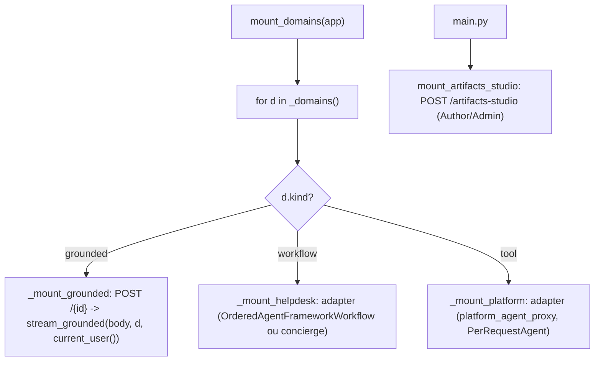
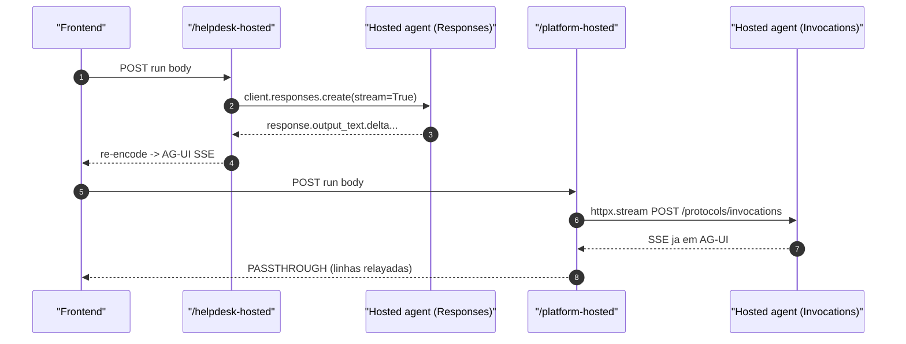

# Registry de Domínios, Endpoints e o Wiring do mount

## O registry de domínios + o wiring transversal

O wiring dos endpoints AG-UI vive num **registry de domínios** (`app/domains.py`) — o gêmeo de backend do `apps/frontend/lib/domains.ts` — e um único loop `mount_domains(app)` que **despacha por `kind`** (apps/backend/app/domains.py:178-187). O `main.py` ficou fino: cria o app, aplica CORS, inclui os routers HTTP, e monta os domínios **mais** o Studio de Artefatos (apps/backend/app/main.py:45-51):

```python
app.include_router(api_router)
mount_domains(app)          # helpdesk / cockpit / selfwiki / platform
mount_artifacts_studio(app) # /artifacts-studio (transversal, fora do registry)
```

O `lifespan` pré-carrega a config OpenID do Entra e fecha o cliente hosted no shutdown (apps/backend/app/main.py:28-35).

## `DomainSpec`: uma linha por domínio

```python
@dataclass(frozen=True)
class DomainSpec:
    id: str
    kind: Literal["grounded", "workflow", "tool"]
    instructions: str = ""
    kb_name: str | None = None
    ks_name: str | None = None        # KB's knowledge-source name (native path)
    search_index: str | None = None   # direct-search fallback target
    search_endpoint: str = ""
    acl_group_map: dict | None = None # name→objectID; None/empty → no ACL trim
    hosted_agent_name: str | None = None
```

(apps/backend/app/domains.py:35-53)

**Fato (lido no código):** `__post_init__` faz o spec **fail fast** — um domínio grounded que não resolve nem `kb_name` nem `search_index` levantaria uma `ValueError` no build do registry, em vez de cair depois em `.../indexes/None/docs/search` no `retrieve()` (apps/backend/app/domains.py:54-60). A **ACL é DADO** (RULE #6): o registry só carrega `acl_group_map` (name→objectID) — nunca classifica.

`_domains()` lê `tenant_config()` **lazily** e devolve as quatro linhas (apps/backend/app/domains.py:63-99):

| Domínio | `kind` | `acl_group_map`? | Fonte |
|---|---|---|---|
| helpdesk | workflow | — | (apps/backend/app/domains.py:70-74) |
| cockpit | grounded | **sim** | (apps/backend/app/domains.py:75-84) |
| selfwiki | grounded | não (single-audience) | (apps/backend/app/domains.py:85-94) |
| platform | tool | (map `app-users`, se houver) | (apps/backend/app/domains.py:95-98) |

## `mount_domains`: um loop, três branches



<!-- Sources: apps/backend/app/domains.py:122-187, apps/backend/app/agents/artifacts_studio.py:111-124 -->

- **grounded** (`_mount_grounded`): registra `POST /{id}` que captura `current_user()` no corpo (o contextvar se perde no gerador) e devolve `StreamingResponse(stream_grounded(...))` (apps/backend/app/domains.py:122-140).
- **workflow** (`_mount_helpdesk`): com KB configurada, monta o workflow via `add_agent_framework_fastapi_endpoint`; sem KB, cai para o concierge sem deps (apps/backend/app/domains.py:143-160).
- **tool** (`_mount_platform`): só monta quando `platform_configured()`; serve o `platform_agent_proxy` (apps/backend/app/domains.py:163-175).

## `_domain_deps`: o gate por modo

`_domain_deps(domain_id)` retorna `auth_dependencies()` e, **só em shared**, anexa `Depends(require_domain(domain_id))`. Em self_hosted/dedicated é byte-idêntico a só auth (apps/backend/app/domains.py:113-119). **Nota:** o `/artifacts-studio` **não** usa `_domain_deps` — anexa `auth_dependencies()` + `require_role("Author","Admin")` diretamente, porque não é um domínio licenciável (apps/backend/app/agents/artifacts_studio.py:119-124).

## Mapa de endpoints

| Endpoint | Método/Protocolo | Gate | Fonte |
|---|---|---|---|
| `/healthz` | GET | nenhum | (apps/backend/app/api/health.py:6-7) |
| `/me` | GET | `require_user` | (apps/backend/app/api/me.py:19-20) |
| `/tickets` | GET | `auth_dependencies()` | (apps/backend/app/api/tickets.py:9-10) |
| `/eval/runs`, `/eval/foundry` | GET | `auth_dependencies()` | (apps/backend/app/api/evals.py:16-42) |
| `/admin/*` | GET/POST/DELETE | `require_role("Admin")` | (apps/backend/app/api/admin.py:47-88) |
| `/artifacts/html/*` | GET/POST | Author / Approver / Reader (por rota) | (apps/backend/app/api/artifacts.py:48-135) |
| `/tenant/*` | GET/POST/PUT/DELETE | Admin + tenant-scoped (**shared only**) | (apps/backend/app/api/tenant.py:72-142) |
| `/helpdesk` | AG-UI (workflow ou concierge) | `_domain_deps("helpdesk")` | (apps/backend/app/domains.py:143-160) |
| `/cockpit`, `/selfwiki` | `POST` → SSE grounded | `_domain_deps(...)` | (apps/backend/app/domains.py:122-140) |
| `/platform` | AG-UI (MCP) | `_domain_deps("platform")` | (apps/backend/app/domains.py:163-175) |
| `/artifacts-studio` | AG-UI (shared-state) | Author/Admin | (apps/backend/app/agents/artifacts_studio.py:119-124) |
| `/helpdesk-hosted` | Responses → AG-UI | `auth_dependencies()` | (apps/backend/app/api/chat.py:12-13) |
| `/platform-hosted` | Invocations passthrough | `_domain_deps("platform")` | (apps/backend/app/api/chat.py:29-30) |

## Agregação de routers

`api_router` inclui os routers fixos — agora incluindo `artifacts` — e, **só em shared mode**, inclui o router `/tenant` (importado lazy) (apps/backend/app/api/__init__.py:6-21):

```python
from app.api import admin, artifacts, chat, copilot, evals, health, me, tickets
...
api_router.include_router(artifacts.router)
if settings.deployment_mode == "shared":
    from app.api import tenant
    api_router.include_router(tenant.router)
```

## Pontes hosted: só duas restam

Os hosted twins **grounded** (`/cockpit-hosted`, `/selfwiki-hosted`) foram removidos — o `chat.py` só tem `/helpdesk-hosted` e `/platform-hosted` (apps/backend/app/api/chat.py:12-34). O grounded roda **live-OBO**.



<!-- Sources: apps/backend/app/api/chat.py:12-34, apps/backend/app/services/hosted.py:72-121 -->

- **`/helpdesk-hosted`** (`stream_agui`): consome o protocolo **Responses** do hosted agent e re-encoda cada `response.output_text.delta`; o cliente async é cacheado (apps/backend/app/services/hosted.py:72-105).
- **`/platform-hosted`** (`stream_platform_agui`): usa o protocolo **Invocations**, que já serve AG-UI — passthrough 1:1 (apps/backend/app/services/hosted.py:121-135).

## A API de tenant (shared mode)

Gerenciamento per-tenant de config + connections, Admin-gated + tenant-scoped. Todo write é um **read-modify-write do próprio registro do caller** (`current_tenant_id()`) — nenhum `tid` vem do path (apps/backend/app/api/tenant.py:37-67). O onboarding semeia `enabled_domains` pelo tier, e `PUT /domains` rejeita ids fora de `DOMAIN_IDS` (apps/backend/app/api/tenant.py:86-142).

## A API admin (Microsoft Graph app-only)

`/admin/*` dirige o ciclo de vida de usuário + atribuição de papel via Microsoft Graph **app-only**, cada rota Admin-gated (apps/backend/app/api/admin.py:47-88).

## Related Pages

| Página | Relação |
|------|-------------|
| [Modos de Implantação e o Seam de Tenant](./page-2.md) | `require_domain`, `TenantConfig`, `Connection` usados aqui |
| [Autenticação, OBO e RBAC](./page-3.md) | `auth_dependencies`, `require_role`, `onboarding_guard` |
| [Domínios de Agente e Workflow](./page-5.md) | Os builders que o registry monta nos endpoints |
| [HTML Artifacts](./page-8.md) | O router `/artifacts` e o mount do `/artifacts-studio` |
