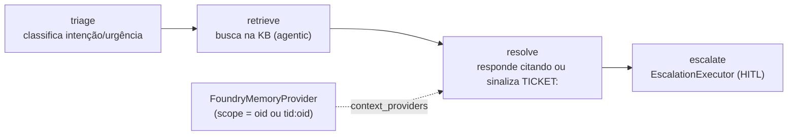
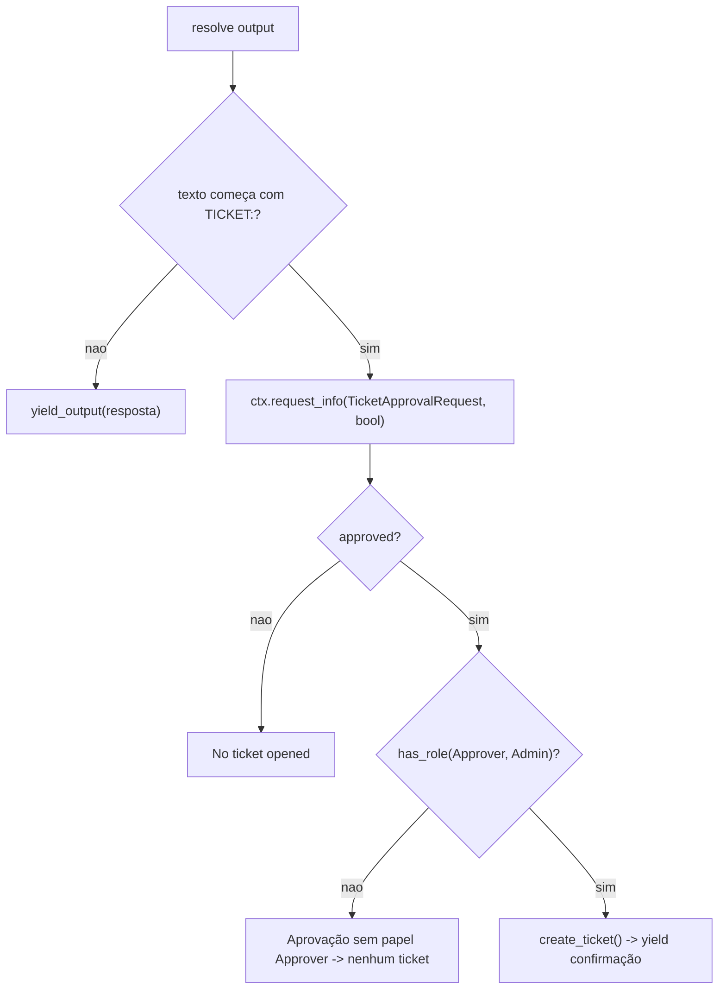

# Domínios de Agente e o Workflow Helpdesk

## Por que um workflow, não um agente único

O domínio `helpdesk` é o de maior risco do showcase: expor um **workflow multi-agente** sobre AG-UI de forma que o frontend receba os passos intermediários (triage, retrieve, draft), não só a resposta final. A solução é **workflow-as-agent** (apps/backend/app/workflow/graph.py:1-14). Os dois domínios grounded (`cockpit`/`selfwiki`) são Q&A simples e **não têm agente próprio**: rodam pela costura `stream_grounded` + `retrieve()`.

## O workflow construído por requisição

`build_helpdesk_workflow(thread_id)` é **per-request** para cada run usar a credencial OBO do usuário e seu próprio escopo de memória (apps/backend/app/workflow/graph.py:28-52):

1. `credential = credential_for_request()` e `scope = memory_scope()` (apps/backend/app/workflow/graph.py:30-31);
2. `memory = build_memory_provider(credential, scope)` (apps/backend/app/workflow/graph.py:33);
3. constrói os três agentes + o `EscalationExecutor` (apps/backend/app/workflow/graph.py:35-40);
4. monta `add_chain([triage, retrieve, resolve, escalate])` (apps/backend/app/workflow/graph.py:52).

<!-- Sources: apps/backend/app/workflow/graph.py:28-52, apps/backend/app/workflow/agents.py:34-56 -->

Os três agentes são `FoundryChatClient.as_agent(...)` com `name` **lowercase UI-facing** (`triage`/`retrieve`/`resolve`), porque o `name` vira o id do executor que o adapter AG-UI emite como o passo renderizado (apps/backend/app/workflow/agents.py:34-56). O `_client()` lê endpoint/modelo de `tenant_config()` — ponto onde o seam de tenant entra no workflow (apps/backend/app/workflow/agents.py:25-31).

### Nuance importante

O nó `retrieve` do workflow **ainda** injeta `AzureAISearchContextProvider(mode="agentic")` apontando para `azure_search_knowledge_base` (a KB helpdesk) — ele **não** migrou para a costura `retrieve()` (apps/backend/app/workflow/agents.py:42-49). A unificação sobre `retrieve()` valeu para os **domínios grounded** (cockpit/selfwiki); o workflow helpdesk mantém o context-provider agentic nativo do agent-framework. É um ponto de assimetria real.

## Memória por usuário (Fase 3)

`build_memory_provider` retorna um `FoundryMemoryProvider` scoped a um usuário, ou `None` quando memória não está configurada (apps/backend/app/workflow/memory.py:27-41). Antes de um run, busca as memórias do usuário e as injeta; depois, armazena novas — com `update_delay=0` (grava imediatamente) (apps/backend/app/workflow/memory.py:22-41).

## HITL: ticket só após aprovação humana + papel

O `EscalationExecutor` é o nó final. Por que um nó `request_info` do workflow em vez de uma tool com approval-mode: o adapter AG-UI duplica o `TOOL_CALL_START` para tools approval-gated, quebrando o stream; o mecanismo nativo de request/response emite um interrupt limpo que o CopilotKit renderiza (apps/backend/app/workflow/escalation.py:1-17).

<!-- Sources: apps/backend/app/workflow/escalation.py:51-93, apps/backend/app/agents/prompts.py:26-43 -->

O contrato textual: `resolve` responde **exatamente** `TICKET: <one-line summary>` quando é um pedido de ação (apps/backend/app/agents/prompts.py:26-43). O `on_resolve` inspeciona o prefixo `TICKET:` e pausa com `ctx.request_info(... response_type=bool)`; o `on_decision` só cria o ticket se `approved` E `has_role("Approver", "Admin")` (apps/backend/app/workflow/escalation.py:51-93). Assim "nenhum ticket sem aprovação" vale **estruturalmente** — o mesmo princípio que governa a publicação de um HTML Artifact (ver [HTML Artifacts](./page-8.md)).

`create_ticket` é uma ação **real, persistida** em `data/tickets.jsonl`; também exposta como `@tool` para o hosted agent chamar autonomamente (apps/backend/app/tools/tickets.py:1-10, apps/backend/app/tools/tickets.py:28-48).

## O fix de ordering do stream (workflow-as-agent)

O workflow live é servido por `OrderedAgentFrameworkWorkflow`, um wrap de `AgentFrameworkWorkflow` que corrige um bug de ordenação do adapter (rc5): reordena para fechar toda mensagem de texto aberta antes de qualquer evento terminal, e suprime o trio `TOOL_CALL` do `request_info` que deixava um spinner preso (apps/backend/app/workflow/stream_fix.py:51-54). É o que o `_mount_helpdesk` instancia (apps/backend/app/domains.py:143-160).

## Os domínios grounded: sem agente, pela costura

O path grounded é `stream_grounded(body, domain, user)` sobre `retrieve()`, dirigido só pelos **dados** do `DomainSpec` (KB, instructions, `acl_group_map`).

| Domínio | Instructions | Diferença-chave | Fonte |
|---|---|---|---|
| cockpit | `COCKPIT_INSTRUCTIONS` | **ACL trim por usuário** (via header no `retrieve()`) | (apps/backend/app/agents/prompts.py:73-104) |
| selfwiki | `SELFWIKI_INSTRUCTIONS` | single-audience — sem ACL (dogfood do repo) | (apps/backend/app/agents/prompts.py:106-136) |

As instructions impõem a disciplina de citação (RULE #4). O detalhe da costura está em [Conhecimento, ACL e o retrieve() Unificado](./page-7.md).

## Os arquivos vestigiais `cockpit.py` / `selfwiki.py`

**Inconsistência real:** `app/agents/cockpit.py` e `app/agents/selfwiki.py` sobreviveram à unificação mas ficaram **vestigiais**. Cada um só expõe um `*_configured()` que checa o campo **legado** `cockpit_search_knowledge_base` / `selfwiki_search_knowledge_base` (apps/backend/app/agents/cockpit.py:21-25, apps/backend/app/agents/selfwiki.py:21-25), enquanto o registry usa os campos **searchindex**. E `mount_domains` **não** chama esses helpers. Só `eval/configured_mode_test.py` os importa — código morto em produção, mantido vivo por um teste.

## `PerRequestAgent`: o proxy que difere o build

O adapter quer um `SupportsAgentRun` *instance*, não uma factory. O `platform` domain — **e agora o Studio de Artefatos** — usam `PerRequestAgent` para diferir o build ao request time: cada `.run()` chama `builder()` fresco, lendo a config do tenant DESTA requisição + as roles/OBO do caller atual (apps/backend/app/agents/per_request.py:25-48). Detalhe do platform em [Platform e MCP](./page-6.md); do Studio em [HTML Artifacts](./page-8.md).

## Related Pages

| Página | Relação |
|------|-------------|
| [Autenticação, OBO e RBAC](./page-3.md) | `credential_for_request`/`memory_scope`/`has_role` |
| [Registry de Domínios e mount](./page-4.md) | Onde os builders/streamers são montados |
| [Conhecimento, ACL e o retrieve() Unificado](./page-7.md) | `stream_grounded` e o `retrieve()` que os grounded usam |
| [HTML Artifacts](./page-8.md) | O Studio, que também usa `PerRequestAgent` + FoundryChatClient |
