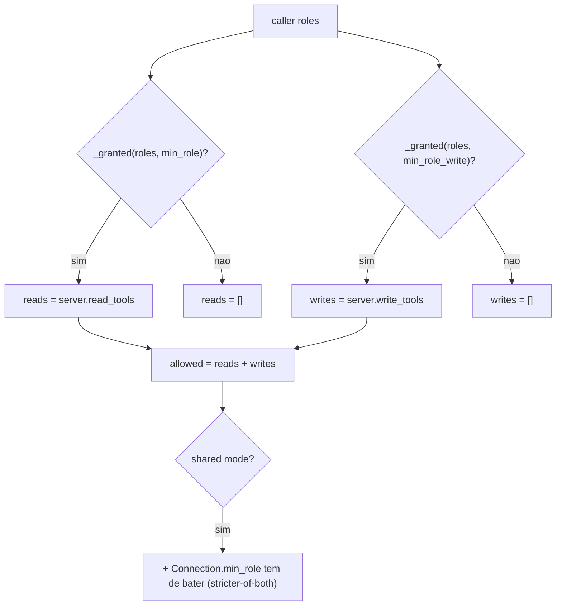

# O Quarto Domínio: Platform e Integração MCP

## Por que este domínio é diferente

Diferente dos experts grounded, a capacidade do agente `platform` **é** o conjunto de ferramentas MCP first-party da Microsoft, montadas **por requisição** a partir de `app/agents/mcp/`. As ferramentas são filtradas por papel (Reader vê reads; Author/Admin veem writes) e, para servidores OBO, rodam como o usuário assinado (apps/backend/app/agents/platform.py:31-44). No registry de domínios, é o único `kind: "tool"` (apps/backend/app/domains.py:98).

## Sumário

| Peça | Símbolo | Arquivo | Fonte |
|---|---|---|---|
| Catálogo de servidores (dado puro) | `SERVERS`, `McpServer` | `mcp/registry.py` | (apps/backend/app/agents/mcp/registry.py:25-116) |
| Governança como dado | `visible_tools`, `classify_tool` | `mcp/registry.py` | (apps/backend/app/agents/mcp/registry.py:130-175) |
| Build de ferramentas | `build_mcp_tools`, `build_from_connections`, `build_hosted_from_connections` | `mcp/tools.py` | (apps/backend/app/agents/mcp/tools.py:219-281) |
| Build read-only (artifacts) | `build_artifact_mcp_reads` | `mcp/tools.py` | (apps/backend/app/agents/mcp/tools.py:139-150) |
| Agente + proxy | `build_platform_agent`, `platform_agent_proxy` | `agents/platform.py` | (apps/backend/app/agents/platform.py:25-44) |

## O registry: governança como dado, não código

`app/agents/mcp/registry.py` é **puro** — sem rede, framework ou auth — então é unit-testável isolado. **Fail-closed:** uma tool que não está em NENHUMA lista é tratada como WRITE (apps/backend/app/agents/mcp/registry.py:130-134).

| Servidor | `auth` | Habilitado? | Por quê | Fonte |
|---|---|---|---|---|
| `learn` | `public` | sim | endpoint público (Microsoft Learn) | (apps/backend/app/agents/mcp/registry.py:44-47) |
| `azure` | `obo` | **não** | sem endpoint remoto gerenciado | (apps/backend/app/agents/mcp/registry.py:56-63) |
| `entra` | `obo` | **não** | sem endpoint first-party remoto | (apps/backend/app/agents/mcp/registry.py:69-76) |
| `azdo` | `obo` | sim | endpoint real (`{org}` por org) | (apps/backend/app/agents/mcp/registry.py:82-90) |
| `github` | `github_pat` | sim | OAuth do GitHub (NÃO Entra OBO) | (apps/backend/app/agents/mcp/registry.py:99-105) |
| `m365` | `oauth_passthrough` | **não** | endpoint a confirmar | (apps/backend/app/agents/mcp/registry.py:107-114) |

O modelo de papéis é **flat** (não escada): `READ_ROLES` = Reader/Author/Approver/Admin; `WRITE_ROLES` = Author/Admin (apps/backend/app/agents/mcp/registry.py:19-21). GitHub auth **não** é Entra OBO — GitHub rejeita audiência Microsoft, então usa PAT/OAuth próprio (apps/backend/app/agents/mcp/registry.py:99-105).

## RBAC por ferramenta



<!-- Sources: apps/backend/app/agents/mcp/registry.py:137-175 -->

`visible_tools(server, roles)` retorna `(reads, writes)` visíveis ao caller — sem papel vê nada (fail-closed) (apps/backend/app/agents/mcp/registry.py:142-147). Em shared mode, `visible_tools_for(server, conn, roles)` aplica o **stricter-of-both**: a min-role do registry E a do `Connection` têm de ser satisfeitas — o tenant só aperta, nunca afrouxa (apps/backend/app/agents/mcp/registry.py:158-175).

## Os três caminhos de build

`build_mcp_tools()` é **mode-aware**. Quando auth está off (dev local), trata o caller como Admin — senão o filtro de papel esconderia toda tool localmente (apps/backend/app/agents/mcp/tools.py:264-281):

| Caminho | Quando | Função | Auth da tool | Fonte |
|---|---|---|---|---|
| Registry flat | self-hosted (default) | `_build_one` sobre `enabled_servers()` | header_provider OBO/PAT | (apps/backend/app/agents/mcp/tools.py:82-109) |
| Connections (interno) | shared | `build_from_connections` → `_build_from_connection` | OBO ou Foundry-connection broker | (apps/backend/app/agents/mcp/tools.py:191-222) |
| Connections (hosted) | hosted | `build_hosted_from_connections` via `get_tool` | `project_connection_id` (Foundry resolve) | (apps/backend/app/agents/mcp/tools.py:225-251) |

A resolução RBAC + URL + approval compartilhada vive em **um lugar** — `_connection_build_params` — usado tanto pelo path interno quanto pelo hosted (apps/backend/app/agents/mcp/tools.py:165-188).

## `build_artifact_mcp_reads`: o grounding read-only do Studio

A v0.4.0 acrescenta um **quarto** builder, usado só pela feature de HTML Artifacts. `build_artifact_mcp_reads()` difere de `build_mcp_tools()` em dois pontos deliberados (apps/backend/app/agents/mcp/tools.py:139-150):

1. **Auto-gate por `mcp_enabled`** — normalmente esse gate vive no caller (`platform_configured()`); aqui ele é interno, então o Studio pode chamá-lo incondicionalmente.
2. **Só ferramentas de LEITURA** — usa `_build_one_read_only`, que passa `allowed_tools=reads` (writes nunca são expostos). Geração de artefato **nunca** pode escrever em sistema externo (apps/backend/app/agents/mcp/tools.py:112-136).

```python
def build_artifact_mcp_reads() -> list[MCPStreamableHTTPTool]:
    if not settings.mcp_enabled:
        return []
    roles = current_roles() if settings.auth_enabled else {"Admin"}
    tools = [_build_one_read_only(s, roles) for s in enabled_servers()]
    return [t for t in tools if t is not None]
```

É travado por `artifact_mcp_reads_test.py` (gate off → `[]`; on → ≥1 read, zero writes) — ver [Avaliação](./page-9.md). O consumo pelo Studio está em [HTML Artifacts](./page-8.md).

## Aprovação de escrita: interno vs hosted

No path **interno** o `approval_mode="never_require"` porque a aprovação MCP nativa NÃO executa sobre AG-UI (agent-framework #3199), então a escrita é tratada pelo nosso card HITL — mas a **visibilidade** de write continua gated por papel (apps/backend/app/agents/mcp/tools.py:1-18). No path **hosted/connection**, o `approval_mode` é um dict que marca `always_require_approval` para writes e `never_require_approval` para reads (apps/backend/app/agents/mcp/tools.py:184-188).

## O agente e o proxy

`build_platform_agent()` cria um `FoundryChatClient` com `credential_for_request()` (OBO) e chama `client.as_agent(... tools=build_mcp_tools())` (apps/backend/app/agents/platform.py:31-44). O `_mount_platform` do registry serve o `platform_agent_proxy` — um `PerRequestAgent` que **reconstrói** o agente a cada `.run()` (apps/backend/app/domains.py:163-175). Só é montado quando `platform_configured()` retorna verdadeiro (apps/backend/app/agents/platform.py:25-28).

As `PLATFORM_INSTRUCTIONS` impõem: preferir tool a chute, fundamentar em resultados de tool, e **nunca alegar que executou uma escrita** (apps/backend/app/agents/prompts.py:139-144).

## Related Pages

| Página | Relação |
|------|-------------|
| [Modos de Implantação e o Seam de Tenant](./page-2.md) | `Connection` e o tenant store que alimenta os builds shared |
| [Autenticação, OBO e RBAC](./page-3.md) | `current_roles`/`credential_for_request` que filtram as tools |
| [Registry de Domínios e mount](./page-4.md) | `_mount_platform` e a ponte `/platform-hosted` (Invocations) |
| [HTML Artifacts](./page-8.md) | O Studio consome `build_artifact_mcp_reads` (read-only) |
