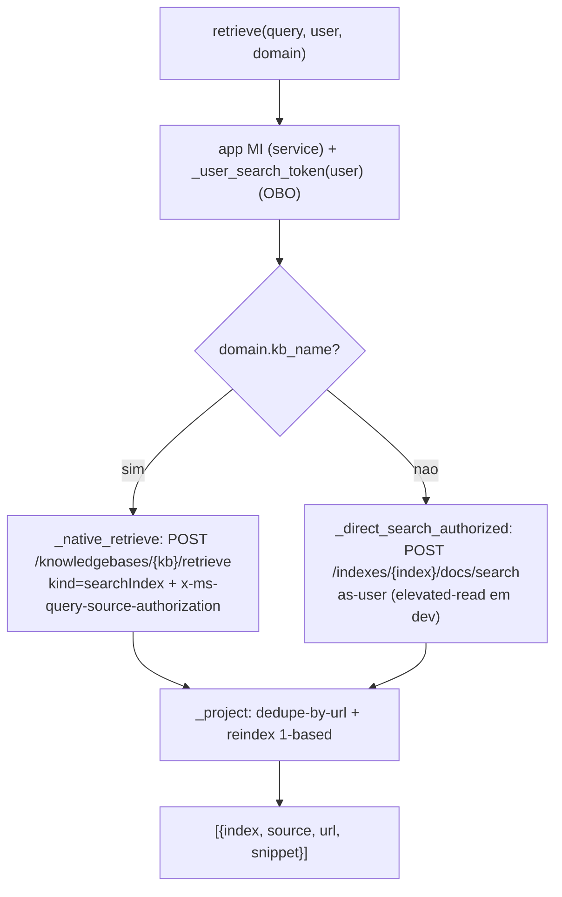
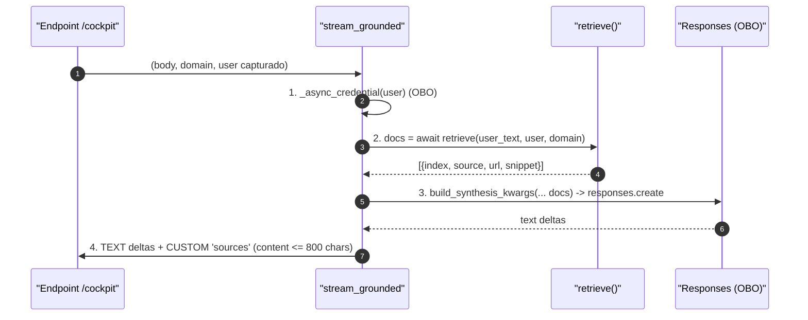
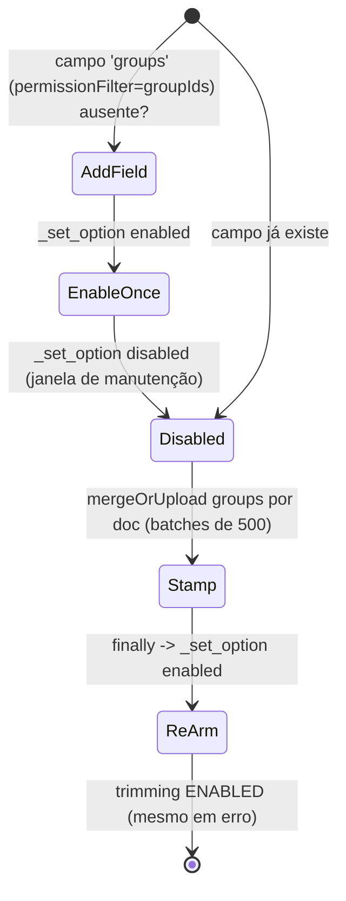

# Conhecimento, ACL e o retrieve() Unificado

## Por que uma costura única

O path grounded colapsou num **único arquétipo** sobre uma **única costura — `retrieve()`** — com uma interface, duas identidades e dois motores atrás do mesmo seam (apps/backend/app/services/retrieval.py:1-35).

## Por que controle de acesso é DADO

Regra inegociável: **controle de acesso é dado** (os grupos de leitura de cada fonte), **nunca lógica de classificação no código**. O `acl_setup.py` é explícito: documentos sem acesso declarado **fail-closed** (apps/backend/app/knowledge/acl_setup.py:1-13). No registry isso aparece como o `acl_group_map` — só dado (name→objectID) (apps/backend/app/domains.py:35-53).

## Sumário

| Componente | Papel | Fonte |
|---|---|---|
| A costura de recuperação | `retrieve()` — nativo + fallback, dedupe | (apps/backend/app/services/retrieval.py:48-79) |
| O arquétipo grounded | `stream_grounded()` — 4 estações | (apps/backend/app/services/grounded.py:76-135) |
| Ingestão da KB helpdesk | upload + knowledge source + KB | (apps/backend/app/knowledge/ingest.py:1-14) |
| Ingestão de docbundles (cockpit/selfwiki) | 2º/3º domínio (docbundles internos) | (apps/backend/app/knowledge/ingest_docbundles.py:1-18) |
| Geração do deep-wiki (dogfood) | wiki fiel a partir do código real | (apps/backend/app/knowledge/wiki_builder.py:1-11) |
| Stamp de ACL no índice | grava grupos por doc + liga trimming | (apps/backend/app/knowledge/acl_setup.py:97-107) |

## A costura `retrieve()`: uma interface, dois motores

<!-- Sources: apps/backend/app/services/retrieval.py:48-79, apps/backend/app/services/retrieval.py:278-292 -->

**As duas identidades** (apps/backend/app/services/retrieval.py:48-79):
- **credencial de serviço** na chamada = o **app managed identity** (`Search Index Data Reader`) — usuários finais não têm RBAC de busca;
- **distinção por usuário** = o header `x-ms-query-source-authorization`, com o token de busca OBO do usuário, anexado **só** em domínios ACL. `_user_search_token(user)` faz o OBO para `search.azure.com`; retorna `None` quando auth off / sem usuário / domínio público (apps/backend/app/services/retrieval.py:81-99).

**Fail-closed (RULE #6):** num domínio ACL cujo user token é `None`, nenhum header é enviado; sobre um índice `permissionFilterOption=enabled` o retrieve pertence a nenhum grupo e volta **zero docs** (apps/backend/app/services/retrieval.py:20-23).

### PRIMARY — retrieve nativo sobre searchIndex

`_native_retrieve` faz `POST {search}/knowledgebases/{kb}/retrieve?api-version=2026-05-01-preview`, com `knowledgeSourceParams[].kind = "searchIndex"` e o header ACL **bare** (sem `Bearer`) (apps/backend/app/services/retrieval.py:105-166). O `_KB_API` é `2026-05-01-preview` (apps/backend/app/services/retrieval.py:45). O `x-ms-query-source-authorization` só é anexado quando há user token (apps/backend/app/services/retrieval.py:128-139).

### FALLBACK — direct-search-as-user

Sem `kb_name`, `_direct_search_authorized` faz uma busca DIRETA sobre `domain.search_index` **como o usuário** (mesmo header); o serviço trima pelo campo `groups` stampado (apps/backend/app/services/retrieval.py:248-272). Ambos os motores desaguam em `_project`, que faz dedupe-by-url (first-wins) + reindex 1-based num só lugar (apps/backend/app/services/retrieval.py:278-292).

## `docKey` → blob URL: a decodificação verificada ao vivo

Cada `references[].docKey` do searchIndex codifica o blob URL. `_decode_dockey` foi **verificado ao vivo** contra 38 `docKeys` reais de `cockpit-si-kb`: o formato é `<12-hex>_<STANDARD-base64(blob_url + byte de cauda)>_pages_<M>` (apps/backend/app/services/retrieval.py:177-208). É travado por `dockey_decode_test.py`.

## O snippet de citação (content-on-click)

O `snippet` de cada citação vem de `references[].sourceData.snippet`, populado por `includeReferenceSourceData=true` no ksp (apps/backend/app/services/retrieval.py:139, apps/backend/app/services/retrieval.py:211-224). Isto **substitui** o antigo join `references[].id` ↔ chunk `ref_id`, que nunca disparava na KB `answerSynthesis`. É travado, infra-free, por `native_snippet_test.py`.

## O arquétipo `stream_grounded`: quatro estações

<!-- Sources: apps/backend/app/services/grounded.py:76-135, apps/backend/app/services/grounded.py:38-48 -->

As quatro estações (apps/backend/app/services/grounded.py:1-18):
1. **Identidade (OBO):** a síntese roda AS-USER; o `user` é capturado no endpoint (apps/backend/app/services/grounded.py:58-73).
2. **Retrieve:** uma linha — `docs = await retrieve(...)`.
3. **Sintetize:** `build_synthesis_kwargs` monta o payload com o `SYNTHESIS_DIRECTIVE` — o modelo responde APENAS dos docs, citando por `[n]`, senão "não sei" (RULE #4) (apps/backend/app/services/grounded.py:31-48).
4. **Emit:** re-emite AG-UI SSE (text deltas + um CUSTOM `sources` com `content` capado em 800 chars) (apps/backend/app/services/grounded.py:121-135).

## Ingestão: o padrão Foundry IQ

`ingest.py` (Fase 1) constrói a KB do helpdesk: upload dos markdowns → **blob knowledge source** → **knowledge base**, tudo com `DefaultAzureCredential` (apps/backend/app/knowledge/ingest.py:1-14). `ingest_docbundles.py` é o mesmo padrão apontado aos docbundles internos (Cockpit) num KB separado, e expõe o entrypoint **`--selfwiki`** que ingere a deep-wiki deste repo (`docs/wiki`) na `selfwiki-si-kb` — sem overrides `COCKPIT_*` e sem ACL (single-audience) (apps/backend/app/knowledge/ingest_docbundles.py:1-18). O `wiki_builder.py` é a outra metade: um agente Foundry lê o **código-fonte real** e escreve uma wiki citada no formato de bundle, dirigido pelo Agent Skill **wiki-page-writer** — a base do dogfood selfwiki (apps/backend/app/knowledge/wiki_builder.py:1-11). (Este próprio bundle segue esse formato — pela via local-agent, não Foundry.)

## `setup_acl`: o stamp do índice

<!-- Sources: apps/backend/app/knowledge/acl_setup.py:97-107, apps/backend/app/knowledge/acl_setup.py:91-94 -->

`setup_acl(component_groups)` adiciona o campo `groups` (se ausente), popula sob uma **janela disabled**, e re-arma o trimming no `finally` — então uma falha transitória nunca deixa o índice aberto (apps/backend/app/knowledge/acl_setup.py:97-107). Grupos são resolvidos por nome → object-ID via `tenant_config().acl_group_map`; docs sem grupo resolvível são **fail-closed** (apps/backend/app/knowledge/acl_setup.py:59-68). A identidade de componente (`_component`/`_canonical`) é extração determinística da convenção de nomeação do blob — **não classificação** (apps/backend/app/knowledge/acl_setup.py:38-56).

## Inconsistências reais no código

- **`secure_search.py` é legado test-only:** o antigo trim app-side (camadas B/C) NÃO está mais no path grounded de produção (que trima via o header nativo no `retrieve()`). Ele só é importado por testes (apps/backend/app/agents/secure_search.py:1-19).
- **Skew de api-version:** `retrieve()` usa `2026-05-01-preview` (apps/backend/app/services/retrieval.py:45), enquanto `acl_setup.py` usa `2025-08-01-preview` (apps/backend/app/knowledge/acl_setup.py:33). Convivem, mas é um skew a rastrear.

## Related Pages

| Página | Relação |
|------|-------------|
| [Modos de Implantação e o Seam de Tenant](./page-2.md) | `acl_group_map`/campos searchindex no `TenantConfig` |
| [Autenticação, OBO e RBAC](./page-3.md) | `_user_search_token`/`_async_credential` e o OBO |
| [Domínios de Agente e Workflow](./page-5.md) | Os domínios grounded que consomem `stream_grounded` |
| [Avaliação, Garantia e Testes](./page-9.md) | O golden sobre `retrieve()` + o gate de access-control |
