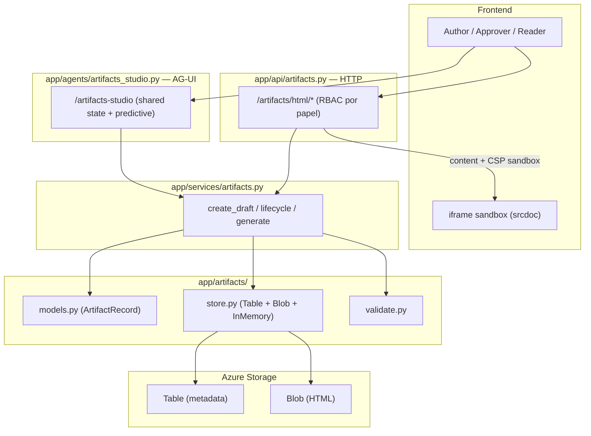
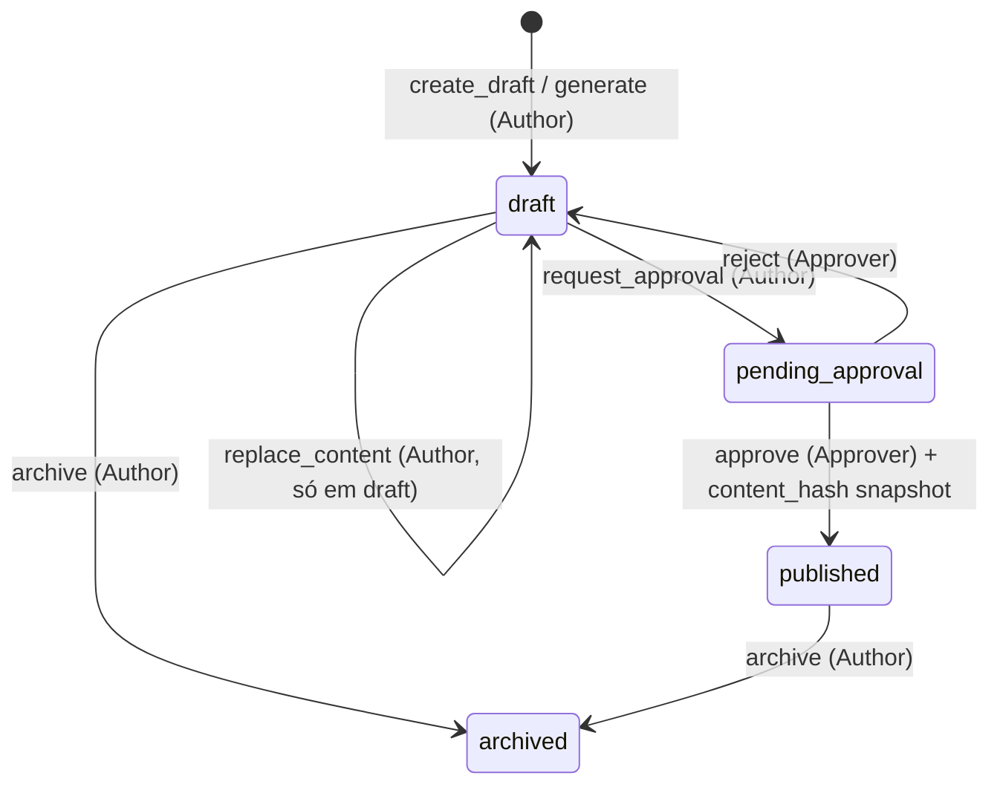
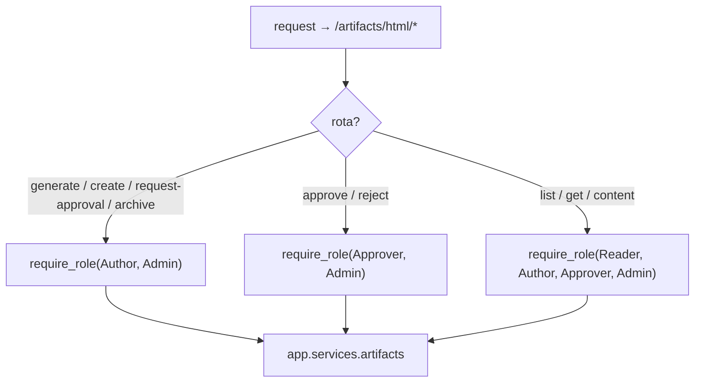
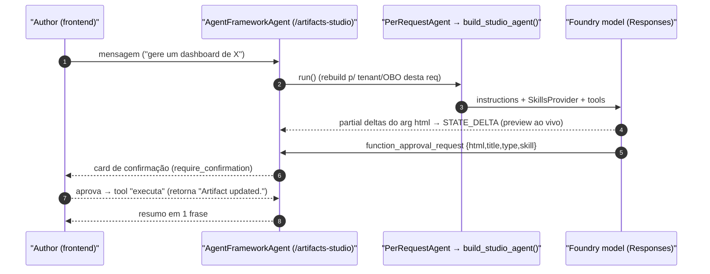

# HTML Artifacts: Persistência, Ciclo de Vida Governado e o Studio Skill-Driven

## O que a feature entrega

A v0.4.0 adiciona uma capacidade transversal: um usuário **Author** pede ("gere um relatório executivo sobre X"), o backend produz um **documento HTML autocontido** (todo CSS/JS inline, zero requisições externas), persiste-o versionado por tenant, e o promove por um **ciclo de vida governado** (draft → pending → published) onde a publicação exige um **Approver**. O frontend renderiza o HTML dentro de um `<iframe>` sandbox — essa é a **fronteira primária de isolamento**; o backend adiciona defesa em profundidade (cap de tamanho, checagem de forma, header CSP).

São três subsistemas: o **pacote `app/artifacts/`** (modelo + stores + validação), o **serviço** (`app/services/artifacts.py`, ciclo de vida + geração), e as **duas superfícies HTTP/AG-UI** (`app/api/artifacts.py` + `app/agents/artifacts_studio.py`).

<!-- Sources: apps/backend/app/api/artifacts.py:15-135, apps/backend/app/agents/artifacts_studio.py:79-124, apps/backend/app/services/artifacts.py:61-207, apps/backend/app/artifacts/store.py:62-140 -->

## O modelo: `ArtifactRecord` imutável

`ArtifactRecord` é uma dataclass **frozen** — toda transição de estado produz um **novo** registro via `dataclasses.replace` (apps/backend/app/artifacts/models.py:37-53). Os estados e tipos são classes de constantes (não enums), com um `ALLOWED_TYPES` frozenset como o gate de validação (apps/backend/app/artifacts/models.py:9-26):

| Constante | Valores | Fonte |
|---|---|---|
| `ArtifactStatus` | `draft` · `pending_approval` · `published` · `rejected`* · `archived` | (apps/backend/app/artifacts/models.py:9-14) |
| `ArtifactType` / `ALLOWED_TYPES` | `presentation` · `report` · `walkthrough` · `dashboard` | (apps/backend/app/artifacts/models.py:17-26) |
| `new_artifact_id()` | `art_<12-hex>` (secrets) | (apps/backend/app/artifacts/models.py:29-30) |
| `sha256_hex(text)` | hash de conteúdo (snapshot na aprovação) | (apps/backend/app/artifacts/models.py:33-34) |

*\* `rejected` está reservado mas **sem uso** — `reject()` volta o registro para `draft`; o status existe para uma trilha de auditoria futura (apps/backend/app/artifacts/models.py:13).*

O campo `skill` (novo, opcional) registra **qual SKILL.md** o Studio usou para gerar o artefato — a ponte entre o registro persistido e a biblioteca de skills (apps/backend/app/artifacts/models.py:53).

## Os stores: metadata (Table) + content (Blob), cada um com fake in-memory

O `store.py` **espelha** o padrão de `app/core/tenant_store.py`: um `Protocol` + um fake InMemory para dev/CI + uma impl Azure que importa o SDK preguiçosamente na construção (apps/backend/app/artifacts/store.py:1-11). Há **dois** stores porque metadados (consultáveis, pequenos) e conteúdo (HTML, grande, imutável por versão) têm formas diferentes:

| Store | Protocol | Fake | Azure | Fonte |
|---|---|---|---|---|
| Metadata | `ArtifactStore` (get/put/list) | `InMemoryArtifactStore` | `TableArtifactStore` (PartitionKey=tenant, RowKey=id) | (apps/backend/app/artifacts/store.py:13-91) |
| Content | `ArtifactContentStore` (put/get) | `InMemoryContentStore` | `BlobContentStore` | (apps/backend/app/artifacts/store.py:94-140) |

O `BlobContentStore` guarda **um blob por versão** no caminho `{tenant}/{id}/v{n}/index.html`, com `content_type="text/html"` (apps/backend/app/artifacts/store.py:112-131). O `TableArtifactStore` serializa os campos via a tupla `_FIELDS`, mapeando `None`→`""` no upsert e de volta a `None` na leitura (apps/backend/app/artifacts/store.py:35-59, apps/backend/app/artifacts/store.py:80-91). As factories escolhem a impl por `settings.artifact_store_backend` (`"memory"` vs `"table"`), com fail-fast se a account URL faltar (apps/backend/app/artifacts/factory.py:7-44).

## A validação: defesa em profundidade, NÃO a fronteira

`validate_html` é deliberadamente mínima — a docstring é enfática: *a fronteira primária é o iframe sandbox; esta validação é um gate secundário* (apps/backend/app/artifacts/validate.py:1-8). Ela **não** faz strip de `<script>` (isso quebraria artefatos interativos legítimos; o sandbox contém o script). Só três checagens (apps/backend/app/artifacts/validate.py:20-27):

1. rejeita vazio;
2. rejeita acima de `max_bytes` (default 2 MB, `settings.artifact_max_html_bytes`);
3. exige que o conteúdo **pareça** HTML (regex `_HTML_HINT` casando `<!doctype html`/`<html`/`<body`/`<div`/`<section`) (apps/backend/app/artifacts/validate.py:13).

## O serviço: ciclo de vida governado

`app/services/artifacts.py` guarda os stores como singletons module-level resolvidos preguiçosamente pelas factories (para testes sobrescreverem com fakes) (apps/backend/app/services/artifacts.py:24-41). Toda leitura passa por `_load_scoped`, que **nunca vaza existência entre tenants** — um id de outro tenant levanta `Forbidden`, indistinguível de "não existe" (apps/backend/app/services/artifacts.py:52-58).

<!-- Sources: apps/backend/app/services/artifacts.py:115-159 -->

Cada transição valida o estado de origem e grava um novo registro via `replace`:

| Operação | Pré-condição | Efeito | Fonte |
|---|---|---|---|
| `create_draft` | type ∈ ALLOWED, title/description dentro dos caps, HTML válido | novo `draft` + blob v1 | (apps/backend/app/services/artifacts.py:61-82) |
| `replace_content` | status == `draft` | reescreve o blob, atualiza `updated_at` | (apps/backend/app/services/artifacts.py:115-122) |
| `request_approval` | status == `draft` | → `pending_approval` | (apps/backend/app/services/artifacts.py:129-133) |
| `approve` | status == `pending_approval` | → `published`, grava `approved_by`/`approved_at` + `content_hash` | (apps/backend/app/services/artifacts.py:136-145) |
| `reject` | status == `pending_approval` | → `draft` | (apps/backend/app/services/artifacts.py:148-152) |
| `archive` | status ∈ {`published`,`draft`} | → `archived` | (apps/backend/app/services/artifacts.py:155-159) |

**Risco aceito (MVP), documentado no código:** as transições são read-check-write **sem** concorrência otimista (`store.put` é upsert incondicional). Chamadas concorrentes no mesmo registro são last-write-wins — aceitável para aprovações HITL de ritmo humano; um `put` condicional por ETag fica para quando/se isso virar automatizado/alto-volume (apps/backend/app/services/artifacts.py:125-128).

### `generate`: a fronteira LLM

`generate` gera o HTML via `_generate_html` e então **re-valida** por `create_draft` antes de persistir (apps/backend/app/services/artifacts.py:198-207). `_generate_html` espelha `app/services/copilot.py::_responses`: abre um `AIProjectClient` async, roda a **Responses API** com um system prompt que exige um único documento autocontido começando com `<!doctype html>`, e usa a **credencial OBO** do usuário (`_async_credential(user)`, reusado de `grounded.py`) (apps/backend/app/services/artifacts.py:162-195). É a mesma disciplina de auth do path grounded (RULE #2).

## O router `/artifacts`: HTTP fino, RBAC por papel, CSP sandbox

`app/api/artifacts.py` é um router fino — HTTP + RBAC apenas; a lógica fica no serviço (apps/backend/app/api/artifacts.py:1-15). A partição de tenant vem de `artifact_tenant_id()`. Os três gates de papel espelham o modelo de autoria→aprovação do helpdesk (apps/backend/app/api/artifacts.py:17-19):

<!-- Sources: apps/backend/app/api/artifacts.py:17-19, apps/backend/app/api/artifacts.py:48-135 -->

| Rota | Método | Gate | Fonte |
|---|---|---|---|
| `/artifacts/html/generate` | POST | Author/Admin | (apps/backend/app/api/artifacts.py:48-58) |
| `/artifacts/html` | POST | Author/Admin | (apps/backend/app/api/artifacts.py:61-70) |
| `/artifacts/html` | GET | Reader+ | (apps/backend/app/api/artifacts.py:73-76) |
| `/artifacts/html/{id}` | GET | Reader+ | (apps/backend/app/api/artifacts.py:79-85) |
| `/artifacts/html/{id}/content` | GET | Reader+ | (apps/backend/app/api/artifacts.py:88-106) |
| `/artifacts/html/{id}/request-approval` | POST | Author/Admin | (apps/backend/app/api/artifacts.py:118-120) |
| `/artifacts/html/{id}/approve` | POST | Approver/Admin | (apps/backend/app/api/artifacts.py:123-125) |
| `/artifacts/html/{id}/reject` | POST | Approver/Admin | (apps/backend/app/api/artifacts.py:128-130) |
| `/artifacts/html/{id}/archive` | POST | Author/Admin | (apps/backend/app/api/artifacts.py:133-135) |

O `content_route` devolve o HTML cru **com um header `Content-Security-Policy: sandbox`** + `X-Content-Type-Options: nosniff` — defesa em profundidade que faz o browser sandboxar o conteúdo mesmo numa navegação same-origin direta, fechando o gap de dev onde `auth_enabled=False` torna `require_role` um no-op (apps/backend/app/api/artifacts.py:88-106). O `_act` helper mapeia `Forbidden`→404 e `ValueError`→409 (conflito de estado) (apps/backend/app/api/artifacts.py:109-115).

## O Studio: um agente AG-UI generativo-UI, skill-driven

O `/artifacts-studio` é onde a v0.4.0 é mais ambiciosa: um agente conversacional que **transmite** o documento HTML para o shared state do AG-UI enquanto o modelo o escreve (preview ao vivo), gated por uma **confirmação de edição in-loop**. Ele espelha a construção per-request do `platform.py` (`FoundryChatClient.as_agent` + `PerRequestAgent`) mais o wrapper de shared-state do AG-UI (apps/backend/app/agents/artifacts_studio.py:1-7).

### SkillsProvider: as instruções são dados

O Studio é **skill-driven**: um `SkillsProvider.from_paths(...)` descobre os 4 `SKILL.md` da pasta `artifact-skills/`, construído **uma vez** no module scope porque é descoberta estática de arquivos sem estado per-request (apps/backend/app/agents/artifacts_studio.py:23-27). As instruções mandam o modelo escolher o skill que casa com o pedido (ou o que o usuário fixou), seguir seu SKILL.md via `load_skill`/`read_skill_resource`, e passar o `skill` usado adiante (apps/backend/app/agents/artifacts_studio.py:29-41). `build_studio_agent()` injeta o provider como `context_providers` — **sem** script_runner (nada de shell) (apps/backend/app/agents/artifacts_studio.py:57-70).

### `update_artifact`: a tool de 4 args + a confirmação

Para criar/mudar o artefato o modelo **deve** chamar `update_artifact(html, title, type, skill)` — o HTML **completo** a cada vez (nunca diff/parcial) (apps/backend/app/agents/artifacts_studio.py:44-54). Dois detalhes são carregados no código:

- **`approval_mode="always_require"`** faz o agente emitir um `function_approval_request` por chamada, que o adapter AG-UI expõe como o evento de confirmação de edição in-loop — pareado com o `require_confirmation=True` do agente. Sem isso a tool executaria direto e nenhum interrupt seria emitido (verificado ao vivo) (apps/backend/app/agents/artifacts_studio.py:44-54).
- **O arg `html` mapeado ao state DEVE ser uma string flat** — o extrator de partial-delta preditivo só streama args string (regex `"arg":\s*"([^"]*)`); um arg de objeto aninhado emitiria um único evento no fim (sem streaming ao vivo) (apps/backend/app/agents/artifacts_studio.py:73-78).

### Shared state + predictive: só `html` streama

<!-- Sources: apps/backend/app/agents/artifacts_studio.py:79-99, apps/backend/app/agents/artifacts_studio.py:44-54 -->

O wrapper `AgentFrameworkAgent` declara só `html` como shared state e como `predict_state_config` (streaming preditivo do preview) (apps/backend/app/agents/artifacts_studio.py:79-99). `title`/`type`/`skill` **não** são state — o frontend os lê do próprio evento `function_approval_request` (`function_call.arguments`), verificado ao vivo na Step 4b; manter html-only evita partial-streamar os campos curtos sem benefício (apps/backend/app/agents/artifacts_studio.py:88-97).

### Grounding read-only + o mount

O Studio recebe, além de `update_artifact`, as tools de `build_artifact_mcp_reads()` — MCP **só de leitura**, para grounding quando o usuário pede conteúdo baseado em dados; **nunca** um write (apps/backend/app/agents/artifacts_studio.py:69, apps/backend/app/agents/mcp/tools.py:139-150). O `studio_configured()` espelha `platform_configured()` (em shared monta global; senão exige um endpoint Foundry) (apps/backend/app/agents/artifacts_studio.py:102-108), e `mount_artifacts_studio` registra o endpoint gated Author/Admin — **deliberadamente NÃO** entitlement-gated por tenant, porque é uma ferramenta de autoria transversal, não um domínio `/d/[domain]` (ADR-010) (apps/backend/app/agents/artifacts_studio.py:111-124).

## A biblioteca de skills: `artifact-skills/`

Quatro `SKILL.md`, um por tipo de artefato, cada um com frontmatter YAML (`name` + `description` + `metadata.type`) e um esqueleto HTML + linguagem visual:

| Skill | `type` | Foco | Fonte |
|---|---|---|---|
| `report` | report | one-pager executivo (header band + seções + cards) | (apps/backend/artifact-skills/report/SKILL.md:1-6) |
| `slides` | presentation | deck 16:9 zero-dependência (vendored de `frontend-slides`, MIT) | (apps/backend/artifact-skills/slides/SKILL.md:1-6) |
| `walkthrough` | walkthrough | passo-a-passo numerado (step cards + callout) | (apps/backend/artifact-skills/walkthrough/SKILL.md:1-6) |
| `dashboard` | dashboard | dashboard de métricas (KPI tiles + SVG bar chart inline) | (apps/backend/artifact-skills/dashboard/SKILL.md:1-6) |

O `slides` é o mais rico: traz recursos (`references/STYLE_PRESETS.md`, `references/html-template.md`, `viewport-base.css`) que o modelo lê via `read_skill_resource`, e um `VENDORED.md` documentando o que foi mantido/dropado do upstream + a licença MIT (apps/backend/artifact-skills/slides/VENDORED.md:1-30). Todos os skills insistem no mesmo contrato: um único documento, tudo inline, zero requisições — porque renderiza num `<iframe sandbox="allow-scripts">` sem `allow-same-origin`.

## Related Pages

| Página | Relação |
|------|-------------|
| [Modos de Implantação e o Seam de Tenant](./page-2.md) | `artifact_tenant_id()` + os stores swappable |
| [Autenticação, OBO e RBAC](./page-3.md) | Os gates Author/Approver/Reader + OBO na geração |
| [Registry de Domínios e mount](./page-4.md) | Onde `/artifacts` e `/artifacts-studio` são montados |
| [Platform e MCP](./page-6.md) | `build_artifact_mcp_reads` reusa o registry MCP (read-only) |
| [Avaliação, Garantia e Testes](./page-9.md) | A suíte que trava store/RBAC/studio/skills/MCP-reads |
