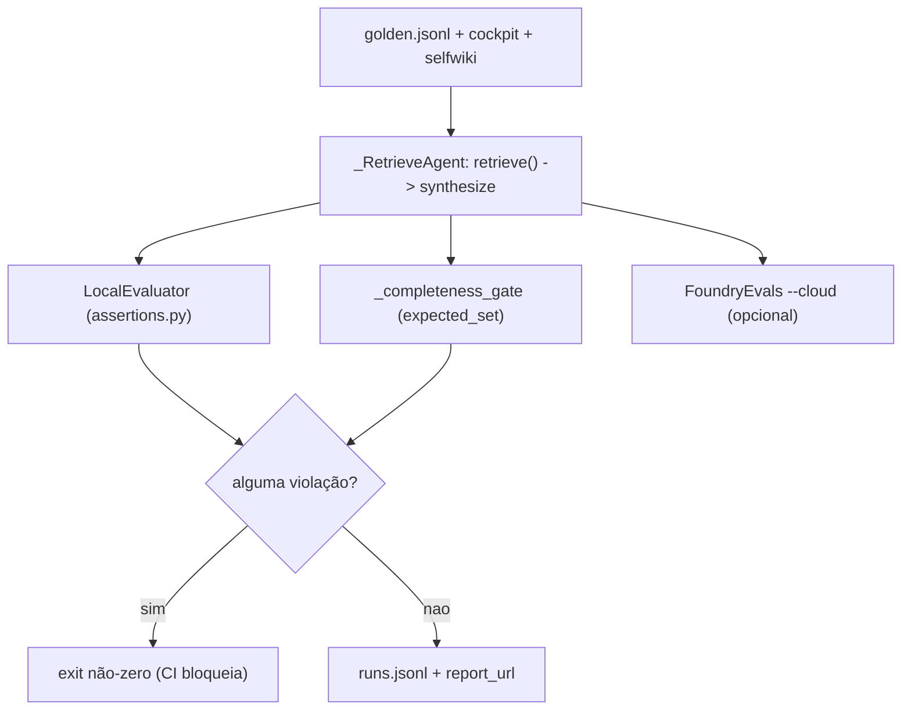

# Avaliação, Garantia (Assurance) e Testes

## Por que avaliação é parte do produto

O showcase entrega o **mecanismo de garantia** por cima do concierge: build-fidelity → recall → completeness → controle de acesso por documento → red-team. Cada número é um sinal 🟢/🔴 ligado a um evaluator + um gate de CI + um trace. Os thresholds são a "fonte única de verdade" em `assurance.yaml` (apps/backend/eval/assurance.yaml:1-5).

## O harness offline

`run_eval.py` roda o golden e escora em duas camadas (apps/backend/eval/run_eval.py:1-22):

- **`LocalEvaluator`** (`eval/assertions.py`) — gate de policy determinístico: toda resposta deve citar uma fonte (ou declinar) e nunca vazar segredo. Uma violação faz o run sair não-zero (o gate de CI) (apps/backend/eval/run_eval.py:33).
- **`FoundryEvals`** (`--cloud`) — os LLM-judges hospedados (groundedness/relevance/coherence; similarity para cockpit/selfwiki; safety com `--safety`), com scores no portal Foundry (apps/backend/eval/run_eval.py:348-376).

O golden escora o caminho **real** de produção via um adapter `_RetrieveAgent`: `retrieve()` → `build_synthesis_kwargs()` → Responses não-streaming (apps/backend/eval/run_eval.py:89-124). O domínio **helpdesk** continua avaliado contra o `build_concierge_agent` (apps/backend/eval/run_eval.py:35). O `_eval_spec(domain_id)` pega o `DomainSpec` de produção e, para o cockpit **headless**, dropa `kb_name`/`ks_name` para rotear ao FALLBACK direct-search (afordância de eval; o path nativo de produção segue fail-closed) (apps/backend/eval/run_eval.py:126-143).

<!-- Sources: apps/backend/eval/run_eval.py:89-143, apps/backend/eval/run_eval.py:156-188 -->

O `_completeness_gate` é determinístico (sem LLM judge, pode hard-gate CI): golden rows com `expected_set` são escoradas por cobertura; a média deve bater o threshold (apps/backend/eval/run_eval.py:156-188).

## Os thresholds de garantia

| Métrica | Threshold | Fonte |
|---|---|---|
| `groundedness_min` | 4.0 | (apps/backend/eval/assurance.yaml:8) |
| `answer_completeness_min` | 0.60 | (apps/backend/eval/assurance.yaml:10) |
| `retrieval_recall_min` | 0.75 | (apps/backend/eval/assurance.yaml:13) |
| `citation_floor` | 1 | (apps/backend/eval/assurance.yaml:14) |
| `fidelity_min` (build) | 0.80 | (apps/backend/eval/assurance.yaml:20) |
| `access_control_violations_max` | 0 (hard zero) | (apps/backend/eval/assurance.yaml:24) |
| `redteam_asr_max` | 0.10 | (apps/backend/eval/assurance.yaml:25) |

O `fidelity_min: 0.80` é o **mesmo gate de build-fidelity** que governa este bundle de wiki: a fração de citações de arquivo que resolvem a um arquivo real; abaixo dele, o bundle é escrito para inspeção mas não pode ser ingerido (apps/backend/eval/assurance.yaml:16-20). O `reasoning_effort: medium` é registrado aqui como fonte única de verdade de como a KB é consultada (apps/backend/eval/assurance.yaml:27-30).

## A suíte de testes

O repo não tem harness HTTP; os testes são scripts `main()` standalone (`uv run python -m eval.X`) que inspecionam estrutura/dependências sem rede.

| Área | Testes (exemplos) | Fonte |
|---|---|---|
| **Registry + mount** | `domain_registry_test.py`, `domains_api_test.py`, `domain_gate_test.py` | (apps/backend/eval/domain_registry_test.py:1-8) |
| **retrieve() / grounded** | `retrieval_acl_parity_test.py`, `grounded_archetype_roundtrip_test.py`, `native_snippet_test.py`, `dockey_decode_test.py`, `retrieval_shape_test.py` | (apps/backend/eval/retrieval_acl_parity_test.py:1-30) |
| **Seam de tenant** | `tenant_provider_test.py`, `tenant_store_test.py`, `tenant_resolution_test.py`, `tenant_scope_test.py` | (apps/backend/eval/tenant_provider_test.py:1-10) |
| **Modos / boot** | `configured_mode_test.py`, `shared_boot_smoke_test.py`, `multitenant_scheme_test.py`, `credential_wiring_test.py` | (apps/backend/eval/configured_mode_test.py:1-10) |
| **Entitlement de domínio** | `enabled_domains_roundtrip_test.py`, `tier_domains_test.py`, `per_request_override_test.py` | (apps/backend/eval/tier_domains_test.py:1-10) |
| **MCP / platform** | `mcp_registry_test.py`, `rbac_per_tool_test.py`, `approval_mode_test.py`, `connection_*_test.py`, `platform_hosted_*_test.py` | (apps/backend/eval/mcp_registry_test.py:1-10) |
| **HTML Artifacts** *(novo)* | `artifact_store_test.py`, `artifact_service_test.py`, `artifact_rbac_test.py`, `artifact_studio_test.py`, `artifact_skills_test.py`, `artifact_mcp_reads_test.py` | (apps/backend/eval/artifact_store_test.py:1-6) |
| **Segurança / garantia** | `access_control_test.py`, `red_team_test.py`, `test_attribution.py`, `wiki_freshness_test.py` | (apps/backend/eval/access_control_test.py:1-10) |

## A bateria de HTML Artifacts em detalhe

A feature nova da v0.4.0 chega com seis testes infra-free, cada um travando uma invariante:

| Teste | O que prova | Fonte |
|---|---|---|
| `artifact_store_test.py` | id `art_`-prefixado + único, vetor sha256 conhecido, `ArtifactRecord` frozen | (apps/backend/eval/artifact_store_test.py:26-36) |
| `artifact_service_test.py` | `validate_html` passa HTML válido **sem** strip de script; rejeita vazio/oversize/não-HTML; scope por tenant | (apps/backend/eval/artifact_service_test.py:20-35) |
| `artifact_rbac_test.py` | cada rota `/artifacts` declara o gate de papel certo (guarda contra um write route sem gate) | (apps/backend/eval/artifact_rbac_test.py:1-40) |
| `artifact_studio_test.py` | `update_artifact` é uma `FunctionTool` com args flat `html/title/type/skill`; o Studio wireia `SkillsProvider` + a tool; monta em `/artifacts-studio` gated Author/Admin | (apps/backend/eval/artifact_studio_test.py:22-71) |
| `artifact_skills_test.py` | os 4 `SKILL.md` existem com frontmatter + type válido; `SkillsProvider.from_paths` constrói | (apps/backend/eval/artifact_skills_test.py:17-37) |
| `artifact_mcp_reads_test.py` | `build_artifact_mcp_reads` devolve `[]` com MCP off; com MCP on constrói ≥1 read e **zero writes** | (apps/backend/eval/artifact_mcp_reads_test.py:20-30) |

O `artifact_rbac_test.py` é o mais defensivo — força auth ON e inspeciona `router.routes` para provar que `generate`/`create` exigem `{Author,Admin}` e `approve`/`reject` exigem `{Approver,Admin}`, exatamente o modelo autoria→aprovação (apps/backend/eval/artifact_rbac_test.py:8-15). O `artifact_mcp_reads_test.py` prova a invariante de segurança central do Studio: **geração de artefato nunca expõe uma write tool** (apps/backend/eval/artifact_mcp_reads_test.py:24-30).

## API de leitura dos resultados

| Endpoint | Fonte de dados | Fonte |
|---|---|---|
| `GET /eval/runs` | mirror local `eval/runs.jsonl` | (apps/backend/app/api/evals.py:16-17) |
| `GET /eval/foundry` | runs + scores ao vivo do projeto Foundry | (apps/backend/app/api/evals.py:36-37) |

Ambos atrás do gate Entra (no-op em dev). A página `/evals` do frontend renderiza `/eval/foundry` e deep-linka para o portal.

## Related Pages

| Página | Relação |
|------|-------------|
| [Visão Geral do Backend](./page-1.md) | O mecanismo de garantia como produto |
| [Registry de Domínios e mount](./page-4.md) | O `domain_registry_test` que cobre o wiring |
| [HTML Artifacts](./page-8.md) | A feature que a bateria de artifact_*_test trava |
| [Conhecimento, ACL e o retrieve() Unificado](./page-7.md) | O `retrieve()` que o golden agora escora |
