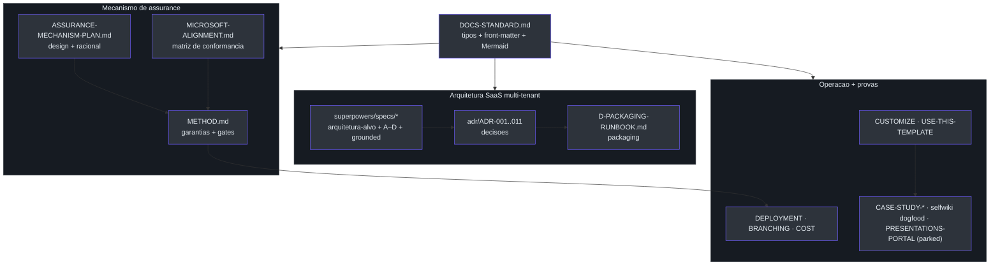

# Visão geral do conjunto de documentação

## Por que este conjunto existe

O diretório `docs/` **não** é um amontoado de notas: é uma base de documentação
versionada, tipada e revisada como código. A regra de fundo está escrita
explicitamente — *"Docs live in the repo, change in the same PR as the code they
describe, and are reviewed like code."*
([docs/DOCS-STANDARD.md:87-88](https://github.com/ruinosus/foundry-assured/blob/3333d60d0e9c02b64a532f2c9bad94692cf50075/docs/DOCS-STANDARD.md#L87-L88)).
A consequência prática: cada fato tem **uma** fonte de verdade — *"One source of
truth per fact."*
([docs/DOCS-STANDARD.md:93-94](https://github.com/ruinosus/foundry-assured/blob/3333d60d0e9c02b64a532f2c9bad94692cf50075/docs/DOCS-STANDARD.md#L93-L94)).

Esta página é o índice navegável do conjunto. Os documentos se dividem em **quatro
grandes blocos**: o **mecanismo de assurance** (o que o produto garante), a
**arquitetura SaaS multi-tenant** (para onde o produto evoluiu desde a v0.1.0), os
**guias operacionais + estudos de caso** (como rodar, adaptar e provar), e — novidade
desta v0.3.0 — a onda de **specs de citações grounded** que unificou os agentes de
conhecimento sobre o retriever nativo da Microsoft.

> **Fato (lido em fonte).** O índice oficial dos docs vive em
> [docs/README.md:21-41](https://github.com/ruinosus/foundry-assured/blob/3333d60d0e9c02b64a532f2c9bad94692cf50075/docs/README.md#L21-L41),
> uma tabela `Doc | Type | Audience | What it's for`. Esta página de wiki reflete esse
> índice e o expande com as novidades da era SaaS (ADRs 001–011, specs de sub-projetos,
> runbook de packaging, custo e branching) **e** com os docs que ainda não entraram na
> tabela do README (`MICROSOFT-ALIGNMENT.md`, as duas specs grounded de 2026-07-01 e o
> plano PARKED de portal de apresentações).

## O conjunto em uma tabela

| Documento | Tipo (`type:`) | Audiência | Para quê | Fonte |
| --- | --- | --- | --- | --- |
| **METHOD.md** | reference | adopter | O mecanismo de assurance — garantias, gates e como rodar | [docs/README.md:23](https://github.com/ruinosus/foundry-assured/blob/3333d60d0e9c02b64a532f2c9bad94692cf50075/docs/README.md#L23) |
| **DEPLOYMENT.md** | how-to | operator | Provisionamento ponta-a-ponta, do clone ao deploy | [docs/README.md:24](https://github.com/ruinosus/foundry-assured/blob/3333d60d0e9c02b64a532f2c9bad94692cf50075/docs/README.md#L24) |
| **IDENTITY-AND-ACCESS-SETUP.md** | reference | operator | O mapa Entra ID — o que o azd/Bicep cria vs registros manuais | [docs/README.md:25](https://github.com/ruinosus/foundry-assured/blob/3333d60d0e9c02b64a532f2c9bad94692cf50075/docs/README.md#L25) |
| **RBAC-AND-USER-MANAGEMENT-PLAN.md** | plan | contributor | App RBAC (Entra App Roles) + gestão de usuários in-portal | [docs/README.md:26](https://github.com/ruinosus/foundry-assured/blob/3333d60d0e9c02b64a532f2c9bad94692cf50075/docs/README.md#L26) |
| **USE-THIS-TEMPLATE.md** | how-to | adopter | Criar seu próprio repo a partir deste template | [docs/README.md:27](https://github.com/ruinosus/foundry-assured/blob/3333d60d0e9c02b64a532f2c9bad94692cf50075/docs/README.md#L27) |
| **CUSTOMIZE.md** | how-to | adopter | Trocar as quatro peças de domínio | [docs/README.md:28](https://github.com/ruinosus/foundry-assured/blob/3333d60d0e9c02b64a532f2c9bad94692cf50075/docs/README.md#L28) |
| **RELEASE-AUTOMATION.md** | how-to | operator | Como um merge vira release versionada + deploy gateado | [docs/README.md:29](https://github.com/ruinosus/foundry-assured/blob/3333d60d0e9c02b64a532f2c9bad94692cf50075/docs/README.md#L29) |
| **USE-CASE-WALKTHROUGH.md** | explanation | evaluator | Exemplo fictício do mecanismo inteiro ponta-a-ponta | [docs/README.md:30](https://github.com/ruinosus/foundry-assured/blob/3333d60d0e9c02b64a532f2c9bad94692cf50075/docs/README.md#L30) |
| **CASE-STUDY-LLM-WIKI-LOOP.md** | explanation | evaluator | Estudo de caso medido: aterrar docs e eval na fonte | [docs/README.md:31](https://github.com/ruinosus/foundry-assured/blob/3333d60d0e9c02b64a532f2c9bad94692cf50075/docs/README.md#L31) |
| **CASE-STUDY-SELFWIKI-DOGFOOD.md** | explanation | evaluator | Dogfood do mecanismo neste repo — dois bugs que ele achou em si | [docs/README.md:32](https://github.com/ruinosus/foundry-assured/blob/3333d60d0e9c02b64a532f2c9bad94692cf50075/docs/README.md#L32) |
| **DOCS-STANDARD.md** | reference | contributor | Como os docs são tipados, estruturados e diagramados | [docs/README.md:39](https://github.com/ruinosus/foundry-assured/blob/3333d60d0e9c02b64a532f2c9bad94692cf50075/docs/README.md#L39) |

*A tabela acima é o subconjunto listado no README. A era SaaS e a onda grounded adicionam
os ADRs, specs, runbooks e o `MICROSOFT-ALIGNMENT.md` documentados nas páginas seguintes.*

## O que o README ainda não lista (docs recém-chegados)

O `docs/README.md` está estampado `updated: 2026-06-27`
([docs/README.md:7](https://github.com/ruinosus/foundry-assured/blob/3333d60d0e9c02b64a532f2c9bad94692cf50075/docs/README.md#L7))
e por isso **não indexa** os documentos que chegaram depois. Esta wiki os cobre:

| Documento | Tipo | Estado | O que é | Fonte |
| --- | --- | --- | --- | --- |
| **MICROSOFT-ALIGNMENT.md** | reference | vivo | Matriz de conformância — quais padrões Microsoft seguimos, onde, e a prova (link do doc) | [docs/MICROSOFT-ALIGNMENT.md:1-11](https://github.com/ruinosus/foundry-assured/blob/3333d60d0e9c02b64a532f2c9bad94692cf50075/docs/MICROSOFT-ALIGNMENT.md#L1-L11) |
| **grounded-obo-citations-design.md** | spec | shipped | Citações estruturadas via OBO + Responses API + Foundry IQ MCP tool | [specs/2026-07-01-grounded-obo-citations-design.md:1-15](https://github.com/ruinosus/foundry-assured/blob/3333d60d0e9c02b64a532f2c9bad94692cf50075/docs/superpowers/specs/2026-07-01-grounded-obo-citations-design.md#L1-L15) |
| **grounded-archetype-unification-design.md** | spec | shipped | Unifica os domínios grounded num único arquétipo sobre o retriever nativo | [specs/2026-07-01-grounded-archetype-unification-design.md:1-6](https://github.com/ruinosus/foundry-assured/blob/3333d60d0e9c02b64a532f2c9bad94692cf50075/docs/superpowers/specs/2026-07-01-grounded-archetype-unification-design.md#L1-L6) |
| **PRESENTATIONS-PORTAL-PLAN.md** | plan | **PARKED** | Portal de decks access-controlled — o mecanismo aplicado a artefatos HTML | [docs/PRESENTATIONS-PORTAL-PLAN.md:10-14](https://github.com/ruinosus/foundry-assured/blob/3333d60d0e9c02b64a532f2c9bad94692cf50075/docs/PRESENTATIONS-PORTAL-PLAN.md#L10-L14) |
| **MCP-INTEGRATION-PLAN.md** | plan | vivo | Integração dos MCP servers Microsoft (domínio `platform`) | [docs/MCP-INTEGRATION-PLAN.md](https://github.com/ruinosus/foundry-assured/blob/3333d60d0e9c02b64a532f2c9bad94692cf50075/docs/MCP-INTEGRATION-PLAN.md) |
| **SECOND-DOMAIN-WIKI-PLAN.md** | plan | vivo | O plano vivo do 2º domínio via padrão LLM Wiki | [docs/README.md:38](https://github.com/ruinosus/foundry-assured/blob/3333d60d0e9c02b64a532f2c9bad94692cf50075/docs/README.md#L38) |

> **Inconsistência real (surfaçada pelo dogfood).** A tabela do `README.md` é um subconjunto
> desatualizado: omite `MICROSOFT-ALIGNMENT.md`, `PRESENTATIONS-PORTAL-PLAN.md`, as duas
> specs grounded de 2026-07-01, os ADRs e as specs de sub-projeto. O `README.md` deveria
> re-carimbar `updated:` e reincorporar esses docs — o mecanismo de assurance existe
> justamente para expor lacunas como esta (ver [Estudos de caso e dogfood](./page-8.md)).

## O padrão por trás dos documentos (Diátaxis ↔ Microsoft Learn)

Todo `.md` sob `docs/` carrega um **tipo** que mapeia 1:1 entre o framework
[Diátaxis](https://diataxis.fr/) e o `ms.topic` do Microsoft Learn — a *necessidade do
leitor* escolhe o tipo
([docs/DOCS-STANDARD.md:15-27](https://github.com/ruinosus/foundry-assured/blob/3333d60d0e9c02b64a532f2c9bad94692cf50075/docs/DOCS-STANDARD.md#L15-L27)).

| Tipo | `ms.topic` | O leitor está… | Fonte |
| --- | --- | --- | --- |
| `tutorial` | tutorial | aprendendo fazendo | [docs/DOCS-STANDARD.md:23](https://github.com/ruinosus/foundry-assured/blob/3333d60d0e9c02b64a532f2c9bad94692cf50075/docs/DOCS-STANDARD.md#L23) |
| `how-to` | how-to | completando uma tarefa | [docs/DOCS-STANDARD.md:24](https://github.com/ruinosus/foundry-assured/blob/3333d60d0e9c02b64a532f2c9bad94692cf50075/docs/DOCS-STANDARD.md#L24) |
| `reference` | reference | consultando algo | [docs/DOCS-STANDARD.md:25](https://github.com/ruinosus/foundry-assured/blob/3333d60d0e9c02b64a532f2c9bad94692cf50075/docs/DOCS-STANDARD.md#L25) |
| `explanation` | conceptual | entendendo o *porquê* | [docs/DOCS-STANDARD.md:26](https://github.com/ruinosus/foundry-assured/blob/3333d60d0e9c02b64a532f2c9bad94692cf50075/docs/DOCS-STANDARD.md#L26) |
| `plan` | conceptual | acompanhando trabalho planejado | [docs/DOCS-STANDARD.md:27](https://github.com/ruinosus/foundry-assured/blob/3333d60d0e9c02b64a532f2c9bad94692cf50075/docs/DOCS-STANDARD.md#L27) |

Cada `.md` começa com um bloco YAML (front-matter) seguido por exatamente um `# H1` —
ambos, nessa ordem, como o Microsoft Learn exige
([docs/DOCS-STANDARD.md:32-46](https://github.com/ruinosus/foundry-assured/blob/3333d60d0e9c02b64a532f2c9bad94692cf50075/docs/DOCS-STANDARD.md#L32-L46)).
**Exceção:** tudo sob `docs/wiki/` é a deep-wiki gerada por máquina (o domínio
`selfwiki`) e é **isento** da regra de front-matter + H1 — não é escrito à mão, é
regenerado
([docs/DOCS-STANDARD.md:51-54](https://github.com/ruinosus/foundry-assured/blob/3333d60d0e9c02b64a532f2c9bad94692cf50075/docs/DOCS-STANDARD.md#L51-L54)).
Esta própria wiki é justamente esse conteúdo gerado.

## Como os blocos se conectam

<!-- Sources: docs/README.md:12-41, docs/DOCS-STANDARD.md:15-54, docs/MICROSOFT-ALIGNMENT.md:8-11 -->

A própria página inicial dos docs resume a tese em uma frase: **"Three domains, one
mechanism"** — o mesmo código de assurance dirige domínios de conhecimento swappable
(helpdesk, cockpit, selfwiki), cada um com sua KB e ingest, e você implanta qualquer
subconjunto
([docs/README.md:12-17](https://github.com/ruinosus/foundry-assured/blob/3333d60d0e9c02b64a532f2c9bad94692cf50075/docs/README.md#L12-L17)).
Desde então entrou um **quarto domínio tool-driven** (`platform`) e os três grounded
foram unificados sobre um único arquétipo (ver [Customização e expansão](./page-7.md)).

## O que mudou desde a v0.2.0

A v0.2.0 desta wiki refletiu a evolução para **SaaS multi-tenant híbrido**. A v0.3.0
(esta) acrescenta a **onda de citações grounded** e a matriz de conformância Microsoft:

- **`MICROSOFT-ALIGNMENT.md`** — a matriz auditável de "qual padrão Microsoft, onde, com
  que prova", complementar aos ADRs
  ([docs/MICROSOFT-ALIGNMENT.md:8-11](https://github.com/ruinosus/foundry-assured/blob/3333d60d0e9c02b64a532f2c9bad94692cf50075/docs/MICROSOFT-ALIGNMENT.md#L8-L11)).
- **Duas specs grounded** (2026-07-01): `grounded-obo-citations` (citações estruturadas
  via OBO + Responses + MCP tool) e `grounded-archetype-unification` (um único arquétipo
  sobre o retriever nativo), com seus plans e STEP0-findings (página
  [Sub-projetos e D-packaging](./page-5.md)).
- **`PRESENTATIONS-PORTAL-PLAN.md`** — o mecanismo virado sobre artefatos HTML,
  **PARKED** de propósito (página [Estudos de caso e dogfood](./page-8.md)).
- **Rename de produto** — a infra passou de `helpdesk` para **`assured`** (`foundry-assured`),
  o que também explica as URLs de citação desta wiki.

## Related Pages

| Página | Relação |
|------|-------------|
| [O mecanismo de assurance](./page-2.md) | O coração do produto — garantias e gates |
| [Arquitetura SaaS multi-tenant](./page-3.md) | Para onde o conjunto evoluiu |
| [Decisões de arquitetura (ADRs)](./page-4.md) | As decisões que sustentam a evolução |
| [Sub-projetos e D-packaging](./page-5.md) | As specs SaaS + as novas specs grounded |
| [Estudos de caso e dogfood](./page-8.md) | As provas + o portal de apresentações PARKED |
