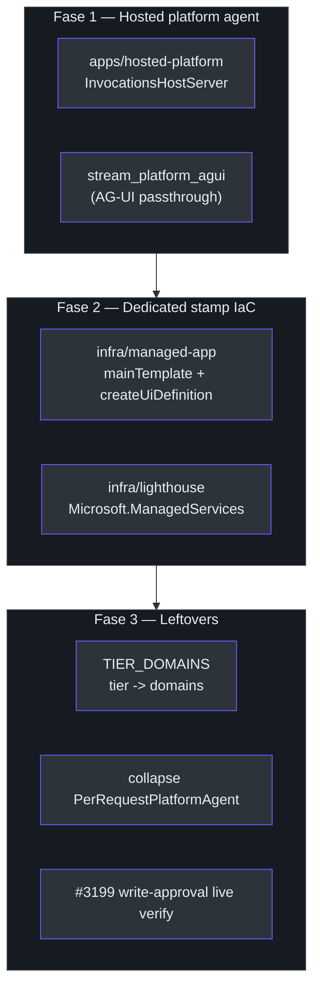
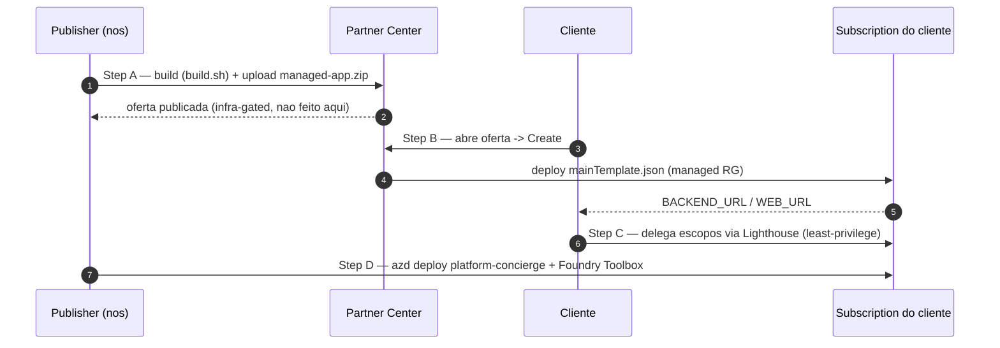

# Sub-projetos SaaS e o runbook de D-packaging

## A estrutura superpowers/

A epopeia SaaS é decomposta em quatro sub-projetos (A → D), cada um com sua **spec** (em
`docs/superpowers/specs/`) e seu **plan** de implementação (em `docs/superpowers/plans/`).
A spec de arquitetura-alvo é o topo; cada sub-projeto desce ao detalhe. Esta página
documenta esse conjunto de planejamento, o **D-PACKAGING-RUNBOOK.md** que o operacionaliza,
e a **onda grounded** de 2026-07-01 que chegou depois.

| Sub-projeto | Spec | Plan |
| --- | --- | --- |
| Arquitetura-alvo | [saas-target-architecture-design.md](https://github.com/ruinosus/foundry-assured/blob/3333d60d0e9c02b64a532f2c9bad94692cf50075/docs/superpowers/specs/2026-06-29-saas-target-architecture-design.md) | — |
| A — Multitenant foundation | [subproject-a-…-design.md](https://github.com/ruinosus/foundry-assured/blob/3333d60d0e9c02b64a532f2c9bad94692cf50075/docs/superpowers/specs/2026-06-29-subproject-a-multitenant-foundation-design.md) | [plan](https://github.com/ruinosus/foundry-assured/blob/3333d60d0e9c02b64a532f2c9bad94692cf50075/docs/superpowers/plans/2026-06-29-subproject-a-multitenant-foundation.md) |
| B — Connections | [subproject-b-…-design.md](https://github.com/ruinosus/foundry-assured/blob/3333d60d0e9c02b64a532f2c9bad94692cf50075/docs/superpowers/specs/2026-06-29-subproject-b-connections-design.md) | [plan](https://github.com/ruinosus/foundry-assured/blob/3333d60d0e9c02b64a532f2c9bad94692cf50075/docs/superpowers/plans/2026-06-29-subproject-b-connections.md) |
| C — Credential brokering | [subproject-c-…-design.md](https://github.com/ruinosus/foundry-assured/blob/3333d60d0e9c02b64a532f2c9bad94692cf50075/docs/superpowers/specs/2026-06-29-subproject-c-credential-brokering-design.md) | [plan](https://github.com/ruinosus/foundry-assured/blob/3333d60d0e9c02b64a532f2c9bad94692cf50075/docs/superpowers/plans/2026-06-29-subproject-c-credential-brokering.md) |
| D — Runtime | [subproject-d-runtime-design.md](https://github.com/ruinosus/foundry-assured/blob/3333d60d0e9c02b64a532f2c9bad94692cf50075/docs/superpowers/specs/2026-06-29-subproject-d-runtime-design.md) | [plan](https://github.com/ruinosus/foundry-assured/blob/3333d60d0e9c02b64a532f2c9bad94692cf50075/docs/superpowers/plans/2026-06-29-subproject-d-runtime.md) |
| D — Packaging | [subproject-d-packaging-design.md](https://github.com/ruinosus/foundry-assured/blob/3333d60d0e9c02b64a532f2c9bad94692cf50075/docs/superpowers/specs/2026-06-29-subproject-d-packaging-design.md) | [plan](https://github.com/ruinosus/foundry-assured/blob/3333d60d0e9c02b64a532f2c9bad94692cf50075/docs/superpowers/plans/2026-06-29-subproject-d-packaging.md) |
| **Grounded OBO citations** *(2026-07-01)* | [grounded-obo-citations-design.md](https://github.com/ruinosus/foundry-assured/blob/3333d60d0e9c02b64a532f2c9bad94692cf50075/docs/superpowers/specs/2026-07-01-grounded-obo-citations-design.md) | [plan](https://github.com/ruinosus/foundry-assured/blob/3333d60d0e9c02b64a532f2c9bad94692cf50075/docs/superpowers/plans/2026-07-01-grounded-obo-citations.md) |
| **Grounded archetype unification** *(2026-07-01)* | [grounded-archetype-unification-design.md](https://github.com/ruinosus/foundry-assured/blob/3333d60d0e9c02b64a532f2c9bad94692cf50075/docs/superpowers/specs/2026-07-01-grounded-archetype-unification-design.md) | [plan](https://github.com/ruinosus/foundry-assured/blob/3333d60d0e9c02b64a532f2c9bad94692cf50075/docs/superpowers/plans/2026-07-01-grounded-archetype-unification.md) |

> **Convenção de teste (lida em fonte).** O repo usa testes runnable `def main() -> int`
> em `apps/backend/eval/` via `uv run python -m eval.<name>` — **sem pytest**
> ([…subproject-d-packaging.md:9](https://github.com/ruinosus/foundry-assured/blob/3333d60d0e9c02b64a532f2c9bad94692cf50075/docs/superpowers/plans/2026-06-29-subproject-d-packaging.md#L9)).
> O plan inteiro é executado por agentes (superpowers), com steps em checkbox
> ([…subproject-d-packaging.md:3](https://github.com/ruinosus/foundry-assured/blob/3333d60d0e9c02b64a532f2c9bad94692cf50075/docs/superpowers/plans/2026-06-29-subproject-d-packaging.md#L3)).

## D-packaging — o que ele finaliza

A spec de D-packaging tem três fases, cada uma com um deliverable **infra-free** (autorado
+ validado estruturalmente agora) e uma validação **infra-gated** (Foundry deployado /
Partner Center / tenants de cliente)
([…subproject-d-packaging-design.md:10-12](https://github.com/ruinosus/foundry-assured/blob/3333d60d0e9c02b64a532f2c9bad94692cf50075/docs/superpowers/specs/2026-06-29-subproject-d-packaging-design.md#L10-L12)).

<!-- Sources: docs/superpowers/specs/2026-06-29-subproject-d-packaging-design.md:50-152, docs/superpowers/plans/2026-06-29-subproject-d-packaging.md:19-35 -->

### Fase 1 — O agente hosted de paridade total

O agente deployado serve o **mesmo** agente AG-UI de `/platform` com a **mesma governança
da live** (tools por tenant + write-approval HITL). A **inversão crítica**: os
`hosted-agent`/`hosted-cockpit` existentes eram variantes *Responses deliberadamente
stripadas* (single-identity, sem OBO/HITL); o `hosted-platform` faz o **oposto** —
serve o mesmo agente AG-UI, mantendo per-tenant + write-approval
([…d-packaging-design.md:70-81](https://github.com/ruinosus/foundry-assured/blob/3333d60d0e9c02b64a532f2c9bad94692cf50075/docs/superpowers/specs/2026-06-29-subproject-d-packaging-design.md#L70-L81)).
O `stream_platform_agui` real vive em
[apps/backend/app/services/hosted.py](https://github.com/ruinosus/foundry-assured/blob/3333d60d0e9c02b64a532f2c9bad94692cf50075/apps/backend/app/services/hosted.py);
o container em
[apps/hosted-platform/main.py](https://github.com/ruinosus/foundry-assured/blob/3333d60d0e9c02b64a532f2c9bad94692cf50075/apps/hosted-platform/main.py).

### Fase 2 — Managed App + Lighthouse como IaC

Autora os artefatos de marketplace agora (validados offline); publish/delegação reais são
infra-gated. **Caminho DRY:** autora o deployment do managed-app em Bicep que **compõe os
módulos `infra/` existentes** (`resources.bicep`, `containerapps.bicep`), depois
`bicep build` → `mainTemplate.json`
([…d-packaging-design.md:109-123](https://github.com/ruinosus/foundry-assured/blob/3333d60d0e9c02b64a532f2c9bad94692cf50075/docs/superpowers/specs/2026-06-29-subproject-d-packaging-design.md#L109-L123)).
O Lighthouse é um registro `Microsoft.ManagedServices` **least-privilege, revogável,
auditável**
([…d-packaging-design.md:119-121](https://github.com/ruinosus/foundry-assured/blob/3333d60d0e9c02b64a532f2c9bad94692cf50075/docs/superpowers/specs/2026-06-29-subproject-d-packaging-design.md#L119-L121)).

### Fase 3 — Leftovers

O mapa `TIER_DOMAINS: dict[str, tuple[str, ...]]` em
[apps/backend/app/core/tenant.py](https://github.com/ruinosus/foundry-assured/blob/3333d60d0e9c02b64a532f2c9bad94692cf50075/apps/backend/app/core/tenant.py)
fecha a Open Q#3 da ADR-010; `POST /tenant/onboard` aceita um `tier` opcional e semeia
`enabled_domains` ([…d-packaging-design.md:133-140](https://github.com/ruinosus/foundry-assured/blob/3333d60d0e9c02b64a532f2c9bad94692cf50075/docs/superpowers/specs/2026-06-29-subproject-d-packaging-design.md#L133-L140)).
O colapso de `PerRequestPlatformAgent` em `PerRequestAgent` (em
[apps/backend/app/agents/per_request.py](https://github.com/ruinosus/foundry-assured/blob/3333d60d0e9c02b64a532f2c9bad94692cf50075/apps/backend/app/agents/per_request.py)
e [platform.py](https://github.com/ruinosus/foundry-assured/blob/3333d60d0e9c02b64a532f2c9bad94692cf50075/apps/backend/app/agents/platform.py))
é refactor puro — **self-hosted byte-identical**
([…d-packaging-design.md:141-145](https://github.com/ruinosus/foundry-assured/blob/3333d60d0e9c02b64a532f2c9bad94692cf50075/docs/superpowers/specs/2026-06-29-subproject-d-packaging-design.md#L141-L145)).

## O runbook — onde a infra entra

O `D-PACKAGING-RUNBOOK.md` é o **veículo dos passos infra-gated** de D-packaging. Um banner
deixa explícito: *"Infra-gated. Every step below requires an external account or a live
Azure subscription/tenant… None of it runs in CI and nothing here has been executed"*
([docs/D-PACKAGING-RUNBOOK.md:3-14](https://github.com/ruinosus/foundry-assured/blob/3333d60d0e9c02b64a532f2c9bad94692cf50075/docs/D-PACKAGING-RUNBOOK.md#L3-L14)).
Honestidade de scope: nada de "published" fabricado.

| Veículo | Para quê | Artefato | Quem implanta | Fonte |
| --- | --- | --- | --- | --- |
| **Managed Application** | Dedicated stamp (enterprise) | `infra/managed-app/managed-app.zip` | Cliente, do marketplace, na sua subscription | [D-PACKAGING-RUNBOOK.md:22](https://github.com/ruinosus/foundry-assured/blob/3333d60d0e9c02b64a532f2c9bad94692cf50075/docs/D-PACKAGING-RUNBOOK.md#L22) |
| **Azure Lighthouse** | Gestão de data-plane shared | `infra/lighthouse/lighthouse.bicep` + `parameters.json` | Cliente, delegando escopos ao nosso tenant | [D-PACKAGING-RUNBOOK.md:23](https://github.com/ruinosus/foundry-assured/blob/3333d60d0e9c02b64a532f2c9bad94692cf50075/docs/D-PACKAGING-RUNBOOK.md#L23) |

<!-- Sources: docs/D-PACKAGING-RUNBOOK.md:31-176 -->

**Step A — Publish (Partner Center):** `cd infra/managed-app && ./build.sh` →
`mainTemplate.json` + `managed-app.zip`; **deployment mode = Incremental (recommended)** —
**não escolher Complete** (destrutivo: ambos módulos declaram o mesmo Log Analytics
workspace)
([D-PACKAGING-RUNBOOK.md:36-62](https://github.com/ruinosus/foundry-assured/blob/3333d60d0e9c02b64a532f2c9bad94692cf50075/docs/D-PACKAGING-RUNBOOK.md#L36-L62)).

**Step B — Cliente implanta:** o portal renderiza `createUiDefinition.json`; o cliente
seta `modelDeploymentName` (default `gpt-5-mini`) + campos OBO opcionais. **`principalId`
é vazio no caminho managed-app** — sem grant de data-plane ao usuário deployer,
**fail-closed por padrão**
([D-PACKAGING-RUNBOOK.md:88-99](https://github.com/ruinosus/foundry-assured/blob/3333d60d0e9c02b64a532f2c9bad94692cf50075/docs/D-PACKAGING-RUNBOOK.md#L88-L99)).

**Step C — Lighthouse:** o cliente delega no escopo de subscription com role set
**least-privilege: Reader + Monitoring Contributor + Log Analytics Reader (sem Owner, sem
Contributor)**; revogação removendo o `registrationAssignments`
([D-PACKAGING-RUNBOOK.md:126-133](https://github.com/ruinosus/foundry-assured/blob/3333d60d0e9c02b64a532f2c9bad94692cf50075/docs/D-PACKAGING-RUNBOOK.md#L126-L133)).

**Step D — Agente hosted + Toolbox:** o `platform-concierge` carrega write-approval HITL →
usa o protocolo **Invocations** (não Responses); tools resolvem via um **Foundry Toolbox
com OAuth identity passthrough (por tenant, OBO)**
([D-PACKAGING-RUNBOOK.md:146-149](https://github.com/ruinosus/foundry-assured/blob/3333d60d0e9c02b64a532f2c9bad94692cf50075/docs/D-PACKAGING-RUNBOOK.md#L146-L149)).
`azd deploy platform-concierge` (azd service → `apps/hosted-platform`,
`host: azure.ai.agent`)
([D-PACKAGING-RUNBOOK.md:151-157](https://github.com/ruinosus/foundry-assured/blob/3333d60d0e9c02b64a532f2c9bad94692cf50075/docs/D-PACKAGING-RUNBOOK.md#L151-L157)).

## A onda grounded (2026-07-01) — duas specs, um arquétipo

Depois do SaaS, o architecture do agente "drifted into an inconsistent shape" — **4
domínios servidos de duas maneiras**, com o próprio caminho grounded **forkado em dois**
([grounded-archetype-unification-design.md:9-19](https://github.com/ruinosus/foundry-assured/blob/3333d60d0e9c02b64a532f2c9bad94692cf50075/docs/superpowers/specs/2026-07-01-grounded-archetype-unification-design.md#L9-L19)).
Duas specs consecutivas resolveram isso:

| Spec | Objetivo | STEP 0 findings |
| --- | --- | --- |
| **grounded-obo-citations** | Citações estruturadas + ACL por usuário via **OBO + Responses API + Foundry IQ MCP tool** (`knowledge_base_retrieve`), trocando o regex-sobre-texto do `EvidencePanel` | [STEP0-findings](https://github.com/ruinosus/foundry-assured/blob/3333d60d0e9c02b64a532f2c9bad94692cf50075/docs/superpowers/plans/2026-07-01-grounded-obo-citations-STEP0-findings.md) |
| **grounded-archetype-unification** | **Um arquétipo grounded** (retriever nativo + single head + ACL por usuário) com domínios reduzidos a **dados** | [STEP0-findings](https://github.com/ruinosus/foundry-assured/blob/3333d60d0e9c02b64a532f2c9bad94692cf50075/docs/superpowers/plans/2026-07-01-grounded-archetype-unification-STEP0-findings.md) |

O conflito aparente era **(1) retriever nativo ↔ (3) ACL por usuário**: acreditava-se que
o caminho agêntico `knowledge_base_retrieve` nunca honrava o header
`x-ms-query-source-authorization`
([grounded-archetype-unification-design.md:30-40](https://github.com/ruinosus/foundry-assured/blob/3333d60d0e9c02b64a532f2c9bad94692cf50075/docs/superpowers/specs/2026-07-01-grounded-archetype-unification-design.md#L30-L40)).

> **Evolução do gate (leitura honesta).** O **STEP 0** original probou a KB `azureBlob` e
> gravou o **VERDICT: ❌ NO** — o retriever nativo não expõe o filtro do chamador nessa KB;
> recomendou Plan B (direct-search)
> ([archetype-STEP0-findings.md:12-18](https://github.com/ruinosus/foundry-assured/blob/3333d60d0e9c02b64a532f2c9bad94692cf50075/docs/superpowers/plans/2026-07-01-grounded-archetype-unification-STEP0-findings.md#L12-L18)).
> O **STEP 0.5** re-probou sobre uma KB **`searchIndex`** e **inverteu** o veredicto: uma KB
> `searchIndex` **honra** o header — os três (nativo + single head + ACL) coexistem migrando
> a KB para uma fonte `searchIndex`
> ([grounded-archetype-unification-design.md:102-115](https://github.com/ruinosus/foundry-assured/blob/3333d60d0e9c02b64a532f2c9bad94692cf50075/docs/superpowers/specs/2026-07-01-grounded-archetype-unification-design.md#L102-L115)).
> Quem ler só o topo do arquivo de findings vê o ❌ — o veredicto vivo é o searchIndex.

O arquétipo real é uma linha de montagem de quatro estações — **Identity (OBO) → Retrieve
→ Synthesize → Emit** — com a costura que de-risca tudo em `retrieve()`, que **possui as
duas identidades de retrieval internamente** (o app MI como credencial de serviço + o token
do usuário como header ACL)
([grounded-archetype-unification-design.md:44-65](https://github.com/ruinosus/foundry-assured/blob/3333d60d0e9c02b64a532f2c9bad94692cf50075/docs/superpowers/specs/2026-07-01-grounded-archetype-unification-design.md#L44-L65)).
Como-construído, o seam vive em
[apps/backend/app/services/retrieval.py](https://github.com/ruinosus/foundry-assured/blob/3333d60d0e9c02b64a532f2c9bad94692cf50075/apps/backend/app/services/retrieval.py)
e o registry de domínios do backend em
[apps/backend/app/domains.py](https://github.com/ruinosus/foundry-assured/blob/3333d60d0e9c02b64a532f2c9bad94692cf50075/apps/backend/app/domains.py)
(mirror do `apps/frontend/lib/domains.ts`); um loop de mount único despacha por `kind`
([grounded-archetype-unification-design.md:69-94](https://github.com/ruinosus/foundry-assured/blob/3333d60d0e9c02b64a532f2c9bad94692cf50075/docs/superpowers/specs/2026-07-01-grounded-archetype-unification-design.md#L69-L94)).
A prova Microsoft (Responses API é o caminho de auth-por-usuário; header + prerequisito de
metadados de permissão) está registrada em §8 da spec de citações
([grounded-obo-citations-design.md:234-258](https://github.com/ruinosus/foundry-assured/blob/3333d60d0e9c02b64a532f2c9bad94692cf50075/docs/superpowers/specs/2026-07-01-grounded-obo-citations-design.md#L234-L258))
e nas linhas 42–44 de
[docs/MICROSOFT-ALIGNMENT.md:42-44](https://github.com/ruinosus/foundry-assured/blob/3333d60d0e9c02b64a532f2c9bad94692cf50075/docs/MICROSOFT-ALIGNMENT.md#L42-L44).

## Validação offline (infra-free)

Antes de qualquer infra: `bicep build` compila o `mainTemplate.json`; **ARM-TTK
(`Test-AzTemplate`)** linta `mainTemplate.json` + `createUiDefinition.json`; o zip monta
no layout de root requerido
([…d-packaging-design.md:125-129](https://github.com/ruinosus/foundry-assured/blob/3333d60d0e9c02b64a532f2c9bad94692cf50075/docs/superpowers/specs/2026-06-29-subproject-d-packaging-design.md#L125-L129)).
Os artefatos vivem em
[infra/managed-app/managedApp.bicep](https://github.com/ruinosus/foundry-assured/blob/3333d60d0e9c02b64a532f2c9bad94692cf50075/infra/managed-app/managedApp.bicep)
e [infra/lighthouse/lighthouse.bicep](https://github.com/ruinosus/foundry-assured/blob/3333d60d0e9c02b64a532f2c9bad94692cf50075/infra/lighthouse/lighthouse.bicep).

## Related Pages

| Página | Relação |
|------|-------------|
| [Arquitetura SaaS multi-tenant](./page-3.md) | A arquitetura que estes sub-projetos implementam |
| [Decisões de arquitetura (ADRs)](./page-4.md) | ADR-002/009/010/011 dirigem D-packaging |
| [Customização e expansão de domínio](./page-7.md) | O arquétipo grounded unificado, como-construído |
| [Deploy, branching e custo](./page-6.md) | O fluxo de branch e o deploy hosted |
