# Visão geral do conjunto de documentação

## Por que este conjunto existe

O diretório `docs/` **não** é um amontoado de notas: é uma base de documentação
versionada, tipada e revisada como código. A regra de fundo está escrita
explicitamente — *"Docs live in the repo, change in the same PR as the code they
describe, and are reviewed like code."*
(docs/DOCS-STANDARD.md:87-88).
A consequência prática: cada fato tem **uma** fonte de verdade — *"One source of
truth per fact."*
(docs/DOCS-STANDARD.md:93-94).

Esta página é o índice navegável do conjunto. Os documentos se dividem em **cinco
grandes blocos**: o **mecanismo de assurance** (o que o produto garante), a
**arquitetura SaaS multi-tenant** (para onde o produto evoluiu desde a v0.1.0), os
**guias operacionais + estudos de caso** (como rodar, adaptar e provar), a onda de
**specs de citações grounded** que unificou os agentes de conhecimento sobre o retriever
nativo da Microsoft, e — novidade desta v0.4.0 — a documentação de **HTML Artifacts**: a
estratégia de nível de plataforma (na raiz do repo) e o trio de specs/plans que a
concretizou (MVP governado → canvas Studio → geração dirigida por skills + grounding MCP).

> **Fato (lido em fonte).** O índice oficial dos docs vive em
> (docs/README.md:21-41),
> uma tabela `Doc | Type | Audience | What it's for`. Esta página de wiki reflete esse
> índice e o expande com as novidades da era SaaS (ADRs 001–011, specs de sub-projetos,
> runbook de packaging, custo e branching), com os docs que ainda não entraram na
> tabela do README (`MICROSOFT-ALIGNMENT.md`, as duas specs grounded de 2026-07-01 e o
> plano PARKED de portal de apresentações) **e** com a nova documentação de HTML Artifacts
> — a estratégia `foundry-assured-html-artifacts-strategy.md` (na raiz do repo, não em `docs/`)
> e as specs/plans de 2026-07-06 sob `docs/superpowers/` (ver [HTML Artifacts](./page-9.md)).

## O conjunto em uma tabela

| Documento | Tipo (`type:`) | Audiência | Para quê | Fonte |
| --- | --- | --- | --- | --- |
| **METHOD.md** | reference | adopter | O mecanismo de assurance — garantias, gates e como rodar | (docs/README.md:23) |
| **DEPLOYMENT.md** | how-to | operator | Provisionamento ponta-a-ponta, do clone ao deploy | (docs/README.md:24) |
| **IDENTITY-AND-ACCESS-SETUP.md** | reference | operator | O mapa Entra ID — o que o azd/Bicep cria vs registros manuais | (docs/README.md:25) |
| **RBAC-AND-USER-MANAGEMENT-PLAN.md** | plan | contributor | App RBAC (Entra App Roles) + gestão de usuários in-portal | (docs/README.md:26) |
| **USE-THIS-TEMPLATE.md** | how-to | adopter | Criar seu próprio repo a partir deste template | (docs/README.md:27) |
| **CUSTOMIZE.md** | how-to | adopter | Trocar as quatro peças de domínio | (docs/README.md:28) |
| **RELEASE-AUTOMATION.md** | how-to | operator | Como um merge vira release versionada + deploy gateado | (docs/README.md:29) |
| **USE-CASE-WALKTHROUGH.md** | explanation | evaluator | Exemplo fictício do mecanismo inteiro ponta-a-ponta | (docs/README.md:30) |
| **CASE-STUDY-LLM-WIKI-LOOP.md** | explanation | evaluator | Estudo de caso medido: aterrar docs e eval na fonte | (docs/README.md:31) |
| **CASE-STUDY-SELFWIKI-DOGFOOD.md** | explanation | evaluator | Dogfood do mecanismo neste repo — dois bugs que ele achou em si | (docs/README.md:32) |
| **DOCS-STANDARD.md** | reference | contributor | Como os docs são tipados, estruturados e diagramados | (docs/README.md:39) |

*A tabela acima é o subconjunto listado no README. A era SaaS e a onda grounded adicionam
os ADRs, specs, runbooks e o `MICROSOFT-ALIGNMENT.md` documentados nas páginas seguintes.*

## O que o README ainda não lista (docs recém-chegados)

O `docs/README.md` está estampado `updated: 2026-06-27`
(docs/README.md:7)
e por isso **não indexa** os documentos que chegaram depois. Esta wiki os cobre:

| Documento | Tipo | Estado | O que é | Fonte |
| --- | --- | --- | --- | --- |
| **MICROSOFT-ALIGNMENT.md** | reference | vivo | Matriz de conformância — quais padrões Microsoft seguimos, onde, e a prova (link do doc) | (docs/MICROSOFT-ALIGNMENT.md:1-11) |
| **grounded-obo-citations-design.md** | spec | shipped | Citações estruturadas via OBO + Responses API + Foundry IQ MCP tool | (docs/superpowers/specs/2026-07-01-grounded-obo-citations-design.md:1-15) |
| **grounded-archetype-unification-design.md** | spec | shipped | Unifica os domínios grounded num único arquétipo sobre o retriever nativo | (docs/superpowers/specs/2026-07-01-grounded-archetype-unification-design.md:1-6) |
| **PRESENTATIONS-PORTAL-PLAN.md** | plan | **PARKED** | Portal de decks access-controlled — o mecanismo aplicado a artefatos HTML | (docs/PRESENTATIONS-PORTAL-PLAN.md:10-14) |
| **MCP-INTEGRATION-PLAN.md** | plan | vivo | Integração dos MCP servers Microsoft (domínio `platform`) | (docs/MCP-INTEGRATION-PLAN.md) |
| **SECOND-DOMAIN-WIKI-PLAN.md** | plan | vivo | O plano vivo do 2º domínio via padrão LLM Wiki | (docs/README.md:38) |
| **foundry-assured-html-artifacts-strategy.md** | strategy | shipped→feature | A estratégia HTML Artifacts (na **raiz do repo**, fora de `docs/`): por que reusar Next.js + FastAPI + Blob + iframe sandbox em vez de Static Web Apps/SharePoint/Power Pages | (foundry-assured-html-artifacts-strategy.md:411-415) |
| **2026-07-06-html-artifacts-mvp.md** | plan | shipped | O MVP governado — `ArtifactStore`/`ContentStore`, lifecycle approve-to-publish, viewer sandbox | (docs/superpowers/plans/2026-07-06-html-artifacts-mvp.md:5-7) |
| **2026-07-06-artifacts-canvas-design.md** / `-canvas.md` | design + plan | shipped | O Studio: canvas conversacional CopilotKit + AG-UI com preview vivo sandboxed | (docs/superpowers/specs/2026-07-06-artifacts-canvas-design.md:9-22) |
| **2026-07-06-skills-driven-generation-design.md** / `-generation.md` | design + plan | draft | Geração dirigida por `SKILL.md` + grounding read-only via MCP | (docs/superpowers/specs/2026-07-06-skills-driven-generation-design.md:9-25) |

> **Inconsistência real (surfaçada pelo dogfood).** A tabela do `README.md` é um subconjunto
> desatualizado: omite `MICROSOFT-ALIGNMENT.md`, `PRESENTATIONS-PORTAL-PLAN.md`, as duas
> specs grounded de 2026-07-01, os ADRs e as specs de sub-projeto. O `README.md` deveria
> re-carimbar `updated:` e reincorporar esses docs — o mecanismo de assurance existe
> justamente para expor lacunas como esta (ver [Estudos de caso e dogfood](./page-8.md)).

## O padrão por trás dos documentos (Diátaxis ↔ Microsoft Learn)

Todo `.md` sob `docs/` carrega um **tipo** que mapeia 1:1 entre o framework
[Diátaxis](https://diataxis.fr/) e o `ms.topic` do Microsoft Learn — a *necessidade do
leitor* escolhe o tipo
(docs/DOCS-STANDARD.md:15-27).

| Tipo | `ms.topic` | O leitor está… | Fonte |
| --- | --- | --- | --- |
| `tutorial` | tutorial | aprendendo fazendo | (docs/DOCS-STANDARD.md:23) |
| `how-to` | how-to | completando uma tarefa | (docs/DOCS-STANDARD.md:24) |
| `reference` | reference | consultando algo | (docs/DOCS-STANDARD.md:25) |
| `explanation` | conceptual | entendendo o *porquê* | (docs/DOCS-STANDARD.md:26) |
| `plan` | conceptual | acompanhando trabalho planejado | (docs/DOCS-STANDARD.md:27) |

Cada `.md` começa com um bloco YAML (front-matter) seguido por exatamente um `# H1` —
ambos, nessa ordem, como o Microsoft Learn exige
(docs/DOCS-STANDARD.md:32-46).
**Exceção:** tudo sob `docs/wiki/` é a deep-wiki gerada por máquina (o domínio
`selfwiki`) e é **isento** da regra de front-matter + H1 — não é escrito à mão, é
regenerado
(docs/DOCS-STANDARD.md:51-54).
Esta própria wiki é justamente esse conteúdo gerado.

## Como os blocos se conectam

```mermaid
flowchart TB
  subgraph MECH["Mecanismo de assurance"]
    METHOD["METHOD.md<br>garantias + gates"]
    PLAN["ASSURANCE-MECHANISM-PLAN.md<br>design + racional"]
    ALIGN["MICROSOFT-ALIGNMENT.md<br>matriz de conformancia"]
  end
  subgraph SAAS["Arquitetura SaaS multi-tenant"]
    SPEC["superpowers/specs/*<br>arquitetura-alvo + A–D + grounded"]
    ADR["adr/ADR-001..011<br>decisoes"]
    RUN["D-PACKAGING-RUNBOOK.md<br>packaging"]
  end
  subgraph OPS["Operacao + provas"]
    DEP["DEPLOYMENT · BRANCHING · COST"]
    CUST["CUSTOMIZE · USE-THIS-TEMPLATE"]
    CASE["CASE-STUDY-* · selfwiki dogfood · PRESENTATIONS-PORTAL (parked)"]
  end
  subgraph ART["HTML Artifacts (v0.4.0)"]
    STRAT["strategy (raiz do repo)<br>por que reusar a stack"]
    MVP["html-artifacts-mvp<br>lifecycle governado"]
    CANVAS["artifacts-canvas<br>Studio CopilotKit + AG-UI"]
    SKILLS["skills-driven-generation<br>SKILL.md + MCP reads"]
  end
  STD["DOCS-STANDARD.md<br>tipos + front-matter + Mermaid"]
  STD --> MECH
  STD --> SAAS
  STD --> OPS
  STD --> ART
  PLAN --> METHOD
  ALIGN --> METHOD
  SPEC --> ADR
  ADR --> RUN
  METHOD --> DEP
  CUST --> CASE
  STRAT --> MVP
  MVP --> CANVAS
  CANVAS --> SKILLS
  style MECH fill:#161b22,stroke:#30363d,color:#e6edf3
  style SAAS fill:#161b22,stroke:#30363d,color:#e6edf3
  style OPS fill:#161b22,stroke:#30363d,color:#e6edf3
  style ART fill:#161b22,stroke:#30363d,color:#e6edf3
  style METHOD fill:#2d333b,stroke:#6d5dfc,color:#e6edf3
  style PLAN fill:#2d333b,stroke:#6d5dfc,color:#e6edf3
  style ALIGN fill:#2d333b,stroke:#6d5dfc,color:#e6edf3
  style SPEC fill:#2d333b,stroke:#6d5dfc,color:#e6edf3
  style ADR fill:#2d333b,stroke:#6d5dfc,color:#e6edf3
  style RUN fill:#2d333b,stroke:#6d5dfc,color:#e6edf3
  style DEP fill:#2d333b,stroke:#6d5dfc,color:#e6edf3
  style CUST fill:#2d333b,stroke:#6d5dfc,color:#e6edf3
  style CASE fill:#2d333b,stroke:#6d5dfc,color:#e6edf3
  style STD fill:#2d333b,stroke:#6d5dfc,color:#e6edf3
  style STRAT fill:#2d333b,stroke:#6d5dfc,color:#e6edf3
  style MVP fill:#2d333b,stroke:#6d5dfc,color:#e6edf3
  style CANVAS fill:#2d333b,stroke:#6d5dfc,color:#e6edf3
  style SKILLS fill:#2d333b,stroke:#6d5dfc,color:#e6edf3
```

<!-- Sources: docs/README.md:12-41, docs/DOCS-STANDARD.md:15-54, docs/MICROSOFT-ALIGNMENT.md:8-11, foundry-assured-html-artifacts-strategy.md:694-726 -->

A própria página inicial dos docs resume a tese em uma frase: **"Three domains, one
mechanism"** — o mesmo código de assurance dirige domínios de conhecimento swappable
(helpdesk, cockpit, selfwiki), cada um com sua KB e ingest, e você implanta qualquer
subconjunto
(docs/README.md:12-17).
Desde então entrou um **quarto domínio tool-driven** (`platform`) e os três grounded
foram unificados sobre um único arquétipo (ver [Customização e expansão](./page-7.md)).

## O que mudou desde a v0.3.0

A v0.3.0 desta wiki refletiu a **onda de citações grounded** e a matriz de conformância
Microsoft. A v0.4.0 (esta) acrescenta a **documentação de HTML Artifacts** — a estratégia
de plataforma mais o trio de specs/plans que a implementou:

- **`foundry-assured-html-artifacts-strategy.md`** — na **raiz do repo** (não em `docs/`): o
  documento de estratégia que comparou opções Microsoft (Sway, SharePoint, Static Web Apps,
  Power Pages, Blob Static Website) e recomendou **reusar** o Next.js + FastAPI + Blob +
  iframe sandbox já existentes
  (foundry-assured-html-artifacts-strategy.md:411-415).
- **Trio de specs/plans (2026-07-06)** sob `docs/superpowers/` — a evolução em três camadas:
  **MVP governado** (`2026-07-06-html-artifacts-mvp.md`), **Studio canvas** CopilotKit + AG-UI
  (`2026-07-06-artifacts-canvas-design.md` + plano), e **geração dirigida por skills** +
  grounding MCP (`2026-07-06-skills-driven-generation-design.md` + plano). Detalhada na
  página [HTML Artifacts](./page-9.md).
- **Continuidade da era SaaS + grounded** — os ADRs 001–011, as specs A→D, as duas specs
  grounded e o `MICROSOFT-ALIGNMENT.md` seguem cobertos (páginas 2–8). O rename de produto
  `helpdesk` → **`assured`** (`foundry-assured`) permanece.

## Related Pages

| Página | Relação |
|------|-------------|
| [O mecanismo de assurance](./page-2.md) | O coração do produto — garantias e gates |
| [Arquitetura SaaS multi-tenant](./page-3.md) | Para onde o conjunto evoluiu |
| [Decisões de arquitetura (ADRs)](./page-4.md) | As decisões que sustentam a evolução |
| [Sub-projetos e D-packaging](./page-5.md) | As specs SaaS + as novas specs grounded |
| [HTML Artifacts](./page-9.md) | A estratégia + as specs/plans MVP → Studio → skills |
| [Estudos de caso e dogfood](./page-8.md) | As provas + o portal de apresentações PARKED |
