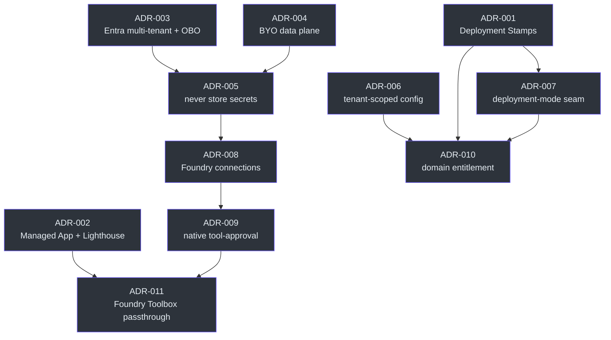

# Decisões de arquitetura (ADRs 001–012)

## O que são e por que existem

ADRs capturam decisões de arquitetura significativas: **context → decision →
consequences**, cada uma aterrada na orientação Microsoft que segue. O formato é
leve (MADR-style)
(docs/adr/README.md:1-4).
As **11 ADRs compartilham Status: Accepted e Date: 2026-06-29** — todas escritas na mesma
rodada de design SaaS.

O mapeamento spec↔ADR (footer do índice): **ADRs 001–007** pertencem à arquitetura-alvo
SaaS; **ADR-008** refina conexão/segredo para o sub-projeto B; **ADR-009** o credential
brokering + write approval para C; **ADR-010** o entitlement por domínio para D-runtime;
**ADR-011** o passthrough de Toolbox para D-packaging; **ADR-012** a reutilização do plugin
deep-wiki upstream (`microsoft/skills`) para a geração da self-wiki
(docs/adr/README.md:22).

> **Nota da v0.3.0.** As duas specs grounded de 2026-07-01
> (`grounded-obo-citations`, `grounded-archetype-unification`) **estendem** a arquitetura
> mas **não** foram gravadas como novas ADRs — vivem em `docs/superpowers/specs/` com seus
> plans (ver [Sub-projetos e D-packaging](./page-5.md)). O que elas encostam do lado das
> decisões é registrado na **matriz de conformância** `MICROSOFT-ALIGNMENT.md`, complementar
> aos ADRs
> (docs/MICROSOFT-ALIGNMENT.md:8-11).

## Índice das 11 decisões

| ADR | Decisão (uma linha) | Sub-projeto | Fonte |
| --- | --- | --- | --- |
| 001 | Tenancy = **Deployment Stamps** (híbrido: shared + dedicated) | arch SaaS | (docs/adr/README.md:10) |
| 002 | Dedicated stamp = **Managed Application**; mgmt cross-tenant = **Lighthouse** | arch SaaS | (docs/adr/README.md:11) |
| 003 | Identidade = **Entra app multi-tenant**, tenant do `tid`, **OBO** downstream | arch SaaS | (docs/adr/README.md:12) |
| 004 | Data plane = **BYO por tenant**, Foundry **project** como fronteira de isolamento | arch SaaS | (docs/adr/README.md:13) |
| 005 | Control plane **nunca armazena segredos do cliente** (passthrough + refs CMK) | arch SaaS | (docs/adr/README.md:14) |
| 006 | Config **tenant-scoped** — substitui o `settings` global; namespace de memória por tenant | arch SaaS | (docs/adr/README.md:15) |
| 007 | Coexistência via costura **deployment-mode** (um codebase, três modos) | arch SaaS | (docs/adr/README.md:16) |
| 008 | **Foundry connections + App Configuration + Key Vault**, não um credential store próprio | B | (docs/adr/README.md:17) |
| 009 | **Native tool-approval + resolução por Foundry-connection** — sem self-read Key Vault, sem HITL caseiro | C | (docs/adr/README.md:18) |
| 010 | Domínio por tenant = **license entitlement** no registro do tenant, não feature flag | D-runtime | (docs/adr/README.md:19) |
| 011 | Resolução de tool hosted = **Foundry Toolbox + OAuth identity passthrough** | D-packaging | (docs/adr/README.md:20) |

## O fio condutor: "não reinvente mecanismos first-party"

A lição que costura 008→011: não reconstruir serviços que a Microsoft já oferece. As
três ADRs de credencial/conexão (008/009/011) convergem nisso, e a 005 é o axioma de
fundo ("não somos um secret store").

<!-- Sources: docs/adr/README.md:22, docs/adr/ADR-008-foundry-connections-app-configuration.md:13, docs/adr/ADR-009-native-tool-approval-foundry-connection-resolution.md:5, docs/adr/ADR-011-hosted-per-tenant-foundry-toolbox-passthrough.md:5 -->

## As decisões em detalhe

### ADR-001 — Deployment Stamps híbrido

Adota o padrão **Deployment Stamps** em config híbrida: **shared stamp** (default, SMB),
**dedicated stamp** (enterprise), **self-hosted** (existente). Um stamp é uma cópia
isolada e independente da plataforma; adicionar stamps escala quase-linearmente e contém
o blast radius
(docs/adr/ADR-001-tenancy-deployment-stamps.md:14-26).
Consequência: serve SMB e enterprise de uma arquitetura, ao custo de operar múltiplos
tipos de stamp — o que exige a abstração de deployment-mode da ADR-007
(docs/adr/ADR-001-tenancy-deployment-stamps.md:30-33).

### ADR-002 — Managed Application + Lighthouse

O dedicated stamp é entregue como **Azure Managed Application** na subscription do
cliente; a gestão de data-plane do modelo shared via **delegação Azure Lighthouse**
(docs/adr/ADR-002-dedicated-stamp-managed-app-lighthouse.md:14-22).
Ambos são sancionados pela Microsoft e marketplace-publicáveis; a delegação Lighthouse é
revogável e auditável
(docs/adr/ADR-002-dedicated-stamp-managed-app-lighthouse.md:26-29).
Os artefatos são Bicep que compõe os módulos `infra/` existentes, compilados para
`mainTemplate.json` via `bicep build`
(docs/adr/ADR-002-dedicated-stamp-managed-app-lighthouse.md:31-39).

### ADR-003 — Identidade multi-tenant + OBO

Converte os app regs API/SPA para **multitenant**; **resolve o tenant do claim `tid`** e
valida `iss`; mantém **OBO** para downstreams de audiência Microsoft, terceiros usam OAuth
passthrough; onboarding = admin consent
(docs/adr/ADR-003-multitenant-identity-obo.md:14-24).
Reutiliza a maquinaria OBO existente (`app/core/auth.py`); o risco é que a validação de
token ganha checks obrigatórios `tid`/`iss` + lista de tenants permitidos — um check
faltando é um risco cross-tenant
(docs/adr/ADR-003-multitenant-identity-obo.md:27-30).

### ADR-004 — BYO data plane

Cada tenant **traz seu próprio data plane (BYO)**: Foundry project, Search/KB, storage
próprios. *"We never host the customer's models, KB, or data."* O **Foundry project é a
fronteira de isolamento**, um por tenant
(docs/adr/ADR-004-byo-data-plane-foundry-project.md:13-21).
Dá a isolação de dados mais forte; o custo é fricção de onboarding para clientes sem
Azure — um tier de data-plane gerenciado fica como opção futura, BYO-first
(docs/adr/ADR-004-byo-data-plane-foundry-project.md:24-28).

### ADR-005 — Nunca armazenar segredos

O store guarda **configuração e metadados de conexão apenas — nunca segredos, nunca dado
do cliente**. Audiência Microsoft → OBO cunha token por usuário (nada armazenado);
terceiros (GitHub) → OAuth identity passthrough; segredos em repouso no Key Vault do
cliente, com `Connection.secret_ref` apontando para o URI/connection id, **nunca o valor**
(docs/adr/ADR-005-never-store-secrets.md:14-26).
Fato load-bearing: a Microsoft **bloqueia** passar um token de audiência Microsoft a um
endpoint MCP de terceiro — por isso o passthrough OAuth é obrigatório nesse caminho
(docs/adr/ADR-005-never-store-secrets.md:27-29).

### ADR-006 — Config tenant-scoped

Substitui o `settings` global por **`TenantConfigProvider.current()`**; faz namespace da
memória por tenant — `memory_scope()` vira `f"{tid}:{user.oid}"` **só na impl
`MultiTenant`** (a `SingleTenant` mantém `user.oid` sem prefixo para não orfanar
memórias); enforça o scoping em **um único choke point**
(docs/adr/ADR-006-tenant-scoped-config.md:16-30).
A Microsoft chama o tenant-scoping na camada de dados de "a consideração de segurança mais
importante" para SaaS multitenant; o trade-off é um refactor amplo — cada leitura de
`settings.<x>` deve passar pelo provider, e um scope faltando é um bug de segurança, não
funcional
(docs/adr/ADR-006-tenant-scoped-config.md:9-14,
docs/adr/ADR-006-tenant-scoped-config.md:33-36).

### ADR-007 — Coexistência {#adr-007-coexistencia}

Um único ponto de variação — **`DEPLOYMENT_MODE`** (env) — seleciona uma impl de
`TenantConfigProvider` no boot: `self_hosted`/`dedicated` → `SingleTenantConfigProvider`,
`shared` → `MultiTenantConfigProvider` resolvendo por `tid`. Disciplina de migração:
**enviar `SingleTenant` primeiro com zero mudança de comportamento** antes de adicionar
`MultiTenant`
(docs/adr/ADR-007-coexistence-deployment-mode.md:14-31).
Todo o resto do código pede ao provider "a config do tenant atual" e é **idêntico entre
modos — nunca sabe qual modo roda**
(docs/adr/ADR-007-coexistence-deployment-mode.md:24-26).

### ADR-008 — Foundry connections, não credential store próprio

Auth de serviço externo → **Foundry project connections** (a `Connection` guarda um
`foundry_connection_id`, nunca a credencial); config por tenant → **Azure App
Configuration** (prefixo por tenant-id), primeira impl do B é **Azure Table Storage**
(mais barato), swappable; segredos → **Key Vault** via `keyvault_ref`. O B guarda
"**referências e metadados de governança… não credenciais**, e roda **nenhum fluxo
OAuth**"
(docs/adr/ADR-008-foundry-connections-app-configuration.md:16-36).
O design anterior fazia o B rodar OAuth e guardar `secret_ref` — o que reinventa dois
serviços first-party e contradiz a ADR-005
(docs/adr/ADR-008-foundry-connections-app-configuration.md:9-14).

### ADR-009 — Native tool-approval + resolução por conexão

Resolução de credencial → Foundry connections + OBO; **nunca ler um segredo de Key
Vault**. OBO para servidores de audiência Microsoft; para não-OBO/GitHub via
`Connection.foundry_connection_id` — caminho hosted `get_mcp_tool(project_connection_id=…)`,
caminho interno recupera via `azure-ai-projects` em runtime. `keyvault_ref` é
**deprecado** em favor de `foundry_connection_id`. Write approval → **tool-approval nativo
do framework** via `approval_mode="always_require"`, reusando
`components/chat/TicketApproval.tsx`, exigindo papel **Approver/Admin**
(docs/adr/ADR-009-native-tool-approval-foundry-connection-resolution.md:16-43).
Risco aberto: write-approval sobre AG-UI depende do bug agent-framework **#3199** — um
item de verificação com dois checks independentes + fallbacks
(docs/adr/ADR-009-native-tool-approval-foundry-connection-resolution.md:38-43,
docs/adr/ADR-009-native-tool-approval-foundry-connection-resolution.md:47-51).

### ADR-010 — Domínio por tenant = license entitlement

Modela a habilitação de domínio como **license entitlement no registro do tenant, não
feature flag**: **`TenantRecord.enabled_domains: tuple[str, ...]`** é o entitlement (dado
no catálogo do control plane), lido por uma guarda `require_domain(domain_id)`,
**fail-closed** (sem registro / fora do set → 403). Domínios nomeados: `helpdesk`,
`cockpit`, `selfwiki`, `platform`
(docs/adr/ADR-010-per-tenant-domain-entitlement.md:9-27).
Nota de migração: `enabled_domains` defaulta para `()` — registros pré-existentes
deserializam para `()` → **403 em todo domínio até um Admin conceder via
`PUT /tenant/domains`**; backfill recomendado para 403s não serem confundidos com
regressão
(docs/adr/ADR-010-per-tenant-domain-entitlement.md:54-62).

### ADR-011 — Foundry Toolbox + OAuth passthrough (hosted)

O agente hosted deployado resolve tools via o **endpoint MCP do Foundry Toolbox** com
**OAuth identity passthrough** — *"The agent never manages credentials."* O container é
**protocol-only** — `apps/hosted-platform` usa `InvocationsHostServer`
(`agent_framework_foundry_hosting`) servindo o mesmo agente AG-UI de `/platform`; o
protocolo Invocations passa o stream AG-UI intocado, então o write-approval sobrevive
(docs/adr/ADR-011-hosted-per-tenant-foundry-toolbox-passthrough.md:21-37).
Escolheu o protocolo **Invocations** (não Responses) porque o platform agent carrega
HITL de write-approval que o Responses não consegue round-tripar
(docs/adr/ADR-011-hosted-per-tenant-foundry-toolbox-passthrough.md:8-19).

### ADR-012 — Reutilizar o tooling deep-wiki upstream (não reinventar o gerador)

A geração da self-wiki reusa o plugin **`deep-wiki` do `microsoft/skills`** (MIT), vendorizado
(pinado) em **`.github/skills/deep-wiki/`** — local nativo de descoberta de skills do GitHub, então
o **Copilot cloud agent / CLI / VS Code agent mode** (e o Claude Code) enxergam as 10 skills, não só
`wiki-architect`/`wiki-page-writer`. Mantém-se como fosso apenas a **camada de assurance** (formato de
bundle, gate de fidelity, gate de freshness, ingest na KB + ACL, `--selfwiki`); o padrão de
**freshness→regen** é emprestado do **OpenWiki** (git-diff → PR)
(docs/adr/ADR-012-reuse-upstream-deep-wiki-tooling.md:19-45).

## Related Pages

| Página | Relação |
|------|-------------|
| [Arquitetura SaaS multi-tenant](./page-3.md) | A arquitetura que estas ADRs gravam |
| [Sub-projetos e D-packaging](./page-5.md) | Como as ADRs viram código |
| [O mecanismo de assurance](./page-2.md) | O fail-closed que a ADR-010 estende a domínios |
