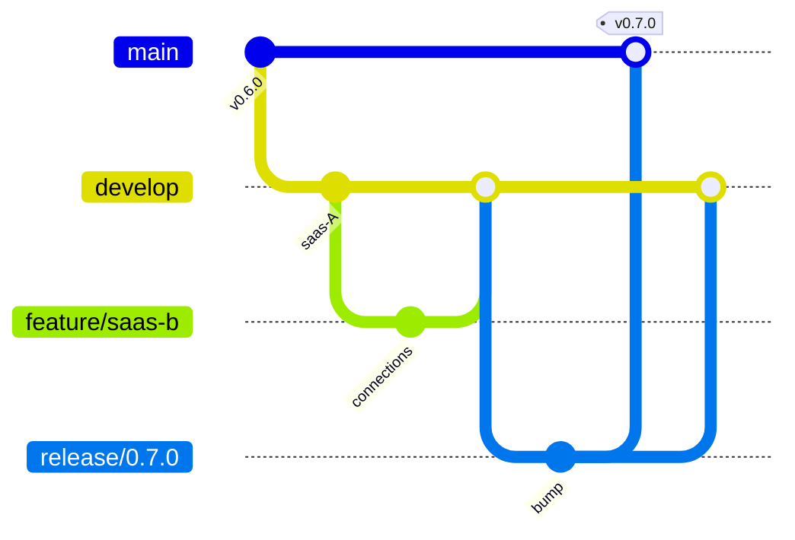
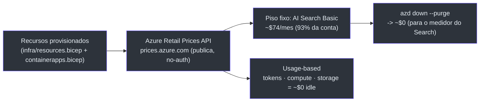

# Deploy, branching e custo

Esta página cobre o trio operacional: **como rodar** (`DEPLOYMENT.md`), **como o código
flui para produção** (`BRANCHING.md`) e **quanto custa, e como o número é derivado**
(`COST.md`).

## Provisionamento ponta-a-ponta

O `DEPLOYMENT.md` leva do clone fresco a um deploy provisionado e opcionalmente publicado
(docs/DEPLOYMENT.md:2-7).
O caminho curto: dois scripts colapsam os passos manuais — após `azd auth login && az
login`, roda-se `azd up`, `./scripts/setup-entra.sh` (opcional), `./scripts/bootstrap.sh`
(docs/DEPLOYMENT.md:20-30).
**Pular `setup-entra.sh` roda sem sign-in** (uma única identidade `DefaultAzureCredential`)
(docs/DEPLOYMENT.md:32-33).
Há também um `./scripts/up-all.sh` que faz o bring-up de infra em um comando (preflight +
`azd up` + auth opcional + bootstrap).

| Step | O que faz | Fonte |
| --- | --- | --- |
| 1 | `azd up` provisiona infra (Foundry + Search Basic + Storage + ACR + Container Apps) | (docs/DEPLOYMENT.md:63-73) |
| 2 | Backend `.env` (cola outputs do azd; auth opcional → fallback `DefaultAzureCredential`) | (docs/DEPLOYMENT.md:87-96) |
| 3 | App regs Entra (SPA + API) + OBO; 3d declara as 4 App Roles | (docs/DEPLOYMENT.md:100-161) |
| 4 | KB + memory; **domínios, cada um com seu KB + ingest, implante qualquer subset (≥1)** | (docs/DEPLOYMENT.md:175-177) |
| 5 | Rodar local (backend `uvicorn`; frontend porta 3000) | (docs/DEPLOYMENT.md:232-240) |
| 6 | Deploy do agente hosted; **RBAC pós-deploy obrigatório** (senão 403 em runtime) | (docs/DEPLOYMENT.md:244-267) |
| 7 | Publicar backend + frontend (Container Apps) | (docs/DEPLOYMENT.md:271-288) |

O Step 3d declara **quatro App Roles — Admin, Author, Approver, Reader** — via
`setup-app-roles.sh`: o **card de aprovação HITL exige Approver ou Admin**; o
`/admin/users` exige Admin
(docs/DEPLOYMENT.md:143-161).
O Step 6 alerta: a Managed Identity fresca criada no deploy não pode ser pré-atribuída em
Bicep — precisa de **Foundry User** + **Search Index Data Reader**, senão o agente
deploya mas retorna **403**
(docs/DEPLOYMENT.md:253-267).
A escolha do papel **Foundry User** (ex-"Azure AI User"), e não Cognitive Services / Azure
AI Developer, é um padrão Microsoft verificado em-sessão
(docs/MICROSOFT-ALIGNMENT.md:68).

## O modelo de branching — Git Flow

O `BRANCHING.md` é o modelo oficial: **Git Flow** — `main` + `develop` long-lived,
`feature/*`, `release/*`, `hotfix/*` short-lived. Mantém **`main` sempre
production-clean** enquanto a feature SaaS multi-tenant (sub-projetos A→D) integra em
`develop`
(docs/BRANCHING.md:12-15).
A escolha é deliberada para um time pequeno: a arquitetura é feature-flagged via
`DEPLOYMENT_MODE`, então um move futuro para trunk-based é baixo-risco
(docs/BRANCHING.md:17-20).

<!-- Sources: docs/BRANCHING.md:22-56 -->

| Branch | Vida | Papel | Vem de → vai para | Fonte |
| --- | --- | --- | --- | --- |
| `main` | sempre | Produção, deployable, tag `vX.Y.Z` | ← `release/*`, `hotfix/*` | (docs/BRANCHING.md:24-30) |
| `develop` | sempre | Integração | ← `feature/*` → `release/*` | (docs/BRANCHING.md:24-30) |
| `feature/*` | curta | Trabalho de feature | `develop` → `develop` | (docs/BRANCHING.md:24-30) |
| `release/*` | curta | Estabilização | `develop` → `main` **e** `develop` | (docs/BRANCHING.md:24-30) |
| `hotfix/*` | curta | Correção em produção | `main` → `main` **e** `develop` | (docs/BRANCHING.md:24-30) |

**Nunca commitar direto em `main` ou `develop`** — sempre via PR
(docs/BRANCHING.md:32-33).
`main` carrega **nada** da epopeia SaaS até um `release/*` cortar de `develop`; gateado por
`DEPLOYMENT_MODE` (default `self_hosted`)
(docs/BRANCHING.md:72-74).

Ambientes `azd` nomeados mapeiam aos branches — cada um com seu resource group + data
plane, totalmente isolados
(docs/BRANCHING.md:81-95):

| Ambiente | Rastreia | `DEPLOYMENT_MODE` | Fonte |
| --- | --- | --- | --- |
| **dev** | `develop` | `shared` ou `self_hosted` | (docs/BRANCHING.md:81-85) |
| **staging** | `release/*` | modo prod alvo | (docs/BRANCHING.md:81-85) |
| **prod** | `main` (tag) | `self_hosted` até SaaS GA | (docs/BRANCHING.md:81-85) |

## Custo — o método Microsoft-indicado

O `COST.md` deriva o custo da **Azure Retail Prices API** (`#2`, reproduzível com o ACE
`#3`) — **toda preço fixo da tabela foi puxado live dessa API** (USD, `eastus2`)
(docs/COST.md:21-44).
A API é pública, sem auth, programática — ex.:
`"retailPrice": 0.101, "unitOfMeasure": "1 Hour", "meterName": "Basic Unit"` para o Azure
Cognitive Search Basic
(docs/COST.md:26-33).

**Bottom line:** o piso always-on é **≈ $79/mês (~$0,11/hora)**, e **~93% disso é o Azure
AI Search Basic ($73,73/mês)** — o resto é usage-based, **≈ $0 enquanto idle**. Com uso de
demo leve, **~$80–90/mês**; `azd down` derruba para ~$0
(docs/COST.md:12-17).

| Recurso | Preço (Retail API, eastus2) | Natureza | Fonte |
| --- | --- | --- | --- |
| **Azure AI Search Basic** | $0,101/hr ≈ **$73,73/mês** | fixo/always-on — *the meter to watch* | (docs/COST.md:61) |
| Container Registry Basic | $0,1666/dia ≈ $5,07 | fixo | (docs/COST.md:62) |
| Foundry Cognitive Services S0 | $0 platform fee | — | (docs/COST.md:63) |
| Container Apps | scale-to-zero | ≈ $0 idle | (docs/COST.md:64) |
| gpt-5-mini GlobalStandard | ~$0,25 in / ~$2,00 out por 1M tok | usage | (docs/COST.md:68) |
| text-embedding-3-small | ~$0,02 por 1M tok | usage | (docs/COST.md:69) |

<!-- Sources: docs/COST.md:46-70, docs/COST.md:79-87 -->

A única alavanca de custo é o **AI Search** — não tem scale-to-zero, então o controle é
`azd down`, não downsizing
(docs/COST.md:12-17).
Teardown: `azd ai agent delete helpdesk-concierge` (um agente) ou `azd down --purge` (o RG
inteiro, para o medidor do Search)
(docs/COST.md:81-84).

> **Nota de consistência (lida em fonte).** `DEPLOYMENT.md` arredonda o headline do AI
> Search para **~$0,10/hr ≈ $74/mês (~95% da conta)**
> (docs/DEPLOYMENT.md:340),
> enquanto o `COST.md` cita o preciso **$0,101/hr ≈ $73,73/mês (~93%)**
> (docs/COST.md:12).
> Ambos rastreiam o mesmo `retailPrice: 0.101` da Retail Prices API.

## Related Pages

| Página | Relação |
|------|-------------|
| [Sub-projetos e D-packaging](./page-5.md) | O deploy do agente hosted platform-concierge |
| [Customização e expansão de domínio](./page-7.md) | Os domínios e o que se troca |
| [O mecanismo de assurance](./page-2.md) | Os gates que rodam no CI antes do deploy |
