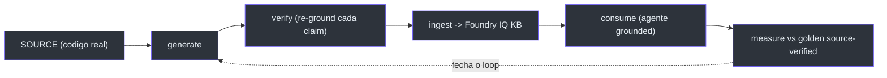
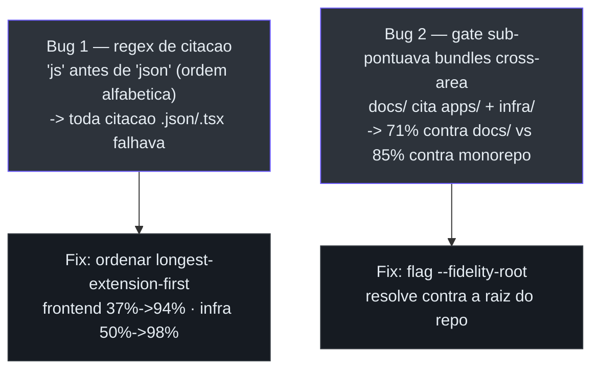

# Estudos de caso e dogfood

Os estudos de caso são onde o conjunto sai do plano e mostra **números**. Dois documentos
`explanation` carregam o peso: o **loop LLM-wiki** (por que docs e eval precisam ser
aterrados na fonte) e o **dogfood selfwiki** (o mecanismo virado sobre o próprio repo).
A v0.3.0 acrescenta o **explainer de citações grounded** e o **portal de apresentações**
(PARKED).

## Caso 1 — O loop LLM-wiki source-grounded

A tese: para aterrar um agente num codebase multi-repo grande, *tanto* a documentação que
ele recupera *quanto* a avaliação que o julga precisam ser **verificadas contra a fonte** —
um resumo de LLM não basta. Um loop **generate → verify → ingest → consume**, medido
contra um golden source-verified, produz respostas mensuravelmente mais fiéis
(docs/CASE-STUDY-LLM-WIKI-LOOP.md:12-17).


<!-- Sources: docs/CASE-STUDY-LLM-WIKI-LOOP.md:33-41 -->

A evidência: num golden de 20 perguntas, o score subiu **12 → 16 → 17/20** — e *por que*
subiu é o achado
(docs/CASE-STUDY-LLM-WIKI-LOOP.md:55-64):

| Passo | O que mudou | Score | Fonte |
| --- | --- | --- | --- |
| Baseline | docs LLM-summarized + golden LLM-authored | 12/20 | (docs/CASE-STUDY-LLM-WIKI-LOOP.md:62) |
| Source-verify o **golden** | ~5 "falhas" eram **bugs do golden** (o agente estava certo) | 16/20 | (docs/CASE-STUDY-LLM-WIKI-LOOP.md:63) |
| Instrução de autoridade | preferir docs de arquitetura autoritativos sobre resumos | 17/20 | (docs/CASE-STUDY-LLM-WIKI-LOOP.md:64) |

A meta-descoberta: re-checar o golden contra a fonte mostrou que **a própria verdade-base
LLM-authored estava errada** em vários itens — *"the agent had answered correctly and the
ruler was bent"*. Não confie num golden gerado por LLM mais do que em docs gerados por LLM
— verifique ambos contra a fonte
(docs/CASE-STUDY-LLM-WIKI-LOOP.md:65-71).

## Caso 2 — Dogfood na própria fonte (selfwiki)

O mecanismo foi virado sobre **o próprio monorepo** (`apps/backend`, `apps/frontend`,
`infra`, `docs`): gerou uma deep-wiki, ingestou numa KB Foundry IQ dedicada e levantou um
terceiro agente grounded — `/selfwiki`. O ponto não era demo: dogfoodar um mecanismo de
qualidade num codebase que você conhece a fundo é o jeito mais rápido de achar onde ele
mente
(docs/CASE-STUDY-SELFWIKI-DOGFOOD.md:11-21).

### O que ele achou — dois bugs no próprio mecanismo


<!-- Sources: docs/CASE-STUDY-SELFWIKI-DOGFOOD.md:47-69 -->

- **Bug 1 — contagem de citação.** O gate de fidelidade media *qual fração das citações de
  arquivo da wiki resolvem a um arquivo real*. O regex montava a alternação de extensões
  **alfabeticamente**, então `js` vinha antes de `json`; alternação regex é first-match,
  então todo `main.parameters.json` virava `main.parameters.js` — path que nunca resolve.
  **Toda citação `.json`/`.tsx` falhava silenciosamente.** Fix: ordenar
  longest-extension-first — frontend **37% → 94%**, infra **50% → 98%**, sem regeneração. Os
  bundles sempre foram fiéis; o gate é que contava errado
  (docs/CASE-STUDY-SELFWIKI-DOGFOOD.md:47-61).
- **Bug 2 — escopo cross-area.** O bundle `docs/` pontuou **71%** — mas uma wiki de
  docs/overview *legitimamente* cita arquivos em `apps/` e `infra/`. Contra o monorepo
  inteiro — o denominador justo — é **85%**. Adicionou-se a flag `--fidelity-root`
  (docs/CASE-STUDY-SELFWIKI-DOGFOOD.md:63-69).

> **Por que importa para esta wiki.** Esta é uma wiki do bundle `docs/` — um bundle
> cross-cutting. O denominador justo de fidelidade é o **monorepo inteiro**, não `docs/`
> sozinho. Foi exatamente o Bug 2 que estabeleceu isso — e é por isso que o `fidelity_check.py`
> desta v0.3.0 resolve contra a raiz do repo.

### A prova de genericidade

O resultado mais forte é o que *não* precisou de código novo. O domínio selfwiki reusa o
ingest do Cockpit **verbatim** — a única diferença é o ambiente
(docs/CASE-STUDY-SELFWIKI-DOGFOOD.md:79-94):

```bash
KB_KNOWLEDGE_SOURCE=selfwiki-docbundles-ks \
COCKPIT_STORAGE_CONTAINER=selfwiki-corpus \
COCKPIT_SEARCH_KNOWLEDGE_BASE=selfwiki-kb \
COCKPIT_DOCBUNDLES=../../docs/wiki \
  uv run python -m app.knowledge.ingest_cockpit
```

O agente
(apps/backend/app/agents/selfwiki.py)
era um mirror fino do Cockpit apontado a outra KB; na v0.3.0, ambos passaram ao **arquétipo
grounded unificado** sobre `retrieve()` (ver [Customização e expansão](./page-7.md)). "Mesma
máquina, corpus + prompts diferentes" deixou de ser claim e virou a implementação
(docs/CASE-STUDY-SELFWIKI-DOGFOOD.md:91-94).
A geração é dirigida por
(apps/backend/app/knowledge/wiki_builder.py),
que segue as skills de geração da Microsoft — as mesmas usadas para escrever esta própria
página.

## Os decks HTML (apresentações standalone)

A era SaaS e a onda grounded adicionaram decks HTML standalone (renderizados via GitHub
Pages), complementando os decks de deep-wiki existentes:

| Deck | Para quê | Fonte |
| --- | --- | --- |
| `saas-architecture.html` | A arquitetura SaaS visual (control plane × data plane, stamps) | (docs/saas-architecture.html) |
| `saas-request-flow.html` | O fluxo de requisição multi-tenant ponta-a-ponta | (docs/saas-request-flow.html) |
| `grounded-citations-explainer.html` | **Novo** — citações grounded + ACL por usuário (funcional → técnico → Microsoft) | (docs/grounded-citations-explainer.html) |
| `deep-wiki-presentation.html` | Como a deep-wiki é construída, ingestada e seu custo (dados reais) | (docs/README.md:34) |
| `fluxo-deepwiki.html` | Build-time (fidelity gate) × query-time (identity trim) | (docs/README.md:35) |

## A ideia PARKED — o portal de apresentações access-controlled

O `PRESENTATIONS-PORTAL-PLAN.md` propõe **o mecanismo de assurance virado sobre artefatos
HTML**: um autor *upload* ou *gera* um deck, controla **quem pode vê-lo**, e compartilha por
link — o destinatário assina com Entra ID e, se entitled, o deck abre. Sem segredo no link:
acesso decidido por **identidade no sign-in**. Um deck é só um "documento" com read groups —
o mesmo modelo *access follows the source* que já trima a KB
(docs/PRESENTATIONS-PORTAL-PLAN.md:16-25).

> **Status: PARKED (deliberado).** Construir isto agora "shiftaria o caráter do projeto
> (o mecanismo de assurance: grounded KB + access + eval) para um produto separado". Fica
> como registro da ideia + a pesquisa, para retomar depois
> (docs/PRESENTATIONS-PORTAL-PLAN.md:10-14).
> **Nota de rastreabilidade:** este plano está no disco mas **ainda não versionado** (untracked),
> e por isso o `README.md` não o indexa — outro caso do índice ficar atrás dos docs (ver
> [Visão geral do conjunto](./page-1.md)).

O plano é Microsoft-native-first: a maior parte já é serviço (Graph `createLink`/`invite`,
SharePoint/OneDrive ACL que o Foundry IQ ingesta, Azure Static Web Apps com Entra). O
**finding** probado (2026-06-29): este tenant **não tem licença SPO**, então o caminho
SharePoint/OneDrive nativo não está disponível — restam **(A)** Azure Static Web Apps ou
**(B)** reusar o **Next.js + FastAPI + Entra + OBO** já construído, onde o share-by-person cai
do allowed-set
(docs/PRESENTATIONS-PORTAL-PLAN.md:26-46).
Consideração de segurança crítica: servir **HTML de upload** sob a origem autenticada
permitiria stored-XSS roubar o token → mitigação por **`<iframe>` sandboxed** / origem
separada + CSP estrito; decks *gerados* são confiáveis, *uploads* não
(docs/PRESENTATIONS-PORTAL-PLAN.md:157-164).

## O que o dogfood significa

Ele não só *testou* o mecanismo — ele o **melhorou**. Dois bugs latentes de gate teriam
mis-graduado qualquer corpus `.json`/`.tsx`-heavy ou cross-cutting que um adopter real
apontasse; ambos estão corrigidos, e a deep-wiki deste repo está viva e consultável
(docs/CASE-STUDY-SELFWIKI-DOGFOOD.md:130-135).
Esta própria página v0.3.0, regenerada sob o mesmo gate, é a continuação do dogfood.

## Related Pages

| Página | Relação |
|------|-------------|
| [O mecanismo de assurance](./page-2.md) | O gate de fidelidade que o dogfood corrigiu |
| [Customização e expansão de domínio](./page-7.md) | A genericidade que o selfwiki provou |
| [Sub-projetos e D-packaging](./page-5.md) | A onda grounded por trás do explainer HTML |
| [Visão geral do conjunto](./page-1.md) | Onde os estudos de caso e o portal PARKED se encaixam |
